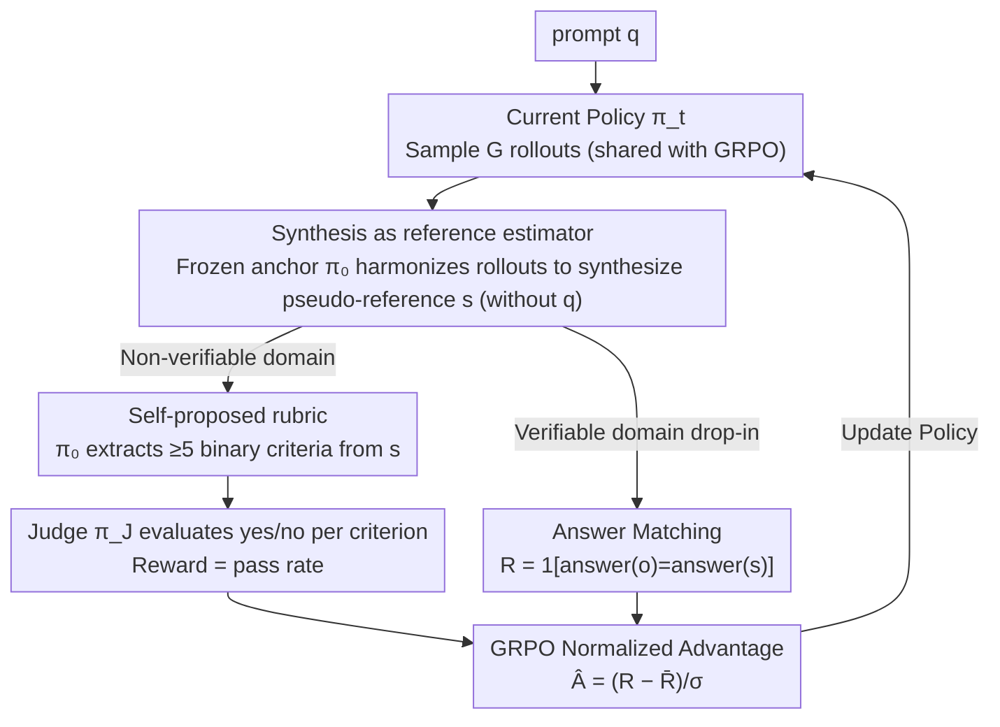

# Compute as Teacher: Turning Inference Compute Into Reference-Free Supervision

**Conference**: ICML 2026  
**arXiv**: [2509.14234](https://arxiv.org/abs/2509.14234)  
**Code**: None (No public repository provided in the paper)  
**Area**: LLM / NLP; RLHF alternatives; reference-free supervised RL  
**Keywords**: GRPO, self-synthesized reference, self-proposed rubric, non-verifiable reward, HealthBench

## TL;DR
This paper proposes Compute as Teacher (CaT): it "synthesizes" a pseudo-reference answer from $G$ rollouts already sampled by GRPO using a frozen anchor model. In non-verifiable domains, the model uses binary rubrics self-derived from this pseudo-reference to score each rollout as an RL reward. This directly converts inference compute into supervision signals without any human annotation, achieving up to a 30% improvement over baselines on HealthBench and matching or exceeding inference-time aggregation with 9× lower test-time compute.

## Background & Motivation

**Background**: Current post-training for Large Language Models (LLMs) primarily follows two paths: SFT based on human-labeled reference answers (Ouyang et al. 2022), or RLVR with programmatic verifiers (such as GRPO for math/code, Shao et al. 2024). Both paths require "existent and accessible reference answers."

**Limitations of Prior Work**: In tasks like medical consultation, life advice, open dialogue, and creative writing, answers are naturally open-ended, multi-solution, or subject to expert disagreement. Ground truths are difficult to write, and programmatic checkers are impossible to implement. Common fallbacks include expensive annotation pipelines or direct scoring by another LLM (LLM-as-judge) on a scale of 1–10, the latter of which has been repeatedly proven to suffer from inconsistency, verbosity bias, style bias, and reward hacking (Zheng et al. 2023).

**Key Challenge**: RL training requires a "reference signal" to calculate advantage; however, in non-verifiable domains, this reference signal is neither provided by humans nor generated by programs. This leaves post-training most impoverished in the most valuable open domains.

**Goal**: (i) Provide a stable, usable reward signal for RL in non-verifiable tasks without any human reference; (ii) ensure this reward mechanism is plug-and-play with existing RLVR pipelines (GRPO) without introducing significant additional compute.

**Key Insight**: GRPO already samples $G$ rollouts in parallel for each prompt to estimate advantage. These rollouts naturally "diverge where the model is uncertain"—one might get an intermediate step right, another might get the final answer right, and a third might perform correct validation. **The information content of the entire set of rollouts is inherently greater than any single rollout**, yet this information is currently wasted, being used only for variance normalization.

**Core Idea**: Use "synthesis" to harmonize multiple rollouts into a pseudo-reference answer $s$, then let the model extract several binary rubric criteria from $s$ as rewards. This transforms "compute-for-supervision" into a plug-and-play two-stage pipeline, corresponding to **reference estimation** and **reward derivation**.

## Method

### Overall Architecture
CaT addresses the deadlock where "non-verifiable domains lack reference answers, preventing RL from calculating advantage." The overall strategy is to use the $G$ rollouts already sampled by GRPO as raw material: first, a frozen anchor model $\pi_0$ "synthesizes" these divergent responses into a pseudo-reference answer $s$ (reference estimation); then, reward signals are automatically derived from $s$ to score each rollout (reward derivation). This entire mechanism converts inference compute into supervision without manual annotation.

Specifically, given a prompt $q$, the current policy $\pi_t$, a frozen anchor $\pi_0$ (usually the initial policy), and a judge $\pi_J$ (e.g., GPT-4o): $\pi_t$ first samples $G$ rollouts $o_{1:G}$ (sharing these samples with GRPO). $\pi_t$ reads them under a fixed prompt $p_{\text{syn}}$ to synthesize a pseudo-reference $s \sim \pi_0(\cdot \mid p_{\text{syn}}, o_{1:G})$. For verifiable domains, string matching is performed against $s$. For non-verifiable domains, $\pi_0$ extracts $n \ge 5$ binary rubric criteria from $s$, and $\pi_J$ judges each criterion as yes/no. The reward is the pass rate $R_{\text{rub}}(o;\mathcal{R}) = \frac{1}{n}\sum_j \mathbf{1}[\pi_J(o,r_j)=\text{yes}]$. Finally, GRPO updates $\pi_t$ using the normalized advantage $\hat A_i = (R_i - \bar R_G)/\sigma_G$. The process is **fully aligned with native GRPO sampling**, adding only one synthesis step, one rubric generation step, and $n \times G$ short yes/no judgments, all of which are parallelizable and cost significantly less than the $G$ rollouts themselves.

### Key Designs

**1. Synthesis as Reference Estimator: Harmonizing divergent rollouts into a superior pseudo-reference**

RL training is stalled by the "lack of reference signals," while the $G$ rollouts sampled by GRPO diverge precisely where the model is uncertain. The collective information in the group is richer than any single instance but has only been used for variance normalization. Instead of "selecting" one, CaT has the frozen initial policy $\pi_0$ (not the current $\pi_t$) read all rollouts under a fixed prompt $p_{\text{syn}}$ and synthesize a new pseudo-reference $s$. Two deliberate designs are used: **the original prompt $q$ is intentionally excluded from the input** (ablation in Appx 6.4) to force the model to harmonize internal rollout information rather than bypassing them to re-answer; **using a frozen anchor instead of the current policy** decouples "exploration" from "estimation." While $\pi_t$ improves through RL, $\pi_0$ provides a stable reference baseline that does not drift with the policy, preventing self-deception caused by moving targets.

This is effective because selection methods (majority vote, Self-BoN, min-PPL) can, at best, recover the "best rollout," whereas synthesis can concatenate correct segments across rollouts and generate superior answers outside the original distribution. Empirically, synthesis disagrees with the majority vote on 5–15% of cases, maintaining 70–86% accuracy even when disagreeing (Table 1), and can even be "the only one right when the whole team is wrong" in ~1% of cases—a feat no selection method can achieve.

**2. Self-proposed Rubrics: Decomposing "quality" into auditable binary judgments with zero human reference**

With the pseudo-reference $s$, non-verifiable domains need a way to transform it into a stable reward. Direct 1–10 scoring by LLMs is inconsistent and prone to style bias and reward hacking. CaT instead has the anchor model self-propose rubrics $\mathcal{R} \sim \pi_0(\cdot \mid p_{\text{rub}}, s)$, extracting $\ge 5$ binary, auditable, and repeatable criteria (e.g., "suggested consulting a doctor," "mentioned lifestyle modification," "avoided giving a definitive diagnosis"). The judge $\pi_J$ then independently evaluates yes/no for each rollout, with the reward being the satisfaction ratio. The entire pipeline from inference compute → pseudo-reference → rubrics → reward is seamless, without human intervention.

Decomposing coarse judgments into fine-grained binary questions offers three benefits: binary questions are much more stable for LLMs than scoring, resulting in lower reward noise (self-proposed rubrics rival physician-written ones on HealthBench); it enables pinpointing failed criteria, making rewards auditable and debuggable; and rubrics reward "content coverage" rather than writing style or length, fundamentally suppressing verbosity bias and reward hacking.

**3. Drop-in Compatibility for Verifiable Domains + Amortizing Compute into Weights**

To prove CaT is a unified paradigm rather than a healthcare-specific trick, the authors allow the same framework to run in verifiable domains (math/code) by simply changing the reward derivation: the reward becomes $R_{\text{ver}}(o;s)=\mathbf{1}[\texttt{answer}(o)=\texttt{answer}(s)]$, with $s$ still provided by synthesis. This is formally equivalent to majority-vote pseudo-labeling in TTRL, but because it uses synthesis rather than selection, pseudo-labels can exceed the support of the rollout set. More importantly, while test-time best-of-N or inference aggregation requires "paying $G$ times the compute for every deployment," CaT burns this benefit into the weights during training. After training, a single forward pass produces answers equivalent to or better than 9× inference-time synthesis, returning to 1× compute during deployment.

### Loss & Training
- Base: GRPO clipped surrogate + KL regularization to $\pi_0$;
- Group size $G=8$;
- Anchor $\pi_0$ same as the initial policy, judge $\pi_J=$ GPT-4o;
- Compute overhead: Synthesis is roughly equivalent to 1 extra rollout; rubric scoring requires $n \times G$ very short yes/no judgments, which are fully parallelizable.

## Key Experimental Results

### Main Results

| Model | Dataset | Initial | CaT | Inference-time Synthesis | Gain / Compute Ratio |
|------|--------|---------|-----|--------------------------|------------------|
| Gemma 3 4B | HealthBench | base | +up to 30% | < CaT | CaT 1× test compute vs synth 9× |
| Qwen 3 4B | HealthBench | base | Significantly > base | ≈ CaT | 9× test compute reduced to 1× |
| Llama 3.1 8B | HealthBench | base | 0.38 (vs SFT 0.28) | < CaT | Same as above |
| All three | MATH-500 | base | Up to +33% | ≈ CaT | Drop-in parity with verifiable baselines |

### Ablation Study

| Configuration | Key Phenomenon in HealthBench | Description |
|------|--------------------|------|
| CaT (self-proposed rubric) | On par with physician rubric | For two models, "self-written standards ≈ doctor-written standards" |
| Model-as-judge (1–10 score) | Significantly lower than CaT | Coarse judgments are unstable; high reward noise |
| CaT-SFT (SFT with pseudo-ref) | Llama 0.28 vs CaT 0.38 | RL generalizes better than SFT with small data |
| Synthesis vs Majority/Self-BoN | Wins on HealthBench, ties on MATH-500 | Synthesis advantage highest in non-verifiable domains |
| Synthesis Input 8 vs 1 | 0.85 vs 0.80 (Qwen MATH) | Proves synthesis performs cross-rollout reasoning, not just "sampling one more" |

### Key Findings
- **Self-proposed rubrics rival expert annotations**: On HealthBench, the self-proposed rubrics for two models were nearly identical in performance to those designed by human doctors, proving that models capable of "writing decent answers" also possess the ability to "extract effective scoring dimensions."
- **Synthesis performs genuine harmonization**: In ~1% of questions, synthesis was correct while "all rollouts were wrong," and accuracy remained 82–86% when disagreeing with the majority vote, indicating synthesis can generate superior answers outside the rollout distribution.
- **Compute burned into weights**: After training, CaT matches or exceeds 9× G-rollout inference-time synthesis with a single forward pass, amortizing the cost of "9× compute per deployment" into a "one-time training cost."
- **Llama shows small synthesis gains but maximum RL gains**: Weaker models are less proficient at meta-cognitive harmonization, but RL compensates; this suggests CaT is friendly to small-to-medium models.
- **Training saturation after entropy collapse**: As rollouts converge, the harmonization space for synthesis disappears, leading to diminishing marginal returns—consistent with common entropy collapse in RL fine-tuning.

## Highlights & Insights
- **Paradigm shift to "Compute as Supervision"**: Previous reference-free RL (TTRL, Absolute Zero) only dared to use selective aggregators like majority vote and was limited to verifiable domains. This work is the first to combine "generative aggregator + binary rubrics" into a unified pipeline for non-verifiable domains, essentially translating inference-time best-of-N gains into training-time supervision signals.
- **Decoupling anchor and policy is a crucial engineering detail**: Using the frozen $\pi_0$ instead of $\pi_t$ for synthesis prevents positive feedback drift ("deceiving oneself"), anchoring the reward signal to a stable reference distribution—consistent with the KL-to-reference philosophy in RLHF but used here to estimate targets rather than constrain update magnitude.
- **Rubrics as a "white-box interface" for rewards**: Rubrics make rewards readable, auditable, and debuggable. This is critical for industrial deployment when answering "why was this instance penalized?" It upgrades reward engineering from black-box LLM judging to a structured checklist that can be spot-checked or curated.
- **Transferable design**: The synthesis-as-aggregator + rubric-as-reward paradigm can be directly transferred to reasoning trace scoring, multi-turn dialog, and agentic trajectories. Any scenario that "needs scoring but lacks clear criteria" can allow the model to first generate its own criteria.

## Limitations & Future Work
- **Dependency on base model capability**: If the base model's rollouts lack information or its synthesis ability is poor, CaT's gains diminish. CaT is essentially "amplifying base capability with compute" and is ineffective for domains the model hasn't mastered.
- **Training saturation after entropy collapse**: Once rollouts converge, synthesis lacks harmonization space. The authors suggest introducing exploration rewards or more diverse sampling strategies in the future.
- **Dependency on judge model capability**: Using GPT-4o as $\pi_J$ is a cost and reproducibility issue for small teams; the effectiveness of replacing it with open-source judges was not systematically studied in the main text (briefly mentioned in Appx 6.3).
- **Rubric granularity**: Current rubrics are binary yes/no without partial credit, hierarchical standards, or confidence weighting. Future work could introduce finer-grained rubrics to increase reward signal resolution.
- **Self-validation**: Do self-generated rubrics protect the model itself? The paper does not systematically discuss if "self-collusion" exists (i.e., rubrics favoring the anchor's own answer patterns), which is a potential reward hacking path worth investigating.

## Related Work & Insights
- **vs TTRL / Absolute Zero**: They also perform reference-free RL but use majority vote/self-play only in verifiable domains. CaT moves beyond the rollout support via synthesis and incorporates non-verifiable domains via rubrics.
- **vs Rubrics as Rewards (RaR, Gunjal et al. 2026)**: RaR uses rubrics for scoring, but they are constructed from **human references**. CaT makes rubrics self-generated, completely removing human annotation dependency.
- **vs Test-time scaling (majority vote, best-of-N)**: That path requires "paying G times the compute for every deployment"; CaT amortizes the same compute into training.
- **vs LLM-as-judge (Zheng et al. 2023)**: 1–10 scoring is coarse and style-biased; CaT uses binary rubrics + auditable criteria to reduce noise and bias.

## Rating
- Novelty: ⭐⭐⭐⭐⭐ Integrating "compute-as-supervision + self-proposed rubrics" into a plug-and-play pipeline is a key step for reference-free RL in non-verifiable domains.
- Experimental Thoroughness: ⭐⭐⭐⭐ Covers three model families + two domains, including comparisons with human expert rubrics and full selection baseline ablations; however, non-verifiable validation was limited to the 4–8B scale in a single domain (healthcare).
- Writing Quality: ⭐⭐⭐⭐⭐ Clear progression, refined "why it works" intuition sections, with algorithm blocks and charts closely supporting conclusions.
- Value: ⭐⭐⭐⭐⭐ Provides a paradigm that can be immediately embedded into industrial RLHF pipelines (GRPO compatible, no verifier needed, no human labels needed), highly valuable for open-domain post-training.

<!-- RELATED:START -->

## Related Papers

- [\[NeurIPS 2025\] Wider or Deeper: Scaling LLM Inference-Time Compute with Adaptive Branching Tree Search](../../NeurIPS2025/llm_nlp/wider_or_deeper_scaling_llm_inference-time_compute_with_adaptive_branching_tree_.md)
- [\[ACL 2025\] SkillAggregation: Reference-free LLM-Dependent Aggregation](../../ACL2025/llm_nlp/skillaggregation_reference-free_llm-dependent_aggregation.md)
- [\[NeurIPS 2025\] Don't Be Lazy: CompleteP Enables Compute-Efficient Deep Transformers](../../NeurIPS2025/llm_nlp/dont_be_lazy_completep_enables_compute-efficient_deep_transformers.md)
- [\[ICML 2025\] BEST-Route: Adaptive LLM Routing with Test-Time Optimal Compute](../../ICML2025/llm_nlp/best-route_adaptive_llm_routing_with_test-time_optimal_compute.md)
- [\[ICML 2026\] Scheduling LLM Inference with Uncertainty-Aware Output Length Predictions](scheduling_llm_inference_with_uncertainty-aware_output_length_predictions.md)

<!-- RELATED:END -->
