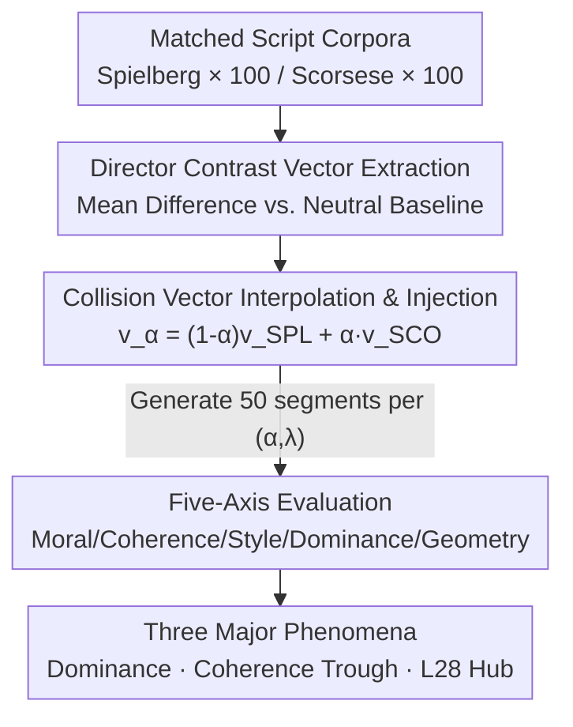

# Creative Collision: Directorial Persona Steering and Competition in Large Language Models

**Conference**: ICML2026  
**arXiv**: [2606.16240](https://arxiv.org/abs/2606.16240)  
**Code**: https://github.com/SubramanyamSahoo/Creative-Collision  
**Area**: Interpretability / Activation Steering / Controllable Generation  
**Keywords**: Activation Steering, Representation Engineering, Vector Competition, Moral Tone, Residual Stream Geometry

## TL;DR
Two semantically opposing "directorial persona" steering vectors (Spielberg's optimistic redemption vs. Scorsese's dark moral ambiguity) are simultaneously injected into the residual stream of an LLM. This study systematically characterizes the moral tone, coherence, and geometric changes during the competition between these two directions, discovering three counter-intuitive phenomena: "directional dominance," "coherence trough," and the "Layer 28 moral hub."

## Background & Motivation
**Background**: High-level semantic attributes in the residual stream of modern Transformers, such as sentiment, formality, and moral tone, are encoded approximately as "linear directions." Activation steering leverages this linearity to modify model behavior by adding a learned direction to the hidden states of specific layers during inference without updating weights. This has been successfully applied to truthfulness, safety, and persona control.

**Limitations of Prior Work**: Almost all prior works inject only a **single** semantic direction into the residual stream. What happens when two semantically **opposing** directions simultaneously compete for control over the representation—who wins, how they win, and how coherence changes—remains largely unstudied.

**Key Challenge**: Single-direction steering assumes that "moral tone shifts monotonically with the mixing coefficient." However, when two non-anti-parallel vectors are superimposed, the vector magnitude and angular relationships change non-linearly. Consequently, the extent to which the residual stream is pushed away from the natural text manifold also changes non-linearly, suggesting that behavioral responses may not be predictable by simple linear interpolation.

**Goal**: Construct a pair of semantically opposing steering vectors, interpolate between them using a mixing parameter $\alpha\in[0,1]$, control injection magnitude with steering strength $\lambda$, and characterize this "collision" across five evaluation axes (moral tone, coherence, surface style, directional dominance, and vector geometry).

**Key Insight**: Creative writing serves as a natural testbed that is semantically rich, culturally legible, and stylistically quantifiable. Spielberg's films feature redemption arcs, emotional catharsis, innocence, and optimistic endings; Scorsese's films feature moral ambiguity, violence, betrayal, and self-destruction. These two directors define the poles of a "moral tone" axis and serve as natural opposing anchors.

**Core Idea**: Use "directorial persona collision" as a controllable probe to study the dynamics of **competition between two opposing linear directions in the residual stream**, rather than performing another single-direction steering experiment.

## Method

### Overall Architecture
The method is essentially a pipeline consisting of "extracting two opposing vectors, interpolating and injecting them, and multi-axis measurement." The input is a pair of script passage corpora matched by narrative context (confrontation / loss / moral choice), and the output is the generated text's moral tone, coherence, style, and geometric metrics under different $(\alpha,\lambda)$ conditions. The process involves three steps: ① Extracting one steering vector for each director via mean difference contrast; ② Constructing the "collision vector" $\mathbf{v}_\alpha$ via linear interpolation of $\alpha$ and adding it to the residual stream of upper-middle layers (Layers 20–38) scaled by $\lambda$; ③ Generating 50 text segments at each grid point and evaluating them along five axes.

### Key Designs

**1. Director Contrast Vector Extraction: Using mean difference to decouple "moral tone" from plot complexity**

The challenge is to obtain vectors that **encode only moral tone without confounding plot complexity**. The authors construct a paired corpus $\mathcal{D}=\{(x_i^{\mathrm{SPL}}, x_i^{\mathrm{SCO}})\}$ where each pair is matched by narrative context (confrontation, loss, moral choice). On a 14B, 40-layer decoder model, the mean pooled activations of the residual stream at layer $l$ for each director are subtracted by the mean of a shared neutral baseline corpus $\mathcal{B}$ (100 segments across genres):

$$\mathbf{v}_{\mathrm{SPL}}^{(l)}=\frac{1}{N_{\mathrm{SPL}}}\sum_i \mathbf{h}^{(l)}(x_i^{\mathrm{SPL}})-\frac{1}{|\mathcal{B}|}\sum_j \mathbf{h}^{(l)}(b_j)$$

The Scorsese vector is extracted similarly. Both vectors are $\ell_2$ normalized. A key observation: the two are **not anti-parallel**, with a cosine similarity of approximately $\rho\approx0.29$ at Layer 28—indicating that both directors share a representation subspace for "cinematic emotional content" and only diverge significantly on "moral outcome." The fact that $\rho<1$ is the geometric root of the "coherence trough" phenomenon.

**2. Collision Vector Interpolation and Injection: Controlling "who dominates" and "collision intensity" with a single scalar**

To characterize competition, a knob is needed to slide continuously from "pure Spielberg" to "pure Scorsese." The authors use a mixing coefficient $\alpha\in\{0,0.25,0.5,0.75,1.0\}$ to construct the collision vector:

$$\mathbf{v}_\alpha^{(l)}=(1-\alpha)\,\hat{\mathbf{v}}_{\mathrm{SPL}}^{(l)}+\alpha\,\hat{\mathbf{v}}_{\mathrm{SCO}}^{(l)}$$

$\alpha=0$ is pure Spielberg, $\alpha=1$ is pure Scorsese, and intermediate values represent the "collision." Injection is performed at layers $l\in\{20,\dots,38\}$ at every token position: $\tilde{\mathbf{h}}_t^{(l)}=\mathbf{h}_t^{(l)}+\lambda\cdot\mathbf{v}_\alpha^{(l)}$, with steering strength $\lambda\in\{0.5,1.0,1.5,2.0\}$. The injection range (depth 50–95%) was pre-selected via single-layer scans to maximize moral tone shift while minimizing coherence cost. This $\alpha\times\lambda$ grid decouples "directional competition" from "injection strength," allowing differentiation between effects caused by the "collision itself" versus excessive coefficients.

**3. Norm Reduction Explanation for the Coherence Trough: Proving counter-intuitive phenomena as geometric consequences**

Experiments revealed a counter-intuitive phenomenon: pure single-director steering resulted in the highest perplexity (lowest coherence) at high $\lambda$, while intermediate collision points were more coherent. The authors explain this via a norm reduction proposition. For two unit vectors with cosine similarity $\rho$, the squared norm of the collision vector is:

$$\|\mathbf{v}_\alpha\|_2^2=1-2\alpha(1-\alpha)(1-\rho)$$

This is minimized at $\alpha^*=\tfrac12$ (provided $\rho<1$), where $\|\mathbf{v}_{1/2}\|_2^2=\tfrac{1+\rho}{2}$. Substituting the measured $\rho\approx0.29$, we get $\|\mathbf{v}_{1/2}\|_2\approx0.80 < 1.0$. Since coherence cost grows with $\|\lambda\mathbf{v}_\alpha\|$, intermediate $\alpha$ values actually exert a **weaker** perturbation on the residual stream, keeping activations closer to the natural text manifold and resulting in lower perplexity. This frames the "coherence trough" as a direct corollary of the vectors being non-anti-parallel.

### Evaluation Protocol
For each $(\alpha,\lambda)$ condition, $G=50$ segments (200 tokens, temperature 0.8) are generated using the prompt: "Write a short cinematic scene in which a character faces a moral choice." Five axes are measured: **Moral Tone** $\mathrm{MV}(x)\in[-1,+1]$ provided by a classifier fine-tuned on ETHICS and directorial contrast pairs (positive = Spielbergian optimism, negative = Scorsesian darkness); **Coherence** via token-level perplexity $\mathcal{P}(x)$ under the base model; **Surface Style** via spaCy (word/sentence count, average sentence length, dialogue density, lexical diversity TTR); **Directional Dominance** $\mathcal{D}(x)=P_\phi(\mathrm{SPL}\mid x)$ via a style classifier; and **Vector Geometry** via cosine similarity between the collision vector and the directorial reference vectors.

## Key Experimental Results

### Main Results: Three Major Phenomena

| Phenomenon | Key Evidence | Implication |
|------|----------|------|
| Non-monotonic Moral Tone | At $\lambda=1.0$, MV is most negative at $\alpha=0.25$ ($\approx-0.38$) rather than $\alpha=1.0$ ($\approx0$) | Weak collision introduces "moral incoherence," penalized more heavily by the classifier than either pure director. |
| Coherence Trough | Pure directors $\alpha\in\{0,1\}$ have highest perplexity at $\lambda\ge1.5$ ($\mathcal{P}\approx28$ / $20$); intermediate $\alpha\in\{0.25,0.5\}$ remains at $\mathcal{P}\approx8$–$9$ even at $\lambda=2.0$ | Norm reduction results in smaller perturbations and higher coherence at intermediate points. |
| Directional Dominance | $P_\phi(\mathrm{SPL})\approx1.0$ persists until $\alpha=0.5$; even at $\alpha=0.75$, it is $\approx0.97$. Only at $\alpha=1.0$ does it drop to $\approx0.49$. | Spielberg's stylistic signature dominates Scorsese almost entirely during competition. |

### Key Findings
- **Hypotheses for Directional Dominance**: ① Prior Bias—pre-training corpora contain more optimistic, pro-social narratives than dark content, giving the residual stream a Spielbergian prior; ② Alignment Amplification—Instruction tuning/RLHF reinforces pro-social generation, acting as a constant low-amplitude Spielbergian prior. The Scorsese vector must first "repay this debt" before it can manifest (explaining why Scorsese only appears at $\alpha=1.0$ when the Spielberg component is absent).
- **Layer 28 is the Moral Hub**: Moral shifts peak at **Layer 28** (approx. 70% depth) for both directors: Scorsese $\Delta\mathrm{MV}\approx-0.50$, Spielberg $\approx+0.47$. This approximate anti-symmetry points toward a shared "moral tone hub."
- **Coherence Trough Support**: The phenomenon is not an empirical coincidence but a geometric necessity of the norm reduction in non-anti-parallel vector interpolation.

## Highlights & Insights
- **Dual-Vector Competition as a Controllable Probe**: Using culturally recognizable directorial styles as opposing anchors makes the abstract "residual stream directional competition" quantifiable and interpretable—a clever bridge between interpretability and creative generation evaluation.
- **Norm Reduction Proposition**: Proving the "intermediate coherence" via $\|\mathbf{v}_\alpha\|_2^2=1-2\alpha(1-\alpha)(1-\rho)$ allows this insight to be transferred to any scenario involving the superposition of non-anti-parallel steering vectors.
- **Decoupling Moral Shift from Perturbation Sensitivity**: The presence of a peak at L28 for the moral axis but not for coherence provides clean causal evidence of a "semantic-specific layer," serving as a paradigm for locating other semantic hubs.
- **Alignment as a Prior**: The observation that RLHF behaves like a constant low-amplitude steering direction provides significant insight into the side effects of alignment.

## Limitations & Future Work
- **Single Model, Single Pair of Directors**: All conclusions are based on one 14B model and the Spielberg/Scorsese pair. Whether directional dominance is a property of this model/alignment strategy or a universal law remains unverified across models.
- **Classifier as an Evaluation Bottleneck**: MV is provided by a fine-tuned classifier. At high $\lambda$, it is difficult to distinguish whether the model is truly morally neutral or if the classifier fails on off-manifold text (the authors admit the classifier receives "no meaningful input").
- **Dominance Mechanisms are Hypotheses**: The explanations regarding prior bias and alignment amplification have not undergone ablation studies (e.g., comparing against a non-aligned base model) and remain plausible conjectures.

## Related Work & Insights
- **vs. Single-Direction Activation Steering (ActAdd / RepE / ITI)**: While prior works inject one direction for truthfulness/safety/persona, this work is the first to study the competitive dynamics of **simultaneous dual-direction injection**.
- **vs. Linear Representation Hypothesis (Elhage / Burns CCS / Templeton SAE)**: This work essentially tests whether composite attributes like "directorial moral persona" allow for linear causal representations and vector arithmetic. The anti-symmetric peak at L28 provides new evidence for this hypothesis in creative generation.
- **vs. Style/Persona Steering (Subramani 2022)**: While they focus on replicating specific style segments, this work focuses on coarse-grained "creative moral tone" and the interaction between two personas during simultaneous injection.

## Rating
- Novelty: ⭐⭐⭐⭐ First systematic study of competition between opposing directions in the residual stream.
- Experimental Thoroughness: ⭐⭐⭐ Detailed five-axis characterization, but limited to a single model/pair; mechanisms remain largely conjectural.
- Writing Quality: ⭐⭐⭐⭐ Clear narrative linking phenomena, mechanisms, and geometric proofs.
- Value: ⭐⭐⭐⭐ Provides a quantifiable probe for research into controllable creative generation and alignment side effects.

<!-- RELATED:START -->

## Related Papers

- [\[ICML 2026\] The Cylindrical Representation Hypothesis for Language Model Steering](the_cylindrical_representation_hypothesis_for_language_model_steering.md)
- [\[ACL 2026\] CoSToM: Causal-oriented Steering for Intrinsic Theory-of-Mind Alignment in Large Language Models](../../ACL2026/llm_nlp/costomcausal-oriented_steering_for_intrinsic_theory-of-mind_alignment_in_large_l.md)
- [\[ICML 2026\] Emergence of Hierarchical Emotion Organization in Large Language Models](emergence_of_hierarchical_emotion_organization_in_large_language_models.md)
- [\[ACL 2025\] Sample-Efficient Human Evaluation of Large Language Models via Maximum Discrepancy Competition](../../ACL2025/llm_nlp/sample-efficient_human_evaluation_of_large_language_models_via_maximum_discrepan.md)
- [\[ICLR 2026\] Fine-Grained Activation Steering: Steering Less, Achieving More](../../ICLR2026/llm_nlp/fine-grained_activation_steering_steering_less_achieving_more.md)

<!-- RELATED:END -->
