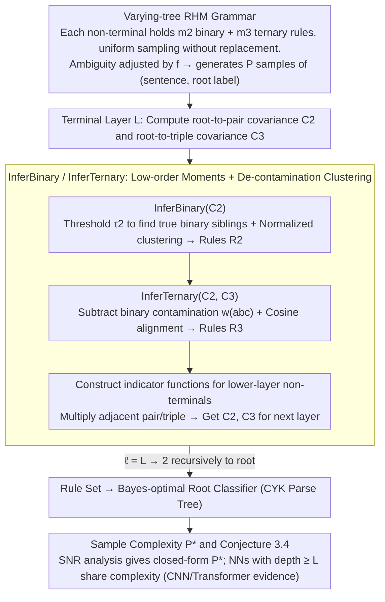

# Deep Networks Learn to Parse Uniform-Depth Context-Free Languages from Local Statistics

**Conference**: ICML 2026  
**arXiv**: [2602.06065](https://arxiv.org/abs/2602.06065)  
**Code**: https://github.com/jackparley/learn_to_parse  
**Area**: NLP Theory / Interpretability / LM Learning Mechanisms  
**Keywords**: PCFG, Syntactic Parsing, Sample Complexity, Hierarchical Representation, Local Statistics

## TL;DR
The authors propose a "Varying-tree RHM" Probabilistic Context-Free Grammar (PCFG) with controllable ambiguity. They prove that using only low-order moments (root-to-pair and root-to-triple) combined with layer-wise clustering is sufficient to recover grammar rules and perform CYK-style parsing. The sample complexity is derived as $P^\star \asymp v\, m_3\, m_2^{L-1} (p_2^2/2)^{1-L}$, and experiments on CNNs and Transformers strictly follow this power law.

## Background & Motivation

**Background**: It has been repeatedly confirmed by probing experiments that Large Language Models (LLMs) can learn tree-like parsing behaviors without explicit syntactic supervision. Theoretical research primarily uses PCFG as a toy model. It is known that Transformers can approximate the inside algorithm, and the sample complexity of deep networks under a fixed-tree Random Hierarchy Model (RHM) has been clearly characterized.

**Limitations of Prior Work**: Existing theories mainly study simplified scenarios with "fixed tree structures" (where the shape of the parsing tree for each sentence is known in advance). In such cases, "parsing" is unnecessary—only hierarchical clustering is required. This bypasses two critical challenges in real-world language learning: (A) learners do not know which span corresponds to which latent non-terminal; (B) the same substring can be produced by different non-terminals (local ambiguity), causing low-order correlations to be "contaminated" by ambiguity.

**Key Challenge**: To keep sample complexity polynomial, learners must rely on low-order statistics. However, PCFG ambiguity makes these statistics unreliable—the same pair (a,b) might be binary siblings, a prefix of ternary siblings (a,b,c), or span across two different boundaries.

**Goal**: (i) Construct a family of "ambiguity-adjustable" synthetic PCFGs where ambiguity is controlled by a scalar $f$; (ii) Provide a rule inference algorithm using only low-order moments and clustering, and prove its correctness and sample complexity; (iii) Empirically verify that the sample complexity of deep networks (CNN/Transformer) strictly follows the theoretical predictions.

**Key Insight**: The authors observe that even in the presence of ambiguity, in the limit of vocab size $v \to \infty$, the root-to-pair covariance contributed by true binary siblings $(a,b)$ still dominates contributions from "fake siblings." In the ternary case, although true ternary siblings and "binary sibling + 1" contribute at similar magnitudes, the latter can be explicitly subtracted using $C_2$.

**Core Idea**: Equivalent to "deep networks learning to parse" by "performing hierarchical clustering with denoising using low-order root-to-substring covariances," and providing a closed-form sample complexity through a signal-to-noise argument.

## Method

### Overall Architecture
The core problem this paper addresses is: how do deep networks learn to parse an ambiguous context-free grammar from $P$ samples of (sentence, root label) without syntactic supervision? The authors decompose this into a provable chain: first, creating a "Varying-tree RHM" grammar where unknown span boundaries and local ambiguity are intrinsic properties; second, providing a rule inference algorithm (Algorithm 1) using low-order moments and clustering to top-down recover the rule set layer by layer, thereby constructing a Bayes-optimal root classifier (and implicitly a parsing tree); finally, providing the closed-form sample complexity $P^\star$ and asserting that standard NNs with depth $\geq L$ follow the same mechanism, validated by rescaling CNN/Transformer learning curves relative to $P^\star$ until they collapse onto a single master curve. The intermediate outputs of the algorithm are layer-wise rule sets $\{\mathcal{R}_2^{(\ell)}, \mathcal{R}_3^{(\ell)}\}_{\ell=1}^L$, and the final output is the root classifier.

### Key Designs

**1. Varying-tree RHM: Synthetic Grammar with Adjustable Local Ambiguity**

Previous fixed-tree RHMs provided the shape of the parsing tree in advance, meaning learners did not need to perform parsing. The authors allow each non-terminal $z$ to hold $m_2 = f_2 v$ binary rules and $m_3 = f_3 v^2$ ternary rules, where the right-hand sides are *sampled uniformly without replacement* from all possible pairs/triples. While sampling without replacement ensures single rules are unambiguous, combinations of rules create "local ambiguity"—for example, the ternary string $(a,b,c)$ could originate from $z \to abc$ or from a concatenation of $z' \to ab$ and another derivation. Ambiguity is controlled by a scalar $f$, and global ambiguity undergoes a phase transition (bottom of Figure 2), categorized into low ambiguity, intermediate local ambiguity, and high global ambiguity. This creates a solvable testbed where sentence lengths vary and parsing tree topologies are exponentially many.

**2. InferBinary / InferTernary: Hierarchical Clustering via Low-order Moments and De-contamination**

With ambiguous grammars, the difficulty lies in recovering rules using only root-conditioned low-order statistics without relying on high-order moments (to maintain polynomial sample complexity). The authors perform layer-wise clustering with denoising. For the binary case, for each terminal pair $(a,b)$, a slice of the root-to-pair covariance tensor is taken as $u_{ab} = C_2^{(\ell)}((a,b), :) \in \mathbb{R}^v$. The key observation is that the norm $\|u_{ab}\|$ for true binary siblings significantly exceeds that of "fake siblings" as $v \to \infty$. Thus, true pairs are filtered via threshold $\tau_2 = \gamma v^{-1}(\sum \|u_{ab}\|^2)^{1/2}$, and normalized $\hat u_{ab}$ are clustered into $v$ classes, each corresponding to a parent non-terminal (Prop. 3.1 proves asymptotic correctness). The ternary case is more difficult because "true ternary siblings" and "binary siblings + 1" contribute at similar magnitudes. To solve this, binary contamination is explicitly subtracted:

$$w_{abc} = C_3((a,b,c), :) - \tfrac{1}{v} C_2((a,b),:) - \tfrac{1}{v} C_2((b,c),:)$$

This subtraction, derived from the law of total covariance, removes the "binary sibling + 1" component. The remaining signal can then be clustered using the same logic as the binary case—calculating cosine alignment scores $A_z(a,b,c)$ with cluster centers $c_z$ from InferBinary (Prop. 3.2). Once rules are found, candidate non-terminal indicator functions $N_{i,\lambda}^{(\ell-1)}(a)$ are constructed to recursively compute indicators for the next layer.

**3. Sample Complexity Formula and Conjecture 3.4: Transferring Algorithm Complexity to NNs**

To quantify the complexity, the authors measure the signal-to-noise ratio (SNR) on the algorithmic side. Using the vector Bernstein inequality, the covariance estimation error is $E_s \leq \gamma_s\big(\sqrt{\log(2/\delta)/(v m_s P)} + \log(2/\delta)/P\big)$. Combined with the asymptotic row norm $\|u_{ab}\| \to \frac{1}{m_2 v}\sqrt{(p_2^2/2)^{\ell-1} / m_2^{\ell-1}}$, the number of samples required to distinguish signal from noise at layer $\ell$ is derived as $P_{\ell, s} \asymp (p_2^2/2)^{1-\ell} v m_s m_2^{\ell-1}$. Conjecture 3.4 asserts that NN sample complexity is determined by the most difficult layer, $P_{\mathrm{NN}}^\star \asymp \max_{\ell, s} P_{\ell, s}$. In the asymptotic limit $m_3 \gg m_2$, this simplifies to:

$$P_{\mathrm{NN}}^\star \asymp (p_2^2/2)^{1-L}\, v\, m_3\, m_2^{L-1}.$$

This formula reflects an intuitive physical picture: the first branch detected is the "easiest one"—where the first $L-1$ layers are binary (probability $p_2/m_2$ much larger than ternary $p_3/m_3$), and only the last layer uses a ternary rule. The formula also predicts that networks with depth $< L$ cannot achieve polynomial convergence.

### Loss & Training
NNs are trained using standard cross-entropy and SGD. The algorithm side only requires $O(P)$ time for gathering low-order moments and performing spectral clustering. CNNs use a hierarchical architecture with filter size 4 and stride 2. Transformers are standard encoders with sinusoidal PE. All architectures require depth $\geq L$.

## Key Experimental Results

### Main Results

| Experimental Setup | Predicted $P^\star$ scaling | Observed Phenomena | Conclusion |
|----------|------------------------|----------|------|
| CNN, low ambig $f = 1/v$, $L=2$ | $\sim v^2$ | Learning curves collapse perfectly after rescaling | Scaling is correct |
| CNN, low ambig $f = 1/v$, varied $L$ | $(p_2^2/2)^{1-L} v^2$ | $P^\star(v, L)$ matches theory and measured SNR | Depth factor $(p_2^2/2)^{1-L}$ is correct |
| CNN, intermediate $f=1/4$, $L=3$ | $\sim v^5$ | Learning curves collapse | Formula holds under intermediate ambiguity |
| CNN, high $f=0.6, 0.8$, $L=2$ | $\sim v^2$ scaling | Loss saturates at Bayes-optimal lower bound | NNs reach information-theoretic limits under high ambiguity |
| INN / CNN / Transformer comparison ($L=2, 3$) | Same $P^\star \sim v^2$ for all | All architectue curves collapse with $v^2$ rescaling | Formula is architecture-agnostic |

### Ablation Study

| Configuration | Key Observation | Mechanism |
|------|---------|------|
| Full model (depth $= L$) | Curves collapse to $P^\star$ | Full theory holds |
| depth $< L$ Network | Fails polynomial convergence | Depth is a necessary condition |
| Remove ternary correction $\tfrac{1}{v}C_2$ | Ternary rules mixed with "fake siblings" | Correction term is essential |
| Use token frequency instead of root-conditioned covariance | Complete failure | Label information is necessary |

### Key Findings
- Learning curves for three architectures (INN, CNN, Transformer) collapse onto a single master curve after rescaling, strongly supporting the conjecture that NNs share the same mechanism as Algorithm 1.
- In high global ambiguity regions, the NN cross-entropy converges to the Bayes-optimal lower bound determined by the intrinsic entropy of the PCFG.
- The depth factor $(p_2^2/2)^{1-L}$ indicates that sample requirements grow exponentially with $L$, yet remain polynomial in $v$, supporting the proposition that hierarchical representation is a viable path for learning PCFGs.

## Highlights & Insights
- **"Local Ambiguity" as a Controllable Parameter**: Unlike previous RHMs that avoided parsing by fixing the tree, this work uses binary/ternary coexistence and sampling without replacement to make local ambiguity natural and adjustable.
- **"De-contamination" Trick for Ternary Covariance**: $w_{abc} = C_3 - \tfrac{1}{v}(C_2((a,b), :) + C_2((b,c), :))$ is a simple yet profound design—it removes the "binary sibling + 1" branch based on the law of total covariance, allowing ternary rules to be recovered with the same clustering logic.
- **NN Sample Complexity = Complexity of the "Easiest Path"**: The dominance of $P_{\mathrm{NN}}^\star$ by the "all binary + last layer ternary" path provides a physical intuition: the network learns from the paths most easily dominated by signal.

## Limitations & Future Work
- The task is limited to root classification; the authors acknowledge that next-token prediction requires future work.
- Asymptotic analysis is rigorous in the $v \to \infty$ limit, but whether constant terms remain negligible in finite real-world vocabularies needs further study.
- Assumes uniform rule probabilities $p_2 = p_3 = 1/2$ and $f_2 = f_3 = f$; heavy-tailed distributions in real languages might disrupt the SNR argument.
- The comparison focuses on sample complexity; direct alignment between "NN internal representations" and "explicitly recovered rule sets" would further strengthen the mechanical claims.

## Related Work & Insights
- **vs. Cagnetta et al. 2024 (Fixed-tree RHM)**: They assume known tree structures and study how hierarchical clustering works; this paper allows random tree shapes and local ambiguity, extending RHM from "learnable hierarchies" to "learnable parsing."
- **vs. Allen-Zhu & Li 2025 (Transformer approximates inside algorithm)**: They provide post-hoc explanations for trained Transformers; this paper provides a forward theory of how training reaches that point and exactly how many samples are needed.
- **vs. Sclocchi et al. 2025 (Belief Propagation perspective)**: Algorithm 1 can be seen as an "approximate BP when tree structure is unknown," bridging BP literature with PCFG learnability.

## Rating
- Novelty: ⭐⭐⭐⭐⭐ First to reduce "NN parsing" to a provable low-order moment clustering algorithm with exact complexity.
- Experimental Thoroughness: ⭐⭐⭐⭐ Validated across architectures and ambiguity zones, though Transformer scale is small.
- Writing Quality: ⭐⭐⭐⭐⭐ Clear structure, theorem-experiment loop, and consistent notation.
- Value: ⭐⭐⭐⭐⭐ Provides the first end-to-end, formula-backed theoretical explanation for LLM data efficiency in parsing.

<!-- RELATED:START -->

## Related Papers

- [\[ICLR 2026\] Constrained Decoding of Diffusion LLMs with Context-Free Grammars](../../ICLR2026/llm_nlp/constrained_decoding_of_diffusion_llms_with_context-free_grammars.md)
- [\[NeurIPS 2025\] SubSpec: Speculate Deep and Accurate — Lossless and Training-Free Acceleration for Offloaded LLMs](../../NeurIPS2025/llm_nlp/speculate_deep_and_accurate_lossless_and_training-free_acceleration_for_offloade.md)
- [\[NeurIPS 2025\] In-Context Learning of Linear Dynamical Systems with Transformers: Approximation Bounds and Depth-Separation](../../NeurIPS2025/llm_nlp/in-context_learning_of_linear_dynamical_systems_with_transformers_approximation_.md)
- [\[ICML 2026\] Compute as Teacher: Turning Inference Compute Into Reference-Free Supervision](compute_as_teacher_turning_inference_compute_into_reference-free_supervision.md)
- [\[ACL 2026\] Characterizing the Expressivity of Local Attention in Transformers](../../ACL2026/llm_nlp/characterizing_the_expressivity_of_local_attention_in_transformers.md)

<!-- RELATED:END -->
