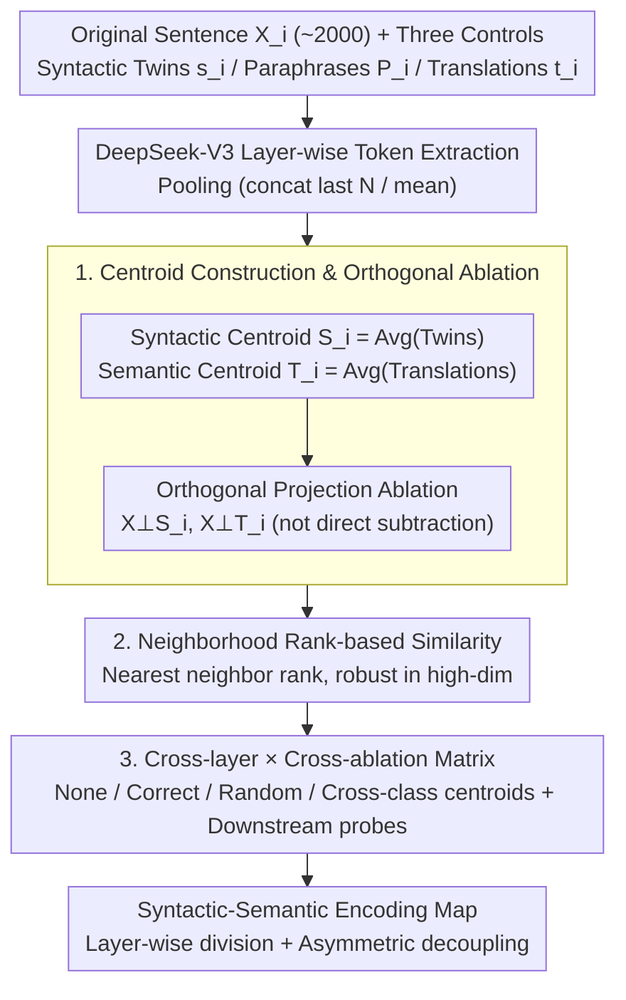

# Differential Syntactic and Semantic Encoding in LLMs

**Conference**: ICML 2026  
**arXiv**: [2601.04765](https://arxiv.org/abs/2601.04765)  
**Code**: https://github.com/acevedo-s/syn-sem  
**Area**: LLM Interpretability / Representation Learning / Computational Linguistics  
**Keywords**: Syntactic-Semantic Decoupling, Linear Encoding, Centroid Ablation, DeepSeek-V3, Representation Geometry

## TL;DR
By averaging hidden representations of sentences sharing the same syntactic structure or the same meaning to obtain "syntactic centroids" and "semantic centroids," the authors demonstrate that a significant portion of syntactic/semantic information in LLMs like DeepSeek-V3 is encoded via **linear superposition**. Moreover, these two types of information exhibit clear separability in layer-wise distribution and orthogonal ablation—supporting the linguistic hypothesis of "syntactic autonomy."

## Background & Motivation

**Background**: How internal LLM representations carry linguistic information is a core question in interpretability research. Existing work suggests a consensus: deep "alignment phenomena" imply shared abstract processing in middle layers (Platonic representation hypothesis by Huh et al. 2024; high-dimensional abstract phase by Cheng et al. 2025). Probing studies, such as Hewitt & Manning’s structural probe and Tenney’s BERT pipeline, show that models roughly replicate the classical NLP pipeline of "syntax first, semantics later." Another line of research (Mikolov → Park) repeatedly indicates that LLMs tend to encode concepts in a **linear** manner.

**Limitations of Prior Work**: Existing probes mostly rely on trained classifiers/regressors (structural probes, polar coordinate probes), whose conclusions can be confounded by the probe's own capacity—making it difficult to distinguish whether the information is "encoded in the model" or "learned by the probe." While geometric methods (e.g., Caucheteux 2021) have used syntactic average vectors from GPT-2 to explain fMRI signals, no study has systematically verified whether syntax and semantics can be **simultaneously characterized and decoupled using purely linear methods** in truly large-scale LLMs (10B to 100B+ parameters).

**Key Challenge**: To address linguistic debates like "syntactic autonomy," a tool is needed that requires no downstream model training and treats syntax and semantics symmetrically. Simply "subtracting a syntactic vector to observe semantic changes" in high-dimensional space easily introduces spurious signals (direct subtraction removes components of neighboring samples; see Appendix D).

**Goal**: To answer two sub-questions using a purely linear, unsupervised approach: (i) What proportion of syntactic and semantic information in LLM hidden layers can be explained by a directional vector? (ii) In which layers and to what extent are these two types of information independent?

**Key Insight**: If a group of sentences shares a POS template (same syntax, unrelated meaning), averaging their hidden representations causes **semantic components to cancel out while preserving syntax**—creating a natural "syntactic centroid." Similarly, translating a sentence into 6 languages and averaging them washes out **surface forms while preserving meaning**—creating a "semantic centroid." Using orthogonal projection along these centroids for ablation provides causal evidence virtually free from probe bias.

**Core Idea**: Explicitly construct syntactic and semantic linear subspaces using "shared-structure averaging." Measure cross-similarity via orthogonal projection ablation across all DeepSeek-V3 layers to map the "syntactic-semantic encoding landscape."

## Method

### Overall Architecture

The input consists of a set of English original sentences $\mathbf{X}_i$ (~2,000 sentences, length $\le 10$ words). Each $\mathbf{X}_i$ is paired with three control sets:
- **Syntactic Twins** $\mathbf{s}_i^{\alpha}$: Sentences sharing the same Penn Treebank POS sequence as $\mathbf{X}_i$ but with unrelated meanings (generated by Gemini/ChatGPT).
- **English Paraphrases** $\mathbf{P}_i$: Sentences with the same meaning but different English expressions.
- **Multilingual Translations** $\mathbf{t}_i^{\gamma}$: Translations into $\gamma\in\{$Chinese, Spanish, Italian, Turkish, German, Arabic$\}$ (6 languages).

The pipeline follows four steps: (1) Extract token sequences for each layer using DeepSeek-V3; (2) Aggregate tokens into a single sentence vector (concatenating the last $N$ tokens or mean pooling); (3) Construct syntactic centroids $\mathbf{S}_i$ and semantic centroids $\mathbf{T}_i$ via shared-set averaging; (4) Perform orthogonal projection ablation at each layer and measure geometric proximity of paired sentences using rank-based similarity. Note that $\mathbf{S}_i$ does not include $\mathbf{X}_i$, and $\mathbf{T}_i$ exclude both $\mathbf{X}_i$ and $\mathbf{P}_i$ to avoid "self-ablation" artifacts.

### Key Designs

**1. Centroid Construction & Orthogonal Ablation: Explicitly Extracting Syntactic and Semantic Components Linearly**

Probing methods suffer from conclusions contaminated by the probe's capacity. This work requires a tool that is training-free and symmetric for syntax and semantics. This is achieved via "shared-set averaging": the syntactic centroid $\mathbf{S}_i = \frac{1}{N_{\text{twins}}}\sum_{\alpha=0}^{N_{\text{twins}}} \mathbf{s}_i^{\alpha}$ is the mean of sentences with the same POS template, where meanings cancel out across the $\alpha$ dimension, leaving only the shared syntactic direction. The semantic centroid $\mathbf{T}_i = \frac{1}{N_{\text{lang}}}\sum_{\gamma} \mathbf{t}_i^{\gamma}$ is the mean of multilingual translations, where surface forms are washed out, leaving the shared meaning. For ablation, direct subtraction is avoided as it carries components from other sentences, artificially inflating ablation strength (Appendix D). Instead, orthogonal projection is used: $\mathbf{X}_i^{\perp \mathbf{S}_i} = \mathbf{X}_i - \frac{\mathbf{X}_i\cdot \mathbf{S}_i}{|\mathbf{S}_i|^2}\mathbf{S}_i$. This ensures only the component of $\mathbf{X}_i$ collinear with $\mathbf{S}_i$ is zeroed. A "shuffled centroid" control experiment proves the similarity drop is directional rather than a trivial effect of moving in any random direction.

**2. Neighborhood Rank-based Similarity: Overcoming Weak Signal of CKA in High Dimensions**

To establish a causal narrative of "how much ablation leads to how much similarity drop," a robust similarity metric is needed. Linear alignment measures like CKA produce weak signals in high-dimensional spaces and are easily distorted by normalization. This work adopts a purely geometric neighborhood rank measure: for two sets of representations $A$ and $B$, let $j$ be the nearest neighbor of $i$ in $A$. Record the distance rank $r_{ij}^{B}$ of $j$ relative to $i$ in $B$. Repeat the process in reverse and calculate the normalized average:

$$\text{Similarity}=1-\frac{1}{N_s^2}\Big(\sum_{i,j:r_{ij}^{A}=1} r_{ij}^{B} + \sum_{i,j:r_{ij}^{B}=1} r_{ij}^{A}\Big)$$

A value of 1 indicates identical nearest neighbors; 0 indicates independence. This metric is related to Information Imbalance (Glielmo 2022) and Neighborhood Overlap (Huh 2024). It relies on nearest-neighbor relationships rather than linear mapping, making it robust to translation, rotation, scaling, or normalization of the representation space.

**3. Cross-layer × Cross-ablation Matrix: Visualizing Decoupling with 2D Maps**

Single-direction ablation only shows that centroids capture relevant information. To quantify whether syntax and semantics are decoupled, cross-ablation is required. Holding one similarity type constant (syntactic twin similarity or paraphrase similarity), the ablated direction is systematically varied: None / Correct Centroid / Shuffled Centroid / Cross-class Centroid. This yields a layer × (target, ablated) 2D table. For instance, comparing "syntactic similarity ablated by semantic centroid" vs. "semantic similarity ablated by syntactic centroid" reveals the decoupling asymmetry. These are further verified by two downstream probes (linear POS classification and paraphrase recall@3). The control experiments with random and cross-class centroids rule out the trivial explanation that any linear movement reduces similarity.

### Loss & Training
This work is a **training-free** geometric analysis—no LLM fine-tuning or probe training is performed. All "ablations" are closed-form orthogonal projections. The only learnable components are the linear POS classifier (scikit-learn default logistic regression) and cosine-based ranking for paraphrase recall used for validation. DeepSeek-V3 (671B) weights are frozen throughout; Appendix results replicate robustness on Qwen2-7B / Gemma3-12B / Pythia-6.9B across different scales and training stages.

## Key Experimental Results

### Main Results

| Configuration | Task | DeepSeek-V3 Performance | Interpretation |
|------|------|------------------|------|
| Baseline (No Ablation) | POS Template Class. (Linear probe) | 0.85 | Syntactic info is highly prominent |
| Baseline (No Ablation) | Paraphrase recall@3 | 0.85 | Semantic info is equally prominent |
| Syntactic Sim. vs Layer (concat) | Entire Network | > 0.7 | Syntax is strong across all layers |
| Semantic Sim. vs Layer (mean) | Entire Network | Low early, peaks middle, slight drop at end | Middle layers are the "semantic core" |

### Ablation Study

| Ablation Direction | POS Class. Acc | Paraphrase Recall@3 | Description |
|----------|--------------|----------------------|------|
| None | 0.85 | 0.85 | Upper bound |
| Subtract Semantic $\mathbf{T}_i$ | **0.85** | 0.66 | Syntax unchanged; semantics drops 19% |
| Subtract Syntactic $\mathbf{S}_i$ | **0.10** | **0.90** (slight increase ~5%) | Syntax nearly destroyed; semantics improves |
| Subtract Random Semantic | 0.85 | 0.83 | Minimal impact (control) |
| Subtract Random Syntactic | 0.81 | 0.85 | Minimal impact (control) |

### Key Findings
- **Asymmetric Decoupling**: Removing semantic centroids does **not** harm syntax (0.85 → 0.85), but removing syntactic centroids slightly improves semantic alignment (0.85 → 0.90). This indicates that the syntactic subspace is relatively independent of semantics, while semantic representations "carry" some syntactic noise. This aligns strikingly with the "syntactic autonomy" stance in generative grammar.
- **Layer-wise Division**: Syntactic signals remain strong throughout the network (> 0.7 in concat representations). Semantic signals concentrate in the middle layers (better captured by mean pooling) and persist in the final layers—suggesting LLMs translate semantics back into output forms at the last moment.
- **Norm Decomposition**: Centroid directions explain ~40% of the squared norm of middle-layer sentence vectors. The remaining components likely correspond to "non-strict linguistic knowledge." Pythia training curves show **syntactic centroids emerge early, while semantic centroids accumulate later**, matching the "structures first, meanings later" intuition.
- **Pooling vs. Signal Type**: Concat pooling favors syntax (preserving positional info), while mean pooling favors semantics (averaging out position, leaving meaning). This contrast supports the idea that syntax and semantics may be distributed across different "time scales" in terms of frequency.

## Highlights & Insights
- **Shared-set Averaging as an Unsupervised Probe**: Reducing abstract concepts to "which samples share them" and using average vectors as representations is a paradigm with almost no hyperparameters. It is symmetrically applicable to any attribute defined by shared sets (sentiment, style, domain, etc.).
- **Orthogonal Projection vs. Direct Subtraction**: The authors demonstrate that direct subtraction causes artificially strong ablation (Appendix D) and insist on projection. This critical engineering detail for high-dimensional ablation is applicable to linear steering and concept erasure tasks.
- **Multilingual Translation as a Semantic Proxy**: Using the average of translations in 6 typologically diverse languages (including Chinese and Arabic) washes out surface forms more effectively than paraphrasing. This trick, adapted from Acevedo et al. (2025), is used here for the first time in a symmetric framework with POS averaging.
- **"Syntax Removal Improves Semantics"**: This counter-intuitive result suggests syntactic frameworks act as "interference" in representations. Erasing them allows for tighter semantic clustering—providing practical insights for RAG and embedding design: syntactic centroids can be used for denoising.

## Limitations & Future Work
- **Limited Explanatory Power of Centroids**: The middle layers explain at most ~40% of the squared norm. A large portion of information resides outside both syntactic and semantic subspaces. This may represent the ceiling for linear methods, requiring non-linear features like those in Wild et al. (2025).
- **Data Scale and Length**: ~2,000 pairs, $\le 10$ words per sentence. Short sentences largely bypass long-range dependencies, leaving it unknown if conclusions generalize to paragraph-level text.
- **English-Centric Originals**: Although the semantic centroid uses 6 languages, the ablated sentences are always English. Whether "syntactic autonomy" holds in morphologically complex languages (e.g., Turkish, Finnish) requires further study.
- **Lack of Behavioral Intervention**: Conclusions are based on representation similarity without modifying activations during the forward pass to observe changes in generation. Confirming the use of centroids for steering (e.g., changing meaning while preserving syntax) would upgrade this from an analytical tool to a control tool.

## Related Work & Insights
- **vs. Hewitt & Manning (structural probe, 2019)**: They use trained probes to "draw" dependency trees in word vectors. Ours uses no probes, answering "where is syntax" via geometry. The conclusions are consistent, but our evidence is cleaner, avoiding "probe-learned info" controversies.
- **vs. Park et al. (linear representation hypothesis, 2024/2025)**: They focus on individual concepts (gender, truth). We extend linear encoding to structural properties like "sentence-level syntax" and "sentence-level semantics."
- **vs. Cheng et al. (2025) / Acevedo et al. (2025)**: Part of the same research line; previous work found a "high-dimensional abstract phase," which this work qualitatively identifies as the "semantic phase."
- **vs. Caucheteux et al. (2021)**: Shared use of POS template averages as syntactic proxies, but they fed them to fMRI encoding models; we perform cross-ablation internally in LLMs. Combining both could drive "human-machine unified syntactic maps."

## Rating
- Novelty: ⭐⭐⭐⭐ The core idea (shared sets → centroids) is not entirely new, but the symmetric syntax × semantics cross-ablation in 670B-scale LLMs provides the first measurable geometric evidence for "syntactic autonomy."
- Experimental Thoroughness: ⭐⭐⭐⭐ 4 models × 2 aggregation methods × multiple controls; Appendix is solid, though data scale is small and English-centric.
- Writing Quality: ⭐⭐⭐⭐⭐ Clear logical chain; engineering pitfalls (projection vs. subtraction) are well-explained.
- Value: ⭐⭐⭐⭐⭐ Contributes to both LLM interpretability and linguistics; the methodology serves as a template for representation analysis.

<!-- RELATED:START -->

## Related Papers

- [\[ICML 2026\] SAC-Opt: Semantic Anchors for Iterative Correction in Optimization Modeling](sac-opt_semantic_anchors_for_iterative_correction_in_optimization_modeling.md)
- [\[ACL 2025\] A Systematic Study of Compositional Syntactic Transformer Language Models](../../ACL2025/llm_nlp/a_systematic_study_of_compositional_syntactic_transformer_language_models.md)
- [\[AAAI 2026\] VSPO: Validating Semantic Pitfalls in Ontology via LLM-Based CQ Generation](../../AAAI2026/llm_nlp/vspo_validating_semantic_pitfalls_in_ontology_via_llm-based_cq_generation.md)
- [\[CVPR 2026\] Single-step Diffusion-based Video Coding with Semantic-Temporal Guidance](../../CVPR2026/llm_nlp/single-step_diffusion-based_video_coding_with_semantic-temporal_guidance.md)
- [\[ACL 2025\] Quantifying Semantic Emergence in Language Models](../../ACL2025/llm_nlp/quantifying_semantic_emergence_in_language_models.md)

<!-- RELATED:END -->
