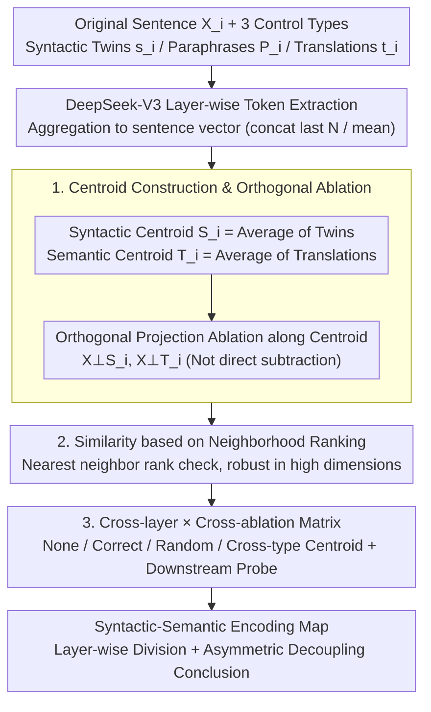

# Differential Syntactic and Semantic Encoding in LLMs

**Conference**: ICML 2026  
**arXiv**: [2601.04765](https://arxiv.org/abs/2601.04765)  
**Code**: https://github.com/acevedo-s/syn-sem  
**Area**: LLM Interpretability / Representation Learning / Computational Linguistics  
**Keywords**: Syntactic-Semantic Decoupling, Linear Encoding, Centroid Ablation, DeepSeek-V3, Representation Geometry

## TL;DR
By averaging latent representations of sentences sharing either syntactic structures or semantic meanings to obtain "syntactic centroids" and "semantic centroids," the authors demonstrate that a significant portion of syntactic and semantic information in LLM sentence vectors (such as DeepSeek-V3) is encoded via **linear superposition**. These two types of information exhibit clear separability in layer-wise distribution and orthogonal ablation—supporting the linguistic hypothesis of "syntactic autonomy."

## Background & Motivation

**Background**: How internal representations of LLMs carry linguistic information is a core question in current interpretability research. Existing work generally agrees that deep "alignment phenomena" suggest middle layers perform shared abstract processing (the Platonic Representation Hypothesis by Huh et al. 2024; High-dimensional Abstract Phases by Cheng et al. 2025). Probing work like Hewitt & Manning’s structural probe and Tenney’s BERT pipeline shows that models roughly replicate the classical NLP pipeline of "syntax first, then semantics." Another line of research from Mikolov to Park consistently indicates that LLMs tend to encode concepts in a **linear** manner.

**Limitations of Prior Work**: Existing probes largely rely on trained classifiers or regressors (structural probes, polar coordinate probes). Their conclusions are easily confounded by the capacity of the probe itself—one cannot distinguish whether information is "encoded in the model" or "learned by the probe." While geometric methods (e.g., Caucheteux 2021) have used syntactic average vectors from GPT-2 to explain fMRI signals, no one has systematically verified on truly large-scale LLMs (10B~100B+ parameters) whether syntax and semantics can be **simultaneously characterized and decoupled using purely linear methods**.

**Key Challenge**: To address linguistic debates such as "syntactic autonomy," a tool is needed that does not require training downstream models and is symmetric for both syntax and semantics. Simply "subtracting a syntactic vector to observe semantic changes" in high-dimensional space can easily introduce artifacts (directly subtracting a centroid takes away neighboring sample components, see Appendix D).

**Goal**: To answer two sub-problems using purely linear, unsupervised methods: (i) what proportion of syntactic and semantic information in LLM latent layers can be explained by a directional vector; (ii) in which layers and to what extent are these two types of information independent.

**Key Insight**: If a group of sentences shares a POS template (same syntax, unrelated meaning), averaging their latent representations causes **semantic components to cancel out while syntactic components remain**—the average vector is naturally a "syntactic centroid." Similarly, translating a sentence into 6 languages and averaging them causes **surface forms to be washed away while meaning remains**—this is the "semantic centroid." Using orthogonal projection along the centroid direction for ablation provides causal evidence nearly free of probe bias.

**Core Idea**: Explicitly construct syntactic and semantic linear subspaces using "averages of shared structures." Cross-measure similarity across all layers of DeepSeek-V3 via orthogonal projection ablation to derive a "syntactic-semantic encoding map."

## Method

### Overall Architecture

The input is a set of original English sentences $\mathbf{X}_i$ (approx. 2,000 sentences, length ≤ 10 words). Each $\mathbf{X}_i$ is paired with three types of controls:
- **Syntactic Twins** $\mathbf{s}_i^{\alpha}$: Sentences sharing the same Penn Treebank POS sequence as $\mathbf{X}_i$ but with unrelated meanings (generated by Gemini/ChatGPT).
- **English Paraphrases** $\mathbf{P}_i$: Paraphrases with the same meaning but different English expressions.
- **Multilingual Translations** $\mathbf{t}_i^{\gamma}$: Translations in $\gamma\in\{$Chinese, Spanish, Italian, Turkish, German, Arabic$\}$ (6 languages total).

The pipeline consists of four steps: (1) Extract token sequences for each layer from DeepSeek-V3; (2) Aggregate tokens into a single sentence vector (concat last N tokens or mean); (3) Construct syntactic centroids $\mathbf{S}_i$ and semantic centroids $\mathbf{T}_i$ using "means of shared sets"; (4) Perform orthogonal projection ablation at each layer and measure geometric proximity of paired sentences using rank-based similarity. Note that $\mathbf{S}_i$ does not include $\mathbf{X}_i$, and $\mathbf{T}_i$ does not include $\mathbf{X}_i$ or $\mathbf{P}_i$ to avoid "self-ablation" artifacts.

### Key Designs

**1. Centroid Construction & Orthogonal Ablation: Explicitly extracting syntactic/semantic components using purely linear means**

Probing methods suffer because conclusions are contaminated by the probe's capacity. This paper seeks a model-free, symmetric tool. The approach utilizes the "average of shared sets": the syntactic centroid $\mathbf{S}_i = \frac{1}{N_{\text{twins}}}\sum_{\alpha=0}^{N_{\text{twins}}} \mathbf{s}_i^{\alpha}$ is the mean of sentences with the same POS template, where meanings cancel out in the $\alpha$ dimension, leaving only the shared syntactic direction. The semantic centroid $\mathbf{T}_i = \frac{1}{N_{\text{lang}}}\sum_{\gamma} \mathbf{t}_i^{\gamma}$ is the average of multilingual translations, where surface forms are washed away, leaving the shared meaning. Ablation uses orthogonal projection $\mathbf{X}_i^{\perp \mathbf{S}_i} = \mathbf{X}_i - \frac{\mathbf{X}_i\cdot \mathbf{S}_i}{|\mathbf{S}_i|^2}\mathbf{S}_i$ rather than direct subtraction to ensure only the component of $\mathbf{X}_i$ collinear with $\mathbf{S}_i$ is zeroed out. "Shuffled centroid" controls prove the drop in similarity is directional and not a trivial effect.

**2. Similarity based on Neighborhood Ranking: Bypassing CKA's weak signal in high dimensions**

To present a causal narrative of "ablation amount → similarity drop," a similarity metric robust in high dimensions is required. Linear alignment metrics like CKA have weak signals in high-dimensional space and are easily distorted by normalization. This paper adopts a purely geometric neighborhood ranking metric: for two representations $A,B$, find the nearest neighbor $j$ of point $i$ in $A$, record the distance rank $r_{ij}^{B}$ of $j$ relative to $i$ in $B$, repeat in reverse, and take the normalized average:

$$Similarity=1-\frac{1}{N_s^2}\Big(\sum_{i,j:r_{ij}^{A}=1} r_{ij}^{B} + \sum_{i,j:r_{ij}^{B}=1} r_{ij}^{A}\Big)$$

A value of 1 indicates perfect nearest neighbor consistency; 0 indicates independent representations. This is related to Information Imbalance (Glielmo 2022) and Neighborhood Overlap (Huh 2024), relying on adjacency rather than linear mapping, making it invariant to space transformation or normalization issues.

**3. Cross-layer × Cross-ablation Matrix: Visualizing the decoupling as a 2D map**

Single-direction ablation only shows that centroids capture relevant information; cross-ablation is required to quantify decoupling. Fixing one similarity type (syntactic twin or paraphrase similarity) and systematically varying the ablated direction—None / Correct Centroid / Shuffled Centroid / Cross-class Centroid—yields a 2D table of layer × (target, ablated). By plotting syntactic similarity ablated by semantic centroids and vice-versa, the "Syntactic-Semantic Encoding Map" is generated. Behaviors are corroborated by downstream probes (linear POS classification + paraphrase recall@3).

### Loss & Training
This work is entirely **training-free** geometric analysis—no fine-tuning of the LLM and no probe training. All "ablations" are closed-form orthogonal projections. The only learnable components are for validation: linear POS classifiers (scikit-learn defaults) and paraphrase recall rankings. DeepSeek-V3 (671B) weights remain frozen throughout. Appendixes replicate results on Qwen2-7B / Gemma3-12B / Pythia-6.9B.

## Key Experimental Results

### Main Results

| Configuration | Task | DeepSeek-V3 Performance | Interpretation |
|------|------|------------------|------|
| Baseline (No ablation) | POS Template Class. (Linear probe) | 0.85 | Syntactic info is highly prominent |
| Baseline (No ablation) | Paraphrase recall@3 | 0.85 | Semantic info is equally prominent |
| Syntactic Sim. vs Layer (concat) | Whole Network | > 0.7 | Syntax is strong across all layers |
| Semantic Sim. vs Layer (mean) | Whole Network | Low early, peak middle, slight drop at end | Middle layers are the "semantic core" |

### Ablation Study

| Ablation Direction | POS Class Acc | Paraphrase Recall@3 | Description |
|----------|--------------|----------------------|------|
| None | 0.85 | 0.85 | Upper bound |
| Subtract Semantic Centroid $\mathbf{T}_i$ | **0.85** | 0.66 | No drop in syntax, semantics drops 19 points |
| Subtract Syntactic Centroid $\mathbf{S}_i$ | **0.10** | **0.90** (5% gain) | Syntax nearly eliminated, semantics slightly increases |
| Subtract Random Semantic Centroid | 0.85 | 0.83 | Near zero impact (control) |
| Subtract Random Syntactic Centroid | 0.81 | 0.85 | Near zero impact (control) |

### Key Findings
- **Asymmetric Decoupling**: Removing semantic centroids does **not** harm syntax (0.85 → 0.85), but removing syntactic centroids slightly **increases** semantic similarity (0.85 → 0.90). This suggests the syntactic subspace is relatively independent of semantics, while semantics is "carried" by the syntactic backbone. This aligns with the "syntactic autonomy" stance in generative grammar.
- **Layer-wise Division**: Syntactic signals remain strong throughout (especially for concat representations > 0.7). Semantic signals concentrate in middle layers (best captured by mean aggregation) and persist to the end—implying LLMs convert semantics back to output forms at the last moment.
- **Norm Decomposition**: Centroid directions explain about 40% of the squared norm in middle layers. Pythia's training curve shows **syntactic centroids emerge early, while semantic centroids accumulate later**, matching the intuition of "structure before meaning."
- **Aggregation vs. Signal**: Concat aggregation favors syntax (retains position), while mean aggregation favors semantics (averages out position, retains meaning). This contrast supports the idea that syntax and semantics may distribute across different timescales/frequencies.

## Highlights & Insights
- **"Mean of Shared Sets" as an Unsupervised Probe**: Reducing abstract concepts like "syntax/semantics" to "which samples share them" and using average vectors as representatives introduces almost no hyperparameters. It is highly transferable to other attributes (sentiment, style, domain).
- **Orthogonal Projection vs. Direct Subtraction**: The authors explicitly demonstrate that direct subtraction causes artifactually strong ablation. Sticking to projection along the direction is a crucial engineering detail for high-dimensional ablation studies.
- **Multilingual Translation as Semantic Representative**: Using the mean of translations from 6 typologically diverse languages (including Chinese, Arabic, Turkish) washes away surface forms more effectively than paraphrases.
- **Syntactic Removal Leading to Semantic Increase**: This counter-intuitive result suggests the syntactic skeleton acts as "noise" for semantic clustering; erasing it clarifies semantic relationships, which offers insights for de-noising retrieval vectors/RAG.

## Limitations & Future Work
- **Limited Explanatory Power of Centroids**: Middle layers explain roughly 40% of the norm; the majority of information lies outside these linear subspaces. This may be a ceiling for linear methods, requiring non-linear tools like those in Wild et al. 2025.
- **Data Scale and Length**: ~2,000 samples and ≤ 10 words per sentence. Short sentences miss long-range dependencies; generalizability to paragraph-level text is unknown.
- **English-Centric**: While 6 languages were used for the centroid, the ablated sentences were always English. Verification in morphologically complex languages (e.g., Finnish) is needed.
- **Intervention Experiments**: Conclusions are based on representation similarity. Future work needs to intervene in the forward pass to see how generation behavior changes.

## Related Work & Insights
- **vs. Hewitt & Manning (2019)**: They use trained probes to find dependency trees; Ours uses geometric centroids without training to find "where syntax is," yielding cleaner evidence.
- **vs. Park et al. (2024/2025)**: They focus on linear directions for single concepts (gender, truth); Ours extends the linear encoding hypothesis to structural properties like entire sentence syntax and semantics.
- **vs. Cheng et al. (2025) / Acevedo et al. (2025)**: Same research group; previous work identified a "high-dimensional abstract phase," while this work qualitatively identifies it as a "semantic phase."
- **vs. Caucheteux et al. (2021)**: They fed POS template averages to fMRI models; Ours performs cross-ablation inside LLMs, potentially leading to a unified machine-brain syntactic map.

## Rating
- Novelty: ⭐⭐⭐⭐ The idea of centroids is established, but the symmetric syntactic-semantic cross-ablation on 670B-scale LLMs and geometric evidence for syntactic autonomy is significant.
- Experimental Thoroughness: ⭐⭐⭐⭐ Multiple models and controls; robust appendix, though data scale is somewhat limited and English-centric.
- Writing Quality: ⭐⭐⭐⭐⭐ Clear argumentation and precise technical details regarding projection vs. subtraction.
- Value: ⭐⭐⭐⭐⭐ Contributes to both LLM interpretability and linguistics; the methodology serves as a reusable template for representation analysis.

<!-- RELATED:START -->

## Related Papers

- [\[ICML 2026\] SAC-Opt: Semantic Anchors for Iterative Correction in Optimization Modeling](sac-opt_semantic_anchors_for_iterative_correction_in_optimization_modeling.md)
- [\[ACL 2025\] A Systematic Study of Compositional Syntactic Transformer Language Models](../../ACL2025/llm_nlp/a_systematic_study_of_compositional_syntactic_transformer_language_models.md)
- [\[ACL 2025\] Quantifying Semantic Emergence in Language Models](../../ACL2025/llm_nlp/quantifying_semantic_emergence_in_language_models.md)
- [\[AAAI 2026\] VSPO: Validating Semantic Pitfalls in Ontology via LLM-Based CQ Generation](../../AAAI2026/llm_nlp/vspo_validating_semantic_pitfalls_in_ontology_via_llm-based_cq_generation.md)
- [\[ICML 2025\] On Expressive Power of Looped Transformers: Theoretical Analysis and Enhancement via Timestep Encoding](../../ICML2025/llm_nlp/on_expressive_power_of_looped_transformers_theoretical_analysis_and_enhancement_.md)

<!-- RELATED:END -->
