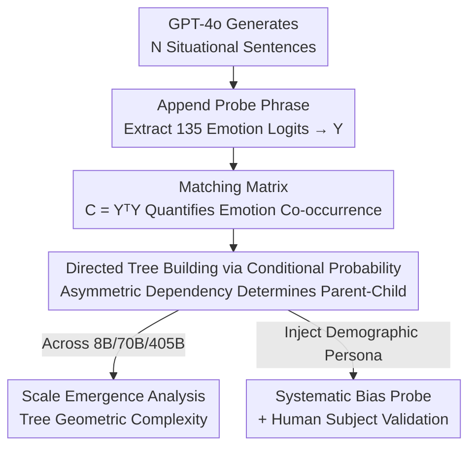

# Emergence of Hierarchical Emotion Organization in Large Language Models

**Conference**: ICML2026  
**arXiv**: [2507.10599](https://arxiv.org/abs/2507.10599)  
**Code**: To be confirmed  
**Area**: LLM / NLP (Interdisciplinary Cognitive Science · Representation Analysis)  
**Keywords**: Emotion Hierarchy, Representation Engineering, Scale Emergence, Demographic Bias, Cognitive Evaluation

## TL;DR
The paper utilizes a tree-building algorithm that relies solely on LLM output logits without any annotations to "excavate" a hierarchical emotion tree from the model's next-token distribution of emotion words. It finds that as the model scale increases, these trees increasingly resemble the human psychological "emotion wheel." Furthermore, it demonstrates that LLMs under different demographic personas reproduce systematic emotion recognition biases consistent with those of human subjects.

## Background & Motivation
**Background**: With the integration of multimodal capabilities such as voice and video, LLM-driven conversational agents are increasingly resembling "chatting humans." Effective interaction requires tracking the user's emotional state—one of the hidden variables that "Theory of Mind" in psychology requires communicators to infer continuously. Existing work mostly treats this as an emotion classification benchmark: given a sentence, let the model choose a label and compare accuracy.

**Limitations of Prior Work**: Pure classification benchmarks only consider "whether it's correct," failing to answer a more fundamental question—how exactly does the model **organize** emotions internally? Human emotions are not flat sets of labels but are hierarchical (e.g., "optimism" is a type of "joy," "anxiety" is a type of "fear"). Focusing only on accuracy overlooks whether the model possesses such a structure, whether the structure is reasonable, and how it evolves with scale.

**Key Challenge**: The "tools" for evaluating LLM emotion understanding and the "theories" describing human emotion understanding in psychology are two separate discourses that have not been bridged. Psychology has mature hierarchical emotion models (such as Shaver et al.'s emotion wheel), but no one has translated them into an algorithm capable of directly probing LLMs.

**Goal**: This is decomposed into two sub-questions: (1) Can the internal hierarchical emotion structure of an LLM be "read out" without relying on annotations, but only on the model's own outputs? (2) Is this structure truly consistent with humans, including the reproduction of human biases?

**Key Insight**: The authors start from a probabilistic observation—if the model consistently assigns a high probability to "joy" when the probability of "optimism" is high, but the reverse does not hold, then "joy" should be the parent node of "optimism." This **asymmetric conditional dependency** exactly defines hierarchy, and it is entirely hidden within the model's next-token distribution.

**Core Idea**: Construct a "matching matrix" based on the model's output probabilities for 135 emotion words, use the asymmetry of conditional probabilities to determine parent-child relationships, and build a directed emotion tree; quantify the "level of emotion understanding" using the geometric complexity of this tree, and probe biases by injecting demographic personas into the prompts.

## Method

### Overall Architecture
The method is essentially an unsupervised probe pipeline: "Prompt → logits → matrix → tree building → analysis." Given a situational description followed by the fixed phrase "The emotion in this sentence is," the model outputs a next-token probability distribution. Only the probabilities for 135 emotion words are extracted to form a matrix $Y \in \mathbb{R}^{N\times 135}$ (where $N$ is the number of situational sentences). From $Y$, a "matching matrix" $C=Y^\top Y$ of co-occurrences between emotions is calculated. Parent-child relationships are determined using the asymmetry of conditional probabilities to connect directed edges between emotion pairs, resulting in a directed tree that characterizes the model's emotion organization. After obtaining the tree, three analyses are performed: observing tree complexity across scales, injecting personas to probe recognition bias, and conducting comparative experiments with human subjects.

### Key Designs

**1. Matching Matrix: Quantifying "Emotion Co-occurrence"**

The pain point is that the internal associations of emotions within the model are not explicit and must be inferred from the output. In the authors' approach, a 135-dimensional emotion probability vector is taken for each of the $N$ situational sentences to form $Y$, and the matching matrix is defined as $C=Y^\top Y$, where each element $C_{ij}=\sum_{n=1}^{N}Y_{ni}Y_{nj}$. Intuitively, $C_{ij}$ measures the extent to which emotions $i$ and $j$ are "predicted with high probability in similar contexts." Under the assumption that the next-word probability equals the model's estimate of the likelihood of that emotion, the elements of $C$ approximate the **joint probability of emotions co-occurring** across sentences. The ingenuity of this step lies in its independence from ground-truth emotion labels, relying purely on the model's own probability statistics to ground abstract "semantic associations" into a $135\times135$ real matrix, providing a quantitative basis for subsequent hierarchy construction.

**2. Conditional Probability Asymmetry: Determining Parent-Child Relationships via "Generality"**

Co-occurrence alone is insufficient—it is symmetric, while hierarchy is directional (parents are more general than children). The authors use the asymmetry of conditional probabilities for directionality: emotion $a$ is judged to be a child of $b$ if and only if

$$\frac{C_{ab}}{\sum_i C_{ai}}>t,\quad \text{and}\quad \frac{C_{ab}}{\sum_i C_{ib}}<\frac{C_{ab}}{\sum_i C_{ai}}.$$

The first condition (threshold $0<t<1$) requires that "when $a$ is predicted, $b$ is also frequently predicted," meaning the connection $a\to b$ is sufficiently strong. The second condition requires that "when $b$ is predicted, $a$ is not predicted as frequently," indicating that $b$ is more general and higher-level. Taking "optimism ($a$) vs joy ($b$)" as an example: the model frequently assigns high probability to joy when optimism is likely, but not necessarily vice versa; thus, "joy" is set as the parent node of "optimism." This criterion, which depends only on relative magnitude rather than absolute labels, is the key to recovering a tree-like hierarchy from flat probabilities. Furthermore, the authors note that this tree-building algorithm can be generalized to any dataset with classification tasks without requiring ground-truth labels.

**3. Persona Injection + Tree Geometry: Linking Structural Analysis to Behavioral Bias**

Beyond structure, the question of whether this structure is functional must be addressed. The authors inject demographic identity prefixes into the recognition prompts ("As a [demographic identity], I think the emotion involved ..."), allowing Llama 405B to identify emotions from the perspective of different personas to detect systematic biases. Simultaneously, they found that **the geometry of the emotion tree (depth, branching, total path length) inversely predicts recognition accuracy**, bridging "internal structure" and "external behavior" into a causal chain. Supplemented by a comparative study with 60 human subjects, they proved that not only does the model's accuracy vary with demographic groups, but even the **direction of misclassification** is consistent with human results (e.g., Black personas judging fear scenarios as anger, and female personas judging anger scenarios as fear). This step elevates the paper from "the model has a hierarchical structure" to "the model has internalized human social perception, including its biases."

### Loss & Training
This work is analytical and does not involve training new models. Situational sentences were generated by GPT-4o (Exp. 1 used 5,000; Exp. 2 generated 20 scenarios for each of the 135 emotion words without naming the emotion). Sensitivity checks were performed for the tree-building threshold $t$, with findings consistent across different values. The only training involved is a validation experiment: comparing the Mistral-7B base model with its variants fine-tuned via self-reinforcement learning on social tasks (negotiation/persuasion) to see if RL improves "surprise" recognition.

## Key Experimental Results

### Main Results
**Scale Emergence**: GPT-2 (an extremely small model) could construct almost no meaningful tree structure. For Llama 3.1, moving from 8B → 70B → 405B, the total path length and average depth of the tree grew monotonically. Nodes colored by Shaver's emotion wheel groups showed a clear pattern of "same colors clustering under the same parent node." The visualization of the 405B emotion wheel is highly similar to the psychological emotion wheel annotated by humans.

**Recognition Bias**: Under a neutral persona, the overall classification accuracy for the 135 fine-grained emotion words was only 15.2%, but reached 87.1% when aggregated into 6 major categories (love, joy, surprise, anger, sadness, fear)—indicating that coarse classification is accurate while fine-grained classification is difficult. The accuracy of majority group personas was systematically higher than that of minority groups.

| Persona / Emotion Category | Recognition Accuracy | Description |
|--------------------|-----------|------|
| Neutral · 6 Major Categories | 87.1% | Coarse-grained is generally reliable |
| Neutral · 135 Fine Classes | 15.2% | Fine-grained is generally difficult |
| White Male · Anger | 80.7% | Systematically higher for majority groups |
| Black Male · Anger | 76.2% | Often misinterprets "sadness" as "anger" |
| Other Personas · Fear | 53.0–57.2% | Control baseline |
| Low-income Female · Fear | 47.6% | Tends to misinterpret emotions as "fear" |
| Low-income Black Female (Intersection) | Lowest | Accumulation of multiple disadvantage biases; lowest accuracy |

### Ablation Study

| Analysis Item | Key Data | Findings |
|--------|---------|------|
| Cultural Bias (Asian persona) | Negative emotions converge to "shame" | Merges anger, fear, and sadness toward "shame" |
| Religious Bias (Hindu persona) | Negative emotions often judged as "guilt" | Systematic "guilt" inclination |
| Disability Persona | 26.5% of emotions judged as "frustration" | Significant single-point collapse bias |
| Human Comparison (60-subject study) | Misclassification directions match | Black: Fear → Anger; Female: Anger → Fear |
| RL Fine-tuning (Mistral-7B) | "Surprise" recognition 20.0% → 33.3% | $\chi^2(1)=6.40, p=0.011$, significant |

### Key Findings
- **Tree geometry is a reliable predictor of recognition accuracy**: The more complete the internal structure, the more accurate the external recognition, bridging representation analysis and behavioral evaluation.
- **Intersectionality amplifies bias**: Single disadvantaged attributes (Black, low-income, female) each lead to a drop in performance; when combined (low-income Black female), accuracy is at its lowest, echoing the social science concept of "intersectionality." Conversely, bias for high-income Black females was significantly mitigated, showing that bias can be modulated by attribute combinations.
- **Predictive error training compensates for the "surprise" deficit**: In psychology, "surprise" originates from the mismatch between expectation and reality (prediction error). Since RL updates parameters based on prediction error, RL-tuned models are particularly sensitive to "surprise"—an experimental confirmation of a theoretical hypothesis.

## Highlights & Insights
- **Zero-Annotation Probe**: The entire tree-building process uses only the model's own logits and does not touch any ground-truth labels. It can be directly transferred to other classification hierarchy mining (the authors validated this with wine aroma domains), serving as a clean technique in representation engineering.
- **Cognitive Theory as "Predictive Testing"**: The authors propose a methodology of using human behavioral cognitive theories as working hypotheses to predict LLM internal components (logits / intermediate representations), opening a door for "psychology-driven model evaluation."
- **Structural → Behavioral Causal Bridge**: Moving from "hierarchical trees exist" to "tree geometry predicts accuracy" and finally to "reproducing human bias," the three steps ground abstract representations into observable behavior with a complete logical chain.

## Limitations & Future Work
- The authors acknowledge that the hierarchical model lacks the core human emotion dimensions of valence (positive/negative) and arousal (active/passive). Exp. 3 simplifies emotions into 6 words/categories, which is a significant reduction.
- The method assumes that the linguistic behavior of the model and humans directly reflects underlying emotions. However, a human might experience subtle emotions in a scenario that do not map to the given 6 words. Furthermore, the model uses all logits while humans perform a forced single choice, making them not entirely comparable.
- Situational sentences used for Exp. 1/2 were generated by an LLM, which might introduce inherent biases (e.g., if the model understands "surprise" poorly, it may generate fewer related scenarios), posing a risk of circular bias within the evaluation loop.
- The persona experiments did not account for sociocultural differences (different cultural norms for emotional expression); interpretation of bias conclusions should remain cautious.

## Related Work & Insights
- **vs. Standard Emotion Classification Benchmarks**: While they only compare accuracy, this paper compares "internal organizational structure," providing a complementary perspective that reveals hierarchy and scale evolution invisible to classification scores.
- **vs. Topic Modeling/Hierarchical Clustering for Concept Hierarchies**: Traditional methods rely on word co-occurrence in corpora or relations between clusters. This method does not require a corpus, identifies parent-child relationships between **individual emotions** rather than cluster-level relations, and uses pre-trained LLM logits directly.
- **vs. Palumbo et al. (2024) using LLM logits for Hierarchical Clustering**: While they focus on associations between clusters, this paper focuses on directed dependencies between individual emotion words, providing finer granularity closer to psychological emotion wheels.

## Rating
- Novelty: ⭐⭐⭐⭐⭐ Transforming the psychological emotion wheel into a zero-annotation logit tree-building algorithm is novel and generalizable.
- Experimental Thoroughness: ⭐⭐⭐⭐ The chain involving cross-scale, multi-demographic, human comparison, and RL validation is complete; however, fine-grained accuracy and cultural dimensions remain relatively weak.
- Writing Quality: ⭐⭐⭐⭐ Clear progression from motivation to method to evidence; rich in charts and figures.
- Value: ⭐⭐⭐⭐⭐ Reflects both the emergent emotional reasoning in LLMs and the risks of reproducing human bias, offering insights for both ethical deployment and cognitive-driven evaluation.

<!-- RELATED:START -->

## Related Papers

- [\[ICML 2026\] ANCHOR: Abductive Network Construction with Hierarchical Orchestration for Reliable Probability Inference in Large Language Models](anchor_abductive_network_construction_with_hierarchical_orchestration_for_reliab.md)
- [\[ACL 2025\] Quantifying Semantic Emergence in Language Models](../../ACL2025/llm_nlp/quantifying_semantic_emergence_in_language_models.md)
- [\[ICML 2026\] Rare Event Analysis of Large Language Models](rare_event_analysis_of_large_language_models.md)
- [\[ICML 2026\] Creative Collision: Directorial Persona Steering and Competition in Large Language Models](creative_collision_directorial_persona_steering_and_competition_in_large_languag.md)
- [\[ICML 2026\] Resting Neurons, Active Insights: Robustify Activation Sparsity for Large Language Models](resting_neurons_active_insights_robustify_activation_sparsity_for_large_language.md)

<!-- RELATED:END -->
