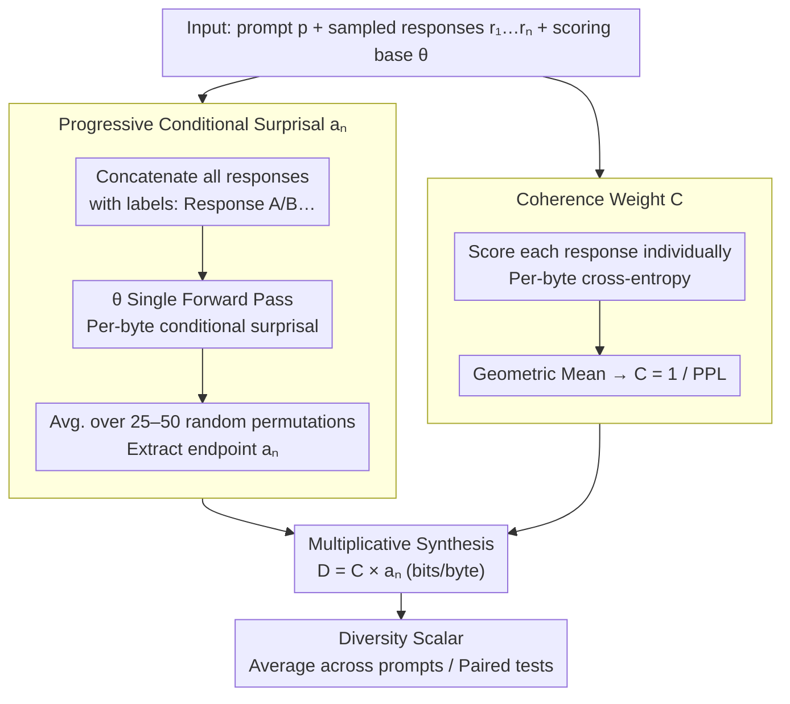

# "I've Seen How This Goes": Characterizing LLM vs. Human Writing Diversity using Progressive Conditional Surprisal

**Conference**: ICML 2026  
**arXiv**: [2606.01811](https://arxiv.org/abs/2606.01811)  
**Code**: https://github.com/AMindToThink/icl-diversity (Available)  
**Area**: LLM Evaluation / Diversity Metrics / Information Theory  
**Keywords**: Diversity Measurement, Conditional Surprisal, In-Context Learning, Mode Collapse, RLHF Evaluation

## TL;DR
This paper proposes $D_{Ca_n}=C\cdot a_n$, an embedding-free, reference-free, and label-free diversity metric. It uses a base model $\theta$ to process all responses in a single forward pass to measure "how much per-byte conditional surprisal remains in the last response after seeing $n-1$ priors," multiplied by the "overall coherence of the responses." It approaches SentBERT performance on the McDiv human evaluation benchmark and captures the monotonic decrease in diversity (mode collapse) across the OLMo-2-7B post-training pipeline (base → SFT → DPO → RLVR).

## Background & Motivation

**Background**: Evaluating generative model diversity currently follows two main paths: surface-level $n$-gram/self-BLEU (Li 2016, Zhu 2018) or embedding distances/clustering (Du & Black 2019, SentBERT). The former is purely lexical, while the latter depends on an external sentence embedding model. The McDiv benchmark (Tevet & Berant 2021) standardized this paradigm (human binary classification + OCA/Spearman scoring), becoming the de facto standard for diversity metrics.

**Limitations of Prior Work**: $n$-grams fail to catch "reskinned homogeneity"—responses with high lexical variety but redundant semantics. Embedding metrics "outsource" diversity to sentence vector models, introducing a black-box whose bias determines diversity scores. Furthermore, embeddings often fail to recognize patterns not seen during their own training (e.g., specific character styles or metaphorical structures). Both paths lack the human-like ability to recognize arbitrary latent commonalities.

**Key Challenge**: Diversity is fundamentally about "how much new information is provided by the next item given the previous ones"—an information-theoretic concept. While existing work (MMI decoding, AIM) uses mutual information as a training or decoding objective, it has not been used as an *evaluation-time* diagnostic tool, largely because base models were not assumed to possess the capability to "learn while reading."

**Goal**: (1) Construct a diversity scalar independent of embeddings, reference corpora, or human labels; (2) Achieve correlation with human judgments on par with SentBERT on the Tevet & Berant benchmark; (3) Detect the "RLHF-induced mode collapse" commonly reported in industry post-training pipelines (OLMo-2-7B base → SFT → DPO → RLVR).

**Key Insight**: The In-Context Learning (ICL) phenomenon (Brown et al. 2020) suggests that base models "learn" while reading concatenated contexts. Therefore, diversity can be naturally defined as the "surprisal remaining for the $k$-th response after the base model $\theta$ has read the preceding $k-1$ responses." If the policy $\pi$ is truly diverse, the ICL of $\theta$ will fail to learn a pattern, and conditional surprisal will remain high; if $\pi$ cycles through a few modes, $\theta$ will quickly identify the pattern, causing conditional surprisal to drop toward zero.

**Core Idea**: Use the ICL capability of a base model as a "diversity microscope." Define a progressive conditional surprisal curve $a_k=-\log_2\theta(r_k\mid r_{<k},p)/\|r_k\|$. Take the final point $a_n$ to measure the residual per-byte surprisal, and multiply it by a coherence weight $C=1/\mathrm{PPL}_\theta(\pi,p)$ to prevent pure noise (which is incompressible) from being misidentified as high diversity.

## Method

### Overall Architecture
Given a prompt $p$, $n$ responses $r_1,\dots,r_n$ sampled from policy $\pi$, and a fixed "scoring base model" $\theta$ (Qwen2.5-3B in experiments), the metric runs two parallel tracks in one forward pass. The **conditional track** concatenates all responses into a long context with "Response A/B..." labels, calculates the per-byte conditional surprisal for each response given its predecessors, and takes the final point $a_n$ as residual diversity. The **unconditional track** scores each response independently to derive a coherence weight $C$. The final diversity is the product $D_{Ca_n}=C\times a_n$ (bits/byte), interpreted as "the amount of reasonable surprisal per byte remaining after $\theta$ has learned what it can via ICL." This pipeline requires no embeddings, reference corpora, human labels, or auxiliary classifiers, relying instead on the per-token probabilities inherent to $\theta$.

### Key Designs

**1. Progressive Conditional Surprisal Curve $a_k$: Turning Diversity into Residual Surprisal**

Existing metrics struggle: $n$-grams are too literal, and embeddings rely on pre-trained black boxes that might miss novel patterns. Information-theoretic measures like mutual information have been confined to training/decoding. This work pivots: since base models possess natural in-context learning (ICL) abilities, they can serve as diversity microscopes. The progressive conditional surprisal is defined as $a_k=-\log_2\theta(r_k\mid r_{<k},p)/\|r_k\|$, representing the surprisal per byte of the $k$-th response after observing the first $k-1$ responses. The endpoint $a_n$ measures residual diversity. It can be rewritten as $a_n=H_\theta(r_n\mid p)-I_\theta(r_n;r_1,\dots,r_{n-1}\mid p)$, i.e., "the surprisal of the response itself" minus "what was predicted by others." To score high, responses must be individually surprising yet mutually unpredictable. Two engineering details ensure cross-model compatibility: normalization via UTF-8 bytes rather than tokens, and averaging over 25–50 random permutations to eliminate ordering bias. This allows the detection of high-order commonalities (templates, narrative arcs, styles) that embeddings/n-grams miss, with sensitivity that scales with the strength of the base model.

**2. Coherence Weight $C$: Filtering Noise via Geometric Mean Perplexity**

The $a_n$ metric alone can be "gamed" by pure noise, as random strings are incompressible via ICL and maintain high surprisal. This work introduces a coherence weight to anchor diversity within the "readability manifold": $C=2^{-\frac{1}{n}\sum_i h_\theta(r_i\mid p)}=1/\mathrm{PPL}_\theta(\pi,p)$, where $h_\theta(r_i\mid p)$ is the individual per-byte cross-entropy. $C$ is the reciprocal of the geometric mean per-byte perplexity. Using the geometric mean is critical: a single response with catastrophic perplexity will drag $C$ toward zero, preventing a set of poor responses from being "whitewashed" by an average. High diversity thus requires responses that are both mutually unpredictable and individually coherent.

**3. Multiplicative Synthesis $D_{Ca_n}=C\times a_n$: Diversity as a Triplet**

Multiplying the components yields a single scalar (bits of reasonable surprisal per byte), facilitating prompt averaging and paired testing. The paper calibrates this behavior across five synthetic scenarios: noise is suppressed by $C$ (0.04), one-mode results are suppressed by $a_n$ (0.10), and mixed scenarios score highest (0.52). Crucially, diversity is explicitly defined as a (responses, prompt, scoring model) triplet. Using a stronger $\theta$ yields different scores, which is a *feature*, not a bug: diversity is defined relative to the patterns a specific model can perceive. This ensures the metric sharpens as base models evolve, avoiding the "fixed裁判 (referee)" ceiling of static embeddings.

### Loss & Training
The method involves no training. $\theta$ is a pre-existing base model (Qwen2.5-3B base, GPT-2 124M, or OLMo-2-7B-base). The metric is calculated from per-token log-probabilities during a forward pass with byte-level normalization and permutation averaging. The only hyperparameters are the number of permutations (25–50) and responses per prompt ($K=10$). In OLMo post-training experiments, responses were truncated to the shortest length per prompt across stages to eliminate artifacts from PPL decreasing with context length.

## Key Experimental Results

### Main Results
Using Qwen2.5-3B with 50 permutations on the McDiv / ConTest human benchmarks, the metric is evaluated via OCA (Optimal 1D threshold Classification Accuracy) and Spearman $\rho$. (Ours results from Section 5 / Table 2).

| Dataset / Sub-task | Metric | $D_{Ca_n}$ (Ours) | SentBERT (Prev. SOTA) | distinct-$n$ |
|---|---|---|---|---|
| McDiv prompt_gen (full, ~2K) | OCA | **0.846** | 0.897 | 0.746 |
| McDiv prompt_gen (full, ~2K) | $\rho$ | +0.729 | +0.796 | +0.476 |
| McDiv_nuggets prompt_gen (~1K) | OCA | 0.785 | 0.850 | 0.675 |
| ConTest prompt_gen (200) | OCA | 0.785 | 0.815 | 0.675 |
| ConTest story_gen (200) | OCA | 0.828 | 0.896 | 0.772 |

OLMo-2-7B post-training pipeline (Base / SFT / DPO / Instruct(RLVR)), scored by $\theta=$ Qwen2.5-3B with 25 permutations:

| Stage | AlpacaEval $D_{Ca_n}$ mean (n=150) | NoveltyBench-curated mean (n=39) |
|---|---|---|
| Base | 0.481 | 0.481 |
| SFT | 0.329 | 0.369 |
| DPO | 0.286 | 0.312 |
| Instruct (RLVR) | 0.281 | 0.303 |

Three pre-registered one-sided paired Wilcoxon tests (Bonferroni $\times 3$) show significant decreases: Base > SFT, SFT > DPO, and Base > Instruct all yield $p_\text{Bonf} < 10^{-6}$ across both prompt sets.

### Ablation Study
The paper provides a component-wise ablation (Table 2) showing the contribution of $a_n$ and $C$:

| Configuration | McDiv prompt_gen OCA | ConTest story_gen OCA | Description |
|---|---|---|---|
| $D_{Ca_n}=C\times a_n$ (Full) | 0.846 | 0.828 | Complete metric |
| $a_n$ only (no coherence) | 0.781 | 0.684 | Drops 6.5pp on McDiv, 14.4pp on story_gen |
| $C$ only (1/PPL) | 0.565 | 0.632 | Barely performs above chance |

Synthetic results (Table 1) confirm the necessity of $C$: noise sets have high $a_n$ but are suppressed by $C$ to 0.04, whereas one-mode sets are suppressed by $a_n$ to 0.10.

### Key Findings
- **Coherence Weight is Vital**: Removing $C$ causes a 14.4pp drop on ConTest story_gen, indicating that human-written diverse sets often contain low-quality responses that interfere with $a_n$; $C$ successfully compensates.
- **Stronger Models, Sharper Metrics**: Qwen2.5-3B shows lower $a_n$ on "incoherent multi-mode" scenarios than GPT-2, as its better ICL identifies the underlying templates. This validates the design goal of "auto-sharpening" with model scaling.
- **Temperature $\neq$ Creativity**: On DecTest (temperate-labeled sets), $a_n$ achieves $\rho=+0.932$, but the authors note this is a sanity check as temperature scales policy entropy mechanically.
- **McDiv_nuggets Confound**: In this benchmark, low-diversity sets consist of rewrites of dramatic endings which are inherently more "surprising" to base models than standard continuations, creating a gap in $a_1$. $C$ succeeds here partly due to this artifact.

## Highlights & Insights
- **ICL as Evaluation-Time Diagnostic**: Unlike MMI/AIM which use mutual information for training/decoding, this paper uses the base model's learning behavior as an *evaluation-only* probe. It requires only the logits $\theta$ already produces.
- **Per-byte Normalization + Geometric Mean Coherence**: Per-byte normalization ensures cross-tokenizer comparability. The geometric mean allows a single "garbage" response to veto the coherence of the entire set—a combination that keeps the metric robust across model evaluations.
- **Diversity as a Triplet $(r, p, \theta)$**: Acknowledging diversity is not an internal property of a policy avoids the trap of using a static "referee" embedding and provides an upgrade path via stronger $\theta$.
- **Statistical Rigor in Post-training**: Converting qualitative observations of "RLHF mode collapse" into quantitative directional conclusions with Bonferroni-corrected $p$-values provides a robust template for future RLHF evaluations.
- **The $\bar a_k$ Curve as Diagnosis**: The curve shape distinguishes between "dropping to the floor" (one-mode collapse) and "stabilizing at a positive plateau" (true diversity), offering more information than a single scalar.

## Limitations & Future Work
- **Diversity $\neq$ Utility**: $a_k$ is decoupled from task success; responses can be diverse but fail the task. It is a "health check/warning" rather than a primary quality metric.
- **Model Capacity Dependence**: The metric is limited by the patterns $\theta$ can see. Evaluating long-form creative writing might require $\theta \geq 7$B and entails $O(n^2)$ computational cost relative to concatenation length.
- **Truncation Artifacts**: The truncation required for some experiments (e.g., AlpacaEval) can be aggressive. Future work could explore correction terms for varying lengths without truncation.
- **McDiv_nuggets Artifacts**: The "inherent surprise" in the nuggets sub-dataset suggests results should be interpreted cautiously; prompt_gen is a cleaner evaluation target.

## Related Work & Insights
- **vs. $n$-gram / self-BLEU**: Captures "reskinned homogeneity" that surface-level overlap misses, at the cost of higher computation.
- **vs. SentBERT Clustering**: SentBERT measures "learned semantic distance" while this measures "statistical independence." They are complementary. This method replaces a fixed black-box with a model-aligned probe.
- **vs. NoveltyBench**: NoveltyBench uses a DeBERTa classifier, but since the ground truth is model-derived, it risks model-to-model bias. This work correlates directly with human judgments.
- **vs. RLHF Diversity Studies (Kirk 2023)**: Provides stronger statistical evidence and a standardized metric for the qualitative observation that RLHF reduces diversity.

## Rating
- Novelty: ⭐⭐⭐⭐ Using ICL as an evaluation-time probe is elegant and captures the essence of diversity.
- Experimental Thoroughness: ⭐⭐⭐⭐ Strong coverage across benchmarks, post-training stages, and synthetic controls.
- Writing Quality: ⭐⭐⭐⭐⭐ Clear notation, cautious claims, and excellent use of synthetic scenario tables.
- Value: ⭐⭐⭐⭐ Provides an immediately usable tool for RLHF and decoding strategy diagnostics.

<!-- RELATED:START -->

## Related Papers

- [\[ICLR 2026\] How Catastrophic is Your LLM? Certifying Risk in Conversation](../../ICLR2026/llm_nlp/how_catastrophic_is_your_llm_certifying_risk_in_conversation.md)
- [\[ACL 2025\] A Survey of LLM-based Agents in Medicine: How Far Are We from Baymax?](../../ACL2025/llm_nlp/a_survey_of_llm-based_agents_in_medicine_how_far_are_we_from_baymax.md)
- [\[ICML 2026\] How Many Different Outputs Can a Transformer Generate?](how_many_different_outputs_can_a_transformer_generate.md)
- [\[ACL 2026\] One Persona, Many Cues, Different Results: How Sociodemographic Cues Impact LLM Personalization](../../ACL2026/llm_nlp/one_persona_many_cues_different_results_how_sociodemographic_cues_impact_llm_per.md)
- [\[ICML 2026\] Universal Reasoner: 冻结 LLM 的可组合即插即用推理器](universal_reasoner_a_single_composable_plug-and-play_reasoner_for_frozen_llms.md)

<!-- RELATED:END -->
