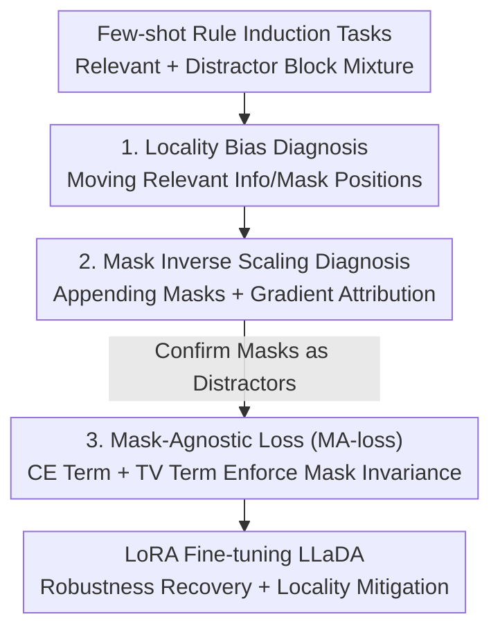

# Masks Can Be Distracting: On Context Comprehension in Diffusion Language Models

**Conference**: ICML2026  
**arXiv**: [2511.21338](https://arxiv.org/abs/2511.21338)  
**Code**: To be confirmed  
**Area**: LLM / NLP (Diffusion Language Models)  
**Keywords**: Masked Diffusion Language Models, Context Comprehension, Locality Bias, Inverse Scaling, Mask-Agnostic Fine-tuning

## TL;DR
This paper systematically reveals two overlooked defects of Masked Diffusion Language Models (MDLM): like autoregressive models, they exhibit a strong locality bias; furthermore, the mask tokens appended for parallel generation act as distractors that degrade context comprehension. The authors propose a mask-agnostic fine-tuning loss that enforces prediction invariance to the number of mask tokens, significantly restoring robustness.

## Background & Motivation

**Background**: Masked Diffusion Language Models (MDLM, such as LLaDA and Dream) are considered powerful alternatives to Autoregressive Language Models (ARLM). By using a denoising objective to predict masked tokens in parallel across the entire sequence with bidirectional attention, they theoretically should utilize context more "globally" without being forced into left-to-right generation like GPT. One of their most attractive selling points is the inference acceleration provided by parallel decoding.

**Limitations of Prior Work**: Despite a more global training objective, no study has systematically examined how MDLMs utilize context during inference. Two points that intuitively "should be fine" are actually problematic: first, whether they truly escape the "weighting proximal and ignoring distal" position bias of ARLMs; second, the fact that parallel generation requires appending a large number of mask tokens at the end of the input (one per target position). These masks are traditionally treated as "neutral placeholders," but their impact on context processing has never been quantified.

**Key Challenge**: Mask tokens in MDLMs serve a dual purpose—they construct the denoising objective during training via random masking and define the interval to be predicted during inference. The authors find that this design, where masks serve as both training signals and generation scaffolding, makes them far from harmless: they distract the model's attention, consuming computational capacity that should be used for understanding context.

**Goal**: The research is divided into three sub-questions: (1) Does MDLM exhibit position/locality bias? (2) How does appending mask tokens specifically affect context comprehension, and what is the mechanism? (3) Can this vulnerability be fixed without increasing inference overhead?

**Key Insight**: The authors move away from traditional "needle-in-a-haystack" information retrieval tasks (which are too simple and require context lengths far exceeding MDLM training windows to expose bias). Instead, they design a set of **few-shot rule induction tasks**—providing several examples for the model to infer abstract rules (e.g., "select the adjective from three words"). Answers are deliberately compressed into a single token, allowing for clean evaluation via accuracy and fine-grained analysis through gradient attribution and prediction entropy, all while remaining within the model's training context length.

**Core Idea**: Controlled experiments are first used to prove the "masks are distractors" phenomenon (locality bias + mask inverse scaling). Then, a mask-agnostic loss is used to directly incorporate "invariance to mask quantity" into the fine-tuning objective, demonstrating that this vulnerability is a product of training rather than an inherent architectural flaw.

## Method

The "Method" of this paper consists of two parts: a set of experimental probes to **diagnose** the problem and a fine-tuning loss to **repair** it. The overall logic follows a sequence of observation, attribution, and correction.

### Overall Architecture

The experimental platform is a suite of 16 few-shot rule induction tasks (combinations of 8 "relevant word selection" tasks + 2 digit-based distractor tasks, with 1000 test points each). Context difficulty and information position are precisely manipulated by mixing "relevant example blocks" and "distractor example blocks" randomly or by position in the prompt. The subjects are two pairs of models: LLaDA-8B trained from scratch via masked diffusion loss (compared against the same architecture's ARLM, Llama3-8B) and Dream-7B initialized from ARLM weights (compared against its source, Qwen2.5-7B), all using greedy decoding. The diagnosis follows three steps: measuring **position sensitivity** (locality bias), testing the **destructive effect of appended masks** (inverse scaling + gradient attribution), and finally using **mask-agnostic fine-tuning** to correct it, verifying that the vulnerability stems from the masks.

### Key Designs

**1. Locality Bias Diagnosis: MDLM is also "Nearsighted" and Biased Toward Specially Masked Positions**

This addresses the pain point that researchers assumed denoising objectives plus bidirectional attention would allow MDLMs to utilize context uniformly. The authors fixed 10 relevant examples into one block and 40 distractor examples, moving the relevant block's position to measure accuracy. Results showed that MDLM (LLaDA, Dream) accuracy **decreased monotonically** as relevant information moved further from the test question—a strong recency bias. Unlike ARLMs, they did not show a U-shape (no obvious primacy bias), consistent with existing explanations that primacy primarily stems from causal attention masking.

Further moving the test question (and the masked answer) within the prompt revealed that performance is determined not by "proximity to the right end" but by "**proximity to the mask tokens**": the closer the relevant information is to the masked question, the better the performance, regardless of absolute position. Thus, "recency bias" is essentially a broader "locality bias." The authors attribute the root cause to the $1/p$ weighting of the masked diffusion loss ($p$ is the masking probability): this weights training more heavily toward cases with "only a few tokens masked," where local context is sufficient for prediction, pushing the model toward local dependency. Gradient attribution (L2 norm of the logit of the predicted answer token with respect to the input embeddings) further confirmed this: all models showed U-shaped attribution, but MDLM (especially base versions) had more uniform gradient distributions than ARLMs, suggesting the potential for global context utility exists but is not fully utilized.

**2. Mask Inverse Scaling Diagnosis: Appended Masks are "Distractors," Worse with Longer Context**

This is the most counter-intuitive finding. The authors hypothesized that "adding more masks makes the model more global." Instead, they appended different numbers of mask tokens after the prompt (the first mask corresponds to the answer; after a single decoding step, only this first mask is evaluated, ignoring the rest to isolate confounding factors of multi-step decoding). The results were the opposite—accuracy **decreased monotonically** with mask count: LLaDA-Base/Instruct dropped by approximately 23 and 27 percentage points respectively under greedy decoding. Dream, initialized from ARLM, was more robust but still dropped 6–8 percentage points with 20 masks. Dropping points under greedy decoding indicates that masks do not just increase entropy but **shift the mode of the model's distribution toward incorrect answers**.

The authors performed a triple attribution to confirm "masks are distractors": (a) as distractor examples increased (making the effective context longer), LLaDA's performance drop became more severe, and tasks that benefited most from more context were also most easily destroyed by masks; (b) gradient attribution showed that appended masks received significantly higher normalized gradients than any non-mask token (see table below), indicating the model is disproportionately influenced by masks; (c) replacing appended masks with neutral repeated tokens (e.g., " .") as a control resulted in almost no drop for LLaDA (at most 3/10 pp vs. 23/27 for masks), proving the destruction comes from the **masks themselves** rather than an out-of-distribution phenomenon of repeating tokens. Additionally, iterative unmasking at inference time (40 steps, selecting tokens based on high confidence) recovered most of the accuracy lost to masks, but at the cost of multi-pass decoding latency.

**3. Mask-Agnostic Loss (MA-loss): Building "Invariance to Mask Quantity" into the Objective**

Having proven the vulnerability comes from masks, and since unmasking is too slow for low-latency scenarios, the authors proposed a mask-agnostic loss to make predictions **invariant to the number of appended masks**. For a prompt-answer pair, the answer is first noisy via Bernoulli($p$) to get $\tilde{\bm{a}}$. Then, two different appended mask lengths $l_1, l_2$ are randomly sampled to construct two inputs $\bm{x}_1, \bm{x}_2$ that differ only in the number of terminal masks. The loss contains two terms:

$$\mathcal{L}_{CE}=-\frac{1}{2pn_m}\sum_{i=1,2}\sum_{j\in\mathcal{A}}\mathbb{1}\{x_i^j=m\}\log p_\theta(x^j|\bm{x}_i),\quad \mathcal{L}_{TV}=\frac{p}{n_m}\sum_{j\in\mathcal{A}}\mathbb{1}\{x_1^j=m\}\,TV\big(p_\theta(x^j|\bm{x}_1),p_\theta(x^j|\bm{x}_2)\big)$$

The final loss is $\mathcal{L}_{MA}=\alpha\mathcal{L}_{CE}+\beta\mathcal{L}_{TV}$. The CE term is standard cross-entropy, ensuring the answer is correct regardless of appended masks ($1/p$ scaled, following masked diffusion objectives). The TV term is the core innovation—using Total Variation distance to **explicitly force the prediction distributions of answer tokens to be consistent under both mask configurations** (scaled by $p$, ensuring alignment even when the answer contains nearly no unmasked tokens). Both terms are normalized by the number of mask tokens $n_m$. Intuitively, the TV term teaches the model to "ignore the trailing string of masks," which the CE term alone fails to do (as proven by ablation).

### Loss & Training
The authors used LoRA adapters to fine-tune LLaDA-Base/Instruct on a subset of the OpenOrca instruction tuning dataset for approximately 1.2k steps. They deliberately chose OpenOrca, which does **not match** the ICL evaluation tasks, to ensure the fine-tuning induced global behavioral changes in the model rather than overfitting to the ICL task structure. An ablation model with $\beta=0$ (CE term only) was used to verify the necessity of the TV term.

## Key Experimental Results

### Main Results

Gradient Attribution (50 masks appended, normalized gradients, ± denotes standard deviation): Mask tokens receive significantly higher gradients than any non-mask tokens, showing the model is disproportionately pulled by masks.

| Model | Mask tokens | Non-mask (last 50) | Non-mask (all) |
|------|-----------|---------------|--------------|
| Dream-Base | 0.282 ± 0.040 | 0.012 ± 0.007 | 0.005 ± 0.003 |
| Dream-Instruct | 0.144 ± 0.031 | 0.030 ± 0.005 | 0.018 ± 0.002 |
| LLaDA-Base | 0.234 ± 0.021 | 0.005 ± 0.002 | 0.005 ± 0.002 |
| LLaDA-Instruct | 0.220 ± 0.031 | 0.057 ± 0.014 | 0.017 ± 0.003 |

Note that the "last 50 non-mask tokens" (immediately to the left of masks) have higher gradients than general non-mask tokens, again confirming recency/locality bias.

### Ablation Study

| Configuration | Phenomenon | Explanation |
|------|------|------|
| Appending Masks (LLaDA-Base/Instruct) | Accuracy drops ~23/27 pp | Masks act as distractors; mode shifts to wrong answer in greedy decoding |
| Appending ". . ." instead of masks | Only drops ~3/10 pp | Destruction is from the mask itself, not OOD repetition |
| Inference-time unmask (40 steps, high confidence) | Basic recovery of accuracy | Effective but requires multi-pass decoding and increases latency |
| MA-loss complete (CE + TV) | Significant robustness recovery; reduced locality bias | Only requires few decoding steps; suitable for low latency |
| MA-loss CE only ($\beta=0$) | No significant effect | TV term is key to encoding mask invariance into the objective |

### Key Findings
- **Mask Inverse Scaling is a "Mask Tax" unique to MDLM**: Parallel decoding requires appending many masks, yet the masks themselves degrade context comprehension—this is a second source of performance degradation independent of "losing token dependencies in few-step decoding."
- **Train-from-scratch vs. ARLM-initialization differs significantly**: LLaDA (scratch-trained on masked diffusion) is extremely sensitive to masks. Dream (initialized from Qwen2.5) is much more robust, suggesting that the degree of mask "integration" into the architecture determines vulnerability. Interestingly, Dream's gradient is still heavily influenced by masks, yet this doesn't fully translate to performance loss.
- **Vulnerability is a product of training, not architecture**: MA-loss corrects it, proving that enforcing mask invariance during training fixes the issue without harming language modeling capabilities (verified in the appendix).
- **Evaluation Implication**: MDLM evaluations must explicitly report the number of mask tokens used and include "mask sensitivity analysis" in standard benchmarks (especially for long-context tasks); otherwise, results are irreproducible and incomparable.

## Highlights & Insights
- **The "Mask Tax" concept highlights the hidden cost of MDLM acceleration**: While others focus on "losing dependencies" during few-step decoding, the authors point out that appending masks damages context comprehension before decoding even starts, which is a critical constraint for designing fast samplers.
- **Clean Diagnostic Design**: By using single-token answers and few-shot rule induction, they avoid fuzzy metrics like generative perplexity, allowing for clean analysis of accuracy, gradient attribution, and entropy. This "controlled probe" method is transferable to other position bias/context studies.
- **Ingenuity of the TV Term**: Rather than fixing things with multi-step unmasking after the fact, the TV term uses Total Variation distance during training to force distribution consistency between mask configurations, making "invariance" a learned inductive bias with near-zero inference overhead.
- **"Control via repeated dots" ablation is textbook attribution**: One simple control excludes the alternative explanation of "OOD repeated tokens," pinning the blame squarely on the mask.

## Limitations & Future Work
- The authors acknowledge that only open-source MDLMs were analyzed. Since pre-training details (exact data, mask scheduling) are not fully public, it is difficult to distinguish "model-specific quirks" from "universal properties of MDLM." Cleaner conclusions require controlled comparisons with transparent training pipelines.
- Limitations of the study itself: Evaluation relies on self-constructed few-shot tasks (though HotPotQA/GSM8k/classification were added in the appendix). Since task answers are single tokens and contexts are relative short, the magnitude of the "mask tax" in real-world long-text generation needs verification closer to actual deployment. MA-loss was only verified on LLaDA; its gains on models already robust like Dream might be limited.
- Future Work: The authors suggest studying uniform diffusion models (which do not use masks explicitly but spread noise uniformly) to see if locality/mask sensitivity is inherent to the diffusion paradigm or specific to masked variants; they also suggest deeper analysis of the $1/p$ weighting and noise scheduling to explain locality from a training dynamics perspective.

## Related Work & Insights
- **vs. Position Bias in ARLMs (Liu 2023 "lost-in-the-middle", etc.)**: They identified U-shaped (primacy + recency) bias in ARLMs attributed to causal masking. This paper transfers the analysis to MDLM, finding a monotonic locality bias (no primacy) and tracing it to the $1/p$ weighting/masking mechanism.
- **vs. MDLM "AR-ness" (Shansan 2025)**: They studied whether MDLM follows a left-to-right **decoding order**. This paper focuses on MDLM's AR-like behavior in **context processing**; the focus is orthogonal.
- **vs. Inference-time Unmasking / Adaptive Parallel Decoding**: Unmasking restores accuracy but adds latency. MA-loss yields robustness in few steps, making it better for low-latency and distillation pipelines.

## Rating
- Novelty: ⭐⭐⭐⭐⭐ First to systematically reveal MDLM locality bias + mask inverse scaling ("mask tax") and provide a training-side fix.
- Experimental Thoroughness: ⭐⭐⭐⭐ Solid multi-model pairing, gradient attribution, and control ablations, though tasks are somewhat synthetic/short.
- Writing Quality: ⭐⭐⭐⭐⭐ Clear Phenomenon-Attribution-Repair logic; well-summarized "mask tax" and evaluation guidelines.
- Value: ⭐⭐⭐⭐⭐ Directly impacts MDLM training, evaluation, and parallel deployment; evaluation guidelines are highly actionable.

<!-- RELATED:START -->

## Related Papers

- [\[ICML 2026\] Reasoning on the Manifold: Bidirectional Consistency for Self-Verification in Diffusion Language Models](reasoning_on_the_manifold_bidirectional_consistency_for_self-verification_in_dif.md)
- [\[ICLR 2026\] Constrained Decoding of Diffusion LLMs with Context-Free Grammars](../../ICLR2026/llm_nlp/constrained_decoding_of_diffusion_llms_with_context-free_grammars.md)
- [\[ICML 2026\] SPA-Cache: Singular Proxies for Adaptive Caching in Diffusion Language Models](spa-cache_singular_proxies_for_adaptive_caching_in_diffusion_language_models.md)
- [\[ACL 2025\] Uncertainty Unveiled: Can Exposure to More In-context Examples Mitigate Uncertainty for Large Language Models?](../../ACL2025/llm_nlp/uncertainty_unveiled_can_exposure_to_more_in-context_examples_mitigate_uncertain.md)
- [\[ACL 2026\] Unlocking the Potential of Diffusion Language Models through Template Infilling](../../ACL2026/llm_nlp/unlocking_the_potential_of_diffusion_language_models_through_template_infilling.md)

<!-- RELATED:END -->
