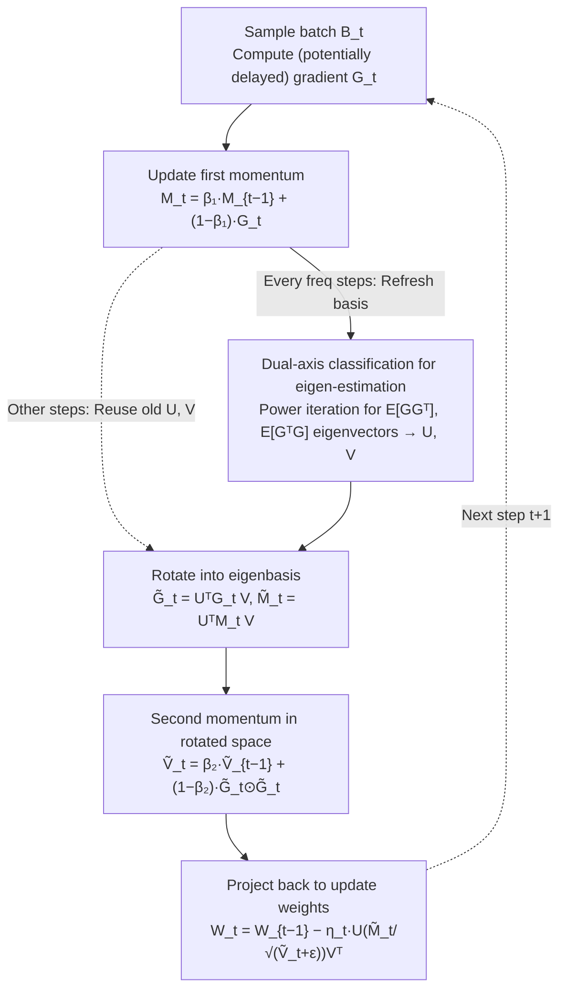

# Mitigating Staleness in Asynchronous Pipeline Parallelism via Basis Rotation

**Conference**: ICML 2026  
**arXiv**: [2602.03515](https://arxiv.org/abs/2602.03515)  
**Code**: https://github.com/LOG-postech/basis-rotation (Available)  
**Area**: LLM Efficiency / Distributed Training / Optimizers  
**Keywords**: Asynchronous Pipeline Parallelism, Gradient Staleness, Basis Rotation, Adam, Hessian Eigenbasis

## TL;DR
The authors attribute the "culprit" of convergence collapse caused by delayed gradients in asynchronous pipeline parallelism (APP) training of LLMs to Adam's basis mismatch (where the Hessian eigenbasis is not aligned with coordinate axes). They propose performing basis rotation to the Hessian eigenbasis before executing Adam updates. On a 3B model, this reaches the same loss with 81.7% fewer iterations compared to the strongest asynchronous baseline.

## Background & Motivation

**Background**: Training LLMs with tens of billions of parameters requires partitioning the model by layers across multiple GPUs using pipeline parallelism. Synchronous pipelines (GPipe series) wait for all stages to complete backpropagation before updating parameters, which creates significant "pipeline bubbles" and reduces hardware utilization. Asynchronous pipelines (PipeDream, etc.) allow each stage to update immediately upon receiving the backward pass, eliminating bubbles to increase throughput.

**Limitations of Prior Work**: The cost of asynchronous execution is gradient staleness—current updates use gradients calculated from weights several steps prior. Known remedies include stage-wise learning rate scheduling (PipeDream-LR), Nesterov momentum (Ajanthan 2025), and future weight prediction (PipeMare). However, the authors' experiments show that if the model is fixed while only increasing the stage count $P$, the convergence speed drops to 1/5.81 from $P=1$ to $P=32$. All existing baselines collapse under large $P$. Worse, when scaling both model and stages, baselines exhibit an "anti-scaling law" where larger models result in higher loss.

**Key Challenge**: Theoretically, the slowdown caused by staleness is a mild $\mathcal{O}(\sqrt{\tau/T})$, but practical collapse far exceeds this prediction. The authors discovered that the damage from staleness is magnified by the interaction between the optimizer and the geometry of the loss landscape—specifically, Adam's coordinate-wise adaptivity causes severe oscillations along major eigen-directions when the Hessian eigenbasis is misaligned with standard coordinate axes.

**Goal**: (i) Explain why staleness leads to catastrophic rather than mild degradation in large pipelines; (ii) Provide a staleness mitigation solution deployable at the 10B scale that works without relying on weight stashing.

**Key Insight**: Observe Adam's trajectory in a simplified quadratic model $\min_w \tfrac12 w^\top H w$. When $H$ is diagonal (basis aligned), the Adam trajectory is straight, and delayed gradients still point in nearly the same direction. When $H$ is rotated (basis mismatch), Adam fluctuates repeatedly along major eigen-directions, potentially causing delayed gradients to point in the opposite direction of the current iteration. The "local consistency" of the trajectory determines the severity of staleness damage.

**Core Idea**: Since Adam is resilient to staleness under an aligned basis, the optimization space should be rotated into the Hessian eigenbasis before running Adam. Rotation matrices $U,V$ are estimated online using the eigenvectors of the empirical Fisher $\mathbb{E}[GG^\top]$ and $\mathbb{E}[G^\top G]$. The gradient is subjected to a bilateral rotation $\tilde G = U^\top G V$ followed by Adam updates, and finally rotated back to the original space.

## Method

### Overall Architecture
The method focuses on one thing: making Adam run in the Hessian eigenbasis rather than standard coordinate axes to immunize it against staled gradients from asynchronous pipelines. The central object is the "Adam-with-basis-rotation" update on a single weight matrix $W\in\mathbb{R}^{m\times n}$. After obtaining the gradient $G_t=\nabla f_W(W_{t-1};B_t)$ at each step, the first-order momentum $M_t$ is updated. Every `freq` steps, power iteration is used to refresh the left and right rotation matrices $U\in\mathbb R^{m\times m}$ and $V\in\mathbb R^{n\times n}$ (the columns of which are eigenvectors of $\mathbb E[GG^\top]$ and $\mathbb E[G^\top G]$). The gradient and momentum are then rotated into the eigenbasis as $\tilde G_t=U^\top G_t V$ and $\tilde M_t=U^\top M_t V$. The second-order momentum $\tilde V_t$ is maintained in the rotated space. Finally, the update direction is projected back to the original space: $W_t=W_{t-1}-\eta_t\,U(\tilde M_t/\sqrt{\tilde V_t+\epsilon})V^\top$. This conversion remains tractable for LLMs due to two structural assumptions: the Hessian is block-diagonal (each weight matrix is an independent block) and each Hessian block can be Kronecker-factored into the tensor product of two smaller matrices.

The following diagram illustrates the per-step update process for a single weight matrix $W$:

### Key Designs

**1. Basis Mismatch as an Amplifier of Staleness Damage**

The staleness $\tau$ in APP theoretically only brings a mild $\mathcal O(\sqrt{\tau/T})$ slowdown, but actual measurements show catastrophic collapse. This gap must be explained before an algorithm can be precisely applied. The authors argue that the mismatch between Adam's coordinate-wise adaptivity and the geometry of the loss landscape is the true amplifier. To quantify this, they use the $(1,1)$-norm of the Hessian $\|\nabla^2 f(w)\|_{1,1}=\sum_{i,j}|H_{ij}|$ as a proxy for "basis mismatch": given a fixed spectrum, $H$ has a smaller norm as it approaches a diagonal (aligned) state, and a larger norm as it rotates. Under assumptions of coordinate-wise bounded noise and coordinate-wise $\ell_\infty$ smoothness, they prove the convergence bound for asynchronous Adam ($\beta_1=0$):

$$\min_t \mathbb E\|\nabla f(w_t)\|_1 = \mathcal O\Bigl(\sqrt{(1+d\tau)\Delta_0 C/T} + \sqrt{\textstyle\sum_i\sigma_i}\,\bigl((1+d\tau)\Delta_0 C/T\bigr)^{1/4} + \dots\Bigr),$$

where $C$ is the mismatch proxy. Crucially, staleness $\tau$ and mismatch $C$ are **multiplicatively** coupled. Under an aligned basis (small $C$), $\tau$ is almost harmless; under a mismatched basis (large $C$), the damage of $\tau$ is severely magnified. This explains why staleness causes collapse in large pipelines. Extending this analysis to varying staleness across stages yields an equivalent staleness $\tau'=\sqrt{\sum_i C_i^2\tau_i^2/\sum_i C_i^2}$, revealing that early stages with the highest staleness drag down convergence most heavily—this formula serves as the basis for stage-aware scheduling.

**2. Basis Rotation Adam (Algorithm 1): Moving Optimization to the Eigenbasis**

Since the $\mathcal O(\tau\cdot C)$ term is dominated by mismatch, the strategy is to construct a transformation that compresses $C$ toward its lower bound. This is achieved by running standard Adam in the rotated space $\tilde w=\mathcal U^\top w$, which is equivalent to executing $\mathcal U\cdot\text{Adam}(\mathcal U^\top\nabla f)$ in the original space. For matrix weights, Kronecker assumptions split $\mathcal U$ into $U,V$. The gradient is rotated $\tilde G_t=U^\top G_t V$, and the second momentum $\tilde V_t$ accumulates squared gradients in the rotated space, finally updating $W_t\leftarrow W_{t-1}-\eta_t\,U(\tilde M_t/\sqrt{\tilde V_t+\epsilon})V^\top$. Theoretically, $\|H_{U,V}\|_{(1,1)}\le\|H_U\|_{(1,1)}\le\|H\|_{(1,1)}$, meaning bilateral rotation minimizes the $(1,1)$-norm. Experiments show the normalized Hessian $(1,1)$-norm drops from 0.5436 to 0.1228, effectively neutralizing the factor amplifying staleness. Overhead is controlled as $U,V$ do not need per-step refreshing; a default `freq=10` shows no performance loss, and even `freq=100` significantly outperforms baselines.

**3. Dual-axis Classification for Eigen-estimation (Algorithm 2)**

Storing two matrices and calculating eigendecompositions is non-trivial for 10B+ models, requiring adjustable estimation of $U,V$. The authors propose a taxonomy along two orthogonal axes:
- **Approximation source ($\mathcal S$)**: $\mathcal S=2^\text{nd}$ maintains two EMA matrices $L=\mathbb E[GG^\top]$ and $R=\mathbb E[G^\top G]$ as empirical Fishers. It is accurate but requires extra storage. $\mathcal S=1^\text{st}$ uses first-order momentum as an approximation $\mathbb E[GG^\top]\approx\mathbb E[G]\mathbb E[G]^\top$, saving storage.
- **Rotation geometry ($\mathcal G$)**: `bilateral` rotates both sides to capture full Kronecker structure; `unilateral` rotates only the smaller dimension to save compute. 
This classification unifies existing methods: SOAP corresponds to ($\mathcal S=2^\text{nd}$, bilateral), and full-rank GaLore corresponds to ($\mathcal S=1^\text{st}$, unilateral). This allows the contribution of Hessian geometry to be cleanly isolated from implementation differences.

### Loss & Training
The training target is standard next-token prediction for language modeling, without extra regularization. Optimizer hyperparameters follow Adam, with the only additions being the basis refresh frequency `freq` and the EMA decay for $L/R$ (reusing $\beta_2$). All methods use weight stashing (using the same weights for forward and backward passes to ensure gradient correctness) by default, though robustness experiments without stashing were also conducted. The stage-aware variant allocates the basis refresh budget non-uniformly according to stage staleness $K-k$—earlier stages with higher staleness refresh more frequently, mapped directly from the insights of $\tau'$ in Key Design 1.

## Key Experimental Results

### Main Results
Decoder-only Transformers (95M to 3B parameters) were trained on 1B tokens of OpenWebText. Baselines include PipeDream, PipeDream-LR, and Nesterov. Default setting: $\mathcal S=2^\text{nd}$ + bilateral, `freq=10`.

| Setting | Metric | Ours (Basis Rotation) | Best Baseline | Gain |
|------|------|------------------------|----------|------|
| 95M, $P=32$ | Iterations to reach target loss | — | — | 71.6% reduction |
| 1B, $P=24$ | Iterations to reach target loss | — | — | 76.8% reduction |
| 3B, Large $P$ | Iterations to reach target loss | — | — | 81.7% reduction |
| 95M, $P=32$ | Relative slowdown ratio vs $P=1$ | 1.27× | 4.24× (PipeDream-LR) | ~3× narrow |
| 95M, $P=32$ | GPU hours to target loss | — | — | 54.3% reduction |

Scaling experiments: When increasing Transformer blocks and $P$ synchronously, baselines exhibit "larger model, higher loss" violating scaling laws. Basis rotation maintains the "larger model, lower loss" trend.

### Ablation Study

| Configuration | $P=32$ slowdown | Description |
|------|------|------|
| PipeDream-LR (baseline) | 4.24× | No basis rotation |
| Basis Rotation, $\mathcal S=1^\text{st}$ / Unilateral | 2.55× | Cheapest tier, still exceeds baseline |
| Basis Rotation, $\mathcal S=1^\text{st}$ / Bilateral | 1.77× | Adds bilateral rotation |
| Basis Rotation, $\mathcal S=2^\text{nd}$ / Unilateral | 1.66× | Adds second-order source |
| Basis Rotation, $\mathcal S=2^\text{nd}$ / Bilateral | 1.27× | Full tier, closest to $P=1$ |

Stage-aware variant: Using the same total refresh budget, it increases convergence speed by 29.2% compared to uniform frequency. Inverse allocation (refreshing later stages more) performs worse than uniform, validating the insight that early-stage mismatch dominates $\tau'$.

### Key Findings
- $\mathcal S=2^\text{nd}$ > $\mathcal S=1^\text{st}$ and bilateral > unilateral, matching the theoretical ranking that closer approximations of the true Hessian eigenbasis minimize the $(1,1)$-norm. This proves basis mismatch is the root cause.
- Even the cheapest configuration ($\mathcal S=1^\text{st}$, unilateral) significantly outperforms the strongest baseline, making the method viable for memory-constrained training.
- Removing weight stashing causes catastrophic degradation in all baselines, whereas basis rotation remains unaffected. This suggests robustness to general gradient noise, not just staleness.
- Direct visualization of parameter trajectories: Without basis rotation, updates oscillate violently along major eigen-directions. With basis rotation, oscillations in major directions are suppressed without affecting minor directions, confirming the "oscillation as amplifier" hypothesis.
- Normalized Hessian $(1,1)$-norm drops from 0.5436 to 0.1228, proving the basis is indeed aligned.

## Highlights & Insights
- Attributing "convergence collapse" in APP—previously seen as a system/engineering issue—to the interaction between the optimizer and loss landscape geometry is a novel perspective. The diagnostic chain (staleness → major direction oscillation → gradient failure) is backed by theory, visualization, and data.
- Using the Hessian $(1,1)$-norm as a proxy for basis mismatch is clever: it appears naturally in convergence bounds and is cheaply measurable via trace estimation and random Cauchy vectors.
- The ($\mathcal S, \mathcal G$) taxonomy unifies SOAP/GaLore/Ours into one family. This reinterprets why SOAP-like methods happen to work well in asynchronous training—they provide the necessary basis alignment.
- Stage-aware scheduling is derived directly from the theoretical $\tau'$ formula, rather than being a heuristic trick. The sanity check via inverse allocation further confirms the causality.
- Effectiveness without weight stashing is highly practical for large models, as weight stashing memory overhead grows linearly with $P$.

## Limitations & Future Work
- Theoretical analysis is primarily based on Adam with $\beta_1=0$. While the appendix extends this to $\beta_1>0$, the bounds still couple with coordinate-wise assumptions that may not perfectly cover actual Transformer landscapes.
- The Kronecker + block-diagonal Hessian assumption is standard in K-FAC/SOAP literature, but its validity on structures like MoE or extremely long contexts is not explored in depth. Only a small MoE sample is verified.
- Basis rotation introduces two matrices $L,R$ (for $\mathcal S=2^\text{nd}$) and two $m\times m, n\times n$ matmuls per step. While negligible at 3B, whether `freq=10` can be maintained at 70B+ is not answered.
- Comparisons with Muon or other recent preconditioned optimizers are limited to the appendix; the main text focuses on asynchronous pipeline baselines.

## Related Work & Insights
- **vs PipeDream-LR (Yang 2021)**: They argue staleness can be mitigated by lower learning rates for staled stages, essentially suppressing all directions equally. Ours proves staleness damage is concentrated in Hessian major directions; adjusting steps by direction (rather than globally per stage) is the correct fix.
- **vs Nesterov for async (Ajanthan 2025)**: Uses Nesterov momentum to "look ahead" and cancel staleness within the standard coordinate system. Ours argues the coordinate system itself is the problem; modifying the optimizer alone is still hindered by basis mismatch.
- **vs SOAP (Vyas 2025) / Full-rank GaLore (Zhao 2024)**: These are essentially equivalent to specific tiers of basis rotation, originally marketed as better synchronous optimizers. Ours reinterprets them as providing the basis alignment needed for asynchronous training.
- **vs Weight prediction (PipeMare / Chen 2018)**: "Fakes" non-delayed gradients by predicting future weights, but prediction errors introduce noise. Basis rotation does not predict or modify gradient values, it only changes the optimization geometry—making it orthogonal and stackable.

## Rating
- Novelty: ⭐⭐⭐⭐ Re-interpreting staleness via Hessian geometry is a fresh perspective; the algorithm itself shares significant overlap with SOAP/GaLore.
- Experimental Thoroughness: ⭐⭐⭐⭐⭐ 95M→3B scaling, multiple baselines, extensive ablations, stashing-free tests, and stage-aware scheduling create a complete loop.
- Writing Quality: ⭐⭐⭐⭐⭐ The "Phenomenon → Intuition → Experiment → Theory" four-step flow in Section 2 is exceptionally clear.
- Value: ⭐⭐⭐⭐⭐ Asynchronous pipelining was often "good in theory, broken in practice"; this provides an explainable, scalable (3B+), and baseline-compatible solution.

<!-- RELATED:START -->

## Related Papers

- [\[ACL 2025\] MDCure: A Scalable Pipeline for Multi-Document Instruction-Following](../../ACL2025/llm_nlp/mdcure_a_scalable_pipeline_for_multi-document_instruction-following.md)
- [\[ACL 2025\] Attention Speaks Volumes: Localizing and Mitigating Bias in Language Models](../../ACL2025/llm_nlp/attention_speaks_volumes_localizing_and_mitigating_bias_in_language_models.md)
- [\[ACL 2025\] Analyzing and Mitigating Inconsistency in Discrete Speech Tokens for Neural Codec Language Models](../../ACL2025/llm_nlp/analyzing_and_mitigating_inconsistency_in_discrete_speech_tokens_for_neural_code.md)
- [\[ACL 2025\] LlamaDuo: LLMOps Pipeline for Seamless Migration from Service LLMs to Small-Scale Local LLMs](../../ACL2025/llm_nlp/llamaduo_llmops_pipeline_for_seamless_migration_from_service_llms_to_small-scale.md)
- [\[ACL 2025\] Beware of Your Po! Measuring and Mitigating AI Safety Risks in Role-Play Fine-Tuning of LLMs](../../ACL2025/llm_nlp/sarft_roleplay_safety.md)

<!-- RELATED:END -->
