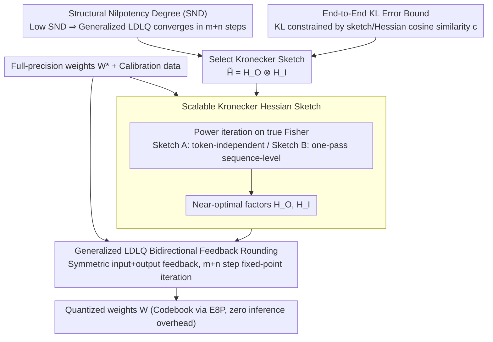

# YAQA: End-to-End KL Minimizing Adaptive Weight Quantization for LLMs

**Conference**: ICML 2026  
**arXiv**: [2505.22988](https://arxiv.org/abs/2505.22988)  
**Code**: Not yet released  
**Area**: Model Compression / LLM Quantization  
**Keywords**: Quantization, Adaptive Rounding, End-to-end KL, Hessian Sketching, Kronecker Decomposition

## TL;DR
YAQA shifts the proxy objective of LLM weight quantization from "layer-wise activation error" to "end-to-end model output KL divergence." Using a Hessian sketch via Kronecker decomposition, it provides the first end-to-end error bound. It reduces KL divergence by approximately 30% compared to GPTQ/LDLQ, even outperforming Quantization-Aware Training (QAT) in accuracy, while maintaining the same inference speed.

## Background & Motivation

**Background**: LLM quantization follows two main paths: QAT modifies the training process to learn low-precision representations, offering high quality but at immense cost; PTQ performs post-hoc rounding to map full-precision weights to a discrete codebook. Representative methods like GPTQ/LDLQ are popular due to their efficiency. GPTQ uses the Hessian of the "current layer activation error" $H_1 = \mathbb{E}[x^\top x]$ as a proxy for end-to-end error.

**Limitations of Prior Work**: $H_1$ only considers the input distribution of the current layer, completely ignoring how subsequent layers amplify or cancel out the rounding error of the current layer. Consequently, "layer-wise optimality" does not equal "global model optimality," often leading to unnecessarily high KL divergence. GuidedQuant/SqueezeLLM use block-diagonal approximations of the empirical Fisher, but these are derived from cross-entropy task loss rather than true KL Hessian; furthermore, their block structures are heuristic, lacking theoretical guarantees—empirically, increasing the number of blocks leads to inconsistent results.

**Key Challenge**: Directly performing adaptive rounding using $\nabla^2 L(W^*) \in \mathbb{R}^{mn \times mn}$ (the true KL Hessian with respect to weights of a single layer) results in a scale explosion. To maintain a tractable structure, one must ensure provable approximation quality. Existing structural approximations either lack bounds or provide poor approximations.

**Goal**: To find a structured Hessian sketch that allows LDLQ-style iterative rounding in $O(m+n)$ steps while strictly controlling end-to-end KL divergence through "cosine similarity to the true Hessian."

**Key Insight**: The authors introduce "Structural Nilpotency Degree" (SND), a combinatorial quantity, to characterize the convergence steps of LDLQ. They prove that for a Kronecker product $L_O \otimes L_I$, $\mathrm{snd}(L_O \otimes L_I) = \mathrm{snd}(L_O) + \mathrm{snd}(L_I) \le m+n-1$. This maps "tractable computation" directly onto Kronecker decomposition.

**Core Idea**: Utilize a Kronecker decomposition $\tilde{H} = H_O \otimes H_I$ as an approximation of $\nabla^2 L(W^*)$. "Near-optimal" factors $H_O$ and $H_I$ are obtained via power iterations on the true Fisher. The rounding algorithm adds a symmetric output-side feedback component to LDLQ, significantly lowering KL divergence in $\approx 2\times$ the time of LDLQ.

## Method

### Overall Architecture

YAQA treats the quantization of a single layer's weights as "finding an optimal integer point within an ellipsoid defined by the true Hessian." The optimization target is the end-to-end KL divergence (Eq 1). After a second-order approximation, the ellipsoid is defined by the true Hessian $\nabla^2 L(W^*) \in \mathbb{R}^{mn \times mn}$. Since it is too large for direct use, a Kronecker sketch $\tilde{H} = H_O \otimes H_I$ is used for approximation. Kronecker is chosen for two theoretical reasons: SND ensures that generalized LDLQ under this structure still converges rapidly within $m+n$ steps, and the end-to-end KL error bound proves that as long as the sketch is directionally close to the true Hessian (higher cosine similarity $c$), the KL of the output distribution is minimized. The algorithm follows two steps: first, compute near-optimal $H_O, H_I$ via power iterations on the true Fisher (Sketch A/B variants); second, use generalized LDLQ fixed-point iteration with both input-side and output-side feedback to round weights to the codebook. Each linear layer is processed independently without changing the inference structure; inference speed is determined solely by the codebook (e.g., E8P) and is independent of YAQA.

### Key Designs

**1. Structural Nilpotency Degree (SND): Selecting Hessian structures for efficient LDLQ**

Past PTQ methods chose between two extremes: layer-wise $H_1 = \mathbb{E}[x^\top x]$ (cheap but lacks output-side feedback) or QAT (globally optimal but expensive). YAQA seeks an intermediate structure that allows end-to-end feedback while permitting fast rounding. The authors define "Structural Nilpotency Degree" $\mathrm{snd}(L)$ as the nilpotency of a binary nilpotent matrix with the same support as $L-I$, proving that LDLQ fixed-point iteration converges in $\le \mathrm{snd}(L)$ steps. A key property is that for Kronecker products, $\mathrm{snd}(L_O \otimes L_I) = \mathrm{snd}(L_O) + \mathrm{snd}(L_I) \le m+n-1$. Thus, $\tilde{H} = H_O \otimes H_I$ allows symmetric feedback from both input $L_I$ and output $L_O$ using only $O(m+n)$ steps of small matrix multiplications. This also explains why GuidedQuant saturates beyond 4 blocks: it effectively runs LDLQ on a block-diagonal approximation lacking output-side feedback.

**2. End-to-End KL Error Bound: Sketch selection as an optimization target via Cosine Similarity**

Having an efficient structure is not enough; one must know which $H_O, H_I$ actually minimize the model's output KL. Theorem 3.4 expresses the end-to-end error upper bound as the geometric relationship between the sketch and the true Hessian: $\mathrm{vec}(\Delta)\, H\, \mathrm{vec}(\Delta)^\top \le \|H\|_F\,(\|\Delta\|_F^2 \sqrt{2-2c} + \text{incoherence/trace terms})$, where $c = \langle H,\, H_O \otimes H_I\rangle / (\|H\|_F \|H_O\|_F \|H_I\|_F)$ is the cosine similarity, and $\Delta = W^* - W$ is the rounding error. The takeaway is direct: the more the sketch aligns with the true Hessian ($c$ closer to 1), the tighter the KL upper bound, provided $H_O, H_I$ have low incoherence and rank. This is the first time a quantization algorithm has been granted an end-to-end error bound, upgrading "Hessian sketch selection" from heuristic guessing to a clear mathematical problem of maximizing cosine similarity, which points directly to power iterations.

**3. Scalable Kronecker Hessian Sketch: Computing $H_O, H_I$ at LLM scale (Sketch A/B Power Iterations)**

Since a Kronecker product is essentially a rank-1 product after reshaping, optimal $H_O, H_I$ can be obtained via power iterations on the true Hessian. However, the true Hessian cannot be directly estimated via Monte-Carlo due to variance explosion in $mn \times mn$ dimensions. The authors provide two scalable options. Sketch A assumes independence across tokens within a sequence, approximating $H \approx \mathbb{E}[x^\top x \otimes (\nabla_y \ell)^\top (\nabla_y \ell)]$. Starting from $(H_I)_0 = H_1, (H_O)_0 = I$, it converges in $\sim 3$ steps, trading bias for variance—stable with little data (10B model $\approx 20$ GPU-hours). Sketch B performs one pass of power iterations on the true Fisher (starting from $I, I$) using sequence-level gradients, offering higher variance tolerance and better quality with more data (10B model $\approx 30$ GPU-hours). Both utilize a modified backward pass for distributed power iteration, similar to Shampoo's preconditioning, but crucially use the true Fisher (sampling logits via Monte-Carlo) instead of the empirical Fisher to avoid directional bias.

**4. Generalized LDLQ Bidirectional Feedback Rounding: Mapping end-to-end targets to element-wise rounding**

With the sketch computed, the final step is a rounding algorithm—the primary algorithmic contribution of YAQA. Original LDLQ only performs linear feedback along input channels (using LDL factors of $H_1$), rounding weights column-by-column without seeing output-side error. YAQA generalizes rounding to fixed-point iteration on an arbitrary Kronecker sketch $\tilde{H} = H_O \otimes H_I$ (Eq 4). Using the Kronecker LDL decomposition $L = L_O \otimes L_I$, the update is expanded (Eq 5/6): $W = Q(W^* + L_O'^{\top}\Delta L_I' + L_O'^{\top}\Delta + \Delta L_I')$, where $\Delta = W^* - W$, $L_O' = L_O - I$, and $L_I' = L_I - I$. Compared to LDLQ, this adds two "output-side" feedback terms, $L_O'^{\top}\Delta$ and $L_O'^{\top}\Delta L_I'$, making feedback symmetric across input/output channels—the key to optimizing end-to-end error. Due to the SND analysis, iteration converges in $\le m+n-1$ steps, each involving highly parallelizable small matrix multiplications, resulting in only $\approx 2\times$ the time of LDLQ.

### Loss & Training

YAQA is a pure PTQ method with no explicit training loss; quantized weights are generated once and not updated. It implicitly optimizes a quadratic proxy target $\mathrm{tr}(\Delta^\top H_O \Delta H_I)$ under the Kronecker sketch. This process is complementary to QuIP#'s randomized Hadamard transform—the latter makes $W$ near-Gaussian and reduces incoherence, while YAQA ensures the Hessian direction is accurate.

## Key Experimental Results

### Main Results: LLM Quantization Quality

| Model / Setting | Method | KL ↓ (vs FP) | Downstream Benchmark (acc%) ↑ |
|------------|------|-------|-----------------|
| Llama 3.1 8B Inst, W2 | LDLQ (GPTQ) | Baseline | Baseline |
| Llama 3.1 8B Inst, W2 | GuidedQuant | Slightly < LDLQ | Slightly > LDLQ |
| Llama 3.1 8B Inst, W2 | **YAQA Sketch A** | $\approx -30\%$ vs LDLQ | Significantly Leads |
| Llama 3.1 8B Inst, W2 | **YAQA Sketch B** | Lowest | Highest |
| Llama 3.1 8B Inst, W2 | QAT | Higher than YAQA | Lower than YAQA |

(Observations: Sketch B establishes a new PTQ SOTA across various chat/reasoning tasks.)

### Ablation Study

| Setting | KL ↓ | Description |
|------|------|------|
| LDLQ ($H_O = I, H_I = H_1$) | Baseline | YAQA degenerate case |
| Sketch A, 1-step power iteration | Medium | Initialized with $H_1$ |
| Sketch A, 3-step power iteration | Excellent | Empirical convergence step |
| Sketch B, 2K sequences | Excellent | SOTA within 1 GPU-hour |
| Sketch B, 64K sequences | Best | 30 GPU-hours |
| GuidedQuant, >4 blocks | No improvement | Lacks output-side feedback |

### Key Findings

- Empirically, $H_O$ is approximately low-rank, which perfectly matches the theoretical condition where the YAQA bound strictly outperforms LDLQ.
- Sketch B outperforms Sketch A after just one round of power iteration, indicating that true Fisher variance and sequence-level estimation are manageable—strict convergence is not required.
- YAQA achieves SOTA with very little data (2K sequences, 1 GPU-hour), a significant selling point for PTQ practicality.
- The result that KL is lower than QAT is counter-intuitive but theoretically consistent: QAT uses first-order descent and may hit local optima, while YAQA performs "optimal one-shot rounding inside the Hessian ellipsoid," avoiding optimization difficulties.

## Highlights & Insights

- **First end-to-end KL upper bound**: Transforms the choice of Hessian sketch into a clear mathematical task of maximizing cosine similarity and controlling incoherence/rank.
- **SND framework unifies existing methods**: GPTQ, LDLQ, and GuidedQuant can all be viewed through the SND/Kronecker lens, clarifying who has output-side feedback and who does not.
- **Synergy of Kronecker + Power Iteration**: Low SND determines speed, cosine similarity determines quality, and power iteration is the optimal tool for Kronecker approximation; they fit together naturally.
- **True Fisher vs. Empirical Fisher**: YAQA notes that for KL objectives, true Fisher (sampling logits) must be used instead of empirical Fisher (task loss) to avoid directional bias.

## Limitations & Future Work

- Discussions are limited to weight-only PTQ; migration to activation and KV-cache quantization is not explored.
- The 30 GPU-hour cost for Sketch B remains heavy for 70B+ models; exploring aggressive sparsification or low-rank approximations to reduce cost further is needed.
- The bound still contains incoherence/trace terms where rank is unconstrained; future work controlling the effective rank of $H_O, H_I$ would tighten the theory.
- Global Hessian behavior for non-linear layers (e.g., Attention Softmax) and fine-grained cross-layer coupling are not yet deeply analyzed.

## Related Work & Insights

- **vs GPTQ / LDLQ**: Equivalent to YAQA's degenerate case ($H_O = I, H_I = H_1$); YAQA provides a strictly tighter bound when $H_O$ is low-rank.
- **vs GuidedQuant / SqueezeLLM**: Both attempt to transcend $H_1$ but use empirical Fisher and block-diagonal approximations lacking output feedback; YAQA wins via true Fisher + Kronecker and a theoretical bound.
- **vs QAT / DiscQuant / PV-Tuning**: While QAT requires long training, YAQA proves that a single pass of power iteration can exceed QAT accuracy, bolstering confidence in PTQ paths.
- **vs Shampoo / KFAC**: Shares the Hessian sketch concept (Kronecker + power iteration), but while those are for preconditioning optimizers, YAQA uses them to determine the rounding direction in PTQ.

## Rating

- Novelty: ⭐⭐⭐⭐⭐ First to anchor quantization algorithms with an end-to-end KL bound and provide a provable algorithm-theory loop via SND/Kronecker.
- Experimental Thoroughness: ⭐⭐⭐⭐⭐ Covers multiple Llama/Gemma scales and bit configurations, outperforming LDLQ, GuidedQuant, and QAT, with detailed ablation on data requirements.
- Writing Quality: ⭐⭐⭐⭐ Theoretical derivations are clear, though the dense SND/Kronecker arguments present a high entry barrier; the appendix handles many details.
- Value: ⭐⭐⭐⭐⭐ Highly practical for LLM deployment: pushes quality to exceed QAT with zero additional inference cost, marking a significant step for PTQ.

<!-- RELATED:START -->

## Related Papers

- [\[ICLR 2026\] d²Cache: Accelerating Diffusion-Based LLMs via Dual Adaptive Caching](../../ICLR2026/llm_nlp/d2cache_accelerating_diffusion-based_llms_via_dual_adaptive_caching.md)
- [\[ICLR 2026\] Massive Editing for Large Language Models Based on Dynamic Weight Generation](../../ICLR2026/llm_nlp/massive_editing_for_large_language_models_based_on_dynamic_weight_generation.md)
- [\[ICML 2026\] SPA-Cache: Singular Proxies for Adaptive Caching in Diffusion Language Models](spa-cache_singular_proxies_for_adaptive_caching_in_diffusion_language_models.md)
- [\[NeurIPS 2025\] Adaptive Kernel Design for Bayesian Optimization Is a Piece of CAKE with LLMs](../../NeurIPS2025/llm_nlp/adaptive_kernel_design_for_bayesian_optimization_is_a_piece_of_cake_with_llms.md)
- [\[AAAI 2026\] LILAD: Learning In-context Lyapunov-stable Adaptive Dynamics Models](../../AAAI2026/llm_nlp/lilad_learning_in-context_lyapunov-stable_adaptive_dynamics_models.md)

<!-- RELATED:END -->
## Related Papers

- [\[ICML 2026\] Universal Reasoner: A Composable Plug-and-Play Reasoner for Frozen LLMs](universal_reasoner_a_single_composable_plug-and-play_reasoner_for_frozen_llms.md)
- [\[ICML 2026\] "I've Seen How This Goes": Characterizing Diversity in LLM and Human Writing via Progressive Conditional Surprisal](ive_seen_how_this_goes_characterizing_diversity_via_progressive_conditional_surp.md)
- [\[ACL 2026\] When Gradients Collide: Failure Modes of Multi-Objective Prompt Optimization for LLM Judges](../../ACL2026/llm_nlp/when_gradients_collide_failure_modes_of_multi-objective_prompt_optimization_for_.md)
- [\[ICML 2026\] Token-Efficient Change Detection in LLM APIs](token-efficient_change_detection_in_llm_apis.md)
- [\[ICML 2026\] Multi-Agent Teams Hold Experts Back: Why Self-Organizing LLM Teams Fail to Retain Specialists](multi-agent_teams_hold_experts_back.md)

<!-- RELATED:END -->
