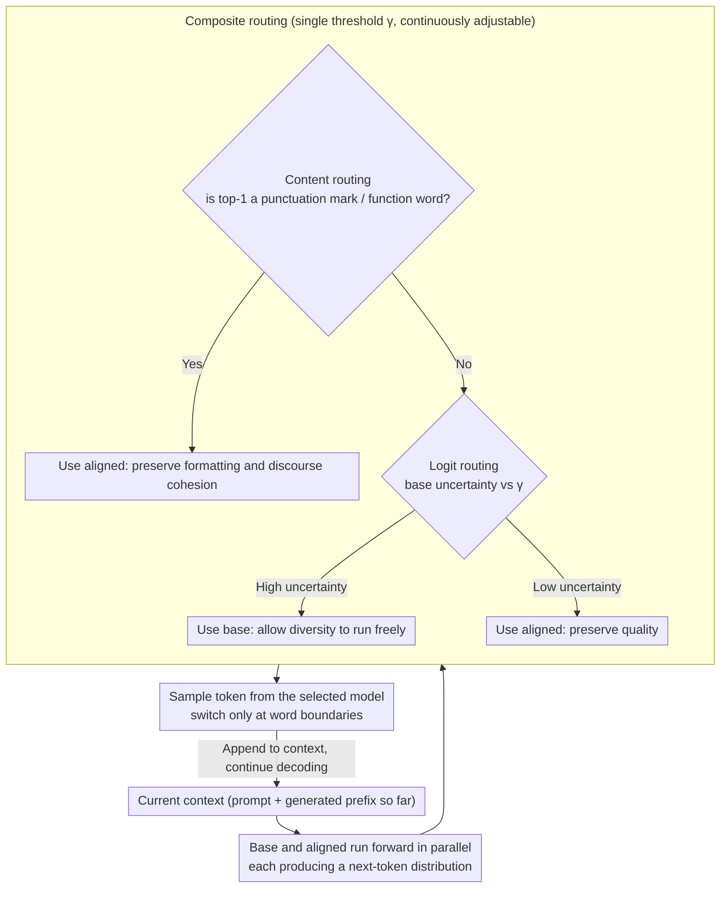

# Optimizing Diversity and Quality through Base-Aligned Model Collaboration

**Conference**: ICML 2026  
**arXiv**: [2511.05650](https://arxiv.org/abs/2511.05650)  
**Code**: Available (Project page + Repository open-sourced)  
**Area**: LLM / NLP  
**Keywords**: Diversity-Quality Trade-off, Inference-time Collaboration, Token-level Routing, Alignment, Open-ended Generation

## TL;DR
The authors propose BACO, an inference-time token-level routing framework. It allows an "unaligned base model" and an "aligned instruct model" to switch token-by-token during a single decoding pass. Decisions are based on logit uncertainty and content signals, achieving base-level diversity and aligned-level quality without re-training or multiple sampling. The best router achieves a 21.3% joint improvement in diversity and quality over the strongest baseline.

## Background & Motivation

**Background**: Alignment (SFT + RLHF/DPO) significantly improves LLMs in instruction following, safety, and reward scores, becoming the default state for deployed models. Partitioning during repeated sampling, however, causes aligned models to collapse into a few "templated responses" (e.g., repeatedly suggesting "Maui, Hawaii" for US summer destinations).

**Limitations of Prior Work**: Previous attempts to mitigate diversity collapse follow two paths. Training-side methods (e.g., diverse RLHF, diversity regularization) require model re-training, which alters the aligned distribution and may sacrifice safety or utility. Inference-side methods include high-temperature/diverse beam search or in-context resampling/paraphrasing, most of which require multiple decoding passes or long-range planning, often trading quality for diversity.

**Key Challenge**: A structural trade-off exists in the single-model paradigm. The alignment process inherently reduces the entropy of the next-token distribution (mode collapse), concentrating probability mass on a few high-quality tokens. Empirical comparisons show that Llama-3-8B is 3.15× more diverse than Llama-3-8B-Instruct on a WildChat subset, بينما quality is 5.95× higher for the latter, showing no Pareto dominance for either side.

**Goal**: To elevate the Pareto frontier on the diversity-quality plane without re-training and within a single decoding pass, providing a method where users can adjust the operating point as needed.

**Key Insight**: The authors leverage the "superficial alignment" phenomenon—base and aligned models predict identically for most tokens. Divergences are concentrated on stylistic/functional tokens (punctuation, newlines, function words) and a few high-uncertainty "semantic crossroads." Since only a few positions truly diverge, switching models is only necessary at these points.

**Core Idea**: Treat the base model as the "diversity source" and the aligned model as the "quality source." During decoding, a lightweight router dynamically selects one model at the token level. This transforms single-model trade-offs into dual-model collaboration.

## Method

### Overall Architecture
BACO aims to capture base diversity and aligned quality in one decoding pass by having the two models alternate tokens. The generation is formulated as $P_{\text{BACO}}(y_t|c_t) = w_{\text{base}} \cdot P_{\text{base}}(y_t|c_t;\theta_{\text{base}}) + (1-w_{\text{base}}) \cdot P_{\text{aligned}}(y_t|c_t;\theta_{\text{aligned}})$, where $c_t = [x, y_{<t}]$. $w_{\text{base}} \in \{0,1\}$ is a **hard** selection provided by the router—no soft weighting is used; each token belongs entirely to one model. Both models perform forward passes in parallel at each step. The router determines which model to trust based on signals at the current position, and a token is sampled from the selected distribution to continue. To avoid garbled text from inconsistent tokenizers, switching only occurs at word boundaries. This workflow requires no fine-tuning or prompt engineering and can be applied to any "base + instruct" weight pair.

### Key Designs

**1. Logit-based routing: Letting base uncertainty decide when to let go**

The root of alignment collapse is the forced convergence of the aligned model at positions that should be diverse. Truly "diversifiable" positions are few—specifically, "semantic crossroads" where multiple continuations are reasonable. BACO uses the base model's current predictive uncertainty to identify these crossroads: when uncertain, it uses the base model for diversity; when certain, it uses the aligned model for quality. Two variants implement this: BACO-P routes to base when the base top-1 probability $\max_{y_t} P_{\text{base}}(y_t|\cdot) < \gamma$; BACO-H routes to base when the base predictive entropy $H_{\text{base}}(Y_t|\cdot) = -\sum_{y_t} P_{\text{base}}(y_t|\cdot)\log P_{\text{base}}(y_t|\cdot) > \gamma$. The threshold $\gamma$ acts as a "diversity temperature": increasing it favors the base (more diversity), while decreasing it favors the aligned (higher quality).

**2. Content-based routing: Task allocation by linguistic role**

Logit signals require access to base logits and may assign all high-uncertainty positions to the base. However, stylistic tokens—such as punctuation, newlines, and function words—are often where the models diverge most, but where readers care least about diversity. Diversifying them can break formatting. BACO delegates based on linguistic roles: "stylistic tokens" are left to the aligned model, while "content words" go to the base model. BACO-PUNC forces the aligned model for punctuation/formatting tokens (e.g., `\n`, periods) to ensure format consistency; BACO-FC uses the aligned model for function words (and, if, the, etc.) to maintain discourse cohesion. This is based on the linguistic observation that perceived diversity resides in content words (places, verbs, imagery).

**3. Combined routing + Controllable threshold: Sliding along the Pareto frontier**

Logit signals favor the aligned model when "confident," while content signals favor the aligned model for "style/function words." Since these focus on different dimensions, they are complementary. Combined versions (BACO-P-PUNC, BACO-P-FC, BACO-H-PUNC, etc.) first apply content rules (PUNC/FC) to lock tokens that "must" be aligned, then fall back to logit rules for the rest. This preserves coherence while allowing the base model to explore diversity at true crossroads. Practically, adjusting a single threshold $\gamma$ sweeps the curve from "low diversity-high quality" to "high diversity-medium quality," providing a continuous dial for applications.

### Loss & Training
Ours is training-free. All routers are parameter-free heuristics. The only continuous hyperparameter is the threshold $\gamma$, which serves as a user-facing "diversity temperature" requiring neither calibration nor learning. The paper explicitly leaves learned routers for future work, noting that diversity is multi-dimensional (lexical/semantic/discourse), and a single scalar loss might cause objective conflict and training instability.

## Key Experimental Results

### Main Results
Evaluation sets: NoveltyBench (instruction following), WildChat (dialogue), Narrative-Discourse (long-form creative writing). Model pairs: Llama-3-8B/Instruct, Olmo2-7B/Instruct. Metrics: 11 diversity metrics × 2 quality metrics = 22 diversity-quality subspaces, aggregated via **Coverage** (Area Under the Curve, measuring the trade-off region) and **Dominance** (percentage of the global Pareto frontier occupied).

| Method | Lexical Cov. | Lexical Dom. | Semantic Cov. | Semantic Dom. | Overall Cov. | Overall Dom. |
|------|-------------|-------------|---------------|---------------|--------------|--------------|
| Base | 0.098 | 12.7% | 0.098 | 16.0% | 0.098 | 14.3% |
| Aligned | 0.269 | 49.0% | 0.104 | 29.2% | 0.186 | 39.0% |
| Nudging (Collab. baseline) | 0.276 | 9.3% | 0.247 | 9.9% | 0.261 | 9.6% |
| Prompting (Best) | — | 2.7% | — | 2.2% | — | 2.4% |
| Ensemble (Best) | — | 1.1% | — | 1.9% | — | 1.5% |
| **BACO (Best)** | **0.445** | 24.9% | **0.360** | **40.5%** | **0.403** | 32.7% |

Coverage improved by 0.142 (+30% reachable area) compared to the strongest baseline, with a 21.3% joint improvement in diversity-quality. Semantic Dominance increased to 40.5% (nearly half of the Pareto optimal points are unique to BACO).

### Ablation Study (Different routers on NoveltyBench)

| Router | Lexical Cov. | Lexical Dom. | Semantic Cov. | Semantic Dom. | Overall Cov. | Overall Dom. |
|--------|-------------|-------------|---------------|---------------|--------------|--------------|
| -RAND (Random Switch) | 0.493 | 26.3% | 0.409 | 17.0% | 0.451 | 21.7% |
| -JUDGE (External Judge) | 0.302 | 2.6% | 0.254 | 0.6% | 0.278 | 1.6% |
| -P (Max Prob only) | 0.433 | 4.8% | 0.397 | 8.5% | 0.415 | 6.7% |
| -FC (Function word only) | 0.419 | 3.2% | 0.382 | 4.7% | 0.401 | 4.0% |
| **-P-PUNC (Best Combo)** | **0.495** | **30.7%** | **0.452** | **31.3%** | **0.474** | **31.0%** |
| -H-PUNC | 0.466 | 16.4% | 0.427 | 18.6% | 0.446 | 17.5% |
| -P-FC | 0.435 | 16.0% | 0.406 | 19.2% | 0.421 | 17.6% |

### Key Findings
- Combined strategies (-P-PUNC, -H-PUNC, -P-FC) outperform single strategies significantly, proving logit and content signals are non-redundant.
- -RAND performs well in lexical dimensions but lexical Dominance is only 17%, indicating random switching creates surface-level lexical diversity but lacks semantic diversity, which requires router guidance.
- -JUDGE (using another LLM to decide per token) performed worst and was slowest, suggesting that heuristic signals are sufficiently powerful for this task.
- BACO increases diversity on verifiable tasks (IFEval, GSM8K) without sacrificing accuracy, proving the gains are not artifacts of open-ended evaluation.
- Human evaluation aligns with automatic metrics; human judges perceive the diversity increase without significant quality degradation.

## Highlights & Insights
- Upgrading "model collaboration" to token-level hard switching at word boundaries is clean and engineering-friendly. It applies to any base+instruct open-source pair with zero training cost.
- The "superficial alignment" hypothesis is effectively utilized: since models agree mostly, decisions are only needed at divergence points. This allows the router to be a simple rule-set rather than a complex model.
- Evaluating diversity-quality via "Coverage + Dominance across 11×2 subspaces" treats controllability as a first-class citizen, providing a more robust methodology than single-metric evaluations.
- Content signals (PUNC/FC) are applicable to black-box models, suggesting that API-based aligned models can replicate BACO by using the API for structural tokens and a base model for others.

## Limitations & Future Work
- Requires holding both base and aligned weights, doubling deployment memory. No quantized or KV-reuse version is provided.
- Strictly depends on the "same source" assumption for base and aligned models; the "superficial alignment" and word-boundary switching may fail for models from different families or tokenizers.
- Evaluation focuses on English open-ended generation; coverage of code, long-chain reasoning, and multilingualism is limited.
- The threshold $\gamma$ still requires manual tuning; there is no automatic mechanism for selecting $\gamma$ based on prompt embeddings or task types.
- A learned router is left for future work; designing learning signals for multi-dimensional diversity remains an open problem.

## Related Work & Insights
- **vs Nudging (Fei et al., 2025)**: Also uses superficial alignment but injects aligned tokens into base decoding to improve base quality. BACO does the opposite—injecting base into aligned to restore diversity.
- **vs Training-side (diverse RLHF / DivPO)**: These require re-training and may impact safety; BACO is inference-only and maintains the original safety profile.
- **vs Decoding (Temperature, Diverse Beam Search, Contrastive Decoding)**: These search within a single distribution; BACO utilizes **two different distributions**, addressing mode collapse structurally rather than parameter-wise.
- **vs Prompting (In-context resampling / paraphrase)**: These are computationally expensive due to multiple decodings; BACO is more clock-time efficient.

## Rating
- Novelty: ⭐⭐⭐⭐ Using base-aligned collaboration to "reverse-apply superficial alignment" is a clean perspective.
- Experimental Thoroughness: ⭐⭐⭐⭐⭐ 22 trade-off subspaces, long-form text, multiple model pairs, and human eval make this high-quality for ICML.
- Writing Quality: ⭐⭐⭐⭐ Clear conceptual diagrams and evaluation metrics; method section is concise but relies heavily on the appendix.
- Value: ⭐⭐⭐⭐ Immediately mitigates mode collapse in creative and dialog scenarios with zero training; provides a reusable multi-objective evaluation protocol.

<!-- RELATED:START -->

## Related Papers

- [\[ICLR 2026\] Optimas: Optimizing Compound AI Systems with Globally Aligned Local Rewards](../../ICLR2026/llm_nlp/optimas_optimizing_compound_ai_systems_with_globally_aligned_local_rewards.md)
- [\[ICML 2026\] "I've Seen How This Goes": Characterizing LLM vs. Human Writing Diversity using Progressive Conditional Surprisal](ive_seen_how_this_goes_characterizing_diversity_via_progressive_conditional_surp.md)
- [\[AAAI 2026\] STEM: Efficient Relative Capability Evaluation of LLMs through Structured Transitive Evaluation Model](../../AAAI2026/llm_nlp/stem_efficient_relative_capability_evaluation_of_llms_through_structured_transit.md)
- [\[ICML 2026\] The Cylindrical Representation Hypothesis for Language Model Steering](the_cylindrical_representation_hypothesis_for_language_model_steering.md)
- [\[ICML 2026\] A Geometric Relation of the Error Introduced by Sampling a Language Model's Output Distribution to its Internal State](a_geometric_relation_of_the_error_introduced_by_sampling_a_language_models_outpu.md)

<!-- RELATED:END -->
