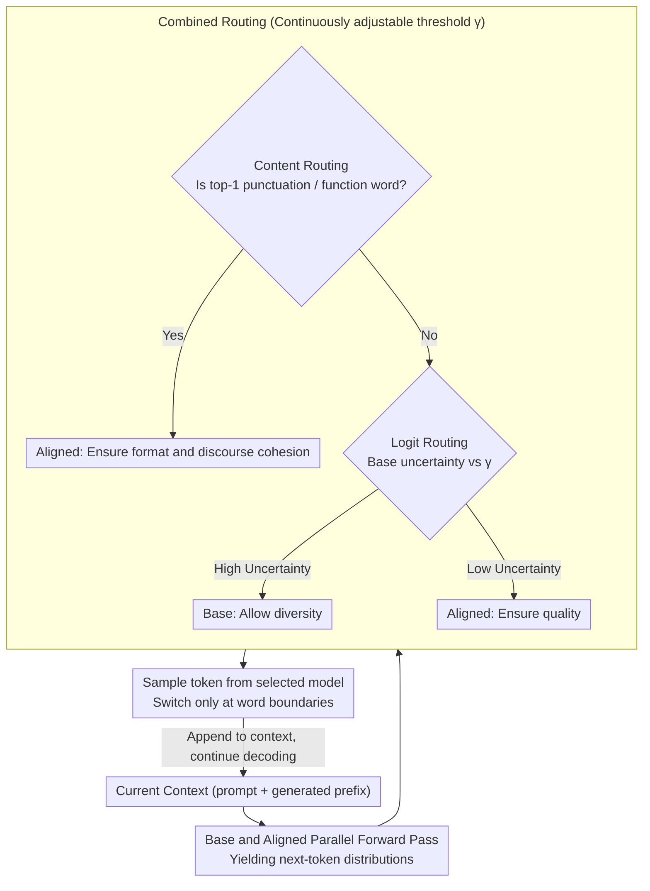

# Optimizing Diversity and Quality through Base-Aligned Model Collaboration

**Conference**: ICML 2026  
**arXiv**: [2511.05650](https://arxiv.org/abs/2511.05650)  
**Code**: Available (Project page + Repository open-sourced)  
**Area**: LLM / NLP  
**Keywords**: Diversity-quality trade-off, inference-time collaboration, token-level routing, alignment, open-ended generation

## TL;DR
The authors propose BACO, an inference-time token-level routing framework. It enables an "unaligned base model" and an "aligned instruct model" to switch per-token during a single decoding pass. By using logit uncertainty and content-word signals to decide which model to trust, the method achieves the diversity of the base model and the quality of the aligned model without additional training or multiple sampling passes. The best router achieves a 21.3% joint improvement in diversity and quality over the strongest baseline.

## Background & Motivation

**Background**: Alignment (SFT + RLHF/DPO) has significantly improved LLMs in instruction following, safety, and reward scores, becoming the default state for deployed models. However, when repeatedly sampling from the same prompt, aligned models tend to collapse into a few "template responses" (e.g., repeatedly suggesting "Maui, Hawaii" for US summer travel destinations).

**Limitations of Prior Work**: Previous attempts to mitigate diversity collapse follow two main paths. Training-side methods (e.g., diverse RLHF, diversity regularization) require retraining, which alters the alignment distribution and may sacrifice safety or helpfulness. Inference-side methods use high-temperature sampling, diverse beam search, in-context resampling, paraphrase prompting, or back-translation; most require multiple decodings or long-range planning and often trade quality for diversity.

**Key Challenge**: The single-model paradigm faces a structural trade-off—the alignment process inherently reduces the entropy of the next-token distribution (mode collapse), concentrating probability mass on a few high-quality tokens. Empirical comparisons show that Llama-3-8B has 3.15× the diversity of Llama-3-8B-Instruct on a WildChat subset, while the quality ratio is inversely 5.95×, with no Pareto-dominant side.

**Goal**: To obtain a method that elevates the overall Pareto frontier on the diversity-quality plane during a single decoding pass without retraining, allowing users to adjust the operating point as needed.

**Key Insight**: The authors leverage the "superficial alignment" phenomenon—base and aligned models show highly consistent predictions for most tokens. Disagreements are concentrated on stylistic/functional tokens (punctuation, newlines, function words) and a few high-uncertainty "semantic crossroads." Since only a few positions truly diverge, model switching only needs to occur at these locations.

**Core Idea**: Treat the base model as the "source of diversity" and the aligned model as the "source of quality." A lightweight router dynamically selects one at the token level during decoding. This transforms a single-model trade-off into a dual-model collaboration.

## Method

### Overall Architecture
BACO aims to capture both base diversity and aligned quality in one decoding pass by letting the two models alternate tokens. The generation is formulated as $P_{\text{BACO}}(y_t|c_t) = w_{\text{base}} \cdot P_{\text{base}}(y_t|c_t;\theta_{\text{base}}) + (1-w_{\text{base}}) \cdot P_{\text{aligned}}(y_t|c_t;\theta_{\text{aligned}})$, where $c_t = [x, y_{<t}]$ and $w_{\text{base}} \in \{0,1\}$ is a **hard** choice made by the router. Each token belongs entirely to one model. In each step, both models perform a parallel forward pass; the router determines which model to trust based on signals at the current position, samples a token from the selected distribution, and appends it to the context. To prevent garbled text due to tokenizer inconsistencies, switching occurs only at word boundaries. The process requires only one decoding path, no fine-tuning, and no prompt engineering, making it directly applicable to any existing "base + instruct" weight pairs.

### Key Designs

**1. Logit-based Routing: Letting base uncertainty decide when to diverge**

Alignment collapse occurs because the aligned model forcibly converges even at positions where diversity is appropriate. However, positions that "allow for diversity" are limited—specifically, "semantic crossroads" where multiple continuations are reasonable. BACO uses the predictive uncertainty of the base model to identify these crossroads: if uncertain, the base model generates the token for diversity; if certain, the aligned model generates it for quality. Two variants implement this: BACO-P routes to base when the base top-1 probability $\max_{y_t} P_{\text{base}}(y_t|\cdot) < \gamma$; BACO-H routes to base when the base predictive entropy $H_{\text{base}}(Y_t|\cdot) = -\sum_{y_t} P_{\text{base}}(y_t|\cdot)\log P_{\text{base}}(y_t|\cdot) > \gamma$. The threshold $\gamma$ acts as a "diversity temperature": increasing it favors the base (more diversity), while decreasing it favors the aligned model (higher quality).

**2. Content-based Routing: Dividing labor by linguistic roles rather than probabilities**

Logit signals require access to base logits and may assign all high-uncertainty positions to the base. However, punctuation, newlines, and function words are often where the models diverge most, yet readers care about them least. Diversifying them is meaningless and likely breaks formatting. BACO delegates labor by linguistic roles: "stylistic tokens" are left to the aligned model, while "content words" are left to the base. BACO-PUNC forces the aligned model for punctuation/format tokens (e.g., `\n`, periods); BACO-FC uses the aligned model for function words (and/if/the, etc.) to maintain discourse cohesion. This is based on the linguistic observation that perceived "diversity" lies in content words (nouns, verbs, descriptive imagery). Entrusting functional/stylistic words to the aligned model stabilizes the writing without sacrificing meaningful diversity.

**3. Combined Routing + Controllable Threshold: Sequencing signals to trace the Pareto frontier**

Logit signals lean toward "aligned when certain," while content signals lean toward "aligned for style/function." These dimensions are complementary. Combined versions (BACO-P-PUNC, BACO-P-FC, etc.) first use content rules (PUNC/FC) to lock in "must-be-aligned" tokens, then fall back to logit rules for the rest. This preserves discourse continuity while allowing the base model to explore diversity at genuine semantic forks. Practically, users can sweep the entire curve from "low diversity-high quality" to "high diversity-medium quality" by adjusting a single threshold $\gamma$, providing a continuous control knob for applications.

### Loss & Training
No training. All routers are parameter-free heuristics. The only continuous hyperparameter is the threshold $\gamma$, acting as a user-facing "diversity temperature" that requires no calibration or learning. The paper explicitly leaves learned routers for future work, noting that diversity is multidimensional (lexical/semantic/discourse) and using a single scalar loss might cause objective conflicts.

## Key Experimental Results

### Main Results
Evaluation sets: NoveltyBench (instruction following), WildChat (dialogue), Narrative-Discourse (long-form creative writing). Model pairs: Llama-3-8B/Instruct, Olmo2-7B/Instruct. Metrics: 11 diversity indicators × 2 quality indicators = 22 diversity-quality subspaces, aggregated by **Coverage** (Area Under Curve) and **Dominance** (Proportion of the global Pareto frontier).

| Method | Lexical Cov. | Lexical Dom. | Semantic Cov. | Semantic Dom. | Overall Cov. | Overall Dom. |
|------|-------------|-------------|---------------|---------------|--------------|--------------|
| Base | 0.098 | 12.7% | 0.098 | 16.0% | 0.098 | 14.3% |
| Aligned | 0.269 | 49.0% | 0.104 | 29.2% | 0.186 | 39.0% |
| Nudging (Collab Baseline) | 0.276 | 9.3% | 0.247 | 9.9% | 0.261 | 9.6% |
| Prompting (Best) | — | 2.7% | — | 2.2% | — | 2.4% |
| Ensemble (Best) | — | 1.1% | — | 1.9% | — | 1.5% |
| **BACO (Best)** | **0.445** | 24.9% | **0.360** | **40.5%** | **0.403** | 32.7% |

Coverage improved by 0.142 (approx. +30% reachable area) over the strongest baseline, with a 21.3% joint improvement in diversity-quality. Semantic Dominance reached 40.5% (meaning nearly half of the Pareto-optimal points are uniquely held by BACO).

### Ablation Study (Different routers on NoveltyBench)

| Router | Lexical Cov. | Lexical Dom. | Semantic Cov. | Semantic Dom. | Overall Cov. | Overall Dom. |
|--------|-------------|-------------|---------------|---------------|--------------|--------------|
| -RAND (Random Switch) | 0.493 | 26.3% | 0.409 | 17.0% | 0.451 | 21.7% |
| -JUDGE (External LLM) | 0.302 | 2.6% | 0.254 | 0.6% | 0.278 | 1.6% |
| -P (Max Prob only) | 0.433 | 4.8% | 0.397 | 8.5% | 0.415 | 6.7% |
| -FC (Function word only) | 0.419 | 3.2% | 0.382 | 4.7% | 0.401 | 4.0% |
| **-P-PUNC (Best Combo)** | **0.495** | **30.7%** | **0.452** | **31.3%** | **0.474** | **31.0%** |
| -H-PUNC | 0.466 | 16.4% | 0.427 | 18.6% | 0.446 | 17.5% |
| -P-FC | 0.435 | 16.0% | 0.406 | 19.2% | 0.421 | 17.6% |

### Key Findings
- Combined strategies (-P-PUNC, -H-PUNC, -P-FC) outperform single strategies, proving logit and content signals are complementary.
- -RAND performs surprisingly well on lexical metrics but has only 17% semantic Dominance—showing that "brainless switching" creates surface-level lexical diversity but fails to produce true semantic diversity, which requires router guidance.
- -JUDGE (using another LLM to decide per token) is the worst and slowest, suggesting that heuristic signals are sufficiently strong for this task.
- BACO increases diversity on verifiable tasks (IFEval, GSM8K) without dropping quality/accuracy, proving gains are not "artifacts of open-ended evaluation."
- Human evaluation aligns with automatic metrics: diversity improvements are perceivable without obvious quality degradation.

## Highlights & Insights
- Upgrading "model collaboration" from sequence-level selection to token-level hard switching at word boundaries is a clean, engineering-friendly approach. It works out-of-the-box for any open-source base/instruct pair.
- The "superficial alignment" hypothesis is utilized effectively: since models agree on most tokens, choices are only needed at divergence points. Thus, the router can be a few rules rather than a complex model.
- The evaluation methodology is robust, moving from "single-point scores" to "Coverage + Dominance + 22 subspaces," treating "controllability" as a first-class citizen.
- Content signals (PUNC/FC) are applicable even to black-box models, meaning even API-only aligned models could benefit from BACO by delegating non-structural tokens to an open-source base model.

## Limitations & Future Work
- Requires holding both base and aligned weights, doubling deployment memory. No quantized or KV-reuse versions are provided, which is unfavorable for VRAM-constrained scenarios.
- Strictly depends on the "same source" assumption for base and aligned models. If models come from different families (different tokenizers or pre-training data), word-boundary switching and "superficial alignment" may fail.
- Evaluation is focused on English open-ended generation. Coverage of code, long-chain reasoning, and multilingual tasks is limited.
- The threshold $\gamma$ still requires manual tuning for different tasks; an automatic mechanism for setting $\gamma$ is a natural next step.
- Learned routers are left for future work; designing learning signals for multidimensional diversity is an open problem that may require multi-objective RL.

## Related Work & Insights
- **vs Nudging (Fei et al., 2025)**: Also uses "superficial alignment" for collaboration, but Nudging injects aligned tokens into base decoding to improve base quality. BACO does the opposite—injecting base into aligned models to recover diversity—and allows tracing the whole Pareto frontier via a controllable router.
- **vs Training-side methods (diverse RLHF / DivPO)**: These require retraining and risk damaging safety/helpfulness. BACO is purely inference-time and maintains the safety attributes of the aligned model.
- **vs Decoding diversity (Temperature, Diverse Beam Search, Contrastive Decoding)**: These are limited by the entropy of a single distribution. BACO utilizes **two distinct distributions** as diversity sources, providing a higher ceiling for mitigating mode collapse.
- **vs Prompting (in-context resampling / paraphrase)**: These incur high costs due to multiple decodings. BACO is more clock-time friendly as a single-pass method.

## Rating
- Novelty: ⭐⭐⭐⭐ Using base-aligned collaboration to "reverse-engineer superficial alignment" is a fresh perspective. Routers are simple, but the redirection toward diversity is a notable contribution.
- Experimental Thoroughness: ⭐⭐⭐⭐⭐ 22 trade-off subspaces, long-form text, multiple model pairs, human evaluation, and cross-validation on verifiable tasks; highly comprehensive for ICML.
- Writing Quality: ⭐⭐⭐⭐ Clear conceptual diagrams and effective use of "Coverage/Dominance" language. The method section is concise; appendices are heavily referenced.
- Value: ⭐⭐⭐⭐ Mitigates mode collapse with zero training; immediately applicable to diversity-first scenarios like creative writing and dialogue.

<!-- RELATED:START -->

## Related Papers

- [\[ICLR 2026\] Optimas: Optimizing Compound AI Systems with Globally Aligned Local Rewards](../../ICLR2026/llm_nlp/optimas_optimizing_compound_ai_systems_with_globally_aligned_local_rewards.md)
- [\[AAAI 2026\] STEM: Efficient Relative Capability Evaluation of LLMs through Structured Transitive Evaluation Model](../../AAAI2026/llm_nlp/stem_efficient_relative_capability_evaluation_of_llms_through_structured_transit.md)
- [\[ICML 2026\] The Cylindrical Representation Hypothesis for Language Model Steering](the_cylindrical_representation_hypothesis_for_language_model_steering.md)
- [\[ICML 2026\] A Geometric Relation of the Error Introduced by Sampling a Language Model's Output Distribution to its Internal State](a_geometric_relation_of_the_error_introduced_by_sampling_a_language_models_outpu.md)
- [\[ICLR 2026\] WebDevJudge: Evaluating (M)LLMs as Critiques for Web Development Quality](../../ICLR2026/llm_nlp/webdevjudge_mllm_web_development.md)

<!-- RELATED:END -->
