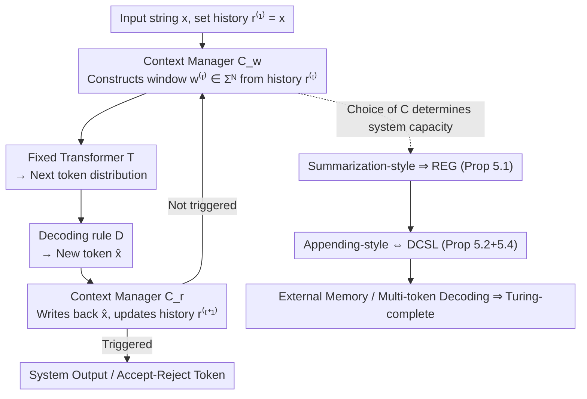

# Position: The Turing-Completeness of Autoregressive Transformers Relies Heavily on Context Management

**Conference**: ICML2026  
**arXiv**: [2605.19514](https://arxiv.org/abs/2605.19514)  
**Code**: None  
**Area**: LLM/NLP  
**Keywords**: Transformer Turing-completeness, Autoregressive decoding, Context management, Computational complexity, position paper

## TL;DR
The authors point out that the popular claim "Transformers are Turing-complete" in most existing proofs actually substitutes "a family of different Transformers together can simulate a Turing machine." They formalize a fixed system $(T, D, C)$ reflective of real-world deployment, proving that the computational power of the same fixed Transformer can shift from merely recognizing regular languages to reaching Turing-completeness under different context management strategies, thereby shifting the research focus from the model itself to the context manager.

## Background & Motivation

**Background**: Since 2019, a long line of theoretical works (Pérez, Bhattamishra, Merrill & Sabharwal, Li, etc.) has claimed that Transformers are Turing-complete in some sense, which has been used by numerous LLM papers as a default endorsement of "sufficient model expressivity."

**Limitations of Prior Work**: These proofs almost entirely rely on two types of unrealistic assumptions: **letting the context window grow with the input length** (where attention can see $n+t$ tokens at each step), or **letting the numerical precision grow with the input length** ($O(\log n)$, $\mathrm{poly}(n)$, or even unbounded real numbers). In real-world deployed LLMs, the context window $N$ and numerical precision are fixed constants, meaning the "models" in these constructions are actually different networks for different input lengths.

**Key Challenge**: The definition of a Turing machine requires a **single** machine to operate on arbitrarily long inputs. If a different Transformer is swapped in for every length, what is essentially obtained is a circuit family. This is qualitatively equivalent to Savage's encoding of $\textsf{DTIME}(T(n))$ as a circuit family of size $O(T(n)^2)$, which cannot be directly called "Turing-complete." In other words, a scaling-family provides **resource bounds**, not **universality**.

**Goal**: To strictly separate "what is fixed" from "what can grow," reclassify existing results, and rediscuss computational power within fixed systems that truly reflect reality.

**Key Insight**: After fixing a pre-trained Transformer $T:\Sigma^N\to\Delta(\Sigma)$, a decoding rule $D$, and finite precision, the only way to handle arbitrarily long inputs is to introduce a **context manager** $C$. This manager decides which $N$ tokens to feed into the window at each step and how to write the generation results back to history. The entire system is a triple $(T, D, C)$. This component, traditionally treated as an engineering detail, actually determines the upper bound of the system's computability.

**Core Idea**: In the fixed-system paradigm, the Turing-completeness of the Transformer itself is a meaningless proposition. **The context management method is the key variable determining the entire system's computational power.** Summarization-style management reduces the system to regular languages, appending-style management yields a linear-space Turing machine, while reading/writing external memory or multi-token decoding truly achieves Turing-completeness.

## Method

As a position paper, there are no experiments. The "Method" consists of a formal model plus a set of qualitative classifications, anchored to the complexity hierarchy by two main theorems.

### Overall Architecture

The authors abstract an LLM capable of processing arbitrarily long inputs as a fixed system $(T, D, C)$: given an input $x=x_1\cdots x_n$, let $r^{(1)}=x$. At step $t$, the context manager $C$ assembles the string to be sent into the window as $w^{(t)}=C_w(r^{(t)})\in\Sigma^N$. The Transformer provides the next token distribution, the decoding rule yields $\hat{x}_{t+1}=D(T(w^{(t)}))$, and $C$ updates the history string as $r^{(t+1)}=C_r(\hat{x}_{t+1}, r^{(t)})$ until a stop condition is triggered. The core claim is that given $T$, $D$, and precision are all fixed, **$C$ is the free variable determining the system's computational power.** The argument proceeds in three steps: separating the semantics of fixed systems from scaling-families, then proving where two "simple enough for deployment" types of $C$ place the system on the complexity scale.

### Key Designs

**1. Formalization of Fixed System $(T, D, C)$ and the Fixed/Scaling Dichotomy: Defining constants vs. variables**

The authors abstract the Transformer as a constant function $T:\Sigma^N\to\Delta(\Sigma)$ and separate decoding and history maintenance from $T$, assigning them to $D$ and $C$. This allows an explicit distinction between two regimes: the fixed-system regime (one fixed Transformer, fixed window $N$, fixed precision) and the scaling-family regime (a family of Transformers where models are picked based on input length). The key observation is that the scaling-family is isomorphic to a circuit family, providing resource bounds of $O((T(n))^2)$ rather than Turing-completeness. This explains why practitioners misinterpret conclusions like "Transformers simulate TMs with $O(\log n)$ precision" (Pérez 2019, Merrill & Sabharwal 2024) as "GPT is Turing-complete"—those "machines" change with $n$ and do not correspond to a deployed LLM. To avoid $C$ becoming a Turing machine itself, the analysis is limited to **simple managers**: using only $N$ token units plus $O(1)$ states, capable only of push/pop/constant offsets on history, and unable to run general algorithms. Re-evaluating representative works in Table 1 under this framework reveals that most Turing-completeness proofs fall into Group A (window $\geq n+t$) and Group B (precision $\geq O(\log n)$), thus being scaling-family arguments.

**2. Summarization-style Management ⇒ Constant Space Upper Bound (Proposition 5.1): `/compact` cannot save regular languages**

If $C$ compresses past history into single-token summaries (similar to `/compact`, AutoCompressor, or ICAE), then regardless of how powerful $T$ is, the $(T, D, C)$ system does not exceed $\textsf{FDSPACE}(1)$. This is proven by constructing a one-way, three-tape transducer to simulate the system: the first $N$ cells of the work tape simulate the context window, the $(N+1)$-th cell holds a separator, and the following area is the workspace for simulating single-step Transformer decoding. Since the total space required remains constant $O(N)$, and given the standard fact $\textsf{REG} = \textsf{DSPACE}(1)$, summarization-style systems can only recognize regular languages. They fail to recognize typical non-regular languages like equality $\{x\#x\}$, palindromes $\{x\#x^R\}$, or binary addition. This directly challenges the engineering belief that "adding `/compact` allows for arbitrarily long tasks"—compressing history essentially reduces memory to $O(1)$ bits, capping the system at a finite state automaton regardless of $T$'s internal complexity.

**3. Appending-style Management ⇔ Linear Space Turing Machine (Proposition 5.2 + 5.4): Switching managers jumps to DCSL**

When $C$ uses a sliding-window with appending (each generated token is appended to the end and the window shifts left), the system's power is exactly equivalent to $\textsf{DSPACE}(n)$, i.e., Deterministic Context-Sensitive Languages (DCSL). The forward direction (Prop. 5.2) uses a Turing machine to move history to the work tape, copy $N$ tokens for decoding, and write back with a shift, using $O(n)$ space. The reverse direction (Prop. 5.4) leverages the $(N, K)$-restricted system framework from Schuurmans et al. (2024). A $(2, 1)$-restricted system is proven to simulate any linear-space TM, and Lemma 5.3 proves that any $f:\Sigma^2\to\Sigma$ can be precisely implemented by a Transformer with window size 2 and greedy decoding. Thus, the $(2, 1)$ system can be instantiated by a fixed $(T, D, C)$. This establishes a clear hierarchy: the same $T$ remains at the regular language level with summarization but jumps to DCSL with appending, and only reaches true Turing-completeness with multi-token decoding ($K=2$) or external memory.

## Key Experimental Results

As a position paper, there are no numerical experiments; the key "data" consists of two tables for classification and capacity grading.

### Main Table 1: Implicit Scaling Assumptions in Existing Turing-completeness Proofs

| Context Window Scale | Numerical Precision | Representative Work | Proven in Fixed System? |
|----------------------|---------------------|---------------------|-------------------------|
| $n+t$ | unbounded | Pérez 2019, Bhattamishra 2020, Roberts 2024, Nowak 2024, Jiang 2026 | No (Dual scaling) |
| $n+t$ | $\mathrm{poly}(n)$ | Li 2024 | No (Dual scaling) |
| $n+t$ | $O(\log(n+t))$ | Merrill & Sabharwal 2024, Qiu 2025, Hou 2025 | No (Window scaling) |
| $n+t$ | $O(1)$ | Malach 2024 | No (Window scaling) |
| $n$ | unbounded / $O(\log n)$ | Back De Luca 2024, Giannou 2023 | No (Window scales with input) |
| $s(n)$ | $O(1)$ | Li & Wang 2025 | No (Scaling by space complexity) |

### Main Table 2: Capability of Fixed Transformer Systems under Different Context Management

| Context Management Type | Computational Power | Source |
|-------------------------|---------------------|--------|
| Read/Write External Memory | $\equiv$ Turing machine | Schuurmans 2023 |
| $(2, 2)$-restricted (2 tokens/step) | $\equiv$ Turing machine | Schuurmans et al. 2024 |
| $(2, 1)$-restricted (Appending variant) | $\equiv$ $O(n)$-space TM | Schuurmans et al. 2024 |
| Appending-style (Prop. 5.2 + 5.4) | $\equiv$ $O(n)$-space TM (= DCSL) | Ours |
| Summarization-style (Prop. 5.1) | $\leq$ $O(1)$-space TM (= REG) | Ours |

### Key Findings
- For the same fixed $T$, the gap between two "deployment-ready" $C$ strategies is REG vs. DCSL—a massive jump across the complexity hierarchy from finite state automata to linear-growth Turing machine tape structures.
- Summarization-style management cannot recognize basic non-regular languages like equality, palindromes, or addition. This serves as a **theoretical upper bound warning** for engineering practices: no amount of `/compact` operations can rescue capabilities beyond regular languages.
- Turing-completeness requires **multi-token decoding + writing back to context** or **external memory access** rather than a larger Transformer. This aligns with Schuurmans' work, suggesting ReAct/Agent systems with external memory might theoretically surpass DCSL.

## Highlights & Insights
- **Abstracting LLM Agents as $(T, D, C)$ is an elegant formalization**: It allows prompt engineering, context compression, memory tools, and tool calls to be discussed under the single $C$ term, giving "how much stronger an agent is than a base model" a descriptible meaning in terms of computability.
- **The analogy between scaling-family and circuit family is incisive**: Mapping "$O(\log n)$ precision Transformers simulate TMs" to "Savage's $O(T(n)^2)$ circuits simulate TMs" immediately clarifies that this represents resource bounds, not universality.
- **Lemma 5.3 (a window-2 Transformer can implement any $\Sigma^2\to\Sigma$)** is a crucial technical detail connecting the Schuurmans framework to specific network architectures, proving that even a "minimal Transformer + sliding window" can maintain linear-space capability.

## Limitations & Future Work
- The paper repeatedly states that $C$ must be "simple enough"; however, the boundary of "simple" ($O(1)$ state size, what constitutes a fixed local operation) remains somewhat informal, leaving grey areas (e.g., is vector retrieval in RAG truly "simple"?).
- The analysis covers only deterministic, greedy, single-token settings. Non-deterministic decoding and temperature $>0$ stochastic systems are only footnotes, without a probability-based capacity grading (e.g., finite Markov vs. probabilistic context-sensitive).
- Proposition 5.1 fixes the summarizer to a single token. Real-world `/compact` outputs $\Theta(N)$ length summaries. While the authors mention a "$t$ token budget," whether multi-token summaries in a chain-of-thought format maintain the constant space conclusion requires more granular proof.

## Related Work & Insights
- **vs. Pérez 2019 / Bhattamishra 2020 / Merrill & Sabharwal 2024**: These works provide simulation constructions under scaling-families. This paper acknowledges their value as resource bounds but rejects their interpretation as Turing-completeness for fixed systems.
- **vs. Schuurmans 2023 / Schuurmans et al. 2024**: This is the closest technical lineage, sharing the view that "fixed Transformer + modified decoding/memory interface" determines capability. This paper uses their $(N, K)$-restricted system as a black box and extends the framework to summarization-style management.
- **Key Takeaway**: Any work claiming a "neural network is Turing-complete" should first answer "what is fixed and what is scaling." For LLM-as-Agent designers, the upper bound of the chosen manager is more decisive than the choice of the base model.

## Rating
- Novelty: ⭐⭐⭐⭐ Does not construct a new model but separates two long-conflated semantics and provides a clean capability hierarchy.
- Experimental Thoroughness: ⭐⭐⭐ A position paper with no numerical experiments, but the two main propositions plus Schuurmans' results fully support its core stance.
- Writing Quality: ⭐⭐⭐⭐ Clear formalization; roadmaps, definitions, and propositions are laid out logically.
- Value: ⭐⭐⭐⭐⭐ Corrects a widely miscited theoretical narrative and directs research focus toward "context managers" and "agent harnesses."

<!-- RELATED:START -->

## Related Papers

- [\[ACL 2025\] Why Are Positional Encodings Nonessential for Deep Autoregressive Transformers? Revisiting a Petroglyph](../../ACL2025/llm_nlp/why_are_positional_encodings_nonessential_for_deep_autoregressive_transformers_r.md)
- [\[ACL 2025\] X-Turing: Towards an Enhanced and Efficient Turing Test for Long-Term Dialogue Agents](../../ACL2025/llm_nlp/xturing_enhanced_turing_test.md)
- [\[NeurIPS 2025\] In-Context Learning of Linear Dynamical Systems with Transformers: Approximation Bounds and Depth-Separation](../../NeurIPS2025/llm_nlp/in-context_learning_of_linear_dynamical_systems_with_transformers_approximation_.md)
- [\[ICLR 2026\] In-Context Algebra](../../ICLR2026/llm_nlp/in-context_algebra.md)
- [\[AAAI 2026\] Learning Spatial Decay for Vision Transformers](../../AAAI2026/llm_nlp/learning_spatial_decay_for_vision_transformers.md)

<!-- RELATED:END -->
