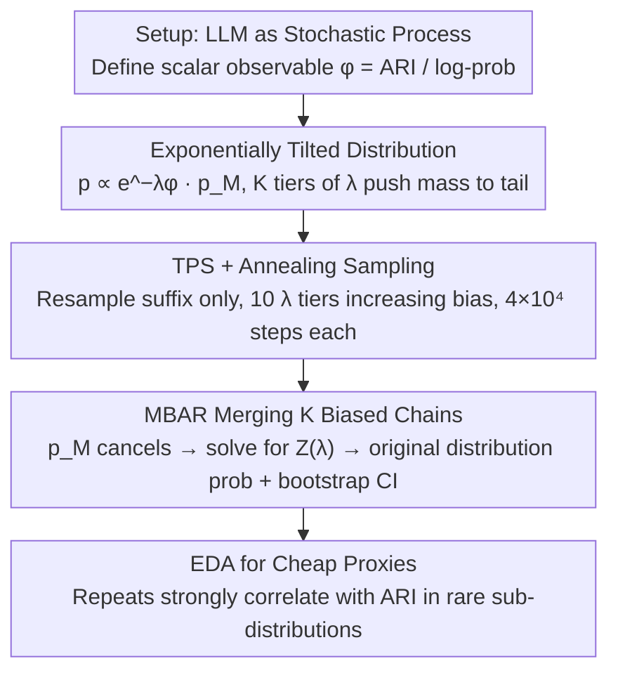

# Rare Event Analysis of Large Language Models

**Conference**: ICML2026 Oral Spotlight  
**arXiv**: [2602.06791](https://arxiv.org/abs/2602.06791)  
**Code**: Available (Minimal implementation provided in paper appendix)  
**Area**: LLM Analysis / Rare Event Sampling / Statistical Physics Methods  
**Keywords**: Rare Event Analysis, Importance Sampling, MBAR, Transition Path Sampling, LLM Safety

## TL;DR
This paper introduces mature Rare Event Analysis (REA) methods from statistical physics to LLMs, utilizing a "Exponential Tilting + Transition Path Sampling + MBAR" trio. On TinyStories, it estimates rare completion probabilities several orders of magnitude smaller than direct sampling with affordable compute, and identifies cheap runtime proxies (consecutive token repeats) via EDA to pre-screen high ARI anomalous outputs.

## Background & Motivation
**Background**: LLMs are probabilistic models; as deployment scales, "events nearly unseen during training/testing" occur online with non-negligible frequency, such as harmful outputs suppressed to the tail of the distribution after alignment. Quantitative analysis of this "tail behavior" is currently in its infancy: either focusing only on single-token probabilities (Wu & Hilton 2025) or extrapolating from a small set of test prompts to the deployment distribution (Jones et al. 2025).

**Limitations of Prior Work**: The default "direct sampling" method (i.e., autoregressive sampling at temperature=1) is extremely inefficient in the tail—observing a $10^{-9}$ event requires generating approximately $10^{9}$ completions on average. While feasible for small models, the cost for production-grade LLMs is prohibitive; worse, many histogram bins have zero counts, making point estimation impossible.

**Key Challenge**: Rare events are, by definition, "un-sampleable," yet they are the most critical part of safety, compliance, and OOD behavior analysis. Systematically characterizing the tail of LLM output distributions without exploding computational costs requires specialized rare event sampling methods.

**Goal**: To build a practical end-to-end framework for Rare Event Analysis (REA) in LLMs, divided into three stages: (1) Setup: Formalizing the LLM as a stochastic process and defining "rare events" as extreme values of observables; (2) Estimation: Estimating rare event probabilities; (3) Exploration: Analyzing the structure and properties of rare completions.

**Key Insight**: Decades of rare event toolkits from molecular dynamics and statistical physics (umbrella sampling, TPS, MBAR, bootstrap CI) naturally fit the "autoregressive sequence + scalar observable" setting. One only needs to replace "particle trajectories" with "token trajectories" for direct migration.

**Core Idea**: Use an exponentially tilted distribution $p_{\lambda}(\mathbf{x}) \propto e^{-\lambda \phi(\mathbf{x})} p_{\mathcal{M}}(\mathbf{x})$ to push sampling toward the tail, employ TPS-MCMC to traverse the sequence space, and use MBAR to combine biased samples from multiple $\lambda$ values back into a probability estimate for the original distribution, providing bootstrap confidence intervals for each step.

## Method

### Overall Architecture
The LLM is treated as a stochastic process generating token sequences $\mathbf{x}_{1:T}$. The object of study is the probability of a scalar observable $\phi(\mathbf{x}_{1:T})$ (Automated Readability Index (ARI) and completion log-probability in this paper) taking extreme values. The pipeline follows three stages: first, construct a family of "intentionally tail-biased" tilted distributions at $K$ different temperatures $\lambda_k$, running one MCMC chain per $\lambda_k$ in sequence space using Transition Path Sampling with annealing to push samples into rare regions; next, use MBAR to merge these biased chains, solve for normalization constants, pull probabilities back to the original distribution $p_{\mathcal{M}}$, and provide bootstrap confidence intervals; finally, perform EDA on the sampled rare completions to find a cheap proxy that can be calculated in real-time during generation. The process does not involve model training and only samples from the pre-trained TinyStories-8M.

### Key Designs

**1. Exponentially Tilted Distribution: Artificially pushing sampling to the tail while maintaining representativeness**

Direct sampling results in nearly zero samples at the tail and exploding estimation variance, with many histogram bins showing zero counts. The solution is to define a tilted PMF for each bias parameter $\lambda_k$:

$$p_{\lambda_k}(\mathbf{x}) = Z(\lambda_k)^{-1} e^{-\lambda_k \phi(\mathbf{x})} p_{\mathcal{M}}(\mathbf{x})$$

This belongs to the exponential family: increasing $\lambda$ shifts probability mass from the typical region to the extreme region of $\phi$. Because it scales the original model $p_{\mathcal{M}}$, the resulting samples still "look like" model outputs rather than being synthesized from thin air. The paper uses both positive and negative $\lambda$ sets to push chains toward both tails. This step only defines "where to bias"; how to actually sample and how to recover the original probability is solved by TPS (Design 2) and MBAR (Design 3).

**2. Transition Path Sampling + Annealing: Efficient traversal in sequence space with "suffix-only" MCMC**

With the tilted distribution defined, a method to sample from it is needed. Independently regenerating the entire sequence autoregressively for each $\lambda_k$ would result in an acceptance rate that exponentially decays with sequence length, leading to almost certain rejection. TPS modifies only the suffix: at step $i$, given the current trajectory $\mathbf{x}^{(i)}_{1:T}$, a truncation point $\tau \in [1, T)$ is randomly selected. The prefix $x_{1:\tau-1}$ is kept, and $x_{\tau:T}$ is resampled autoregressively using the LLM to get a candidate $\tilde{\mathbf{x}}$. The candidate is then accepted or rejected based on the Metropolis-Hastings rate determined by $p_{\lambda_k}$, satisfying detailed balance. This brings the acceptance rate back to $O(1)$. Annealing solves another issue: initialization too far from the target distribution at large $\lambda$ causes long burn-in. By dividing $\lambda$ into 10 tiers from small to large and increasing bias gradually ($4 \times 10^4$ steps per tier), the chain smoothly transitions from "near typical" to "extreme tail," ensuring it starts near its target distribution.

**3. MBAR: Merging multiple biased sample sets for unbiased estimation of the original distribution**

Samples from tilted distributions are "artificially distorted" and must be merged back into the original distribution $p_{\mathcal{M}}$ to be meaningful. The target expectation is written in the form of mixture importance sampling (umbrella sampling) $\bar f = \sum_k \alpha_k \mathbb{E}_{p_{\lambda_k}}[w_{\text{Mix}} f]$, where the mixture weight is:

$$w_{\text{Mix}}(\mathbf{x}) = \frac{1}{\sum_j \alpha_j Z(\lambda_j)^{-1} e^{-\lambda_j \phi(\mathbf{x})}}$$

The original model's probability for the full sequence $p_{\mathcal{M}}(\mathbf{x})$ cancels out—meaning **there is no need to know the model's normalized probability for the full sequence; token-level log-probs are sufficient**, allowing use with closed-source APIs. The $K$ unknown normalization constants $Z(\lambda_j)$ are solved simultaneously via MBAR's $K$-component self-consistency equations (with optimal weights $\alpha_k = N_k^{-1}$), and 96% confidence intervals are provided for each bin using percentile bootstrap (100 resamples). Unlike direct sampling, which provides bin-by-bin Wilson intervals, MBAR reuses information from all biased chains for globally consistent estimation, resulting in relative CI widths in the tail several orders of magnitude smaller than direct sampling.

**4. EDA for Cheap Proxies: Replacing expensive target metrics with cheap statistics calculable during generation**

Metrics like readability, toxicity, or factuality often require full text or external models to compute, making them too slow for online filtering during deployment. The strategy is to use a large $\lambda$ to force samples into the high ARI extreme region, then plot ARI vs. Log-Prob scatters, colored by the number of consecutive repeated tokens:

$$\text{Repeats}(\mathbf{x}) = \sum_t \mathbb{I}[x_{t+1}=x_t]$$

This identifies simple statistics that strongly correlate with the target metric in the tail. Experiments show that TinyStories exhibits heavy repetition at high ARI tails ("Trurururu..."), and $\text{Repeats}(\mathbf{x})$ is an $O(T)$ cheap metric that can be computed incrementally during generation, showing a significant positive correlation with ARI in that sub-distribution. This allows it to serve as a proxy for early abortion at runtime.

### Loss & Training
No models are trained; analysis is performed via sampling on the pre-trained TinyStories-8M. Key MCMC hyperparameters: $K=10$ $\lambda$ tiers, $4 \times 10^4$ TPS steps per tier, first 10% discarded as burn-in, segments with Gelman-Rubin statistic $\ge 1.1$ are discarded, and 100 bootstrap resamples for 96% CI. ARI is truncated at 15 to prevent MCMC acceptance rates from collapsing due to rare high-ARI-high-LogProb completions.

## Key Experimental Results

### Main Results: Tail Coverage and Sample Efficiency

Model: TinyStories-8M, fixed 16-token prompt, 100-token completion; total token budget approx. $4 \times 10^8$.

| Method | Total Completions | ARI / Log-Prob Tail Coverage | Histogram Tail Bin Counts |
| :--- | :--- | :--- | :--- |
| Direct Sampling (Prev. SOTA) | $4.1 \times 10^6$ (100 tokens/ea) | Limited to training data range | High zero counts |
| TPS + MBAR (Ours) | $\approx 7 \times 10^6$ effective / $8 \times 10^6$ gen (avg 50 tokens/ea) | Far beyond training data; estimates prob. several **orders of magnitude** smaller | Non-zero across full range |

### Ablation Study (Error Analysis)

| Metric | Direct Sampling | MBAR | Description |
| :--- | :--- | :--- | :--- |
| Typical Region Relative CI Half-width | Small | Comparable | Both methods similar in the middle |
| Tail Relative CI Half-width (MBAR as Ground Truth) | Huge (Many zero bins requiring "half of min non-zero bin" padding) | Significantly smaller | MBAR tail CI is orders of magnitude narrower |
| Bin Height Change vs. CI Half-width after doubling MCMC steps | — | Mostly < 1, some near 1 | Suggests "increasing steps > increasing parallel chains" is more cost-effective |

### Key Findings
- **MBAR’s advantage in the tail is not marginal**: Direct sampling has no point estimate when tail bin counts are zero; MBAR provides relative CI half-widths orders of magnitude smaller, a fundamental gain for rare event estimation.
- **Annealing is critical for TPS convergence**: Running means in Fig. 2 show that more extreme $\lambda$ values require longer burn-in; after filtering non-converged segments with GR ≥ 1.1, the overall bias is bounded.
- **Model behavior in OOD regions is "mechanical"**: When forced into ARI regions beyond the training distribution, high-probability completions are highly repetitive tokens ("rururururu..." 50 times), suggesting the model resorts to the cheapest "repetition = high likelihood" pattern when extrapolating.
- **"Consecutive repeats" proxy is significantly correlated with high ARI tails**: This can serve as a runtime early-filtering metric, saving the cost of full ARI calculation.

## Highlights & Insights
- **Transferring statistical physics toolkits to LLM analysis** is natural but previously lacked systematic execution: LLM autoregression = sequence trajectories, tokens = particle states, log-probs = energy. The authors mapped these one-to-one, allowing the reuse of MBAR + TPS by essentially "changing variable names," saving development costs.
- **No model weights required, only token log-probs**: The cancellation of $p_{\mathcal{M}}$ in MBAR weights means this analysis can be performed via API (provided the API returns token-level log-probs), offering a practical entry point for third-party safety audits of closed-source models.
- **The "finding cheap proxies" EDA paradigm is transferable**: Any scenario where "target observable is expensive + online filtering is desired" (toxicity, jailbreaks, PII leaks) can benefit. Sampling the rare sub-distribution first allows for more targeted feature engineering for proxies compared to doing so on the typical distribution.
- **Statistical rigor (GR, burn-in, bootstrap CI) is a major engineering contribution**: The authors explicitly address that "rigorous coverage probability remains an open challenge" (McGrath & Burke 2024), showing transparent reporting of limitations rare in ML papers.

## Limitations & Future Work
- **Acknowledged Limitations**: Tested only on toy scales like TinyStories-8M; scaling to production LLMs requires compute upgrades and algorithmic improvements (adaptive runtime, parallel tempering, infilling proposals, etc.).
- **Single Prompt**: Main experiments use one 16-token prompt (Appendix D has minor comparisons); prompt diversity in deployment should be addressed using extrapolation methods like Jones et al. 2025.
- **Tilted distribution design depends on observable smoothness**: When the target is sparse (e.g., "does the output contain a specific bad token"), a smooth biasing observable proxy is needed, which is an open problem analogous to reward model design in RLHF.
- **Future Improvements**: (1) Using fine-tuned small models as TPS proposal distributions to improve acceptance for long sequences; (2) Incorporating RL-based variational methods (Rose et al. 2021, Gillman et al. 2024) and Doob transforms (Ji et al. 2026); (3) Automating proxy discovery (e.g., using sparse regression / Shapley values for feature selection in rare sub-distributions).

## Related Work & Insights
- **vs. Wu & Hilton 2025**: They estimate "single rare token probabilities under different prompts"; this paper extends to "full completions + arbitrary scalar observables," a qualitative leap in coverage.
- **vs. Jones et al. 2025**: They focus on "few test prompts → many deployment prompts extrapolation"; this paper focuses on "precise rare event estimation under a single prompt," making them orthogonal and complementary.
- **vs. "Distribution Sharpening" (Karan & Du 2025 / Ji et al. 2026)**: Those are essentially special cases of TPS shooting methods and Doob transforms, respectively. The authors unify them under the REA framework and note that RLHF/DPO objectives also fall within this variational perspective.

## Rating
- Novelty: ⭐⭐⭐⭐ Systematically bringing statistical physics tools to LLM analysis; more of a method transfer than an algorithm invention, but high novelty in perspective and depth.
- Experimental Thoroughness: ⭐⭐⭐⭐ Very thorough on toy scales (CI, GR, bias-vs-variance trade-offs included), though lacking a sanity check on production-scale models.
- Writing Quality: ⭐⭐⭐⭐⭐ Self-contained, clear motivation, complete derivations, and candid about limitations; very friendly to cross-disciplinary readers.
- Value: ⭐⭐⭐⭐⭐ Provides a quantitative framework for rare events in LLM safety/alignment auditing that does not depend on model weights, offering high practical value.

<!-- RELATED:START -->

## Related Papers

- [\[ACL 2025\] Behavioral Analysis of Information Salience in Large Language Models](../../ACL2025/llm_nlp/behavioral_analysis_of_information_salience_in_large_language_models.md)
- [\[ACL 2025\] Large Language Models for Predictive Analysis: How Far Are They?](../../ACL2025/llm_nlp/large_language_models_for_predictive_analysis_how_far_are_they.md)
- [\[ICML 2026\] Emergence of Hierarchical Emotion Organization in Large Language Models](emergence_of_hierarchical_emotion_organization_in_large_language_models.md)
- [\[ACL 2025\] Explicit and Implicit Data Augmentation for Social Event Detection](../../ACL2025/llm_nlp/explicit_and_implicit_data_augmentation_for_social_event_detection.md)
- [\[ICML 2026\] Creative Collision: Directorial Persona Steering and Competition in Large Language Models](creative_collision_directorial_persona_steering_and_competition_in_large_languag.md)

<!-- RELATED:END -->
