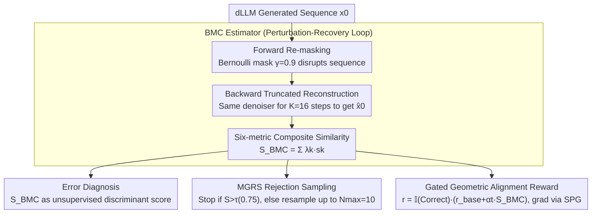

# Reasoning on the Manifold: Bidirectional Consistency for Self-Verification in Diffusion Language Models

**Conference**: ICML2026  
**arXiv**: [2604.16565](https://arxiv.org/abs/2604.16565)  
**Code**: TBD  
**Area**: LLM Reasoning / Diffusion Language Models / Self-Verification  
**Keywords**: Diffusion Language Models, Manifold Geometry, Bidirectional Consistency, Reasoning Self-Verification, Reinforcement Learning Alignment  

## TL;DR
This paper proposes BMC (Bidirectional Manifold Consistency), an unsupervised, training-free metric based on the geometric perspective that "valid reasoning trajectories are stable attractors on the learned distribution." By performing a "forward re-masking + backward few-step reconstruction" on the outputs of a Diffusion Language Model (dLLM), reconstruction stability is used for scoring. BMC supports error diagnosis, inference-time rejection sampling, and dense RL rewards, systematically outperforming baselines such as confidence, Self-Consistency, and Self-Evaluation across four reasoning benchmarks.

## Background & Motivation

**Background**: Diffusion Large Language Models (dLLMs), represented by LLaDA and Dream, replace the strict left-to-right generation of Autoregressive (AR) models with full attention and bidirectional denoising. These models are considered better suited for System-2 reasoning involving "global planning + iterative refinement."

**Limitations of Prior Work**: Verifying whether a generated trajectory is "correct" remains an open problem. Most mainstream approaches leverage external signals from the AR era: PRMs require expensive step-level annotations; Self-Consistency (SC) requires large sample sizes and often fails collectively on difficult problems; Self-Evaluation prompts often degrade into random guessing across domains. These methods treat the model as a black box, failing to utilize the probabilistic geometric structure of the diffusion process itself.

**Key Challenge**: The denoising process of a dLLM is **reversible and bidirectional**. Theoretically, the model itself possesses information about "how stable this trajectory is," but existing verification paradigms cannot extract it. In other words, external verifiers are expensive because we fail to examine the internal "topography" already laid out.

**Goal**: To reduce the question of "correctness" to measurable geometric properties that satisfy: (1) No ground-truth required; (2) No additional training; (3) Overhead significantly lower than re-sampling; (4) A unified signal for "diagnosis $\rightarrow$ inference $\rightarrow$ alignment."

**Key Insight**: The authors hypothesize that valid solutions lie on the high-density manifold of the learned distribution and act as stable attractors of the denoising operator $\mathcal{T}_\theta$, while incorrect solutions deviate from the manifold. Thus, "faithful reconstruction after perturbation" serves as a proxy for manifold distance.

**Core Idea**: Quantify stability using a "forward re-masking + backward few-step reconstruction" cycle. If $\hat{x}_0 \approx x_0$, then $x_0$ is on the manifold and reasoning is reliable; otherwise, off-manifold drift indicates a high probability of error.

## Method

### Overall Architecture
The method translates "reasoning trajectory correctness" into a measurable geometric problem. Given a complete sequence $x_0$ generated by a dLLM, it is first partially re-masked at ratio $\gamma$, then a truncated $K$-step reconstruction is performed using the same denoiser to obtain $\hat{x}_0$. The composite similarity between $x_0$ and $\hat{x}_0$ serves as the geometric stability score $S_{\text{BMC}}(x_0)$. A stable sequence indicates a reliable reasoning path on the manifold, whereas drift indicates likely errors. This single score drives three applications without modification: Error Diagnosis (direct scoring), Manifold-Guided Rejection Sampling (MGRS) at inference time, and dense rewards during RL. Theoretically, BMC is anchored to ELBO: when $\mathcal{D}$ is KL divergence, BMC is equivalent to a re-weighted ELBO estimate (Prop. 3.2); with Csiszár $f$-divergence, it aligns with marginal ELBO (Prop. 3.3). Under continuous embedding, it is relaxed to semantic neighbors via Lipschitz continuity (Prop. 3.4), and a hard guarantee is provided that the reconstruction residual is an upper bound on manifold distance: $\|z_0 - z^*\| \le \frac{1}{1-\kappa}\|z_0 - \mathcal{T}_\theta(z_0)\|$ (Prop. 3.5).

### Key Designs

**1. BMC Estimator: Quantifying Manifold Stability via a "Perturbation-Recovery" Loop**

The quantity to be measured is $\mathcal{R}_\mathcal{D}(x_0) := -\mathbb{E}_{t, \tilde{x}_t}[\mathcal{D}(x_0, \hat{x}_0(\tilde{x}_t))]$, representing reconstructibility after perturbation. Forward re-masking uses a Bernoulli mask $\tilde{x}_t^{(i)} = m_i x_0^{(i)} + (1-m_i)\texttt{[MASK]}$ ($\gamma=0.9$) to disrupt the sequence. The backward process runs only $K=16$ steps rather than the full $T=1024$ steps. This truncation is crucial for keeping verification costs at a fraction of generation costs, preventing it from degrading into another full resampling. The final score $S_{\text{BMC}} = \sum_k \lambda_k s_k$ is weighted by six complementary metrics: Token Accuracy $s_{\text{tok}}$ (local convergence), Semantic Similarity $s_{\text{sem}}$ (allowing paraphrasing), Number Retention $s_{\text{num}}$ (key nodes in math chains), Final Answer Match $s_{\text{ans}}$ (endpoint convergence), plus Character Similarity and Intrinsic Confidence. This composite approach is used because pure likelihood is too strict (misjudging synonyms), while pure answer matching ignores the stability of intermediate reasoning steps. The six metrics ensure BMC is both close to ELBO and robust to semantics.

**2. MGRS: Rejection Sampling with Adaptive Compute Scaling**

MGRS upgrades fixed-budget Best-of-N to dynamic compute allocation based on difficulty. For each sample $x_0 \sim p_\theta(\cdot|q)$, $S = S_{\text{BMC}}(x_0)$ is calculated immediately. If $S > \tau$ ($\tau=0.75$), it is returned immediately as "topographically stable," otherwise sampling continues up to $N_{\max}=10$. If all samples fail the threshold, the candidate with the highest historical score is returned. This results in simple problems stopping after $\sim$2–3 samples on average, while difficult problems (e.g., MATH) naturally utilize $\sim$5–6 samples. In contrast, Self-Consistency wastes compute on easy problems via majority voting and often suffers from "collective errors" on hard ones. Best-of-N (Confidence) uses token probabilities, which correlate poorly with reasoning correctness. BMC provide a geometric signal that naturally couples budget with problem difficulty.

**3. Gated Geometric Alignment Reward: Internalizing Manifold Stability into the Policy**

To move beyond just picking samples during inference and instead bake geometric stability into the weights, BMC is injected into the RL reward: $r(x_0) = \mathbb{I}(y_{\text{pred}} = y^*) \cdot [r_{\text{base}} + \alpha_t \cdot S_{\text{BMC}}(x_0)]$. The multiplicative gate is critical—it ensures that any chain resulting in a wrong answer receives zero reward, establishing a strict hierarchy of "correct first, stable second." Otherwise, dense geometric rewards might lead the model toward drifting "self-consistent but wrong" paths (a geometric form of reward hacking). The weight $\alpha_t = \alpha_{\min} + (\alpha_{\max} - \alpha_{\min}) \cdot t/T$ is linearly annealed, prioritizing the answer early and geometry later. For gradient estimation, since dLLM likelihood is intractable, standard ELBO approximations are biased. The authors use Sandwiched Policy Gradient (SPG) with sandwiched evidence bounds to estimate gradients, transforming sparse outcome rewards into dense, unbiased, optimizable geometric quality rewards.

### Loss & Training
BMC itself is training-free and used with a pre-trained dLLM during inference. For the RL phase, LLaDA-8B is aligned using the SPG framework with hyperparameters $r_{\text{base}} = 1.5$, $\alpha \in [0.5, 1.0]$, $K=16$, $\gamma=0.9$, and $N_{\text{BMC}}=4$ ensemble samples. Semantic similarity is calculated using `all-MiniLM-L6-v2`.

## Key Experimental Results

### Main Results: Unsupervised Error Diagnosis (AUROC)

| Model | Method | GSM8K | MATH | ARC-C | GPQA |
|------|------|-------|------|-------|------|
| LLaDA-8B | Model Confidence | 0.753 | 0.713 | 0.550 | 0.482 |
| LLaDA-8B | Self-Evaluation | 0.549 | 0.558 | 0.546 | 0.529 |
| LLaDA-8B | Self-Consistency | 0.872 | 0.803 | 0.735 | 0.539 |
| LLaDA-8B | **BMC (Ours)** | **0.893** | **0.820** | **0.777** | **0.678** |
| Dream-7B | Self-Consistency | 0.684 | 0.675 | 0.708 | 0.527 |
| Dream-7B | **BMC (Ours)** | **0.898** | **0.825** | **0.804** | **0.605** |

On LLaDA, BMC's advantage over SC increases from +2.1% on GSM8K to +13.9% on GPQA—the harder the task, the more the "consensus assumption" of SC fails, and the more valuable geometric signals become. On Dream-7B, where sampling diversity is poor, SC performs similarly to confidence, while BMC maintains a stable AUROC of 0.80+, indicating its robustness to the base model.

### MGRS Inference and Alignment Results

| Model | Task | Standard | Self-Cons. | Best-of-N(Conf) | **MGRS** |
|------|------|----------|------------|-----------------|----------|
| LLaDA | GSM8K | 70.5 | 74.3 | 70.7 | **79.5** |
| LLaDA | MATH | 24.4 | 24.2 | 23.8 | **27.6** |
| LLaDA | ARC-C | 83.2 | 86.1 | 83.3 | **87.2** |

| Alignment Method (LLaDA, len=512) | GSM8K | MATH | ARC-C | GPQA |
|--------------------------|-------|------|-------|------|
| SFT | 80.4 | 34.8 | 78.1 | 26.8 |
| Outcome RL | 83.5 | 37.2 | 82.2 | 30.8 |
| **Geometric Align (Ours)** | **85.8** | **41.6** | **85.2** | **34.4** |

### Key Findings
- **Geometric Meaning of $K$ and $\gamma$**: AUROC saturates at $K=16$ ($0.840 \to 0.873$), indicating that truncated reconstruction is sufficient to probe the local contraction of $\mathcal{T}_\theta$. The masking rate follows an inverted U-shape, peaking at $\gamma=0.9$ (0.889). At $\gamma=1.0$, performance drops to 0.712, showing that maintaining a few "geometric anchors" is necessary to measure stability; otherwise, it becomes another unconditional resampling.
- **Multiplicative Gating is Essential**: If the reward $r$ is changed to an additive form, the model is misled by "self-consistent but wrong" chains. This form of geometric reward hacking serves as a counter-example to outcome-only RL.
- **Adaptive Compute**: MGRS averages only $\sim$2.2–3.3 samples for GSM8K but naturally increases to $\sim$5.4–5.8 for MATH. Geometric signals align the budget with difficulty, whereas Best-of-N (Conf) even shows **negative Sample Efficiency** on MATH.

## Highlights & Insights
- **"Reconstruction Stability = Manifold Distance" is a clean bridge**: Translating verification into a geometric contraction problem provides both a hard upper bound (Prop. 3.5) and a lightweight $K=16$ step engineering loop. It strikes a rare balance between theory and utility.
- **Unified Signal Across Three Tasks**: Using the same BMC for diagnosis, inference-time selection, and dense RL rewards avoids the "tool fragmentation" of using PRMs for diagnosis, SC for inference, and outcome rewards for alignment. This "one-signal-multiple-uses" approach leverages the internal probabilistic structure.
- **Transferability to any masked denoising model**: As long as there is a "masking-denoising" bidirectional process, BMC can be directly applied. Tasks such as vision or protein modeling using discrete diffusion can immediately reuse this geometric stability criterion.

## Limitations & Future Work
- BMC assumes the dLLM has already learned that "correct answers = high-density manifold." For under-trained or severely misaligned base models, the attractor structure may not exist, causing geometric signals to distort.
- The six weights $\lambda_k$ for $S_{\text{BMC}}$ are mostly manually set in the paper without systemic discussion on adaptive weighting; these weights likely require tuning when migrating across tasks (e.g., code, medical).
- Experiments were primarily conducted on LLaDA-8B and Dream-7B; performance at the 70B+ scale remains untested. When the base model is already highly accurate (e.g., Dream on ARC-C), BMC's gains narrow, necessitating further scaling validation.
- Geometric stability $\neq$ factual correctness: While BMC rejects "drift trajectories," it remains powerless against hallucinations located "on the manifold but factually wrong" (e.g., consistently held common-sense errors).

## Related Work & Insights
- **vs. PRM / Generative Verifier**: These rely on external labeling or additional evaluator models. BMC is white-box, utilizing the dLLM's own denoising operator. The advantage is zero annotation and no extra models; the disadvantage is it is limited to architectures with bidirectional processes like masked diffusion.
- **vs. Self-Consistency**: SC is based on statistical consensus, BMC on geometric stability. SC fails when models "err together" on hard tasks; BMC is more robust in sparse correct mass scenarios because it examines the stability of individual trajectories.
- **vs. RemeDi / CDLM**: RemeDi re-masks low-confidence tokens using dual-streams, and CDLM trains specialized error-correction heads—both are "regeneration" oriented. BMC explicitly formalizes the same bidirectional dynamics as a verification criterion that can be used for diagnosis and alignment without changing training objectives.
- **vs. TraceRL / diffu-GRPO**: While those methods implicitly optimize trajectory likelihood approximations, BMC provides explicit dense geometric signals. Paired with SPG's sandwiched bounds, it solves the gradient estimation problem for intractable dLLM likelihoods, creating a complementarity between geometric dense rewards and unbiased gradient estimation.

## Rating
- Novelty: ⭐⭐⭐⭐⭐ First to formalize dLLM bidirectional dynamics as a "manifold stability" verification criterion, bridging diagnosis, inference, and alignment.
- Experimental Thoroughness: ⭐⭐⭐⭐ Covers two dLLMs, four reasoning benchmarks, and three downstream tasks, with $K/\gamma$ sensitivity and component ablations; lacks larger scale and cross-domain (code/medical) validation.
- Writing Quality: ⭐⭐⭐⭐⭐ Clear progression from geometric intuition to four propositions and algorithm pseudocode; theory and methodology are well-integrated.
- Value: ⭐⭐⭐⭐⭐ Provides a "training-free + multi-purpose" intrinsic verification baseline for the dLLM paradigm, serving as a ready-to-use tool for inference-time scaling and RL post-training.

<!-- RELATED:START -->

## Related Papers

- [\[ICLR 2026\] Don't Settle Too Early: Self-Reflective Remasking for Diffusion Language Models](../../ICLR2026/llm_nlp/dont_settle_too_early_self-reflective_remasking_for_diffusion_language_models.md)
- [\[ICML 2026\] Masks Can Be Distracting: On Context Comprehension in Diffusion Language Models](masks_can_be_distracting_on_context_comprehension_in_diffusion_language_models.md)
- [\[ACL 2025\] Self-Training Elicits Concise Reasoning in Large Language Models](../../ACL2025/llm_nlp/self-training_elicits_concise_reasoning_in_large_language_models.md)
- [\[ACL 2026\] Unlocking the Potential of Diffusion Language Models through Template Infilling](../../ACL2026/llm_nlp/unlocking_the_potential_of_diffusion_language_models_through_template_infilling.md)
- [\[ICLR 2026\] Toward Safer Diffusion Language Models: Discovery and Mitigation of Priming Vulnerabilities](../../ICLR2026/llm_nlp/toward_safer_diffusion_language_models_discovery_and_mitigation_of_priming_vulne.md)

<!-- RELATED:END -->
