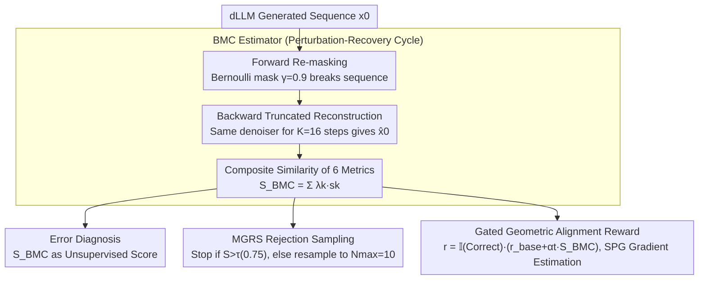

# Reasoning on the Manifold: Bidirectional Consistency for Self-Verification in Diffusion Language Models

**Conference**: ICML2026  
**arXiv**: [2604.16565](https://arxiv.org/abs/2604.16565)  
**Code**: To be confirmed  
**Area**: LLM Reasoning / Diffusion Language Models / Self-Verification  
**Keywords**: Diffusion Language Models, Manifold Geometry, Bidirectional Consistency, Reasoning Self-Verification, Reinforcement Learning Alignment  

## TL;DR
Starting from the geometric perspective that "effective reasoning trajectories are stable attractors on the learned distribution," this paper proposes BMC (Bidirectional Manifold Consistency), an unsupervised, training-free metric. By performing a "forward re-masking + backward few-step reconstruction" on the generated results of a diffusion Language Model (dLLM), it scores the output based on reconstruction stability. BMC simultaneously supports error diagnosis, inference-time rejection sampling, and RL dense rewards, systematically outperforming baselines such as Confidence, Self-Consistency, and Self-Evaluation across four reasoning benchmarks.

## Background & Motivation

**Background**: Diffusion Large Language Models (dLLMs), represented by LLaDA and Dream, replace the strict left-to-right generation of Autoregressive (AR) models with full attention and bidirectional denoising. This is considered more suitable for "global planning + iterative refinement" System-2 reasoning.

**Limitations of Prior Work**: Verifying whether a generated trajectory is actually "correct" remains an open problem. Most mainstream approaches transplant external signals from the AR era: PRMs require expensive process-level annotations; Self-Consistency requires massive sampling and often fails collectively on hard problems; Self-Evaluation prompts degrade almost to random guessing across different domains. These methods treat the model as a black box and completely ignore the probabilistic geometric structure of the diffusion process itself.

**Key Challenge**: The denoising process of a dLLM is **reversible and bidirectional**—theoretically, the model inherently possesses information about "how stable this trajectory is," but existing verification paradigms cannot extract it. In other words, external verifiers are expensive because the internal "topography" is being ignored.

**Goal**: Convert "answer correctness" into a measurable geometric property that must satisfy: (1) no ground-truth required; (2) no additional training; (3) significantly lower overhead than resampling; (4) a unified signal that spans the entire pipeline of "diagnosis → inference → alignment."

**Key Insight**: The authors hypothesize that valid solutions lie on the high-density manifold of the learned distribution and act as stable attractors of the denoising operator $\mathcal{T}_\theta$, while incorrect solutions deviate from the manifold. Thus, "the ability to be faithfully reconstructed after perturbation" serves as a proxy for manifold distance.

**Core Idea**: Use a "forward re-masking + backward few-step reconstruction" cycle to quantify stability—if $\hat{x}_0 \approx x_0$, it indicates $x_0$ is on the manifold and the reasoning is reliable; otherwise, off-manifold drift occurs, indicating a high probability of error.

## Method

### Overall Architecture
The method translates the question of "whether this reasoning trajectory is correct" into a measurable geometric problem. For a complete sequence $x_0$ generated by a dLLM, it first applies partial re-masking with ratio $\gamma$, then performs a $K$-step truncated reconstruction using the same denoiser to obtain $\hat{x}_0$. The composite similarity between $x_0$ and $\hat{x}_0$ serves as the geometric stability score $S_{\text{BMC}}(x_0)$. Stability implies being on the manifold and reliable reasoning; drift implies error. This same score drives three tasks without modification: error diagnosis (used directly as a score), Manifold-Guided Rejection Sampling (MGRS) during inference, and dense rewards during the RL phase. Theoretically, the authors anchor it to the ELBO: when $\mathcal{D}$ is the KL divergence, BMC is equivalent to a reweighted ELBO estimate (Prop. 3.2); when using Csiszár $f$-divergence, it aligns with the marginal ELBO (Prop. 3.3). Under continuous embedding, it is relaxed to semantic proximity via Lipschitz continuity (Prop. 3.4), providing a hard guarantee that the reconstruction residual is an upper bound on manifold distance: $\|z_0 - z^*\| \le \frac{1}{1-\kappa}\|z_0 - \mathcal{T}_\theta(z_0)\|$ (Prop. 3.5).

### Key Designs

**1. BMC Estimator: Quantifying Manifold Stability via a "Perturbation-Recovery" Cycle**

The quantity to be measured is $\mathcal{R}_\mathcal{D}(x_0) := -\mathbb{E}_{t, \tilde{x}_t}[\mathcal{D}(x_0, \hat{x}_0(\tilde{x}_t))]$, representing the ability to be faithfully reconstructed after perturbation. The forward pass uses Bernoulli masking $\tilde{x}_t^{(i)} = m_i x_0^{(i)} + (1-m_i)\texttt{[MASK]}$ ($\gamma{=}0.9$) to disrupt the sequence. The backward pass performs only $K{=}16$ denoising steps instead of the full $T{=}1024$ steps. This truncation is the engineering key to keeping verification costs at a fraction of generation costs, preventing it from degrading into just another resampling step. The final score $S_{\text{BMC}} = \sum_k \lambda_k s_k$ is weighted by six complementary metrics: Token Accuracy $s_{\text{tok}}$ (local convergence), Semantic Similarity $s_{\text{sem}}$ (allowing paraphrasing), Number Retention $s_{\text{num}}$ (key math nodes), Final Answer Match $s_{\text{ans}}$ (endpoint convergence), plus Character Similarity and Intrinsic Confidence. A composite is used because pure likelihood is too strict (mislabeling paraphrasing as errors), while pure answer matching ignores the stability of the reasoning chain. These six metrics make BMC both groundable to ELBO and robust to semantics.

**2. MGRS: Rejection Sampling that Allocates Compute Based on Task Difficulty**

This upgrades fixed-budget Best-of-N to dynamic compute allocation based on difficulty. Each time $x_0 \sim p_\theta(\cdot|q)$ is sampled, $S = S_{\text{BMC}}(x_0)$ is computed immediately. If $S > \tau$ ($\tau{=}0.75$), the trajectory is returned as "geometrically stable," otherwise sampling continues up to $N_{\max}{=}10$. If all samples fail the threshold, the candidate with the highest historic score is returned. This results in simple problems stopping after $\sim$2–3 samples on average, while hard problems (e.g., MATH) naturally take $\sim$5–6 samples. In contrast, Self-Consistency's majority vote wastes compute on simple tasks and "collectively errs" on hard ones; Best-of-N (Confidence) uses token probabilities which correlate poorly with reasoning correctness. BMC provides a geometric signal rather than a statistical one, naturally coupling the budget with task difficulty.

**3. Gated Geometrically Aligned Reward: Internalizing Manifold Stability into Policy**

To move beyond just picking samples during inference and instead train geometric stability into the weights, BMC is injected into the RL reward: $r(x_0) = \mathbb{I}(y_{\text{pred}} = y^*) \cdot [r_{\text{base}} + \alpha_t \cdot S_{\text{BMC}}(x_0)]$. The multiplicative gating is crucial—it ensures that any chain resulting in a wrong answer receives zero reward, establishing a strict hierarchy of "correct first, then stable." Otherwise, dense geometric rewards would steer the model toward "consistent but wrong" drift (a geometric form of reward hacking). The weight $\alpha_t = \alpha_{\min} + (\alpha_{\max} - \alpha_{\min}) \cdot t/T$ is linearly annealed to prioritize answers early and geometry later. For gradient estimation, since dLLM likelihood is intractable and standard ELBO approximations are biased, the authors use Sandwiched Policy Gradient (SPG) with sandwiched evidence bounds. This turns sparse outcome rewards into dense, unbiased, and optimizable geometric quality rewards.

### Loss & Training
BMC itself is training-free and only uses the pre-trained dLLM for inference. During the RL phase, alignment is performed on LLaDA-8B using the SPG framework with hyperparameters $r_{\text{base}} = 1.5$, $\alpha \in [0.5, 1.0]$, $K{=}16$, $\gamma{=}0.9$, and $N_{\text{BMC}}{=}4$ ensemble samples. Semantic similarity uses all-MiniLM-L6-v2.

## Key Experimental Results

### Main Results: Unsupervised Error Diagnosis (AUROC)

| Model | Method | GSM8K | MATH | ARC-C | GPQA |
|------|------|-------|------|-------|------|
| LLaDA-8B | Model Confidence | 0.753 | 0.713 | 0.550 | 0.482 |
| LLaDA-8B | Self-Evaluation | 0.549 | 0.558 | 0.546 | 0.529 |
| LLaDA-8B | Self-Consistency | 0.872 | 0.803 | 0.735 | 0.539 |
| LLaDA-8B | **BMC (Ours)** | **0.893** | **0.820** | **0.777** | **0.678** |
| Dream-7B | Self-Consistency | 0.684 | 0.675 | 0.708 | 0.527 |
| Dream-7B | **BMC (Ours)** | **0.898** | **0.825** | **0.804** | **0.605** |

On LLaDA, BMC's advantage over SC increases from +2.1% on GSM8K to +13.9% on GPQA—the harder the task, the more the "consensus assumption" of SC fails, and the more valuable geometric signals become. On Dream-7B, where sampling diversity is poor, SC performs similarly to confidence, while BMC maintains a stable 0.80+ AUROC, showing low sensitivity to the base model.

### MGRS Inference and Alignment Results

| Model | Task | Standard | Self-Cons. | Best-of-N(Conf) | **MGRS** |
|------|------|----------|------------|-----------------|----------|
| LLaDA | GSM8K | 70.5 | 74.3 | 70.7 | **79.5** |
| LLaDA | MATH | 24.4 | 24.2 | 23.8 | **27.6** |
| LLaDA | ARC-C | 83.2 | 86.1 | 83.3 | **87.2** |

| Alignment Method (LLaDA, len=512) | GSM8K | MATH | ARC-C | GPQA |
|--------------------------|-------|------|-------|------|
| SFT | 80.4 | 34.8 | 78.1 | 26.8 |
| Outcome RL | 83.5 | 37.2 | 82.2 | 30.8 |
| **Geometric Align (Ours)** | **85.8** | **41.6** | **85.2** | **34.4** |

### Key Findings
- **Geometric Meaning of $K$ and $\gamma$**: AUROC saturates at $K{=}16$ ($0.840 \to 0.873$), indicating truncated reconstruction is sufficient to detect local contractivity of $\mathcal{T}_\theta$. The masking rate follows an inverted U-shape, peaking at $\gamma{=}0.9$ (0.889); at $\gamma{=}1.0$, it plummets to 0.712, showing that some "geometric anchors" must be retained to measure stability, otherwise it degrades into unconditional resampling.
- **Multiplicative Gating is Indispensable**: If $r$ is changed to an additive form, the model is led astray by "self-consistent but wrong" chains, exemplifying geometric reward hacking.
- **Compute Adaptivity**: MGRS averages $\sim$2.2–3.3 samples on GSM8K and naturally increases to $\sim$5.4–5.8 on MATH. Geometric signals align the budget with difficulty, whereas Best-of-N(Conf) shows **negative sample efficiency** on MATH.

## Highlights & Insights
- **"Reconstruction Stability = Manifold Distance" is a Clean Bridge**: Translating verification into a geometric contraction problem provides both a hard upper bound in Prop. 3.5 and a lightweight $K{=}16$ cycle for engineering, achieving a rare balance between theory and usability.
- **Unified Signal Across Three Tasks**: Diagnosis, inference-time sampling, and RL dense rewards share the same BMC, avoiding the fragmentation of using PRM for diagnosis, SC for inference, and outcome rewards for alignment. This "one-signal-multiple-uses" approach leverages the model's intrinsic probabilistic structure.
- **Transferable to Any Masked Denoising Model**: As long as there is a "masking-denoising" bidirectional process, BMC can be directly applied—tasks like vision or protein generation using discrete diffusion can reuse this same geometric stability criterion.

## Limitations & Future Work
- BMC assumes the dLLM has already learned "correct answer = high-density manifold." For under-trained or severely misaligned models, the attractor structure might not hold, causing the geometric signal to distort.
- The six weights $\lambda_k$ for the composite score $S_{\text{BMC}}$ are mostly manually set; there is no systematic discussion of adaptive weighting, which might be necessary when migrating to other domains (e.g., code, medical).
- Experiments are primarily on LLaDA-8B and Dream-7B; the scale has not reached the 70B level. When the base model is already nearly perfect (as with Dream on ARC-C), the gain from BMC narrows, requiring larger-scale validation of scaling behavior.
- Geometric stability $\neq$ factual correctness: BMC can reject "drifting trajectories," but it remains powerless against hallucinations that are "on the manifold but factually wrong" (e.g., consistent common-sense errors).

## Related Work & Insights
- **vs PRM / Generative Verifier**: These rely on external annotations or judge models. BMC is white-box, utilizing the dLLM's own denoising operator. The advantage is zero-annotation and zero-extra-model; the disadvantage is its restriction to bidirectional architectures like masked diffusion.
- **vs Self-Consistency**: SC relies on statistical consensus; BMC relies on geometric stability. SC "errs collectively" on hard tasks, while BMC is more robust in sparse correct mass scenarios since it examines single-trajectory stability.
- **vs RemeDi / CDLM**: RemeDi uses dual-stream re-masking of low-confidence tokens, and CDLM trains specialized error-correction heads—both are focused on re-generation. BMC explicitly formalizes this same bidirectional dynamics into a verification criterion that does not require changing training objectives.
- **vs TraceRL / diffu-GRPO**: These implicitly optimize trajectory likelihood approximations. BMC provides an explicit dense geometric signal and, paired with SPG using sandwiched bounds, resolves the gradient estimation problem for dLLMs with intractable likelihoods.

## Rating
- Novelty: ⭐⭐⭐⭐⭐ First to formalize dLLM bidirectional dynamics as a "manifold stability" verification criterion, bridging diagnosis/inference/alignment.
- Experimental Thoroughness: ⭐⭐⭐⭐ Covers two dLLMs across four reasoning benchmarks and three downstream tasks, including $K$/$\gamma$ sensitivities and ablation; lacks larger-scale and cross-domain validation.
- Writing Quality: ⭐⭐⭐⭐⭐ Progresses clearly from geometric intuition to four propositions and algorithmic pseudocode, with clear theoretical-methodological coupling.
- Value: ⭐⭐⭐⭐⭐ Provides a "training-free + multi-use" intrinsic verification baseline for the dLLM paradigm, serving as a ready-to-use tool for inference-time scaling and RL post-training.

<!-- RELATED:START -->

## Related Papers

- [\[ACL 2025\] Self-Training Elicits Concise Reasoning in Large Language Models](../../ACL2025/llm_nlp/self-training_elicits_concise_reasoning_in_large_language_models.md)
- [\[ACL 2026\] Unlocking the Potential of Diffusion Language Models through Template Infilling](../../ACL2026/llm_nlp/unlocking_the_potential_of_diffusion_language_models_through_template_infilling.md)
- [\[ICML 2026\] SPA-Cache: Singular Proxies for Adaptive Caching in Diffusion Language Models](spa-cache_singular_proxies_for_adaptive_caching_in_diffusion_language_models.md)
- [\[ICLR 2026\] Toward Safer Diffusion Language Models: Discovery and Mitigation of Priming Vulnerabilities](../../ICLR2026/llm_nlp/toward_safer_diffusion_language_models_discovery_and_mitigation_of_priming_vulne.md)
- [\[ICLR 2026\] DreamOn: Diffusion Language Models For Code Infilling Beyond Fixed-size Canvas](../../ICLR2026/llm_nlp/dreamon_diffusion_language_models_for_code_infilling_beyond_fixed-size_canvas.md)

<!-- RELATED:END -->
