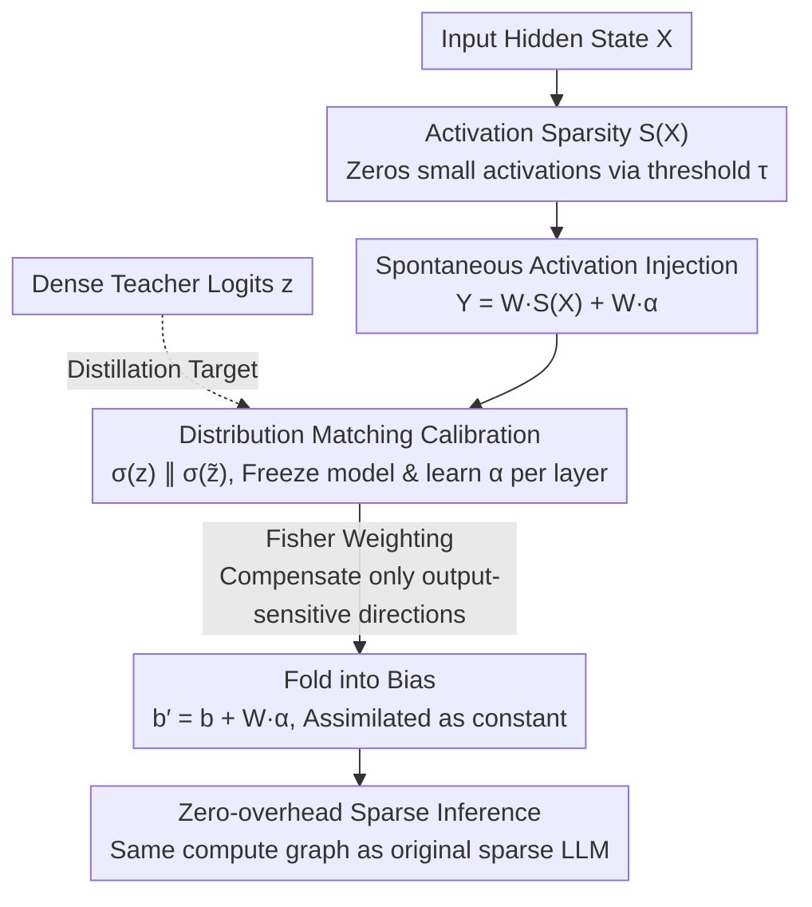

# Resting Neurons, Active Insights: Robustify Activation Sparsity for Large Language Models

**Conference**: ICML 2026  
**arXiv**: [2512.12744](https://arxiv.org/abs/2512.12744)  
**Code**: https://github.com/hxu105/SPON (Available)  
**Area**: Model Compression / LLM Efficiency  
**Keywords**: Activation Sparsity, Representation Stability, Spontaneous Neurons, Bias Absorption, Knowledge Retention

## TL;DR
This paper attributes the performance degradation of LLMs caused by activation sparsity to "representation drift." By mimicking biological spontaneous firing, it injects an input-independent small vector (SPON) into each layer. This vector can be absorbed into the bias after training, significantly narrowing the gap between sparse and dense models with near-zero inference overhead.

## Background & Motivation
**Background**: To accelerate LLM inference, activation sparsity has emerged as an elegant approach. Representative methods like TEAL / LaRoSA / R-Sparse use a magnitude threshold $\tau$ to zero out small activations, thereby skipping corresponding weight columns during linear transformations in MLP/Attention. This "dynamic masking" does not modify weights or activation functions, making it naturally suitable for existing dense LLMs.

**Limitations of Prior Work**: When the sparsity ratio exceeds 50%, almost all existing schemes suffer from significantly increased perplexity and drops in zero-shot task performance. These drops typically require retraining or structural adjustments to recover, contradicting the original goal of "zero-cost acceleration."

**Key Challenge**: The authors observed that as sequence length increases, the proportion of neurons that can be simultaneously activated across all tokens decays exponentially (Figure 1). In other words, those "persistently active" neurons that serve as "global anchors" in dense models are selectively deactivated for different tokens after sparsification. This leads to a token-dependent drift in the hidden state distribution, equivalent to losing the "priors" learned during pre-training.

**Goal**: To restore the representation stability of sparse LLMs and bring performance back to dense levels without retraining weights, changing the architecture, or increasing inference FLOPs.

**Key Insight**: The researchers reframe the activation sparsity problem as a "representation alignment" problem. Sparsity introduces not just simple information loss, but a lack of stable, input-independent "baseline activity" for reference. The spontaneous activity found in biological neural systems plays exactly this role, providing a static prior.

**Core Idea**: Inject a small number of learnable, input-independent "spontaneous activation vectors" $\vec{\alpha}$ into each layer. This vector is trained solely by KL distillation of the dense model's logits. Since it is input-independent, it can be directly folded into the bias after training, resulting in zero additional inference overhead.

## Method

### Overall Architecture
All modifications in SPON are applied to each linear layer of the transformer. The original $Y = WX$ becomes $Y = W\,S(X)$ after activation sparsity, where $S(X)_i = \mathbf{1}\{|x_i|>\tau\}\cdot x_i$ zeroes out small activations. SPON adds an input-independent "spontaneous neuron" term to this: $Y = W\,S(X) + W\vec{\alpha}$. During training, the entire model is frozen, and only one set of $\vec{\alpha}$ per layer is learned. KL divergence is used to pull the sparse model's logits back toward the dense model. After training, $W\vec{\alpha}$ is a constant and is folded into the bias $b' = b + W\vec{\alpha}$. The final inference graph is identical to the original sparse LLM.

### Key Designs

**1. Input-independent Spontaneous Activation Injection: Recovering lost persistent neurons with a static vector**

The cost of sparsity is not "information loss" but "anchor loss." In dense models, neurons that activate for almost all tokens provide an input-independent global prior. In sparse models, these are selectively turned off, causing token-dependent drift. SPON adds $W\vec{\alpha}$ to $W\,S(X)$, where $\vec{\alpha}\in\mathbb{R}^d$ is a learnable vector unique to each layer and independent of input $X$. Because it is token-independent, $W\vec{\alpha}$ is a constant that can be pre-calculated and added to the bias, explicitly writing the "global expectation" of the dense model back into the sparse compute graph. Notably, the paper finds that only **one** spontaneous neuron per layer (i.e., $\vec{\alpha}$ as a fixed-direction activation) is sufficient to recover performance, suggesting that the model lacks stable "directions" rather than extra "capacity."

**2. Distribution-matching Lightweight Calibration: Distilling only logits and learning only per-layer spontaneous vectors $\vec{\alpha}$**

SPON uses a small batch of calibration data $u\sim D$ (e.g., WikiText or C4). Let $z(u)$ and $\tilde z(u;\mathcal{A})$ be the output logits of the dense and sparse models, respectively. The objective is to optimize $\mathcal{A}=\{\vec{\alpha}_\ell\}$ to minimize $\mathcal{L}(\mathcal{A}) = \mathbb{E}_u[\mathrm{KL}(\sigma(z)\|\sigma(\tilde z))]$. Since only one small vector per layer is learned, the calibration cost is much lower than full fine-tuning. Because it aligns final logits rather than forcing intermediate layer matches, the spontaneous neurons act as "global compensation" for sparse residuals, making them robust to calibration data distribution.

**3. Fisher-weighted Residual Correction: Explaining why one vector is enough**

This theoretically explains why a single static vector can revive a sparse model. Taking the final projection layer as an example, define the sparse residual as $e(X) = WX - WS(X)$. The first-order optimality condition for the KL loss yields $\mathbb{E}_u[W^\top H(W\vec{\alpha} - e(X))] = 0$, where $H$ is the Hessian at the logits, which equals the Fisher Information Matrix of the output distribution. Thus, the optimal $\vec{\alpha}$ makes $W\vec{\alpha}$ the best approximation of $e(X)$ under the Fisher metric. The Fisher geometry inherent in KL divergence prioritizes the finite capacity on directions to which the output distribution is most sensitive, compensating for sparse bias only where it matters most.

### Loss & Training
Only $\mathcal{A}$ is trained throughout. The loss is the aforementioned $\mathrm{KL}(\sigma(z)\|\sigma(\tilde z))$. The calibration set is small. Once training is complete, $W\vec{\alpha}$ for each layer is folded into the bias, and the inference graph remains unchanged.

## Key Experimental Results

### Main Results

| Dataset | Model | Sparsity | TEAL | SPON | Notes |
| :--- | :--- | :--- | :--- | :--- | :--- |
| WikiText PPL | Llama3-8B | 50% | 8.34 | 7.83 | Dense: 6.75 |
| WikiText PPL | Mistral-7B | 50% | 6.00 | 5.86 | Dense: 5.49 |
| WikiText PPL | Qwen3-8B | 50% | 9.75 | 9.26 | Dense: 8.99 |
| WikiText PPL | Llama3-8B | 60% | 11.62 | 9.63 | Largest gain at high sparsity |

In comparison with pruning methods (Llama3-8B, 50%): SPON achieves PPL=7.83, significantly outperforming SparseGPT (9.18), Wanda (9.66), MaskLLM (8.58), and ARMOR (10.10).

### Ablation Study

| Configuration | Key Metric | Description |
| :--- | :--- | :--- |
| TEAL only | Llama3-8B 50% PPL: 8.34 | Magnitude threshold sparsity only |
| + Spontaneous Neuron (1 per layer) | PPL: 7.83 | Adding only one $\vec{\alpha}$ |
| Calibrate on C4, Evaluate on WikiText | PPL: 7.95 | Cross-corpus robustness |
| Combined with LaRoSA/WINA/R-Sparse | Llama3-8B 5-task Avg: 71.96% | Higher than LaRoSA(69.82)/WINA(70.97) |

### Key Findings
- Keeping the number of "spontaneous neurons" per layer at 1 yielded the best performance, confirming that SPON addresses "direction" rather than "capacity," consistent with the Fisher residual correction theory.
- The more aggressive the sparsity (60% > 50% > 25%), the larger the gain from SPON, suggesting it compensates for "forced-off persistent neurons."
- SPON is orthogonal to existing sparsity methods (LaRoSA, WINA, R-Sparse, WAS) and can be stacked for further gains. It consistently provides 0.75% / 0.96% improvements on Qwen3-32B and Llama3-70B, demonstrating scalability to larger models.

## Highlights & Insights
- The definition of "compensating for missing persistent neurons using static bias" is very clean—it reuses hardware paths for bias while linking sparsity to representation stability, with near-zero cost.
- The KL+Fisher derivation turns the effectiveness of a single vector into an explainable conclusion rather than an engineering coincidence. This "Fisher-guided minimal parameter compensation" can be transferred to other compression types like low-bit or low-rank.
- While LLM designs often ignore bias, this paper takes the opposite approach, showing that "bias-like" parameters act as indispensable pillars for representations in heavily sparse scenarios, identifying an overlooked design freedom.

## Limitations & Future Work
- Exhaustive experiments were mainly conducted on 7B–8B models. While effective on 70B and 32B, the experimental granularity is smaller; whether spontaneous vectors remain stable in long-context or chain-of-thought scenarios requires more systematic verification.
- Spontaneous vectors are learned independently per layer without explicit modeling of inter-layer interactions. Shared structures (e.g., attention vs. MLP) or low-rank coupling could be explored to further reduce calibration costs.
- Training still requires dense model logits as a teacher; surrogate signals would be needed for deployment scenarios where the dense model is completely inaccessible (e.g., only quantized weights are available).

## Related Work & Insights
- **vs TEAL/LaRoSA/R-Sparse**: These focus on "how to choose activations to mask more intelligently." This paper acknowledges the post-sparsity residual and actively compensates for it, making it orthogonal and combinable.
- **vs SparseGPT/Wanda/MaskLLM**: Weight pruning permanently deletes parameters. SPON operates entirely in the activation space while keeping weights untouched, making it easier to roll back or stack.
- **vs Bias-only fine-tuning (e.g., BitFit)**: BitFit is for task adaptation, while SPON is for sparsity adaptation. Their forms are similar but goals differ, highlighting that "modifying only bias" is still a valuable low-cost tuning space in the LLM era.

## Rating
- Novelty: ⭐⭐⭐⭐ Reframes activation sparsity as representation alignment and uses Fisher residuals for explanation; clear logic with minimal changes.
- Experimental Thoroughness: ⭐⭐⭐⭐ Comprehensive multi-model/baseline comparisons against pruning and SOTA sparsity, though lacking some ultra-long context verification.
- Writing Quality: ⭐⭐⭐⭐ The storyline (biological motivation → empirical observation → theoretical derivation → engineering implementation) is very smooth.
- Value: ⭐⭐⭐⭐ Can be stacked on existing sparsity methods at almost zero cost; highly industrial-deployment friendly.

<!-- RELATED:START -->

## Related Papers

- [\[ACL 2025\] From Neurons to Semantics: Evaluating Cross-Linguistic Alignment Capabilities of Large Language Models via Neurons Alignment](../../ACL2025/llm_nlp/from_neurons_to_semantics_evaluating_cross-linguistic_alignment_capabilities_of_.md)
- [\[NeurIPS 2025\] Scaling Up Active Testing to Large Language Models](../../NeurIPS2025/llm_nlp/scaling_up_active_testing_to_large_language_models.md)
- [\[NeurIPS 2025\] Polar Sparsity: High Throughput Batched LLM Inferencing with Scalable Contextual Sparsity](../../NeurIPS2025/llm_nlp/polar_sparsity_high_throughput_batched_llm_inferencing_with_scalable_contextual_.md)
- [\[ICML 2026\] ANCHOR: Abductive Network Construction with Hierarchical Orchestration for Reliable Probability Inference in Large Language Models](anchor_abductive_network_construction_with_hierarchical_orchestration_for_reliab.md)
- [\[ICML 2026\] Rare Event Analysis of Large Language Models](rare_event_analysis_of_large_language_models.md)

<!-- RELATED:END -->
