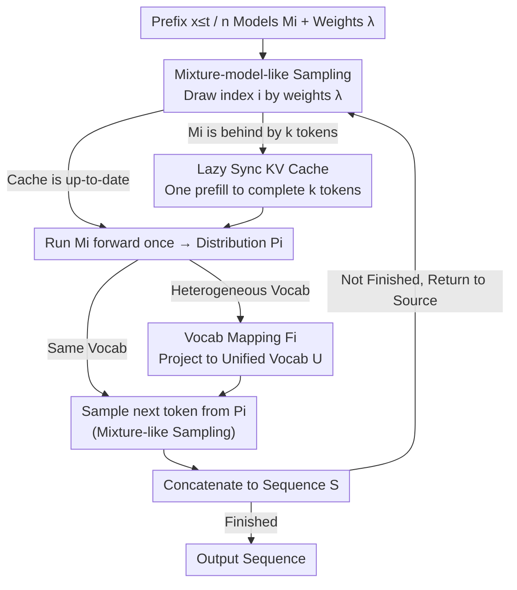

# Rethinking LLM Ensembling from the Perspective of Mixture Models

**Conference**: ICML 2026 Spotlight  
**arXiv**: [2605.00419](https://arxiv.org/abs/2605.00419)  
**Code**: https://github.com/jialefu/Mixture-model-like-Ensemble (Yes)  
**Area**: LLM Efficiency / Decoding and Ensembling  
**Keywords**: LLM Ensemble, Mixture Models, Sampling Equivalence, KV Cache, Token-level Routing

## TL;DR
This paper demonstrates that token-level ensembling of $n$ LLMs does not require executing all models at every step. By randomly selecting one model according to weights to sample the next token, the output distribution is strictly equivalent to "averaging before sampling." This reduces the forward pass overhead from $n\times$ back to $1\times$, achieving practical speedups of 1.78×–2.68× when combined with "Lazy Sync KV Cache."

## Background & Motivation
**Background**: Traditional machine learning ensembles average the probability distributions of multiple models before taking the argmax. This paradigm, when directly applied to LLMs, involves averaging the next-token distributions of $n$ models at each token and then sampling from the averaged distribution. While this improves generation quality, it requires $n$ forward passes.

**Limitations of Prior Work**: Parallelizing $n$ models across $n$ GPUs still fails to approach $1\times$ speed because each token requires heavy cross-device synchronization and communication overhead. Existing methods that "reduce ensemble frequency" or "truncate vocabularies" only provide marginal optimizations; the bottleneck remains the requirement to "explicitly construct the ensemble distribution."

**Key Challenge**: The "argmax selection" behavior in traditional ensembles makes an "explicitly averaged distribution" necessary. However, LLM decoding itself is "sampling from a distribution," where the "shape" of the distribution only matters in the sense of sampling—a latent assumption followed in practice but never directly challenged.

**Goal**: To reduce the asymptotic inference cost of LLM ensembling from $O(n)$ to $O(1)$ with minimal algorithmic changes, while maintaining an output distribution identical to traditional ensembling.

**Key Insight**: The authors pose a simple yet critical question: Does LLM ensembling truly require calling all models? They observe that "sampling from a weighted distribution" is equivalent to "selecting a component according to weights and then sampling from that component," which matches the definition of a mixture model.

**Core Idea**: Treat the LLM ensemble as a mixture model $\sum_i \lambda_i M_i$. In each step, randomly draw an index $i \sim \mathrm{Mult}(\lambda)$, perform only one forward pass with model $M_i$, and then sample. The resulting token distribution is proven identical to traditional ensembling. Simultaneously, this establishes an equivalence bridge between LLM ensembling and token-level routing.

## Method

### Overall Architecture
Given $n$ LLMs $M_1,\dots,M_n$ with weights $\lambda_i\ge 0$ where $\sum_i \lambda_i = 1$, conventional ensembling (CE) explicitly computes the weighted average distribution $\bar P(y|x_{\le t}) = \sum_i \lambda_i M_i(y|x_{\le t})$ at each step to sample the next token, requiring all $n$ models to run. The proposed Mixture-model-like Ensemble (ME) reverses this: at each step, an index $i$ is first drawn from $\mathrm{Mult}(\lambda)$, and only $M_i$ is used for a single forward pass and sampling. By incorporating "Lazy KV Synchronization" to handle historical gaps and "vocabulary mapping" for heterogeneous models, the $n\times$ forward passes are losslessly reduced to $1\times$. The pipeline is a per-token decoding loop: Source Selection → Cache Supplement → Single Forward → (If heterogeneous) Vocabulary Mapping → Sampling → Concatenation → Return to Source Selection.

### Key Designs

**1. Mixture-model-like Sampling: Replacing "Averaging" with "Source Selection before Sampling"**

The reason CE must run $n$ models is the requirement to average distributions before sampling—a habit inherited from traditional ML where argmax necessitates an explicit average. However, for LLM sampling, "sampling from a weighted distribution $\sum_i \lambda_i M_i$" is probabilistically equivalent to "first picking a component $M_i$ with probability $\lambda_i$, then sampling from $M_i$." This is the definition of a mixture model. ME independently draws an index $i \sim \mathrm{Mult}(\lambda_1,\dots,\lambda_n)$ at each step, performs one forward pass to get $P_i = M_i(y|x_{\le t})$, and samples $x_{t+1}$ from $P_i$. This change reduces the per-token forward cost from $n$ to 1, while the final token distribution remains perfectly consistent: $P(x_{t+1}=y) = \sum_i P(\text{Select }i)\,M_i(y|\cdot) = \sum_i \lambda_i M_i(y|\cdot)$, which is identical to CE. Moving the sampling step before the model selection stage saves $n-1$ forward passes without losing any information.

**2. Lazy Sync KV Cache: Single Prefill upon Model Switching**

Reducing forward passes introduces a new issue: if $M_i$ is used at step $t$ and $M_j$ is drawn at $t+1$, $M_j$'s KV cache will lack the history of tokens generated by $M_i$. Standard synchronization would require updating all models every step, causing memory bandwidth to revert to $O(n)$. ME instead maintains independent KV caches and only updates a model when it is selected by performing a "prefill-style completion" for the $k$ missing tokens. Since LLM decoding is memory-bandwidth bound, the latency of a forward extension for $k$ tokens is nearly identical to that for 1 token (as the bottleneck is weight movement, not computation). The amortized cost of completion is negligible, sharing a philosophy with verification in speculative decoding.

**3. Heterogeneous Vocabulary Mapping: Unifying Ensembling with Token-level Routing**

To handle disparate vocabularies, ME applies a mapping $F_i: P_i\mapsto \tilde P_i$ for each model, projecting local distributions onto a unified vocabulary $U$. By replacing $M_i(y|x_{\le t})$ with $F_i[M_i(y|x_{\le t})]$, the algorithm supports models with different architectures and vocabularies (e.g., UniTe). This insight bridges perspectives: a router-based model selection vs. ME's fixed-$\lambda$ selection differs only in being "input-dependent vs. input-independent." Thus, LLM ensembling is a simplified, degenerate case of token-level routing. This aligns ensembling, routing, and MoE on a "training cost vs. performance" axis.

### Loss & Training
ME requires no additional training and serves as a plug-and-play inference algorithm. The only overhead is the one-time KV prefill during model switches, and it can be directly integrated with vocabulary alignment methods like UniTe.

## Key Experimental Results

### Main Results

| Setting | Model Combo | Task | CE Perf. | ME Perf. | Gain (Speed) |
|------|----------|------|---------|---------|------|
| Homogeneous | Qwen-3B + Qwen-Math-1.5B | GSM8K/MMLU/BBH/ARC | Same as ME | Identical to CE | 1.78×–2.68× vs CE |
| Heterogeneous | Openchat + DeepSeek-7B + Mistral-7B | 4 Datasets | > Single Model | Identical to CE | Near single-model speed |
| Different Scales | Llama-3-8B + Llama-3-1B/3B | General | — | $\lambda$ controls speed/accuracy | Significantly faster than CE |

### Ablation Study

| Configuration | Key Metrics | Note |
|------|---------|------|
| Single Model | Max Speed, Min Accuracy | Upper bound comparison |
| CE (Sequential) | High Accuracy, Speed $\approx 1/n$ | Explicit averaging |
| CE (Parallel, GaC) | Slightly faster than Sequential | High multi-GPU comms cost |
| ME | High Accuracy (Eqv. to CE), Near Single-model Speed | Critical evidence |
| Model Count 2→3 | No further gain in most tasks | "More models $\neq$ better" |

### Key Findings
- ME and CE achieve identical accuracy across GSM8K, MMLU, BBH, and ARC, strongly supporting the "distribution equivalence" proof.
- Parallel CE shows almost no speedup due to per-token cross-device communication, confirming that the bottleneck is "explicit distribution construction" rather than pure computation.
- Increasing the number of models in an ensemble does not monotonically improve performance. The optimal $n$ depends on the task/model combination, suggesting ensembling is "complementarity mining" rather than "brute-force averaging."

## Highlights & Insights
- Shifting ensembling from the conditional probability level to the mixture model level (source selection before sampling) is a rare instance of an algorithm change that is "strictly equivalent + provides massive efficiency gains."
- Lazy KV Sync leverages the hardware fact that "LLM decoding is memory-bandwidth bound," a concept shared with speculative decoding. This "amortized prefill" trick can optimize other multi-model collaboration scenarios.
- Treating ensembling as a degenerate case of token-level routing unifies "zero training vs. trained router vs. trained expert" into a continuous spectrum, providing a clear coordinate system for future MoE/routing designs.

## Limitations & Future Work
- While ME's output distribution is equivalent to CE, gains are primarily in efficiency. If CE itself yields marginal improvements (e.g., between non-complementary models), ME cannot create performance out of thin air.
- The equivalence proof holds for "sampling-based decoding." Scenarios without sampling (e.g., greedy or beam search) require separate analysis.
- Model selection is currently determined by a fixed $\lambda$ without utilizing contextual signals. Integrating a lightweight router to upgrade ME to input-dependent token-level routing is a natural next step.

## Related Work & Insights
- **vs. Traditional Ensemble Paradigms (Rokach et al.)**: Traditional methods necessitate explicit averaging for argmax; this work reveals that LLMs do not require this due to sampling.
- **vs. GaC/UniTe (Yu 2024 / Yao 2024)**: These improve vocab alignment or reduce frequency but remain limited by $n$ forward passes. ME bypasses this requirement fundamentally.
- **vs. MoE / Token-level Routing**: The authors compare the three within a "Training Cost-Performance-Inference Speed" triangle, proposing ME as "Training-free + Zero Inference Overhead + Moderate Gain," making it the most cost-effective ensemble option.

## Rating
- Novelty: ⭐⭐⭐⭐ Simple idea with strict equivalence that links ensembling and routing; a "missed truth" type of work.
- Experimental Thoroughness: ⭐⭐⭐⭐ Validated across multiple model families, tasks, and homogeneous/heterogeneous settings with detailed speed tests.
- Writing Quality: ⭐⭐⭐⭐⭐ Strong narrative, clear motivation, and elegant proofs.
- Value: ⭐⭐⭐⭐ 1.78×–2.68× speedup in inference with simple implementation; ready for immediate deployment in LLM applications.

<!-- RELATED:START -->

## Related Papers

- [\[ACL 2025\] Mixture of Small and Large Models for Chinese Spelling Check](../../ACL2025/llm_nlp/mixture_of_small_and_large_models_for_chinese_spelling_check.md)
- [\[ACL 2025\] SR-LLM: Rethinking the Structured Representation in Large Language Model](../../ACL2025/llm_nlp/sr-llm_rethinking_the_structured_representation_in_large_language_model.md)
- [\[ICLR 2026\] Rethinking Code Similarity for Automated Algorithm Design with LLMs](../../ICLR2026/llm_nlp/rethinking_code_similarity_for_automated_algorithm_design_with_llms.md)
- [\[NeurIPS 2025\] Are Language Models Efficient Reasoners? A Perspective from Logic Programming](../../NeurIPS2025/llm_nlp/are_language_models_efficient_reasoners_a_perspective_from_logic_programming.md)
- [\[ACL 2025\] Are Optimal Algorithms Still Optimal? Rethinking Sorting in LLM-Based Pairwise Ranking with Batching and Caching](../../ACL2025/llm_nlp/are_optimal_algorithms_still_optimal_rethinking_sorting_in_llm-based_pairwise_ra.md)

<!-- RELATED:END -->
