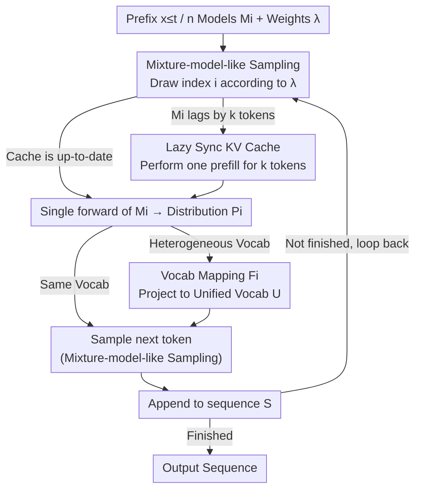

# Rethinking LLM Ensembling from the Perspective of Mixture Models

**Conference**: ICML 2026 Spotlight  
**arXiv**: [2605.00419](https://arxiv.org/abs/2605.00419)  
**Code**: https://github.com/jialefu/Mixture-model-like-Ensemble (Available)  
**Area**: LLM Efficiency / Decoding & Ensembling  
**Keywords**: LLM Ensemble, Mixture Model, Sampling Equivalence, KV Cache, Token-level Routing

## TL;DR
This paper proves that token-level ensembling of $n$ LLMs does not require running all models at every step. By randomly selecting one model per step based on weights to sample the next token, the output distribution is strictly equivalent to the "average then sample" approach. This reduces the $n$-fold forward passes back to a $1\times$ forward pass, achieving actual speedups of 1.78×–2.68× when combined with "Lazy Synchronous KV Cache."

## Background & Motivation
**Background**: Traditional machine learning ensembling averages probability distributions from multiple models before taking the argmax. Directly applying this paradigm to LLMs involves "averaging the next-token distributions of $n$ models at each token, then sampling from the averaged distribution." While this improves generation quality, it requires $n$ forward passes.

**Limitations of Prior Work**: Parallelizing $n$ models across $n$ GPUs still fails to approach $1\times$ speed because each token requires heavy cross-device synchronization communication. Existing methods that "reduce ensemble frequency" or "truncate vocabularies" only optimize peripheral aspects; the bottleneck of "explicitly constructing the ensemble distribution" remains.

**Key Challenge**: The "argmax selection" behavior in traditional ensembles makes an "explicitly averaged distribution" necessary. However, LLM decoding itself is "sampling from a distribution," where the "shape" of the distribution only matters in the sense of sampling—a practical assumption that has been followed but not directly challenged.

**Goal**: To reduce the asymptotic inference cost of LLM ensembling from $O(n)$ to $O(1)$ with minimal algorithmic changes while maintaining an output distribution perfectly identical to traditional ensembling.

**Key Insight**: The authors propose a simple yet critical question: Does LLM ensembling truly require invoking all models? They observe that "sampling from a weighted distribution" is equivalent to "selecting a component according to weights and then sampling from that component," which is the definition of a mixture model.

**Core Idea**: Treat the LLM ensemble as a mixture model $\sum_i \lambda_i M_i$. At each step, randomly select an index $i \sim \mathrm{Mult}(\lambda)$ and run the forward pass of model $M_i$ only once to sample. This proves the resulting token distribution is identical to traditional ensembles. It also establishes an equivalence between LLM ensembling and token-level routing.

## Method

### Overall Architecture
Given $n$ LLMs $M_1,\dots,M_n$ with weights $\lambda_i\ge 0$ and $\sum_i \lambda_i = 1$, a Conventional Ensemble (CE) must explicitly calculate the weighted average distribution $\bar P(y|x_{\le t}) = \sum_i \lambda_i M_i(y|x_{\le t})$ at each step, thus requiring all $n$ models. The proposed Mixture-model-like Ensemble (ME) reverses this: it first samples an index $i$ from $\mathrm{Mult}(\lambda)$ and uses only $M_i$ for one forward pass and sampling. Combined with "Lazy KV Synchronization" to handle historical gaps when switching models and vocabulary mapping for heterogeneous models, the $n$-fold forward cost is losslessly reduced to $1\times$. The pipeline is a token-by-token decoding loop: select source → synchronize cache → single forward → (if heterogeneous) map vocabulary → sample → append → return to selection.

### Key Designs

**1. Mixture-model-like Sampling: Replacing "Averaging" with "Select-then-Sample"**

CE requires running $n$ models because it averages distributions before sampling—a habit inherited from traditional ML ensembles where argmax necessitates an explicit average distribution. However, LLM decoding is inherently sampling-based. Mathematically, "sampling from a weighted distribution $\sum_i \lambda_i M_i$" is strictly equivalent to "randomly picking a component $M_i$ and then sampling from $M_i$." ME independently draws an index $i$ from $\mathrm{Mult}(\lambda_1,\dots,\lambda_n)$ at each step, performs one forward pass to get $P_i = M_i(y|x_{\le t})$, and samples $x_{t+1}$ from $P_i$. This reduces complexity from $n$ to 1 per step while maintaining identical token distributions: $P(x_{t+1}=y) = \sum_i P(\text{select } i) \, M_i(y|\cdot) = \sum_i \lambda_i M_i(y|\cdot)$. Moving sampling ahead of model execution saves $n-1$ forward passes without losing information.

**2. Lazy Synchronous KV Cache: Single Prefill upon Model Switching**

Reducing forward passes introduces a challenge: if $M_i$ is used at step $t$ and $M_j$ is drawn at $t+1$, $M_j$'s KV cache will lack the history of the intervening tokens. Naively synchronizing all KV caches at every step would require loading all model weights, pushing memory bandwidth back to $O(n)$. ME maintains separate KV caches and only updates a model when it is selected by performing a one-time "prefill-style completion" for its missing $k$ tokens. Since LLM decoding is memory-bandwidth bound, the latency of a "forward extend" pass for $k$ tokens is nearly identical to that for 1 token (the bottleneck is weight loading, not token computation). The amortized cost of completion is negligible, sharing the same insight as verification in speculative decoding.

**3. Heterogeneous Vocabulary Mapping: Unifying Ensembling with Token-level Routing**

To handle different vocabularies, ME introduces a mapping $F_i: P_i\mapsto \tilde P_i$ for each model, projecting individual distributions onto a unified vocabulary $U$. By replacing $M_i(y|x_{\le t})$ with $F_i[M_i(y|x_{\le t})]$, the algorithm supports models with different architectures and vocabularies (e.g., via UniTe). This perspective reveals that using a router to select models versus ME's random selection according to fixed $\lambda$ differs only in whether the router is "input-dependent" or "input-independent." Consequently, LLM ensembling is a degenerate case of token-level routing, aligning ensembling, routing, and MoEs along the same "training cost vs. performance" axis.

### Loss & Training
ME requires no additional training and serves as a plug-and-play inference algorithm. The only overhead is the one-time KV prefill during model switches, which is compatible with vocabulary alignment methods like UniTe.

## Key Experimental Results

### Main Results

| Setting | Model Ensemble | Task | CE Performance | ME Performance | Gain (Speed) |
|------|----------|------|---------|---------|------|
| Homogeneous | Qwen-3B + Qwen-Math-1.5B | GSM8K/MMLU/BBH/ARC | Nearly identical to ME | Same as CE | 1.78×–2.68× vs CE |
| Heterogeneous | Openchat + DeepSeek-7B + Mistral-7B | Four datasets | Higher than single models | Same as CE | Near single-model speed |
| Different Scales | Llama-3-8B + Llama-3-1B/3B | General | — | Speed vs. Accuracy via $\lambda$ | Significantly faster than CE |

### Ablation Study

| Configuration | Key Metrics | Description |
|------|---------|------|
| Single Model | Highest speed, lowest accuracy | Upper bound for speed |
| CE (Sequential) | High accuracy, speed $\approx 1/n$ | Explicit averaging |
| CE (Parallel, GaC) | Slightly faster than Sequential | High GPU communication overhead |
| ME | Accuracy equivalent to CE, speed near single model | Key evidence for efficiency |
| Model count 2→3 | No further gain in most tasks | "More models $\neq$ better performance" |

### Key Findings
- ME and CE achieve identical accuracy across GSM8K, MMLU, BBH, and ARC, strongly supporting the "distribution equivalence" proof.
- Parallel CE shows almost no speedup due to per-step cross-device communication, confirming that the bottleneck is the explicit construction of the ensemble distribution rather than pure computation.
- Increasing the number of models does not monotonically improve performance; the optimal $n$ depends on the task and model combination, suggesting ensembling is about "complementarity mining" rather than "brute-force averaging."

## Highlights & Insights
- Shifting the "ensemble" concept from the conditional probability level to the mixture model level (choice then sample) is a rare example of a "one-line change + strict equivalence + massive efficiency gain" contribution.
- The Lazy KV Sync leverages the overlooked hardware fact that LLM decoding is memory-bandwidth bound. Using "amortized prefill" tricks provides a mechanism to optimize other multi-model collaboration scenarios.
- Treating ensembling as a degenerate case of token-level routing unifies "zero training vs. trained router vs. trained expert" into a continuous spectrum, providing a clear coordinate system for future MoE/routing designs.

## Limitations & Future Work
- While ME offers identical output distributions to CE, the primary benefit is efficiency. If CE itself yields minimal gains (e.g., using non-complementary models), ME cannot spontaneously create performance improvements.
- The equivalence proof holds for "sampling-based decoding." Scenarios without sampling, such as greedy or beam search, require further analysis.
- Model selection is currently determined by a fixed $\lambda$ and does not utilize contextual signals. A natural next step is to upgrade ME to input-dependent token-level routing using a lightweight router.

## Related Work & Insights
- **vs. Traditional Ensemble Paradigms (Rokach et al.)**: Traditional methods require explicit averaging for argmax; this work reveals LLMs do not require this due to sampling.
- **vs. GaC/UniTe (Yu 2024 / Yao 2024)**: These improve vocabulary alignment or frequency, but are still limited by $n$ forward passes. This work bypasses that step entirely.
- **vs. MoE / Token-level Routing**: The authors compare the three within a "training cost-performance-inference speed" triangle, positioning ME as "Training-free + zero inference overhead + marginal performance gain"—making it the most cost-effective ensemble option.

## Rating
- Novelty: ⭐⭐⭐⭐ Simple idea with strict equivalence that links ensembling and routing; a "missed truth" type of work.
- Experimental Thoroughness: ⭐⭐⭐⭐ Verified across multiple model families, tasks, scales, and vocabulary types with detailed speed benchmarks.
- Writing Quality: ⭐⭐⭐⭐⭐ Strong narrative, clear motivation, and elegant proofs.
- Value: ⭐⭐⭐⭐ 1.78×–2.68× speedup with easy implementation, ready for immediate deployment in LLM applications.

<!-- RELATED:START -->

## Related Papers

- [\[ICLR 2026\] Best-of-∞: Asymptotic Performance of Test-Time LLM Ensembling](../../ICLR2026/llm_nlp/best-of-infinity_asymptotic_performance_of_test-time_llm_ensembling.md)
- [\[ACL 2025\] Mixture of Small and Large Models for Chinese Spelling Check](../../ACL2025/llm_nlp/mixture_of_small_and_large_models_for_chinese_spelling_check.md)
- [\[ACL 2025\] SR-LLM: Rethinking the Structured Representation in Large Language Model](../../ACL2025/llm_nlp/sr-llm_rethinking_the_structured_representation_in_large_language_model.md)
- [\[ACL 2026\] Rethinking the Idiomaticity Decomposability Hypothesis: Evidence from Distributional Learning](../../ACL2026/llm_nlp/rethinking_the_idiomaticity_decomposability_hypothesis_evidence_from_distributio.md)
- [\[ICLR 2026\] Rethinking Code Similarity for Automated Algorithm Design with LLMs](../../ICLR2026/llm_nlp/rethinking_code_similarity_for_automated_algorithm_design_with_llms.md)

<!-- RELATED:END -->
