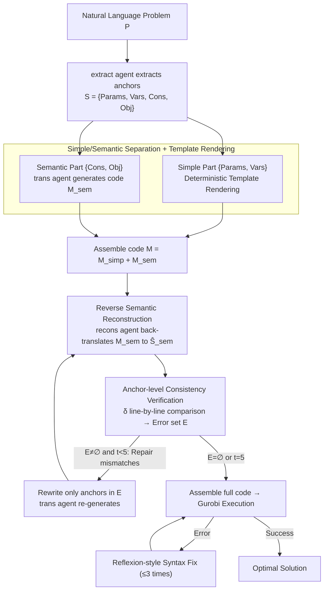

# SAC-Opt: Semantic Anchors for Iterative Correction in Optimization Modeling

**Conference**: ICML2026  
**arXiv**: [2510.05115](https://arxiv.org/abs/2510.05115)  
**Code**: https://github.com/Forrest-Stone/SAC-Opt  
**Area**: Code Intelligence / LLM Optimization Modeling / Self-consistency Correction  
**Keywords**: Optimization Modeling, Semantic Anchors, Back-correction, Solver Code Generation, LLM Agent

## TL;DR
SAC-Opt "back-translates" LLM-generated optimization solver code into structured semantic anchors (constraints and objectives) and compares them line-by-line with the original problem description. By iteratively rewriting only the inconsistent anchors until full alignment, it achieves an average improvement of 7.7% across seven public datasets, with a significant 21.9% boost on ComplexLP.

## Background & Motivation

**Background**: Utilizing LLMs to translate natural language descriptions of optimization problems (e.g., Linear Programming, Integer Programming) into executable Gurobi/CPLEX code is a primary path to lowering the barriers to entry for Operations Research. Representative works like CoE, CAFA, and the OptiMUS series follow a paradigm of "one-shot forward generation + post-processing based on solver error messages."

**Limitations of Prior Work**: Solvers can only check for syntax and feasibility; they **cannot detect semantic errors**. A constraint that should have been an upper bound ($\le$) might be written as a lower bound ($\ge$). The code will still execute and produce an "optimal solution," but this solution is irrelevant to the original problem. The authors refer to such failures as "silent semantic errors"—they do not throw exceptions, and traditional Reflexion-style "debug based on error messages" cannot capture them.

**Key Challenge**: There is an information gap between solver-driven feedback signals (execution errors, infeasibility) and the actual intent of whether the code faithfully represents the problem. Requiring a business-agnostic executor to validate business logic is inherently impossible.

**Goal**: (1) Proactively detect semantic errors in code without relying on solver feedback or additional training; (2) Enable fine-grained correction—avoiding full model regeneration by only modifying the erroneous constraint or objective; (3) Provide a convergent iterative process rather than infinite cycles of guessing.

**Key Insight**: The authors observe that if a problem description can be extracted by an LLM into a structured form $(\mathcal{P}, \mathcal{V}, \mathcal{C}, \mathcal{O})$ (parameters, variables, constraints, objectives), an agent can conversely "back-translate" generated code into structured anchors $\widehat{S}_{\mathrm{sem}}$ of the same format. Using a shared schema for these two sets of structured data allows for line-by-line alignment, diagnosis, and repair.

**Core Idea**: Use "semantic anchors" as a bidirectional bridge to construct a closed loop of "extract → translate → reconstruct → verify → re-translate," transforming code generation from an open-loop forward pipeline into a closed-loop semantic alignment process.

## Method

### Overall Architecture
SAC-Opt addresses implicit semantic errors where LLM-generated solver code executes successfully but fails to match the original problem. Instead of a unidirectional "description → code" flow, it implements a closed loop: extracting parameters, variables, constraints, and objectives as structured anchors $S=(\mathcal{P},\mathcal{V},\mathcal{C},\mathcal{O})$ from the natural language problem $P$. After generating code, an agent back-translates it into anchors $\widehat{S}_{\mathrm{sem}}$ following the same schema. These are compared line-by-line; mismatches are rewritten individually until alignment is achieved or the maximum iteration is reached.

The pipeline consists of six steps: (1) `extract` agent extracts $S$; (2) $S$ is split into simple parts $S_{\mathrm{simp}}=\{\mathcal{P},\mathcal{V}\}$ for deterministic template rendering and semantic parts $S_{\mathrm{sem}}=\{\mathcal{C},\mathcal{O}\}$ for `trans` agent generation, forming initial code $\mathcal{M}^{(0)}=\mathcal{M}_{\mathrm{simp}}+\mathcal{M}_{\mathrm{sem}}^{(0)}$; (3) `recons` agent back-translates $\mathcal{M}_{\mathrm{sem}}^{(t)}$ to $\widehat{S}_{\mathrm{sem}}^{(t)}$; (4) consistency function $\delta$ identifies error set $\mathcal{E}^{(t)}=\{s_i:\delta=0\}$ via line-by-line comparison; (5) rewrite only anchors in $\mathcal{E}^{(t)}$ and repeat; (6) assemble full code for Gurobi execution, applying Reflexion-style syntax fixes (up to 3 times) if execution fails. This decouples "semantic-level correction" (anchor-driven) from "syntax-level correction" (solver-driven).

### Key Designs

**1. Simple/Semantic Separation + Template Rendering: Focusing Compute on Constraints and Objectives**

Declarations of parameters and variables are essentially formatted outputs—code like `RollWidth = data["RollWidth"]` requires no linguistic understanding, and letting LLMs write them increases stochasticity. SAC-Opt splits anchors $S$ into two groups: the simple part $S_{\mathrm{simp}}=\{\mathcal{P},\mathcal{V}\}$ is handled by a deterministic template $f_{\mathrm{det}}^{\mathrm{trans}}$, while the semantic part $S_{\mathrm{sem}}=\{\mathcal{C},\mathcal{O}\}$ is processed by the `trans` agent. Since business logic and implicit errors reside in constraints and objectives, focusing verification on $\mathcal{M}_{\mathrm{sem}}$ reduces the state space from $O(|\mathcal{P}|+|\mathcal{V}|+|\mathcal{C}|+|\mathcal{O}|)$ to $O(|\mathcal{C}|+|\mathcal{O}|)$. This also prevents logic repairs from accidentally introducing errors in variable declarations.

**2. Reverse Semantic Reconstruction: Self-Diagnosis via Unsupervised Signals**

Traditional methods rely on solver errors, but executors only understand syntax; they cannot identify when the logic is wrong but the code is valid. SAC-Opt introduces a `recons` agent to translate generated solver code back into a structured description $\widehat{S}_{\mathrm{sem}}=f_{\mathrm{agent}}^{\mathrm{recons}}(\mathcal{M}_{\mathrm{sem}})$ using the original schema. If the implementation is incorrect (e.g., $\le$ written as $\ge$), the back-translated $\widehat{s}_i$ will not match the original anchor $s_i$. This creates a proxy supervision signal by identifying disparities between forward and backward expressions within the same LLM, without requiring ground truth solutions.

**3. Anchor-level Consistency Verification + Mismatch-only Iteration**

Using the two sets of anchors, the binary consistency function $\delta(s_i,\widehat{s}_i)\in\{0,1\}$ performs line-by-line equivalence checking. The authors provide two implementations: LLM-based (accurate but expensive) and Similarity-based (using SentenceTransformer cosine similarity with threshold $\tau=0.75$). For each round, the error set $\mathcal{E}^{(t)}$ is calculated, and only those anchors are rewritten: $\mathcal{M}_{\mathrm{sem}}^{(t+1)}[s_i]\leftarrow f_{\mathrm{agent}}^{\mathrm{trans}}(s_i)$. This fine-grained increment avoids the "regression" problem common in full-text self-refinement where fixing one part breaks another. Convergence is guaranteed by the bounded nature of the error set and a maximum of $T_{\max}=5$ rounds.

### Loss & Training
**Training-free**. The framework requires no training or supervision. The four agents (extract, trans, recons, verif) are role-played calls to the same backbone LLM (defaulting to GPT-4o). Key hyperparameters include $T_{\max} = 5$ (semantic correction rounds), debug rounds $= 3$ (syntax retries), and similarity threshold $\tau = 0.75$. This demonstrates that gains are derived from the mechanism rather than model-specific fine-tuning.

## Key Experimental Results

### Main Results

Backbone = GPT-4o, Verifier = LLM-based, average of 5 runs across 7 datasets:

| Dataset | SAC-Opt | Second Place (OptiMUS-0.3) | Gain |
|---------|---------|-------------------------|------|
| NL4OPT | 86.8% | 79.8% | +7.0% |
| IndustryOR | 63.8% | 54.3% | +9.5% |
| EasyLP | 96.5% | 92.4% (CoE 94.4%) | +2.1% |
| ComplexLP | **79.6%** | 52.1% | **+21.9%** |
| NLP4LP | 94.0% | 89.8% | +4.2% |
| ReSocratic | 88.7% | 81.0% | +7.7% |
| ComplexOR | 58.9% | 57.1% (CoE) | +1.8% |
| **Average** | — | — | **+7.7%** |

The more complex the dataset (ComplexLP, IndustryOR, ReSocratic), the larger the improvement, validating that the method specifically addresses "silent semantic errors" prevalent in complex scenarios.

### Ablation Study

| Configuration | NL4OPT | IndustryOR | ComplexLP | NLP4LP | Description |
|---------------|--------|------------|-----------|--------|-------------|
| SAC-Opt | 86.8% | 63.8% | 79.6% | 94.0% | Full Model |
| w/o correction | 82.9% | 50.5% | 63.8% | 90.1% | Remove semantic anchor correction |
| w/o debugging | 84.6% | 60.5% | 72.3% | 92.8% | Remove solver error-based repair |

**Ours without correction drops significantly more than without debugging** (e.g., 15.8% vs 7.3% on ComplexLP), proving that semantic correction is the primary performance driver while traditional debugging is secondary.

### Key Findings
- **Semantic Correction >> Syntax Repair**: Removing semantic correction leads to a larger performance drop than removing debugging, confirming that solver-driven paradigms ignore a major source of errors.
- **Robustness Across LLMs**: When using Qwen2.5-72B-Instruct, SAC-Opt still consistently improves performance by 4-9% over the "no correction" baseline, showing the gain is structural.
- **Deeper Gains in Complexity**: Improvements amplify as problem complexity increases, as implicit semantic errors are more common in complex contexts.
- **Lightweight Verifier Viability**: Similarity-based verification (using all-MiniLM-L6-v2) achieved 65.3% on ComplexLP, outperforming most baselines and proving the robustness of the "reconstruct and align" architecture.

## Highlights & Insights
- **Back-translation as a Self-supervision Signal**: The essence is using the disparity between forward and backward expressions as a proxy for ground truth. This pattern is applicable to any "NL → structured executor" task (SQL, API calls, tool use) by having an agent describe the executor back to the semantic layer.
- **Fine-grained Incremental Correction**: By locking the correction scope to individual anchors, SAC-Opt avoids the "global regression" seen in self-refinement where fixing one error ruins another part of the code.
- **Convergent Iteration**: Unlike many heuristic LLM loops, SAC-Opt uses a discrete, observable, and monotonically decreasing condition ($\mathcal{E}^{(t)} = \emptyset$), ensuring the process is terminable.

## Limitations & Future Work
- **Dependency on Agent Quality**: If the `extract` agent fails to capture a constraint from the original problem, the whole process verifies against a flawed baseline.
- **Lack of Manual Anchor Calibration**: The correlation between LLM and Similarity verifiers shows dataset-level agreement, but not necessarily human-level precision on individual anchors.
- **Computational Cost**: More LLM calls are required per problem due to $T_{\max} = 5$, increasing runtime to 40-90 seconds per task.
- **Scope Limitation**: Evaluation is limited to LP/MILP problems. Non-linear or complex combinatorial optimization might introduce more back-translation ambiguity.

## Related Work & Insights
- **vs OptiMUS-0.3**: While OptiMUS corrects parameter/variable extraction, it relies on solver errors for code fix. SAC-Opt pushes correction to the code semantic layer, significantly outperforming it.
- **vs Reflexion**: SAC-Opt addresses the blind spot of Reflexion-style paradigms—silent semantic errors—while remaining compatible with them for syntax debugging.
- **vs CoE**: CoE uses multi-agent collaboration but remains a forward-only generation pipeline. SAC-Opt introduces "accountability" through back-translation alignment.

## Rating
- Novelty: ⭐⭐⭐⭐ (First explicit use of back-translation for semantic anchors in this domain)
- Experimental Thoroughness: ⭐⭐⭐⭐ (Comprehensive datasets and ablation across models/verifiers)
- Writing Quality: ⭐⭐⭐⭐ (Clear logic, precise notation, and well-justified motivation)
- Value: ⭐⭐⭐⭐ (High engineering utility for NL-to-DSL tasks without training)

<!-- RELATED:START -->

## Related Papers

- [\[ICML 2026\] Differential Syntactic and Semantic Encoding in LLMs](differential_syntactic_and_semantic_encoding_in_llms.md)
- [\[ACL 2026\] Iterative Formalization and Planning in Partially Observable Environments](../../ACL2026/llm_nlp/iterative_formalization_and_planning_in_partially_observable_environments.md)
- [\[ICML 2026\] Express Your Doubts: Probabilistic World Modeling Should Not Be Based on Token logprobs](express_your_doubts_--_probabilistic_world_modeling_should_not_be_based_on_token.md)
- [\[ACL 2025\] Quantifying Semantic Emergence in Language Models](../../ACL2025/llm_nlp/quantifying_semantic_emergence_in_language_models.md)
- [\[AAAI 2026\] VSPO: Validating Semantic Pitfalls in Ontology via LLM-Based CQ Generation](../../AAAI2026/llm_nlp/vspo_validating_semantic_pitfalls_in_ontology_via_llm-based_cq_generation.md)

<!-- RELATED:END -->
