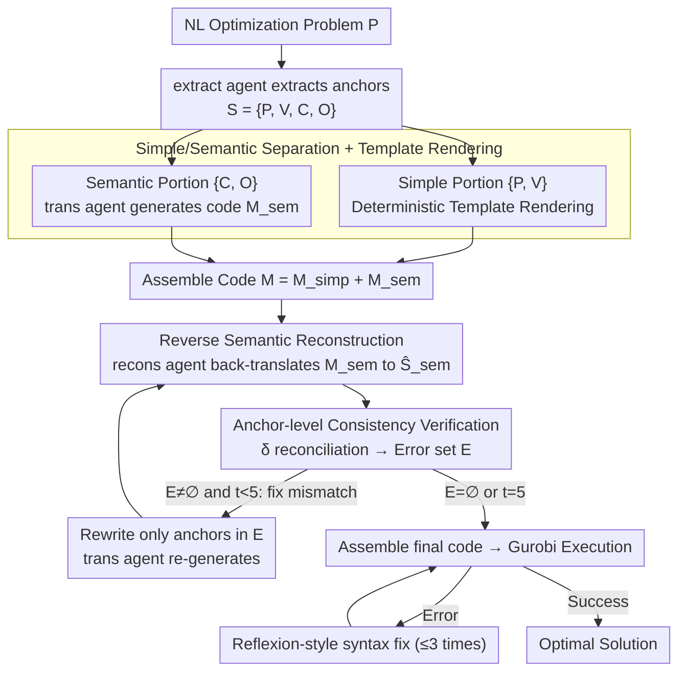

# SAC-Opt: Semantic Anchors for Iterative Correction in Optimization Modeling

**Conference**: ICML2026  
**arXiv**: [2510.05115](https://arxiv.org/abs/2510.05115)  
**Code**: https://github.com/Forrest-Stone/SAC-Opt  
**Area**: Code Intelligence / LLM Optimization Modeling / Self-consistent Correction  
**Keywords**: Optimization Modeling, Semantic Anchors, Back-correction, Solver Code Generation, LLM Agent

## TL;DR
SAC-Opt "back-translates" LLM-generated optimization solver code into structured semantic anchors (constraints and objectives), compares them item-by-item with the original problem description's anchors, and iteratively rewrites only the inconsistent parts. It achieves an average performance gain of 7.7% across 7 public datasets and 21.9% on ComplexLP.

## Background & Motivation

**Background**: Using LLMs to translate natural language optimization problems (Linear Programming, Integer Programming, etc.) into executable Gurobi/CPLEX code is a mainstream path to lowering the barrier for Operations Research. Representative works include CoE, CAFA, and the OptiMUS series, which generally follow a "one-time forward generation + post-processing based on solver error messages" pipeline.

**Limitations of Prior Work**: Solvers can only check syntax and feasibility but **cannot detect semantic errors**. For example, if an upper bound constraint ($\le$) is incorrectly written as a lower bound ($\ge$), the code runs and solves an "optimal solution" that is entirely unrelated to the original problem. The paper refers to such failures as "silent semantic errors"—they throw no exceptions, making traditional Reflexion-style "fix code based on error messages" approaches completely ineffective.

**Key Challenge**: There is an information gap between solver-driven feedback (execution errors, infeasibility) and the actual goal of "faithful representation of problem intent." Expecting a business-agnostic execution engine to verify business logic is inherently impossible.

**Goal**: (1) Proactively detect semantic errors in code without relying on solver feedback or additional training; (2) Enable fine-grained correction—rewriting only the erroneous constraint/objective instead of regenerating the entire model; (3) Provide a convergent iterative process rather than infinite guessing.

**Key Insight**: The authors observe that since problem descriptions can be extracted into structured anchors $(\mathcal{P}, \mathcal{V}, \mathcal{C}, \mathcal{O})$ (Parameters, Variables, Constraints, Objectives), an agent can also "back-translate" generated code into the same structured format $\widehat{S}_{\mathrm{sem}}$. Using the same schema for both sets of data allows for itemized alignment, diagnosis, and correction.

**Core Idea**: Use "semantic anchors" as a bidirectional bridge to construct an "extract → translate → reconstruct → verify → re-translate" back-loop, transforming code generation from an open-loop forward pipeline into a closed-loop semantic alignment process.

## Method

### Overall Architecture
SAC-Opt addresses implicit semantic errors where the code is executable but fails to match the original problem. Instead of a unidirectional "description-to-code" process, it implements a closed loop: it first extracts the natural language problem $P$ into structured anchors $S=(\mathcal{P},\mathcal{V},\mathcal{C},\mathcal{O})$ (parameters/variables/constraints/objectives). After code generation, an agent "back-translates" the code into semantic anchors $\widehat{S}_{\mathrm{sem}}$ under the same schema. Both sets are reconciled; mismatched items are rewritten until fully aligned. Finally, the code is passed to Gurobi; any syntax errors are handled via a Reflexion-style process (up to 3 times). The pipeline decouples "semantic-level correction" (driven by structural anchors) from "syntax-level correction" (driven by solver errors).

### Key Designs

**1. Simple/Semantic Separation + Templated Rendering: Concentrating Correction Budget on Constraints and Objectives**

The declaration of parameters and variables is essentially formatted output—code like `RollWidth = data["RollWidth"]` requires no language understanding. Entrusting LLMs with this task often increases unnecessary randomness. SAC-Opt splits anchors $S$ into two parts: the simple part $S_{\mathrm{simp}}=\{\mathcal{P},\mathcal{V}\}$ is rendered directly via deterministic templates $f_{\mathrm{det}}^{\mathrm{trans}}$, while only the semantic part $S_{\mathrm{sem}}=\{\mathcal{C},\mathcal{O}\}$ is handled by the `trans` agent. Since business logic and implicit errors reside solely in constraints and objectives, this separation reduces the state space from $O(|\mathcal{P}|+|\mathcal{V}|+|\mathcal{C}|+|\mathcal{O}|)$ to $O(|\mathcal{C}|+|\mathcal{O}|)$. It also prevents "cross-contamination" where fixing a constraint might inadvertently break a variable declaration.

**2. Reverse Semantic Reconstruction: Generating an Unsupervised Signal by Forcing the Model to Describe Its "Diagnosis"**

Traditional methods rely on solver errors as feedback, but execution engines only understand syntax and feasibility. SAC-Opt introduces an independent `recons` agent that translates the generated solver code back into a structured description $\widehat{S}_{\mathrm{sem}}=f_{\mathrm{agent}}^{\mathrm{recons}}(\mathcal{M}_{\mathrm{sem}})$ using the same schema as the original anchors. This forces the "code reader" to restate what the code actually does in the original language of the problem. If the implementation is wrong (e.g., an upper bound written as a lower bound), the back-translation $\widehat{s}_i$ will naturally mismatch the original anchor $s_i$. This step creates a proxy supervision signal by comparing the bidirectional expressions of the same LLM without requiring ground-truth solutions.

**3. Anchor-level Consistency Verification + Mismatch-only Iteration**

With two sets of anchors, a binary consistency function $\delta(s_i,\widehat{s}_i)\in\{0,1\}$ is used for itemized comparison. Two implementations are provided: LLM-based (accurate but expensive) and Similarity-based (using SentenceTransformer with a threshold $\tau=0.75$). In each round, the error set $\mathcal{E}^{(t)}$ is calculated, and **only the anchors in $\mathcal{E}^{(t)}$** undergo rewriting: $\mathcal{M}_{\mathrm{sem}}^{(t+1)}[s_i]\leftarrow f_{\mathrm{agent}}^{\mathrm{trans}}(s_i)$. This fine-grained incremental approach avoids the "global regression" issue of full self-refine, where fixing one error may introduce another. Convergence is guaranteed by the monotonic decrease of $|\mathcal{E}^{(t)}|$; the loop terminates when $\mathcal{E}=\emptyset$ or $T_{\max}=5$ is reached.

### Loss & Training
**None**. The framework is entirely training-free and supervision-free. The four agents (extract / trans / recons / verif) are role-based calls to the same backbone LLM (GPT-4o by default). Key hyperparameters include $T_{\max} = 5$ (semantic correction rounds), debug rounds $= 3$ (solver error retry limit), and similarity threshold $\tau = 0.75$. This "zero-training" approach allows easy deployment with open-source models like Qwen2.5-72B-Instruct.

## Key Experimental Results

### Main Results

Backbone = GPT-4o, Verifier = LLM-based, average of 5 runs:

| Dataset | SAC-Opt | 2nd Place (OptiMUS-0.3) | Gain |
|--------|---------|----------------------|------|
| NL4OPT | 86.8% | 79.8% | +7.0% |
| IndustryOR | 63.8% | 54.3% | +9.5% |
| EasyLP | 96.5% | 92.4% (CoE 94.4%) | +2.1% |
| ComplexLP | **79.6%** | 52.1% | **+21.9%** |
| NLP4LP | 94.0% | 89.8% | +4.2% |
| ReSocratic | 88.7% | 81.0% | +7.7% |
| ComplexOR | 58.9% | 57.1% (CoE) | +1.8% |
| **Average** | — | — | **+7.7%** |

The more complex the dataset (e.g., ComplexLP, IndustryOR), the larger the improvement, indicating that back-verification effectively captures implicit semantic errors that solver-driven methods miss.

### Ablation Study

| Config | NL4OPT | IndustryOR | ComplexLP | NLP4LP | Description |
|------|--------|------------|-----------|--------|------|
| SAC-Opt | 86.8% | 63.8% | 79.6% | 94.0% | Full Model |
| w/o correction | 82.9% | 50.5% | 63.8% | 90.1% | Without semantic anchor correction |
| w/o debugging | 84.6% | 60.5% | 72.3% | 92.8% | Without solver error debugging |

**The performance drop from "w/o correction" is significantly sharper than "w/o debugging"** (e.g., -15.8% vs -7.3% on ComplexLP). This proves that semantic correction is the primary performance driver, while traditional error debugging serves an auxiliary role.

### Key Findings
- **Semantic Correction >> Syntax Correction**: Removing semantic correction leads to a 15.8% drop on ComplexLP, while removing debugging only leads to 7.3%, proving that the solver-driven paradigm misses the main source of errors.
- **Robust Across LLMs**: When switched to Qwen2.5-72B-Instruct, SAC-Opt consistently improves over "w/o correction" by 4-9%, indicating the mechanism's generalizability beyond GPT-4o.
- **Difficulty Multiplier**: Improvements are modest on simple datasets (2-7%) but amplify significantly on complex ones (+21.9% on ComplexLP), where implicit semantic errors are more prevalent.
- **Lightweight Verifiers are Viable**: A similarity-based verifier using `all-MiniLM-L6-v2` still achieves 65.3% on ComplexLP, outperforming most baselines and proving that the "reconstruct and align" architecture is robust even with lower verifier precision.

## Highlights & Insights
- **"Back-translation" as a Self-supervision Signal**: The essence is using the same LLM's representational differences in two directions as a proxy for ground truth. It requires neither labels nor solver feedback; as long as the forward and backward descriptions mismatch, an error exists. This pattern is applicable to any "NL → Structured Execution" task (SQL, API calls, tool use, task planning).
- **Fine-grained Incremental Correction**: Standard self-refine often suffers from global regression where fixing one part breaks another. SAC-Opt's schema-isomorphic approach locks the correction scope to individual anchors, a highly effective engineering design for LLM self-correction systems.
- **Guaranteed Convergence**: Unlike many heuristic iterative frameworks, SAC-Opt's convergence condition $\mathcal{E}^{(t)} = \emptyset$ is discrete and observable. Even with an imperfect verifier, the error set size remains bounded.
- **Underestimated Simple/Semantic Separation**: Using deterministic templates for $\mathcal{P}, \mathcal{V}$ simplifies the state space significantly, improving both efficiency and stability by preventing basic declaration errors during semantic correction cycles.

## Limitations & Future Work
- **Dependency on Agent Quality**: The system assumes the `extract` and `recons` agents are reliable. If the `extract` agent misinterprets the original problem, the entire process verifies against an incorrect baseline.
- **Lack of Manual Anchor-level Validation**: The high correlation (0.962) between LLM and Similarity-based verifiers is at the dataset level, not manual anchor-level calibration. If a verifier incorrectly labels a wrong implementation as correct, the loop breaks prematurely.
- **Computational Cost**: Each iteration requires `recons` and `verif` calls, taking an average of 40-90 seconds per problem—roughly 1-2 orders of magnitude more expensive than a single forward pass.
- **Restricted to Linear/Integer Programming**: The framework has not been verified on non-linear or combinatorial optimization problems where semantic ambiguity might be higher.
- **Future Directions**: (1) Human-in-the-loop calibration for verifiers; (2) Adding a back-verification layer to the extraction phase; (3) Distilling small models for the `recons` agent; (4) Extending to other formalization tasks like SAT or Constraint Programming.

## Related Work & Insights
- **Comparison with OptiMUS-0.3**: While OptiMUS performs correction during the extraction of parameters/variables, it still relies on solver errors for code-level fixes. SAC-Opt pushes correction to the code semantic level, significantly outperforming OptiMUS on ComplexLP (79.6% vs 52.1%).
- **Comparison with Reflexion**: Reflexion is a classic solver-driven paradigm. SAC-Opt highlights its weakness: solver feedback only covers explicit execution failures. The two are complementary, as SAC-Opt includes a Reflexion-style debugging step for syntax errors.
- **Comparison with CoE**: CoE focuses on multi-agent task decomposition but remains a forward generation process. SAC-Opt focuses on the "accounting" loop behind this delegation.
- **Broad Impact**: The "Forward generation → Back reconstruction → Element alignment → Selective correction" template is a general-purpose architecture for any NL-to-DSL/code task, providing a training-free means of self-correction.

## Rating
- Novelty: ⭐⭐⭐⭐ (First to explicitly use reverse semantic reconstruction for self-correction in this track)
- Experimental Thoroughness: ⭐⭐⭐⭐ (Extensive datasets, ablation, cross-LLM tests, and case studies)
- Writing Quality: ⭐⭐⭐⭐ (Clear algorithms and logic; effective framing of "silent semantic errors")
- Value: ⭐⭐⭐⭐ (Transferable architecture for NL-to-Formalization tasks with immediate utility)

<!-- RELATED:START -->

## Related Papers

- [\[ICML 2026\] Differential Syntactic and Semantic Encoding in LLMs](differential_syntactic_and_semantic_encoding_in_llms.md)
- [\[ACL 2026\] Iterative Formalization and Planning in Partially Observable Environments](../../ACL2026/llm_nlp/iterative_formalization_and_planning_in_partially_observable_environments.md)
- [\[ICML 2026\] Express Your Doubts: Probabilistic World Modeling Should Not Be Based on Token logprobs](express_your_doubts_--_probabilistic_world_modeling_should_not_be_based_on_token.md)
- [\[AAAI 2026\] Rectification Reimagined: A Unified Mamba Model for Image Correction and Rectangling with Prompts](../../AAAI2026/llm_nlp/rectification_reimagined_a_unified_mamba_model_for_image_cor.md)
- [\[ACL 2025\] Quantifying Semantic Emergence in Language Models](../../ACL2025/llm_nlp/quantifying_semantic_emergence_in_language_models.md)

<!-- RELATED:END -->
