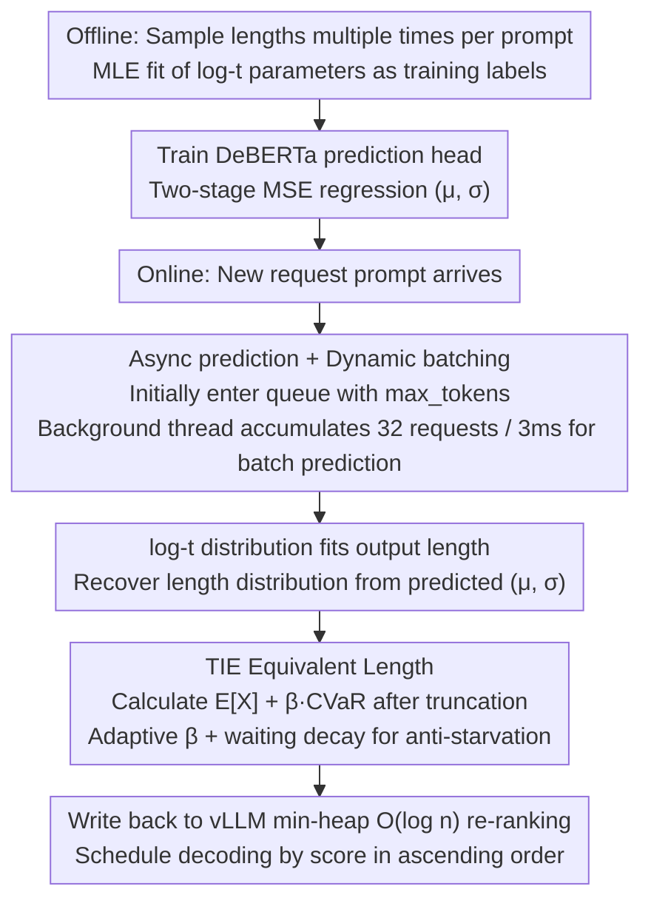

# Scheduling LLM Inference with Uncertainty-Aware Output Length Predictions

**Conference**: ICML 2026  
**arXiv**: [2604.00499](https://arxiv.org/abs/2604.00499)  
**Code**: https://github.com/Hyzheng-code/TIE  
**Area**: LLM Efficiency / Inference Scheduling  
**Keywords**: SJF Scheduling, Output Length Prediction, Heavy-tailed Distribution, log-t Distribution, CVaR

## TL;DR
This paper replaces the point estimation of "predicting a single output length" in LLM inference scheduling with log-t distribution fitting. It substitutes the output length in SJF with Tail Inflated Expectation (TIE), which incorporates a CVaR tail penalty. On LMSYS-Chat-1M, it reduces online per-token latency by $2.31\times$ compared to the strongest baseline LTR and improves offline SDG throughput by $1.42\times$.

## Background & Motivation

**Background**: LLM serving systems like vLLM default to FCFS scheduling, where long requests can block short ones (HOL blocking). A major class of improvements follows the SJF approach: using a lightweight predictor (SSJF / LTR / TRAIL / ELIS) to predict the output length for each prompt and then queuing them from shortest to longest.

**Limitations of Prior Work**: Prediction errors are substantial. Chen et al. (2025b) reported significant errors in output length prediction. To counteract these errors, methods like TRAIL / ELIS perform repeated predictions and preemptions during generation (at every token or every 50 tokens), but the overhead of prediction and preemption itself consumes a large portion of the scheduling gains.

**Key Challenge**: The authors argue that these methods overlook a fundamental issue—LLM decoding is inherently a stochastic process. Since each step samples a token from a probability distribution, the occurrence of the EOS token is a random variable. Running the same prompt 100 times will result in 100 different lengths. **Using a point estimate to describe a distribution inevitably leads to major errors in the tail**: when an inherently long request is mispredicted as short, it blocks the entire batch. This is exacerbated by the fact that LLM output lengths naturally follow heavy-tailed distributions (where the top 10% longest requests account for 35.7% of total length, and the P99/P50 ratio can reach 10.77).

**Goal**: (1) Identify a suitable probability distribution family for output lengths rather than using point estimates; (2) Convert distribution information into a scalar priority directly usable by SJF schedulers; (3) Implement this on vLLM with low overhead.

**Key Insight**: Starting from the LLM decoding process, the authors prove that output lengths follow a heavy-tailed distribution with power-law tails. They identify log-t (3 parameters) as the best fit from candidate distribution families (passing the KS test with a 93.1% rate).

**Core Idea**: Use log-t distributions to fit the output length of each request and utilize $\mathbb{E}[X] + \beta \cdot \mathrm{CVaR}_\alpha[X]$ as the "equivalent length" for SJF. This allows the scheduler to explicitly penalize requests with high tail risk during sorting.

## Method

### Overall Architecture
The method replaces "predicting a single length number" with "predicting a length distribution and then calculating a risk-sensitive priority," running on vLLM. Off-line, MLE is used to fit log-t distribution parameters for each prompt as training labels. Online, a fine-tuned DeBERTa-v3-base predicts distribution parameters directly from the prompt. The TIE scheduler converts this distribution into a scalar priority fed into vLLM's min-priority queue, hiding prediction overhead outside the main loop via asynchronous prediction.

### Key Designs

**1. log-t Distribution Fitting: Replacing Point Estimates with Distributions**

A fatal flaw of all SJF-type methods is compressing the fact that "running the same prompt 100 times yields 100 different lengths" into a single number. If an inherently long request is mispredicted as short, it stalls the batch. This paper first justifies the necessity of heavy-tailed distributions from first principles: Assumption 3.1 + Theorem 3.2 prove that if the density of the termination probability $p$ of different generation trajectories near 0 satisfies $f(p)\sim c\cdot p^{\alpha-1}$, then the tail probability of the output length $L=\min\{t\ge 1: x_t=\text{EOS}\}$ satisfies $P(L>n)\sim c\cdot\Gamma(\alpha)/n^\alpha$, representing power-law decay—a sufficient condition for heavy tails. Empirically, they sampled 100 responses for each of 1K prompts from LMSYS-Chat-1M, finding an average skewness of 3.10 and a coefficient of variation of 1.09, confirming the heavy-tailed nature.

Specifically, the output length of each request is modeled as a 3-parameter distribution $X \sim \text{Log-t}(\mu,\sigma,\nu)$, with PDF $f(x\mid\mu,\sigma,\nu) = \frac{1}{\sigma x}\cdot t_\nu\left(\frac{\ln x-\mu}{\sigma}\right)$, where $\nu$ controls tail thickness. This distribution family was chosen from 6 candidates via KS tests: log-t (3-parameter) had a 93.1% pass rate, the 2-parameter version (fixed $\nu=3.5$) had 90.6%, while log-normal was only 60.3%. Ultimately, log-t ($\nu=3.5$) was selected—fixing $\nu$ saves one parameter to predict without significant loss in fitting quality. This step directly resolves the fundamental conflict between point estimation and stochastic decoding, as length variance is precisely the critical signal for determining scheduling risk, which point estimation ignores.

**2. TIE: Compressing Distributions into Tail-Sensitive Equivalent Lengths using CVaR**

Once the distribution is obtained, it must be converted into a scalar for SJF queue sorting. The most direct approach is taking the expectation $\mathbb{E}[X]$, which is equivalent to the classic SEPT strategy (achieving 0.75s average latency in ablation). SEPT only considers the mean and lacks caution toward requests with moderate means but a 10% probability of being extremely long. TIE first truncates the predicted distribution at `max_tokens` as $\tilde X = \min(X, x_{\max})$, then defines the priority score as the expectation plus a tail penalty: $\text{Score} = \mathbb{E}[\tilde X] + \beta\cdot\mathrm{CVaR}_\alpha[\tilde X]$. Here, $\mathrm{CVaR}_\alpha[X] = \mathbb{E}[X\mid X\ge \text{VaR}_\alpha(X)]$ is the conditional expectation of the distribution tail beyond $(1-\alpha)$. When $\alpha=0.9$, it represents the "average length under the worst 10% of cases"—reflecting the cost of extremely long requests better than the single-point quantile P90. Adding this term reduces latency from 0.75s to 0.67s.

The penalty strength $\beta$ adapts to system pressure: $\beta = \min(0.5, \max(0.1, 0.1\cdot L_q/B))$, where $L_q$ is the waiting queue length and $B$ is the maximum batch size. Under low load, the blocking cost of long requests is small, so the scheduler greedily selects short ones (small $\beta$); under high load, the blocking cost is high, so it conservatively penalizes tail risk (large $\beta$). Both expectations are estimated using 10k Monte Carlo samples rather than numerical integration. Finally, a waiting decay layer is added: $\text{Score}' = \text{Score}\cdot\gamma^{t_w/\tau}$ ($\gamma=0.9, \tau=30s$), ensuring that long requests waiting for extended periods gradually receive smaller scores to avoid starvation.

**3. Async Prediction + Dynamic Batching: Hiding Prediction Overhead**

The predictor requires a DeBERTa pass, incurring GPU overhead. Previous methods like SSJF / LTR used synchronous prediction—entering the queue only after prediction—resulting in unnecessary blocking under low loads and throughput bottlenecks under high loads. TIE splits the scheduler into a main thread (managing vLLM's running batch) and a background prediction thread. When a new request arrives, it is immediately inserted into the min-heap waiting queue with `max_tokens` as an initial score (letting unpredicted requests naturally sink while predicted ones run) and simultaneously placed in a prediction queue. The prediction thread performs batch inference every 32 requests or 3ms. Once results return, scores in the heap are updated and re-heapified, with a single operation complexity of only $O(\log n)$. Thus, under low loads, new requests "start running first and correct their order later," while under high loads, the predictor clears the queue with high throughput.

### Loss & Training
The predictor normalizes $\mu$ with z-score and $\sigma$ after a $\tilde\sigma = \log(1+\sigma)$ correction for right-skewness. It uses two 3-layer MLP heads (256, 256, 128) and two-stage MSE training (full parameter tuning first, then freezing DeBERTa to tune only the MLPs). The training data utilizes the first 45K prompts from LMSYS-Chat-1M with 20 generations each (900K samples total, aligned with SSJF/LTR training volume), resulting in $R^2$ values of 0.82 for $\mu$ and 0.76 for $\sigma$.

## Key Experimental Results

### Main Results
Average per-token latency (PTLA) for an 8B model on LMSYS-Chat-1M online chatbot service at 100 RPS:

| Scheduling Strategy | LMSYS PTLA (s/token) ↓ | Relative FCFS Speedup | Relative LTR Speedup |
|----------|------|------|------|
| FCFS (vLLM Default) | 3.17 (estimated) | 1.00× | — |
| SSJF | 1.95 (estimated) | 1.62× | — |
| LTR | 1.55 (estimated) | 2.05× | — |
| **TIE (Ours)** | **0.67** | **4.73×** | **2.31×** |

Cross-dataset generalization for a 70B model (training done only on LMSYS-Chat-1M 8B):

| Test Data | Model | Metric | FCFS | SSJF | LTR | **TIE** |
|----------|------|------|------|------|-----|---------|
| LMSYS-Chat-1M | 70B | Avg PTLA | 9.08 | 5.50 | 4.34 | **2.41** |
| ShareGPT | 70B | Avg PTLA | 4.36 | 2.43 | 2.22 | **1.41** |
| Alpaca | 70B | Avg PTLA | 4.52 | 2.06 | 2.36 | **1.54** |
| LMSYS-Chat-1M | 70B | P90 PTLA | 16.13 | 8.24 | 7.03 | **4.05** |

Offline SDG (Alpaca + 8B): time@3K reduced from 139.5s (LTR) to **98.1s** ($1.42\times$), with 3-minute throughput increasing from 3672 → **4762** samples.

### Ablation Study
LMSYS-Chat-1M + 8B online service, PTLA / 3K time:

| Configuration | Avg PTLA (s) | P90 PTLA (s) | Time@3K (s) | Description |
|------|------|------|------|------|
| **TIE Full** (log-t, $\nu$=3.5, $\mathbb{E}+\beta\cdot\text{CVaR}$) | **0.67** | **0.96** | **98.12** | Default configuration |
| log-t (dynamic $\nu$) | 0.69 | 1.02 | 97.70 | Minimal gain from extra param, worse efficiency |
| log-normal replaces log-t | 1.63 | 3.37 | 142.21 | Poor fit (60% vs 90% KS) degrades performance |
| $\mathbb{E}[X]$ only (SEPT) | 0.75 | 1.21 | 108.51 | No CVaR tail penalty |
| $\mathbb{E}+0.1\cdot\text{CVaR}$ (fixed) | 0.72 | 1.15 | 104.76 | Fixed $\beta$ inferior to adaptive |

### Key Findings
- **Distribution family selection determines the performance ceiling**: The KS pass rate drop from 90.6% to 60.3% for log-normal caused PTLA to jump from 0.67s to 1.63s, indicating distribution fitting quality is the bottleneck of this technical route.
- **CVaR is superior to simple expectation**: Removing CVaR (degrading to SEPT) increased average PTLA from 0.67 to 0.75 (+12%) and P90 from 0.96 to 1.21 (+26%); tail penalties are crucial for P90 metrics.
- **Strong cross-model and cross-dataset generalization**: Despite training only on 8B + LMSYS, the predictor remained first on 70B + ShareGPT/Alpaca. This is attributed to distribution modeling avoiding overfitting to specific workloads.
- **Better RPS robustness**: As RPS increased from 30 to 100, the PTLA of FCFS/SSJF/LTR worsened by $7.42\times / 8.55\times / 6.17\times$, while TIE only worsened by $3.68\times$. Adaptive $\beta$ becoming more conservative under high pressure was key.
- **Visualization Insights** (Figure 5): In (output length, completion time) heatmaps, SSJF/LTR cluster short requests but scatter long ones. TIE maintains high density even in long-tail areas, indicating more accurate ranking for requests with high length variance.

## Highlights & Insights
- **Reformulating scheduling as "distribution prediction + risk-sensitive ranking"**: This paradigm (log-t + CVaR) relies contextually little on specific LLM features and can be applied to any scheduling scenario where task execution time is naturally stochastic (e.g., GPU kernel launches, query optimizers, ML training queues).
- **Elegant theoretical bridge to power-law tails**: Theorem 3.2 strictly links "the distribution of termination probabilities across trajectories" with the "power-law tail of output lengths," providing first-principles support for using heavy-tailed distributions rather than empirical heuristics.
- **CVaR is better suited for scheduling risk than P90**: The authors compare CVaR with the single quantile P90, noting that P90 is just a point while CVaR is the "conditional expectation beyond P90," making it more sensitive to extreme events—a transferable observation for any system using P90/P99 for SLAs.
- **Async prediction + dynamic batching is an underrated engineering highlight**: Many predictive scheduling papers feature elegant methods that are impractical. The 3ms batching + min-heap deferred update design hides prediction overhead from the main path with $O(\log n)$ complexity.

## Limitations & Future Work
- **High retraining cost**: DeBERTa fine-tuning requires 900K samples. While the 8B-trained predictor works for 70B, retraining is likely needed for optimal performance on newly released models.
- **log-t($\nu=3.5$) is average-optimal but not globally optimal**: Fixing $\nu$ sacrifices some fitting quality. Ablations show dynamic $\nu$ offers similar performance but adds a third parameter; the authors prioritize efficiency, though further tuning might be warranted for latency-sensitive batch services.
- **Dependence on vLLM continuous batching**: There is no discussion on whether this can be reused on non-PagedAttention stacks (e.g., TensorRT-LLM) where KV cache preemption costs differ, potentially requiring re-calibration of $\beta$.
- **Lack of multi-turn/streaming support**: Experiments assume full prompt submission at once. Real chatbots accumulate context across multi-turn dialogues, requiring re-prediction as distributions might shift over history.

## Related Work & Insights
- **vs SSJF (Qiu et al., 2024)**: SSJF uses BERT-like models to directly regress a length value. Ours uses the same but regresses 2 parameters of the log-t distribution, providing explicit uncertainty characterization.
- **vs LTR (Fu et al., 2024)**: LTR transforms prediction into a ranking task (learning-to-rank). Ours proves regression is sufficient if the target is a distribution, significantly outperforming LTR across all datasets.
- **vs TRAIL / ELIS (Iterative prediction + Preemption)**: These methods combat errors through frequent re-prediction (every 1-50 tokens) and preemption, incurring high overhead. Ours demonstrates that **one-time prediction without preemption** is sufficient if the distribution is correctly captured, resulting in a simpler engineering implementation.
- **vs Classic SEPT (Weber, 1983)**: SEPT is the optimal strategy for minimizing expected completion time given known distributions without truncation. Ours degrades to SEPT at $\beta=0$; the CVaR term adds "tail risk aversion" to SEPT, analogous to mean-CVaR optimization in finance.

## Rating
- Novelty: ⭐⭐⭐⭐⭐ Transforming LLM serving into "distribution prediction + CVaR scheduling" is a clear paradigm shift, supported by complete theory and experiments.
- Experimental Thoroughness: ⭐⭐⭐⭐⭐ Includes 3 datasets × 2 models + online/offline scenarios + 6 distribution family comparisons + RPS 30→100 robustness + heatmap visualization.
- Writing Quality: ⭐⭐⭐⭐ Logical and progressive; Theorem 3.2 provides a solid theoretical bridge, though some formulas (e.g., $\Psi$ after truncation) require the appendix for full understanding.
- Value: ⭐⭐⭐⭐⭐ Implemented directly on vLLM, open-source, non-intrusive. Industry serving teams can integrate this at low cost for $2\times$ improvements in latency/throughput.

<!-- RELATED:START -->

## Related Papers

- [\[ACL 2025\] Revisiting Uncertainty Quantification Evaluation in Language Models: Spurious Interactions with Response Length Bias Results](../../ACL2025/llm_nlp/revisiting_uncertainty_quantification_evaluation_in_language_models_spurious_int.md)
- [\[ICML 2026\] A Geometric Relation of the Error Introduced by Sampling a Language Model's Output Distribution to its Internal State](a_geometric_relation_of_the_error_introduced_by_sampling_a_language_models_outpu.md)
- [\[ICML 2026\] SLAY: Geometry-Aware Spherical Linearized Attention with Yat-Kernel](slay_geometry-aware_spherical_linearized_attention_with_yat-kernel.md)
- [\[ACL 2025\] LLM Braces: Straightening Out LLM Predictions with Relevant Sub-Updates](../../ACL2025/llm_nlp/llm_braces_straightening.md)
- [\[ICML 2026\] Compute as Teacher: Turning Inference Compute Into Reference-Free Supervision](compute_as_teacher_turning_inference_compute_into_reference-free_supervision.md)

<!-- RELATED:END -->
