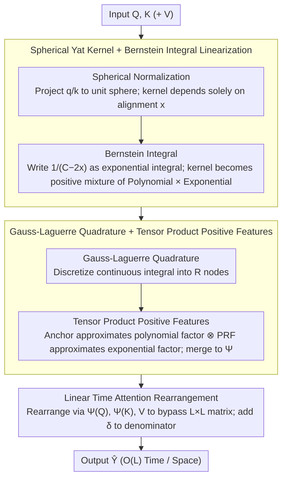

# SLAY: Geometry-Aware Spherical Linearized Attention with Yat-Kernel

**Conference**: ICML 2026  
**arXiv**: [2602.04915](https://arxiv.org/abs/2602.04915)  
**Code**: None  
**Area**: Linear Attention / Transformer Efficiency / Long Context Modeling / Kernel Methods  
**Keywords**: Yat-kernel, Spherical Normalization, Bernstein's Theorem, Positive Random Features, Gauss–Laguerre Quadrature  

## TL;DR
SLAY linearizes the Yat-kernel, inspired by the physical "inverse-square interaction," through a four-step sequence: (1) spherical normalization, (2) Laplace integral representation via Bernstein's Theorem, (3) Gauss-Laguerre quadrature, and (4) tensor product positive random features of polynomial and exponential kernels. This achieves $O(L)$ time complexity with performance nearly indistinguishable from softmax attention.

## Background & Motivation

**Background**: Standard Transformers utilize softmax attention, which requires constructing an $L \times L$ matrix, resulting in $O(L^2)$ time and space complexity. This becomes prohibitive for long-context scenarios. Numerous efficient attention mechanisms have been proposed, including clustering/hashing (Reformer), kernel approximation with random features (Performer/FAVOR+), low-rank approximations (Linformer), and sliding windows.

**Limitations of Prior Work**: (1) Early Rahimi-Recht-style trigonometric random features produce **negative values**, leading to training instability. While Performer uses Positive Random Features (PRFs) to solve stability, it still only approximates softmax-like kernels. (2) Softmax couples "alignment" and "magnitude" within $\exp(\mathbf{q}^\top \mathbf{k})$, requiring careful normalization and stabilization. (3) The emerging Yat-kernel $\text{Yat}(\mathbf{q}, \mathbf{k}) = (\mathbf{q}^\top \mathbf{k})^2 / (\|\mathbf{q} - \mathbf{k}\|^2 + \epsilon)$ (inspired by inverse-square forces) is naturally geometry-aware by rewarding alignment and penalizing distance. However, it is **non-factorizable**: the distance $\|\mathbf{q} - \mathbf{k}\|^2 = \|\mathbf{q}\|^2 + \|\mathbf{k}\|^2 - 2\mathbf{q}^\top \mathbf{k}$ couples $\mathbf{q}$ and $\mathbf{k}$ in the denominator, preventing the "decomposition-rearrangement" path used by Performer. A naive implementation remains $O(L^2)$.

**Key Challenge**: Achieving the geometry-awareness of the Yat-kernel (self-regularization and flexibility) while maintaining linear time complexity, despite the inherently non-separable distance term in the denominator.

**Goal**: (1) Design a factorizable kernel variant that preserves the geometric properties of the Yat-kernel; (2) derive its linear-time approximation; (3) maintain softmax-level performance with a controllable number of random features; (4) strictly demonstrate non-negativity to avoid instability from negative attention scores.

**Key Insight**: If $\mathbf{q}$ and $\mathbf{k}$ are constrained to the unit sphere $\mathbb{S}^{d-1}$, then $\|\mathbf{q}-\mathbf{k}\|^2 = 2 - 2\mathbf{q}^\top\mathbf{k}$. The kernel then depends solely on the angular alignment $x = \mathbf{q}^\top \mathbf{k} \in [-1, 1]$, denoted as $\text{Yat}_{\text{sph}}(\mathbf{q}, \mathbf{k}) = x^2 / (C - 2x)$, where $C = 2 + \epsilon$. **This decouples $\mathbf{q}$ and $\mathbf{k}$**. To handle the non-factorizable $1/(C-2x)$, Bernstein's Theorem allows representing $1/y$ as $\int_0^\infty e^{-sy} ds$. Applying Gauss-Laguerre quadrature discretizes this into nodes representing **polynomial $\times$ exponential** kernels, both of which possess established positive random features.

**Core Idea**: The four-step combination of spherical normalization decoupling, Bernstein-Laplace integral representation (writing non-separable kernels as positive mixtures of exponential families), Gauss-Laguerre quadrature, and tensor product positive random features enables "geometry-awareness + linear time + training stability."

## Method

### Overall Architecture
SLAY seeks an attention mechanism that is both geometry-aware and linear-time. The primary difficulty lies in the Yat-kernel's denominator coupling. The method follows a four-step pipeline to decompose the non-separable kernel: first, normalize $\mathbf{q}/\mathbf{k}$ to the unit sphere so the kernel depends only on angular alignment $x=\hat{\mathbf{q}}^\top\hat{\mathbf{k}}$; second, use Bernstein's Theorem to express the denominator as an exponential integral, transforming the kernel into a **positively weighted mixture** of "second-order polynomial $\times$ exponential" atomic kernels; third, use Gauss-Laguerre quadrature to discretize the integral into $R$ nodes; finally, assign positive random features to both atomic components at each node, merging them via tensor products to obtain a unified feature mapping $\widetilde{\Psi}(\cdot)$. Attention is then computed as $\hat{\mathbf{Y}} = \widetilde{\Psi}(\mathbf{Q})\,(\widetilde{\Psi}(\mathbf{K})^\top \mathbf{V}) / \widetilde{\Psi}(\mathbf{Q})\,(\widetilde{\Psi}(\mathbf{K})^\top \mathbf{1})$, avoiding the $L \times L$ matrix.

### Key Designs

**1. Spherical Yat Kernel + Bernstein Integral Linearization: Decomposing non-separable geometric kernels into linearizable positive mixtures**

The Yat-kernel's denominator $\|\mathbf{q}-\mathbf{k}\|^2$ couples $\mathbf{q}$ and $\mathbf{k}$. Spherical normalization addresses this: when $\mathbf{q},\mathbf{k} \in \mathbb{S}^{d-1}$, $\|\hat{\mathbf{q}}-\hat{\mathbf{k}}\|^2 = 2(1-\hat{\mathbf{q}}^\top\hat{\mathbf{k}})$, and the kernel becomes $\text{Yat}_{\text{sph}} = x^2/(C-2x)$ with $C=2+\epsilon$. This is equivalent to an alignment score $(\hat{\mathbf{q}}^\top\hat{\mathbf{k}})^2/(d_{\mathbb{S}^{d-1}}^2+\epsilon)$ regularized by spherical chordal distance. Although decoupled from distance, $1/(C-2x)$ is still not factorized. 

Bernstein's Theorem states $g(y)=1/y$ is completely monotonic on $(0,\infty)$, yielding the Laplace representation $1/y = \int_0^\infty e^{-sy}\,ds$. Substituting $y=C-2x$ (where $y \ge \epsilon > 0$ for $x \in [-1,1]$):

$$\text{Yat}_{\text{sph}} = \int_0^\infty e^{-sC}\cdot x^2 e^{2sx}\,ds.$$

This transforms the non-separable kernel into a **positively weighted mixture** of a "second-order polynomial $x^2$" and an "exponential $e^{2sx}$." This decomposition strategy ensures that if the approximations of the atomic kernels are non-negative, the total sum remains non-negative, preventing denominator collapse.

**2. Gauss-Laguerre Quadrature + Tensor Product Positive Features: Discretizing the integral via Anchor + PRF**

The continuous integral is discretized using $R$-point Gauss-Laguerre quadrature: $\int_0^\infty e^{-sC} h(s)\,ds \approx \sum_r w_r h(s_r)$, where nodes $s_r=t_r/C$ and weights $w_r=\alpha_r/C$. For each product, **anchor features** $\phi_{\text{anc}}(\mathbf{x}) = \frac{1}{\sqrt{P}}[(\mathbf{x}^\top\mathbf{a}_i)^2]_{i=1}^P$ approximate the polynomial factor $(\hat{\mathbf{q}}^\top\hat{\mathbf{k}})^2$, ensuring non-negativity without requiring Gram matrix inversion. The exponential factor $e^{2s\hat{\mathbf{q}}^\top\hat{\mathbf{k}}}$ is approximated using Choromanski’s **PRF** $\phi_{\text{PRF}}(\mathbf{u};s) = \frac{1}{\sqrt{D}}[\exp(\sqrt{2s}\,\omega_i^\top\mathbf{u}-s)]_{i=1}^D$ with $\omega_i\sim\mathcal{N}(0,I_d)$. These features are fused and reduced via **Tensor Product Sketch** $\mathcal{S}$ to avoid explicit $D_p \cdot D_r$ dimensional Kronecker products. Anchor features are chosen over faster methods like TensorSketch because they maintain non-negativity, which is critical for preventing division-by-zero or cancellation in the attention denominator.

**3. Linear Time Attention Computation + Numerical Stabilization**

The final output is a unified feature mapping $\widetilde{\Psi}(\mathbf{Q}),\widetilde{\Psi}(\mathbf{K})\in\mathbb{R}^{L\times m}$ where $m=O(R D_t)$. Attention is calculated as $\hat{\mathbf{Y}} = \widetilde{\Psi}(\mathbf{Q})\,(\widetilde{\Psi}(\mathbf{K})^\top\mathbf{V}) / \widetilde{\Psi}(\mathbf{Q})\,(\widetilde{\Psi}(\mathbf{K})^\top\mathbf{1})$. The numerator complexity is $O(Lmd_V)$ and the denominator is an $L \times 1$ vector broadcasted row-wise, resulting in $O(Lm)$ space. The $L^2$ terms are eliminated. A small stabilization term $\delta$ is added to the denominator.

## Key Experimental Results

### Main Results
The evaluation covers five dimensions: (1) polynomial approximation comparison, (2) computational scalability, (3) 22 synthetic tasks, (4) extreme classification, and (5) end-to-end Transformer training.

| Evaluation Scenario | Metric | Ours (Anchor) | Comparison | Notes |
|:---|:---|:---|:---|:---|
| Poly-kernel Approx Quality | Rel. L2↓ | 0.527 | Laplace-only 0.544; Nystrom 70.3; TensorSketch 24823 | Anchor has lowest error |
| Poly-kernel Approx Latency| Latency (ms)↓ | **489** | Laplace-only 1906; Hadamard 1932 | Anchor is 4× faster |
| Poly-kernel Approx Cosine | Cos↑ | 0.850 | Hadamard 0.732; Nystrom -0.009 | Anchor has best alignment |
| Long Sequence Scaling (A100) | Max Seq Length | 131K | Standard OOM earlier | $O(L)$ memory/compute |
| End-to-End Transformer | Gap vs Softmax | "Negligible" | Performer/Cosformer degrade significantly | Core conclusion |

### Ablation Study

| Configuration | Key Metric | Description |
|:---|:---|:---|
| Full SLAY (Spherical + Bernstein + GL + Anchor + PRF) | Optimal | Standard performance |
| w/o Spherical Normalization | $O(L^2)$ | Spherical is required for linearization |
| TensorSketch instead of Anchor | Error > 10^4 | Loss of non-negativity causes collapse |
| Nystrom instead of Anchor | Unacceptable Error | Denominator instability from Gram inversion |
| Laplace-only (no polynomial) | Higher error/4× slower | Polynomial factor is key to geometry-awareness |
| Hadamard (shared $\omega$) | Accurate but slow | 1932ms latency; not practical |

### Key Findings
- **Anchor features are the sweet spot**: Non-negative, unbiased, and $O(dP)$ cost. They are more stable than Nystrom and more precise than TensorSketch/RM.
- **Non-negativity is fundamental to stability**: Signed approximations (TensorSketch/RM/Nystrom) can produce negative values in the denominator, leading to division errors or cancellation.
- **Spherical + Bernstein** is a generalizable template for linearizing any "distance-regularized alignment score."
- Ours maintains functionality at 131K sequence lengths where standard attention OOMs.

## Highlights & Insights
- **Bernstein's Theorem for non-separable kernels**: A significant mathematical bridge between numerical linear algebra and probabilistic kernel methods.
- **Breaking the trade-off**: Preserve the physical intuition of the Yat-kernel (inverse-square interaction) while gaining $O(L)$ efficiency.
- **Systematic Poly-kernel Comparison**: Table 1 provides a clear engineering guide comparing four competitive methods across dimensions like cost, bias, and non-negativity.
- **Template for Geometric Kernels**: This approach can be ported to other physics-inspired kernels, such as multipole or Coulomb forms.

## Limitations & Future Work
- **Hyperparameters $R$ and $D$**: Quadrature nodes and PRF counts require manual tuning; no automatic selection strategy provided.
- **Fixed Quadratic Polynomial**: Higher-order polynomials for sharpening would require redesigned anchor features.
- **Task Coverage**: Primarily tested on Transformer encoder tasks; evaluation on autoregressive LMs and multimodal tasks is needed.
- **Magnitude Information**: Spherical normalization discard's $\mathbf{q}/\mathbf{k}$ magnitude, similar to the normalization trade-offs in softmax.

## Related Work & Insights
- **vs Performer / FAVOR+**: While both use PRFs, SLAY linearizes the Yat-kernel using a non-trivial Bernstein step, whereas Performer linearizes softmax.
- **vs Cosformer**: Cosformer redesigns similarity for $O(L)$ but loses softmax expressivity; SLAY maintains geometry-awareness through the Yat-kernel.
- **vs Reformer (LSH)**: SLAY provides a dense low-rank approximation with more predictable complexity compared to LSH-based bucket collisions.
- **vs ELU+1 Linear Attention**: Ours outperforms simple feature maps by using more precise "polynomial + exponential" combinations.

## Rating
- Novelty: ⭐⭐⭐⭐⭐ Introduction of Bernstein's Theorem to attention linearization is a truly novel mathematical operation.
- Experimental Thoroughness: ⭐⭐⭐⭐ Five-dimensional evaluation is comprehensive, though large-scale autoregressive LM verification is missing.
- Writing Quality: ⭐⭐⭐⭐⭐ Rigorous derivations with theorems and remarks; clear engineering implementation.
- Value: ⭐⭐⭐⭐ High-quality $O(L)$ alternative to softmax; significant reference value for the linear attention community regarding anchor features.

<!-- RELATED:START -->

## Related Papers

- [\[NeurIPS 2025\] Unifying Attention Heads and Task Vectors via Hidden State Geometry in In-Context Learning](../../NeurIPS2025/llm_nlp/unifying_attention_heads_and_task_vectors_via_hidden_state_geometry_in_in-contex.md)
- [\[ICML 2026\] Scheduling LLM Inference with Uncertainty-Aware Output Length Predictions](scheduling_llm_inference_with_uncertainty-aware_output_length_predictions.md)
- [\[NeurIPS 2025\] MonarchAttention: Zero-Shot Conversion to Fast, Hardware-Aware Structured Attention](../../NeurIPS2025/llm_nlp/monarchattention_zero-shot_conversion_to_fast_hardware-aware_structured_attentio.md)
- [\[ICML 2026\] In-Context Routing (ICR): 一次训练、处处可用的 attention-level 隐式 ICL](train_once_reuse_everywhere_generalizable_implicit_in-context_learning_by_routin.md)
- [\[NeurIPS 2025\] Adaptive Kernel Design for Bayesian Optimization Is a Piece of CAKE with LLMs](../../NeurIPS2025/llm_nlp/adaptive_kernel_design_for_bayesian_optimization_is_a_piece_of_cake_with_llms.md)

<!-- RELATED:END -->
