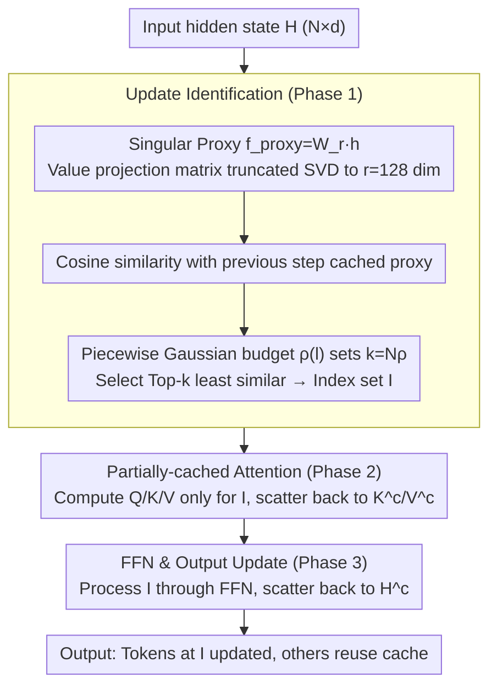

# SPA-Cache: Singular Proxies for Adaptive Caching in Diffusion Language Models

**Conference**: ICML 2026  
**arXiv**: [2602.02544](https://arxiv.org/abs/2602.02544)  
**Code**: https://github.com/wenhao728/spa-cache (Available)  
**Area**: LLM Efficiency / Diffusion Language Models / Inference Acceleration  
**Keywords**: Diffusion LM, KV Cache, Singular Value Decomposition, Adaptive Budget, Inference Acceleration

## TL;DR
SPA-Cache transforms the determination of "which tokens need updating" in Diffusion Language Models (DLMs) from the original $d=4096$ dimensional Value space via cosine similarity to a compressed $r=128$ singular subspace. By dynamically allocating update budgets across layers, it achieves a $6.4\times$ throughput increase for LLaDA-8B on GSM8K and $8\times$ on MBPP without accuracy loss. Combined with parallel decoding, the total acceleration reaches $28\times$.

## Background & Motivation
**Background**: Diffusion Language Models (DLMs) such as LLaDA-8B and Dream-7B replace the left-to-right generation paradigm of AR models with bidirectional attention and arbitrary-order decoding, demonstrating competitiveness in multimodal tasks, reasoning, and the "reversal curse." However, DLMs require a full forward pass on the entire sequence of length $N$ at each decoding step, resulting in a complexity of $O(T \cdot N^2)$, which is highly inefficient compared to the KV-Cache of AR models.

**Limitations of Prior Work**: Standard KV-Cache is unusable due to non-fixed decoding orders. Subsequent works follow two paths: (i) dKV-Cache, d2Cache, and Fast-dLLM use window heuristics, assuming "only hidden states near the recently decoded tokens need updating," which lacks theoretical grounding; (ii) dLLM-Cache monitors Value state drift to identify "drifting tokens" at arbitrary positions, but computing projections and similarity in the $d$-dimensional space at every step incurs high overhead. Furthermore, it uses a uniform update ratio $\rho$ across all layers, averaging the fixed budget.

**Key Challenge**: A trade-off exists between identification overhead and sparsity gains—reducing the update ratio $\rho$ saves attention/FFN computation, but the $d$-dimensional similarity calculation itself consumes much of the savings. Additionally, as observed in Figure 2, the proportion of drifting tokens varies significantly across layers: shallow layers perform embedding transformations, deep layers tend to stabilize, and middle layers are the peak of drifting. Using a uniform $\rho=25\%$ wastes budget in shallow/deep layers, while $\rho=20\%$ misses updates in high-variance middle layers.

**Goal**: To simultaneously optimize "which tokens to update" and "how much update budget to allocate per layer."

**Key Insight**: A formal analysis of DLM hidden state evolution proves that Value state cosine similarity serves as an upper bound for drift in attention and FFN outputs (Theorem 3.1/3.2). Furthermore, truncated SVD of $W$ preserves similarity structures within an $r \ll d$ subspace (Theorem 3.4). This implies that similarity does not need to be calculated on the full-dimensional Value but can be efficiently computed along the top $r$ singular directions.

**Core Idea**: Use "singular proxies" constructed via truncated SVD of $W$ to replace full-dimensional Values for identifying drifting tokens, and adaptively allocate update budgets $\rho(l)$ per layer using a piecewise Gaussian function.

## Method

### Overall Architecture
The core problem SPA-Cache solves is that DLMs recompute the forward pass for the entire sequence at every step, even though hidden states for most tokens remain nearly unchanged. By identifying and recomputing only the few "drifting" tokens while reusing the cache for others, significant computation can be saved. The difficulty lies in ensuring the identification process is inexpensive and that update ratios are tailored to each layer. The SPA-Cache workflow for a single Transformer block consists of three phases (Algorithm 1): First, **Update Identification**, where input hidden states $H \in \mathbb{R}^{N \times d}$ are projected via $f_\text{proxy}: \mathbb{R}^d \to \mathbb{R}^r$ to obtain proxy identifiers. These are compared with cached proxies using cosine similarity to select the Top-$k$ ($k = N\rho$) least similar indices $\mathcal{I}$ based on the layer budget $\rho(l)$. Second, **Partially-cached Attention**, where $Q_\mathcal{I}, K_\mathcal{I}, V_\mathcal{I}$ are computed only for tokens in $\mathcal{I}$ and scatter-written back to caches $K^c, V^c$, allowing these sparse queries to perform attention against the full KV cache. Finally, **FFN & Output Update**, where sparse attention outputs pass through the FFN and are scatter-written back to the output cache $H^c$, while non-selected tokens reuse the cache directly. This reduces the computation of attention and FFN for each layer from $O(N)$ to $O(k) = O(N\rho)$, with $\rho$ being layer-adaptive.

### Key Designs

**1. Theoretical Foundation: Elevating "Value-based Selection" from Heuristic to Bounded Guarantee**

Prior work dLLM-Cache monitored Value state drift purely based on empirical observation, without explaining why Query/Key or attention outputs were not used. This paper establishes a causal chain using two theorems: Theorem 3.1 proves that attention output cosine dissimilarity is upper-bounded by Value dissimilarity, $1 - \mathcal{S}_\cos(h_i^t, h_i^{t+1}) \le C \cdot (1 - \mathcal{S}_\cos(v_i^t, v_i^{t+1})) + \epsilon$; Theorem 3.2 proves that FFN output differences are upper-bounded by their input similarity, $\|f_\text{FFN}(h_1) - f_\text{FFN}(h_2)\|_2 \le C \cdot \sqrt{1 - \mathcal{S}_\cos(h_1, h_2)} + \epsilon$. Together, these imply "Stable Value → Stable Attention → Stable FFN." Thus, high Value similarity ensures the output of the entire block can be safely reused. Empirical results (Table 1) support this: Value is the only identifier that maintains both 78.59% accuracy and 164.88 TPS, whereas attention outputs suffer from anisotropy in deeper layers, causing tokens to cluster in a narrow cone and making them indistinguishable, with accuracy dropping to 73.92%.

**2. Singular Proxies: Reducing Identification Cost via Truncated SVD**

There is a conflict between identification overhead and sparsity gains—reducing the update ratio saves computation, but calculating cosine similarity on $d=4096$ dimensional Values consumes much of those savings. The singular proxy approach performs SVD on the Value projection matrix $W \in \mathbb{R}^{d \times d}$ to get $W \approx U \Lambda V^\top$, and uses only the top $r$ singular vectors to construct a truncated projection $W_r = \Lambda_r V_r^\top \in \mathbb{R}^{r \times d}$. The proxy $f_\text{proxy}(h_i) = W_r h_i$ reduces the identification cost per step from $O(d^3) + O(d)$ to $O(rd^2) + O(r)$. This is reliable because Theorem 3.4 proves the truncation introduces a similarity error bounded by $2(\lambda_{r+1}/\lambda_r)^2$, which is independent of the input. Faster singular spectrum decay leads to more faithful similarity structure in low-dimensional subspaces. Note that SVD here is not used for traditional low-rank weight compression; the weights themselves are unchanged, but the top $r$ singular directions serve as an inexpensive comparison proxy. $r=128$ (32x smaller than full dimension) is the sweet spot: TPS increases from 164.88 to 179.43, while accuracy only drops slightly from 78.59% to 78.23% (Table 5).

**3. Piecewise Gaussian Adaptive Budget: Matching Layer Budgets to Drift Distributions**

dLLM-Cache uses a uniform update ratio $\rho$ for all layers, but Figure 2 shows that the proportion of drifting tokens follows an asymmetric bell curve across layers. Shallow and deep layers are relatively stable, while middle layers are peaks for transformation. A uniform $\rho=25\%$ wastes budget at the ends and under-invests in the middle. This paper uses a piecewise Gaussian function parameterized by a peak at $l_p$ to define the layer-wise budget $\rho(l) = \rho_p \exp\!\left(\ln(\rho_1/\rho_p) \cdot ((l-l_p)/(l_p-1))^2\right)$ (for $l \le l_p$, with a symmetric branch for $l > l_p$). Using only 4 hyperparameters $\{\rho_p, l_p, \rho_1, \rho_L\}$ captures the "high middle, low ends" inductive bias without the risk of over-fitting associated with learning per-layer scalars. Consequently, the average budget $\bar\rho$ drops from 25% to 16%, yet accuracy remains stable as middle layers receive peak budgets, further increasing throughput (Table 4: TPS 179→189).

### Loss & Training
SPA-Cache is entirely training-free and serves as an inference-time plug-in. It does not modify DLM weights but adds proxy projections and Top-$k$ selection at each layer. All hyperparameters ($r=128$, $\rho_p=0.25$, and Gaussian parameters $l_p, \rho_1, \rho_L$) are configured once per model.

## Key Experimental Results

**Setup**: Evaluated on LLaDA-8B-Instruct and Dream-v0-Instruct-7B across 7 benchmarks (GSM8K, MATH500, GPQA, BBH, MMLU-pro, MBPP, HumanEval). Compared against vanilla decoding, dLLM-Cache, and Fast-dLLM on a single NVIDIA B200.

### Main Results (LLaDA-8B-Instruct)

| Benchmark | Baseline TPS | dLLM-Cache TPS | Fast-dLLM TPS | SPA-Cache TPS | Gain | Accuracy (SPA vs Baseline) |
|-----------|-------------:|---------------:|--------------:|--------------:|-------:|-----------------------:|
| GSM8K | 29.67 | 68.62 ($2.3\times$) | 93.86 ($3.2\times$) | **190.73** | $6.4\times$ | 78.24 / 78.62 |
| MATH500 | 33.35 | 74.26 ($2.2\times$) | 85.94 ($2.6\times$) | **172.19** | $5.2\times$ | 33.44 / 33.18 |
| MMLU-pro | 20.68 | 52.71 ($2.5\times$) | 81.25 ($3.9\times$) | **124.06** | $6.0\times$ | 36.30 / 37.08 |
| MBPP | 5.75 | 8.38 ($1.5\times$) | 12.49 ($2.2\times$) | **46.12** | $8.0\times$ | 39.00 / 39.20 |
| HumanEval | 37.48 | 40.29 ($1.1\times$) | 81.90 ($2.2\times$) | **132.91** | $3.5\times$ | 42.07 / 42.07 |

Accuracy is nearly identical to the baseline (most within $\pm 1$ point), while throughput is 2-5x that of dLLM-Cache and 1.5-3.7x that of Fast-dLLM.

### Combined with Parallel Decoding (Table 3, LLaDA-8B)

| Benchmark | Baseline | Fast-dLLM Parallel | SPA-Cache + Parallel | Total Gain |
|-----------|---------:|---------------:|-----------------:|-------:|
| GSM8K | 29.67 | 176.45 ($5.9\times$) | **276.39** | $9.3\times$ |
| BBH | 24.85 | 301.33 ($12.1\times$) | **693.96** | $\mathbf{27.9\times}$ |
| MMLU-pro | 20.68 | 86.40 ($4.2\times$) | **224.97** | $10.9\times$ |
| MBPP | 5.75 | 50.11 ($8.7\times$) | **143.25** | $24.9\times$ |

SPA-Cache is orthogonal to parallel decoding; combining them achieves nearly $28\times$ total acceleration on BBH, outperforming the dual cache of Fast-dLLM.

### Ablation Study (LLaDA-8B, GSM8K, Table 4-5)

| Configuration | Peak $\rho_p$ | Average $\bar\rho$ | TPS | Accuracy |
|------|-------------:|----------------:|-----:|-----:|
| Baseline (No cache) | 100% | 100% | 29.01 | 78.62 |
| Value (Full Dim) | 25% | 25% | 164.88 | 78.59 |
| + Singular-128 (Ours) | 25% | 25% | 179.43 | 78.23 |
| + Adaptive Budget | 25% | 16% | **189.13** | 78.24 |
| Uniform 16% (No Adaptive) | 16% | 16% | 190.06 | 75.65 |

Rank Scanning: $r=4096$ (Value) 178.4 → $r=512$ 172.6 → $r=256$ 176.4 → $r=128$ 179.4 → $r=64$ 181.8 (but accuracy drops from 78.23 to 77.79). Thus, $r=128$ is selected as the default.

### Key Findings
- **Singular Proxies contribute "Acceleration without Degradation"**: Moving from Value to Singular-128 increases TPS by 9% while accuracy only drops by 0.36, validating that the similarity-preserving bound in Theorem 3.4 is tight for practical models.
- **Adaptive Budget is a Free Lunch**: Reducing the average budget from 25% to 16% increases TPS by another 5% with almost no accuracy loss. In contrast, applying the same 16% uniformly across layers results in a 2.59 point drop, proving that "feeding middle layers while starving ends" is critical.
- **MBPP shows the largest gain ($8\times$)**: Due to longer sequences in MBPP, the absolute gains from sparse computation are maximized. HumanEval, with shorter sequences, shows the smallest relative gain ($3.5\times$).
- **Efficiency Bottleneck**: dLLM-Cache actually slows down Dream-7B on HumanEval (0.8x), confirming the argument that full-dimensional identification overhead can exceed sparsity benefits.

## Highlights & Insights
- **From Heuristics to Theorem-bounded Guarantees**: While dLLM-Cache used Value similarity ad-hoc, this work uses two theorems to establish Value similarity as the upper bound for drift in attention/FFN. Theorem 3.4 further bounds the error for low-dimensional proxies. This "prove then implement" approach is more robust and extensible to other normalization or MoE structures (Remark 3.3).
- **Novel use of SVD on Weights**: Weight SVD is typically used for low-rank compression; here, it constructs "proxy identifiers." This "cheap proxy via SVD" pattern is transferable to any scenario requiring efficient comparisons of high-dimensional token features, such as retrieval or MoE routing.
- **Parametrized Layer Heterogeneity**: Using a piecewise Gaussian instead of per-layer scalars ensures the "high middle, low ends" inductive bias while requiring only 4 hyperparameters, avoiding search/overfitting issues.
- **Orthogonality to Parallel Decoding**: Caching optimizes per-step computation while parallel decoding optimizes the number of tokens per step. The multiplicative effect results in a $28\times$ compound acceleration.

## Limitations & Future Work
- **Model Scale**: Validation is limited to 8B models (LLaDA/Dream). It remains to be seen if singular spectrum decay remains as favorable for larger models (30B+).
- **Hyperparameter Tuning**: The 4 piecewise Gaussian parameters are set empirically. A more automated method for parameter selection would improve transferability.
- **Task-specific Rank**: The paper does not explore if different tasks (code, reasoning, etc.) require different $r$ values for optimal performance.
- **Training Acceleration**: SPA-Cache only accelerates inference. The high training cost of DLMs remains an open problem.
- **Future Directions**: Extending the piecewise Gaussian to token or sample-level dynamics; applying singular proxies to acceptance criteria in speculative decoding.

## Related Work & Insights
- **vs dLLM-Cache (Liu et al., 2025b)**: dLLM-Cache also uses Value similarity but suffers from (i) high dimensional calculation costs and (ii) uniform layer-wise budgets. SPA-Cache provides a more efficient and refined solution while providing theoretical justification for using "Value."
- **vs Fast-dLLM (Wu et al., 2025b)**: Fast-dLLM utilizes window-based locality and parallel decoding. SPA-Cache performs global token selection, capturing long-distance drifts that window methods miss.
- **Inspiration for Efficiency**: The pattern of "Weight SVD → Truncated Subspace → Cheap Proxy" is highly portable for AR LLM research, such as in attention pruning or expert routing.

## Rating
- Novelty: ⭐⭐⭐⭐ Using weight SVD for identification proxies rather than compression is a clever shift in perspective.
- Experimental Thoroughness: ⭐⭐⭐⭐ Covers 7 benchmarks across 2 DLMs with detailed ablations and rank scanning; lacks validation on larger scales.
- Writing Quality: ⭐⭐⭐⭐ The "Theory → Algorithm → Empirical" structure is very clear; the theorems are concise and purposeful.
- Value: ⭐⭐⭐⭐ Significant throughput gains ($8\times$ standalone, $28\times$ combined) with zero training cost make it highly practical for DLM deployment.

<!-- RELATED:START -->

## Related Papers

- [\[ICLR 2026\] d²Cache: Accelerating Diffusion-Based LLMs via Dual Adaptive Caching](../../ICLR2026/llm_nlp/d2cache_accelerating_diffusion-based_llms_via_dual_adaptive_caching.md)
- [\[ICLR 2026\] Stopping Computation for Converged Tokens in Masked Diffusion-LM Decoding](../../ICLR2026/llm_nlp/stopping_computation_for_converged_tokens_in_masked_diffusion-lm_decoding.md)
- [\[ICLR 2026\] Toward Safer Diffusion Language Models: Discovery and Mitigation of Priming Vulnerabilities](../../ICLR2026/llm_nlp/toward_safer_diffusion_language_models_discovery_and_mitigation_of_priming_vulne.md)
- [\[ICLR 2026\] DreamOn: Diffusion Language Models For Code Infilling Beyond Fixed-size Canvas](../../ICLR2026/llm_nlp/dreamon_diffusion_language_models_for_code_infilling_beyond_fixed-size_canvas.md)
- [\[ICML 2026\] Reasoning on the Manifold: Bidirectional Consistency for Self-Verification in Diffusion Language Models](reasoning_on_the_manifold_bidirectional_consistency_for_self-verification_in_dif.md)

<!-- RELATED:END -->
