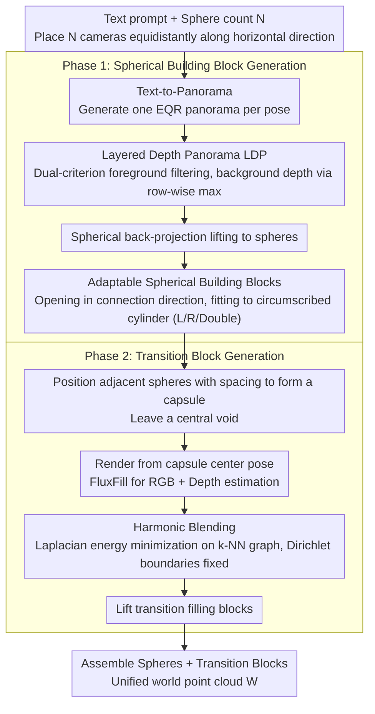

# SphericalDreamer: Generating Navigable Immersive 3D Worlds with Panorama Fusion

**Conference**: ICML 2026  
**arXiv**: [2605.19974](https://arxiv.org/abs/2605.19974)  
**Code**: https://sphericaldreamer.github.io/ (Yes, project page contains open-source code)  
**Area**: 3D Vision / 3D World Generation / Panoramic Images  
**Keywords**: 3D world generation, panoramas, layered depth panoramas, harmonic blending, navigable immersive scenes

## TL;DR
SphericalDreamer generates the first outdoor 3D world that simultaneously possesses $360^\circ \times 180^\circ$ omnidirectional immersion and long-distance navigability. It achieves this by lifting multiple text-generated Layered Depth Panoramas (LDP) into 3D "spherical building blocks" and employing harmonic blending to synthesize and stitch the missing transition regions between adjacent spheres.

## Background & Motivation
**Background**: Text-driven 3D outdoor world generation primarily follows two routes: the panorama route (generating equirectangular EQR panoramas via diffusion and lifting to 3D point clouds/3DGS using monocular depth) and the iterative completion route (iteratively rendering new views $\rightarrow$ inpainting gaps $\rightarrow$ back-projecting to 3D). Representative works for the former include LayerPano3D, HoloDreamer, and PanoDreamer; the latter includes LucidDreamer, SceneScape, and WonderJourney.

**Limitations of Prior Work**: Both routes can only satisfy either "immersion" or "navigability." In panorama methods, the camera can only move within a small neighborhood of the panoramic node; larger translations lead to significant parallax distortion and geometric artifacts. Iterative completion methods, seeking to avoid "previously observed closed regions," typically expand the scene only in the backward direction, naturally losing view-dependent consistency for "looking back" and failing to provide true omnidirectional immersion.

**Key Challenge**: The "self-consistency" assumptions of the two paradigms—single-node omnidirectional light field vs. continuous completion along a unidirectional backward trajectory—are mutually incompatible. The former collapses all viewpoints into a single point, while the latter collapses omnidirectional coverage into a single direction. Any attempt to patch only one representation struggles to achieve both goals.

**Goal**: In outdoor/natural scene settings, design a 3D representation and generation pipeline such that (i) every spatial position provides a full $360^\circ \times 180^\circ$ field of view; (ii) the camera can translate freely over long distances; and (iii) visuals and geometry remain coherent at junctions.

**Key Insight**: The authors observe that panoramas are naturally suited as "local immersion units." If the issues of "seamlessly aligning multiple panoramic units" and "reasonably generating the gaps between them" can be solved, a long corridor-style world can be linked by a series of panoramic spheres. In other words, the "consistent light field" property is preserved locally within spheres, while long-distance expansion is handled by "transition blocks" between spheres.

**Core Idea**: Use Layered Depth Panoramas (LDP) as "spherical building blocks" that can be sliced and docked. Then, utilize inpainting and harmonic depth blending to synthesize "transition blocks" between adjacent spheres, finally assembling spheres and transition blocks into a unified colored point cloud world.

## Method

### Overall Architecture
Given a text prompt $p$ and a sphere count $N$, SphericalDreamer places $N$ camera poses at equal intervals along a horizontal direction $\mathbf{d}$. For each pose, a text-to-panorama model generates an EQR panorama which is lifted into a "spherical building block." A "transition filling block" is generated for the gap between each pair of adjacent spheres. Finally, all blocks are assembled into a unified world point cloud $\mathcal{W}=\{(\mathbf{p}_k,\mathbf{c}_k)\}_{k=0}^{K-1}$. The sphere count $N$ acts as a proxy for "world scale"—the larger $N$, the longer the scene. The pipeline $\mathcal{W}=\mathcal{W}^{\text{partial}}\cup\bigcup_{i=0}^{N-2}\mathcal{B}_i^{\text{fill}}$ separates "local immersion" within spheres and "long-distance expansion" within transition blocks.

### Key Designs

**1. Layered Depth Panorama (LDP): Leaving a Background Shell After Slicing**

Single-layer panoramic spheres have a fatal flaw: once the camera translates away from the node, areas obscured by foreground objects are exposed as black holes (Figure 3b) because no background geometry exists there. LDP addresses this by splitting each panorama into foreground and background layers for separate lifting. First, SAM segments candidate masks $\{S_k\}$. A novel dual-criterion is used to filter foreground—evaluating alignment between mask boundaries and depth edges, alongside depth gradient magnitude at mask boundaries—to merge high-scoring masks into a foreground mask $M_i^{\text{fg}}$. This mask is used to remove foreground and inpaint a clean background panorama $I_i^{\text{bg}}$. A key trick is that the background depth $D_i^{\text{bg}}$ is not re-estimated; instead, it is derived by taking the **row-wise maximum** of the original depth map. This creates a smooth envelope of the "farthest scene radius at each altitude angle," avoiding new estimation noise and ensuring inter-layer depth consistency. Finally, both layers are lifted via spherical back-projection $\Pi_\mathbb{S}^{-1}$ and merged into $\mathcal{S}_i=S_i\cup S_i^{\text{bg}}$, ensuring a visible "distant background shell" remains inside when the sphere is sliced.

**2. Adaptable Spherical Building Blocks: Transforming Closed Spheres into Interfacial Parts**

To string spheres into a corridor, closed spheres must be dockable. Directly overlapping two complete spheres creates inconsistent points at the same physical location, leading to severe geometric conflict. Thus, for each sphere, a portion of the point cloud is removed in the target connection direction to form an "opening." The point cloud around the opening is deformed to fit a circumscribed cylindrical surface, resulting in three states: $\mathcal{S}_i^{\text{left}}$, $\mathcal{S}_i^{\text{right}}$, and $\mathcal{S}_i^{\text{both}}$ (the first and last spheres open on one side, while intermediate spheres open on both). The cylindrical surface shapes the opening into a regular boundary, making it smoother for the subsequent transition region boundary conditions and energy minimization alignment. Adjacent camera poses are intentionally spaced by $\lambda$ (interval $\lambda\mathbf{d}$), leaving a central void between opposing openings to form a "capsule" shape—a creative space reserved for the transition block.

**3. Harmonic Blending: Seamlessly Stitching Estimated Depth into Existing Geometry**

The difficulty of transition blocks lies in the central void requiring RGB inpainting and monocular depth estimation for geometry. Monocular depth is inherently unreliable in scale and local structure; naive replacement results in visible geometric discontinuities (Figure 4a). The authors adapt Laplacian mesh editing/harmonic surface deformation from graphics: first, $(I_i^r,D_i^r,M_i^r)$ is rendered from the capsule center pose $\mathbf{T}_{i+1/2}=\text{Translate}(\mathbf{T}_i,\tfrac{1}{2}\lambda\mathbf{d})$. FluxFill completes the RGB on mask $1-M_i^r$ to get $I_i^{\text{ip}}$, and depth $D_i^{\text{est}}$ is estimated. A k-NN graph is built among synthesized points to minimize the Laplacian smoothing energy, while Dirichlet boundary conditions strictly "nail" known boundary depths to the reference $D_i^r$. Solving the displacement field yields $D_i^{\text{blend}}=\text{Harmonic-Blend}(D_i^r,D_i^{\text{est}},M_i^r)$. This treats estimated depth as a "soft target" and existing geometry as a "hard constraint," using a constrained first-order energy smoothing interpolation that preserves local structure while ensuring airtight boundaries. Finally, the filling block $\mathcal{B}_i^{\text{fill}}$ is lifted only in the $1-M_i^r$ region and assembled with the sphere parts.

### Loss & Training
SphericalDreamer is entirely training-free, assembling off-the-shelf models: Flux + LayerPano3D-trained EQR models for text-to-panorama, $360^\circ$ monocular depth estimation (Rey-Area et al.), SAM for foreground segmentation, and FluxFill for RGB inpainting. Harmonic blending is a closed-form energy minimization (sparse linear system solver) with no learnable parameters. The pipeline runs $N=3$ in approximately 40 minutes on a single A100.

## Key Experimental Results

### Main Results
The evaluation covers three camera trajectories: pure rotation (immersion), pure translation (navigability), and rotation+translation (immersive navigation). 20 poses are sampled per scene, with BRISQUE for image quality and Coverage (ratio of realistic scene pixels to total rendered pixels, excluding background blackness) for coverage.

| Method | Rot BRISQUE↓ | Rot Cov↑ | Trans BRISQUE↓ | Trans Cov↑ | Rot+Trans BRISQUE↓ | Rot+Trans Cov↑ |
|------|--------------|----------|----------------|------------|--------------------|----------------|
| SceneScape | 52.50 | 0.796 | 44.32 | 0.960 | 55.91 | 0.724 |
| WonderJourney | 57.36 | 0.556 | 41.31 | 0.998 | 61.68 | 0.404 |
| LayerPano3D | 48.40 | **1.000** | 70.08 | 0.476 | 76.74 | 0.594 |
| LucidDreamer | 62.54 | 0.798 | 65.16 | 0.682 | 64.35 | 0.775 |
| **Ours** | **44.96** | 0.999 | **36.57** | **0.999** | **41.73** | **0.999** |

Only SphericalDreamer achieves near-perfect coverage across all three trajectories while maintaining optimal BRISQUE scores. LayerPano3D achieves full coverage under rotation but collapses to 0.476 under translation; WonderJourney satisfies translation but drops to 0.556 under rotation, confirming the "immersion vs. navigability" trade-off in existing paradigms.

### Ablation Study

| Configuration | Key Observation | Description |
|------|----------|------|
| Full | Optimal quality and geometry | Complete model (LDP + HB + multi-sphere fusion) |
| w/o LDP | Visible background holes during translation | Single-layer spheres expose black background at foreground occlusions (Fig 3b) |
| w/o Harmonic Blending | Geometric discontinuities at transitions | Naive depth replacement causes visible seams (Fig 4a) |
| $N=3\to 7$ | Stable quality metrics | Scaling the world size does not degrade image quality (Table 7) |

### Key Findings
- LDP and HB are "non-degradable" components: removing either introduces visible artifacts (background holes or geometric seams), though their impact is limited for pure rotation. Their value is primarily realized in "navigable" scenarios, highlighting that existing metrics may underestimate geometric consistency in immersive navigation.
- The "row-wise maximum" engineering trick for background depth outperforms background panoramas from LayerPano3D or 3D Photography (Appendix C.5), indicating that simple panoramic geometric priors are more stable than additional estimation.
- Panoramic monocular depth remains the primary bottleneck: the authors acknowledge curvature artifacts in urban or indoor scenes requiring precise planar geometry, thus limiting the current scope to outdoor/natural scenes.

## Highlights & Insights
- The design philosophy of "taking half of two opposing paradigms" is elegant: using panoramas for local immersion and inpaint-based completion for long-distance expansion, with transition blocks bridging the gap. This "partitioned responsibility + seam generation" paradigm can be migrated to any "locally dense but globally non-extensible" generation problem.
- Harmonic Blending successfully brings decades-old Laplacian mesh editing from graphics to point cloud depth fusion. As long as "trusted references" and "to-be-fused estimates" exist with defined graph structures and boundary conditions, seamless stitching can be achieved via sparse linear solving, which is much cheaper than adversarial or diffusion-based post-processing.
- Utilizing SAM masks with depth edge dual-criteria for foreground filtering is far more robust than simple depth gradient thresholding and could serve as a standard preprocessing step for any LDP or multi-layer scene representation.

## Limitations & Future Work
- **Limitations**: Reliance on panoramic monocular depth causes curvature distortion in urban or indoor scenes with planar geometry. Camera trajectories are currently restricted to a horizontal straight line, making the world a "long corridor/tunnel." Creating forks, loops, or multiple floors requires additional connectivity design. Latency is high (40 min/A100 for $N=3$). Evaluation relies on non-reference metrics (BRISQUE/Coverage) without human preference or downstream VR/SLAM task quantification.
- **Future Work**: Extending linear trajectories to branching trees or graph structures, treating capsule fusion as "graph edge generation"; adopting 3D Gaussian Splatting for faster rendering; and training urban-specific panoramic depth priors to mitigate curvature artifacts.

## Related Work & Insights
- **vs LayerPano3D**: Also uses LDP lifting but is restricted to a single node; Ours adopts the foreground layer concept, adds a more robust background construction (row-wise max + inpaint), and extends single spheres to multi-sphere chains for navigability.
- **vs HoloDreamer / PanoDreamer**: Panoramic route using camera trajectories for inpainting within a single node; Ours restricts inpainting to narrow transition zones between spheres, avoiding the paradox of "forcing new content into observed regions."
- **vs LucidDreamer / SceneScape / WonderJourney**: Iterative completion routes that allow length but sacrifice immersion; Ours demonstrates that localizing "long-distance expansion" to transition blocks with harmonic blending preserves omnidirectional views, shifting the Pareto frontier of the task.
- **vs Classical Graphics**: Adapting mesh editing energy to graph energy minimization on point cloud depth maps is a successful cross-domain reuse, suggesting more room for "3D generation + classical geometric processing" combinations.

## Rating
- Novelty: ⭐⭐⭐⭐ Elegant system-level fusion of two paradigms with harmonic blending; individual components are mostly engineering assemblies.
- Experimental Thoroughness: ⭐⭐⭐⭐ Complete three-trajectory main experiments, extensive ablations, and scale scanning, though lacking human preference/downstream task evaluation.
- Writing Quality: ⭐⭐⭐⭐⭐ Clear paradigm comparison (Table 1), progressive method diagrams, and self-consistent notation.
- Value: ⭐⭐⭐⭐⭐ The first method to achieve both omnidirectional immersion and long-distance navigability in outdoor 3D world generation, offering direct potential for VR/Digital Twin applications.

<!-- RELATED:START -->

## Related Papers

- [\[ACL 2026\] VOYAGER: A Training Free Approach for Generating Diverse Datasets using LLMs](../../ACL2026/llm_nlp/voyager_a_training_free_approach_for_generating_diverse_datasets_using_llms.md)
- [\[AAAI 2026\] ProFuser: Progressive Fusion of Large Language Models](../../AAAI2026/llm_nlp/profuser_progressive_fusion_of_large_language_models.md)
- [\[CVPR 2025\] Dora: Sampling and Benchmarking for 3D Shape Variational Auto-Encoders](../../CVPR2025/llm_nlp/dora_sampling_and_benchmarking_for_3d_shape_variational_auto-encoders.md)
- [\[ACL 2025\] Combining the Best of Both Worlds: A Method for Hybrid NMT and LLM Translation](../../ACL2025/llm_nlp/combining_the_best_of_both_worlds_a_method_for_hybrid_nmt_and_llm_translation.md)
- [\[ACL 2025\] FoodTaxo: Generating Food Taxonomies with Large Language Models](../../ACL2025/llm_nlp/foodtaxo_generating_food_taxonomies_with_large_language_models.md)

<!-- RELATED:END -->
