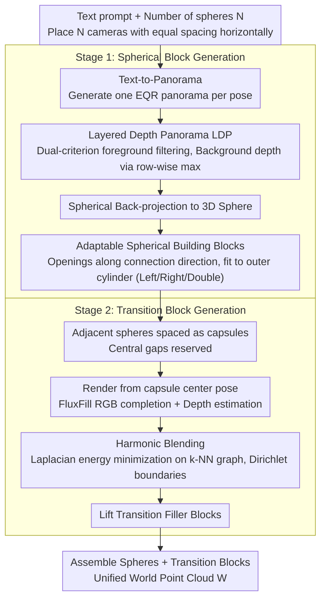

# SphericalDreamer: Generating Navigable Immersive 3D Worlds with Panorama Fusion

**Conference**: ICML 2026  
**arXiv**: [2605.19974](https://arxiv.org/abs/2605.19974)  
**Code**: https://sphericaldreamer.github.io/ (Available, project page contains open-source code)  
**Area**: 3D Vision / 3D World Generation / Panoramic Images  
**Keywords**: 3D World Generation, Panoramas, Layered Depth Panoramas, Harmonic Blending, Navigable Immersive Scenes

## TL;DR
SphericalDreamer generates the first outdoor 3D world with both 360°×180° omnidirectional immersion and long-range navigability by lifting multiple text-generated Layered Depth Panoramas (LDP) into 3D "spherical building blocks" and synthesizing missing transition regions between adjacent spheres using harmonic blending and stitching.

## Background & Motivation
**Background**: Text-driven 3D outdoor world generation primarily follows two routes: the panorama-based route (generating Equirectangular (EQR) panoramas via diffusion, then lifting to 3D point clouds/3DGS using monocular depth) and the iterative completion route (continually rendering new views → inpainting gaps → back-projecting to 3D). Representative methods for the former include LayerPano3D, HoloDreamer, and PanoDreamer, while the latter includes LucidDreamer, SceneScape, and WonderJourney.

**Limitations of Prior Work**: Both routes satisfy either "immersion" or "navigability" but not both. Panorama methods only allow camera movement within a small neighborhood of the nodal point; larger translations cause obvious parallax distortion and geometric artifacts. Iterative completion methods usually expand the scene backward to avoid "previously observed closed regions," naturally losing the "look back" perspective and failing to achieve true omnidirectional immersion.

**Key Challenge**: The respective "self-consistency" assumptions of the two paradigms—single-node omnidirectional light field vs. sequential completion of a unidirectional backward trajectory—are mutually incompatible. The former collapses all perspectives into one point, while the latter collapses omnidirectional coverage into a single direction. Any attempt to patch only one representation struggles to achieve both goals.

**Goal**: In outdoor/natural scene settings, design a 3D representation and generation pipeline such that (i) a full 360°×180° field of view is visible from any spatial position; (ii) the camera can translate freely over long distances; and (iii) visual and geometric consistency are maintained at stitches.

**Key Insight**: It is observed that panoramas are naturally suitable as "local immersion units." If the issues of "seamless alignment of multiple units" and "rational generation of gaps between them" can be solved, a long corridor-like world can be constructed by chaining panoramic spheres. In other words, the "complete light field" property of a single panorama is preserved locally, while long-range extension is handled by "transition blocks" between spheres.

**Core Idea**: Use Layered Depth Panoramas (LDP) as "spherical building blocks" that can be cut/docked, then synthesize "transition blocks" between adjacent spheres using inpainting and harmonic depth blending. Finally, assemble spheres and transition blocks into a unified colored point cloud.

## Method

### Overall Architecture
Given a text prompt $p$ and the number of spheres $N$, SphericalDreamer places $N$ camera poses with equal spacing along a horizontal direction $\mathbf{d}$. At each pose, a text-to-panorama model generates an EQR panorama which is lifted into a "spherical building block." For each pair of adjacent spheres, a "transition filler block" is generated in the intermediate gap. Finally, all blocks are assembled into a unified world point cloud $\mathcal{W}=\{(\mathbf{p}_k,\mathbf{c}_k)\}_{k=0}^{K-1}$. The number of spheres $N$ serves as a proxy for the "world scale." The pipeline $\mathcal{W}=\mathcal{W}^{\text{partial}}\cup\bigcup_{i=0}^{N-2}\mathcal{B}_i^{\text{fill}}$ isolates "local immersion" within spheres and "long-range extension" within transition blocks.

### Key Designs

**1. Layered Depth Panorama (LDP): Retaining Background Shells after Opening Spheres**

Single-layer panoramic spheres have a fatal flaw: once the camera translates away from the node, areas obscured by foreground objects are exposed as black holes (Figure 3b) because no background geometry exists there. The LDP approach decomposes each panorama into foreground and background layers for lifting. Candidates masks $\{S_k\}$ are generated via SAM, followed by a novel dual-criterion to filter foreground: assessing the alignment of mask boundaries with depth edges and the depth gradient magnitude along the boundary normal. High-scoring masks are merged into a foreground mask $M_i^{\text{fg}}$, used to crop the foreground and inpaint a clean background panorama $I_i^{\text{bg}}$. The key innovation is the background depth $D_i^{\text{bg}}$, which is derived by taking the **row-wise maximum** of the original depth map. This produces a smooth envelope representing the "farthest scene radius at each elevation," avoiding new estimation noise and ensuring inter-layer depth consistency. Finally, both layers are lifted via spherical back-projection $\Pi_\mathbb{S}^{-1}$ and merged into $\mathcal{S}_i=S_i\cup S_i^{\text{bg}}$, ensuring a visible "background shell" remains when the sphere is opened.

**2. Adaptable Spherical Building Blocks: Transforming Closed Spheres into Dockable Interfaces**

To chain spheres into a corridor, closed spheres must be dockable. However, overlapping two complete spheres at the same physical location results in inconsistent geometry. Thus, each sphere is "opened" by removing point cloud sections in the connection direction. The remaining point cloud is deformed to fit an outer cylinder, resulting in three states: $\mathcal{S}_i^{\text{left}}$, $\mathcal{S}_i^{\text{right}}$, and $\mathcal{S}_i^{\text{both}}$. The start and end spheres are open on one side, while intermediate spheres are open on both. The cylindrical surface regularizes the opening boundaries, facilitating smoother boundary conditions for energy minimization. Adjacent camera poses are intentionally spaced by $\lambda$ (interval $\lambda\mathbf{d}$), leaving a central gap between openings in a "capsule" arrangement, providing the necessary "creative space" for transition blocks.

**3. Harmonic Blending: Seamlessly Stitching Estimated Depth into Existing Geometry**

The difficulty of transition blocks lies in the fact that intermediate gaps rely on inpainting for RGB and monocular depth estimation for geometry. Monocular depth is often unreliable in scale and local structure; naive substitution creates visible geometric discontinuities (Figure 4a). The authors adapt Laplacian mesh editing / harmonic surface deformation from computer graphics: a rendering $(I_i^r,D_i^r,M_i^r)$ is taken from the capsule center $\mathbf{T}_{i+1/2}=\text{Translate}(\mathbf{T}_i,\tfrac{1}{2}\lambda\mathbf{d})$. RGB is completed via FluxFill on the mask $1-M_i^r$ to obtain $I_i^{\text{ip}}$, and depth $D_i^{\text{est}}$ is estimated. A k-NN graph is built among synthesized points to minimize Laplacian smoothing energy, while Dirichlet boundary conditions strictly "clip" known boundary depths to the reference $D_i^r$. Solving the displacement field yields $D_i^{\text{blend}}=\text{Harmonic-Blend}(D_i^r,D_i^{\text{est}},M_i^r)$. This treats the estimated depth as a "soft goal" and existing geometry as "hard constraints," using constrained smoothing interpolation to preserve local structure while ensuring seamless boundaries. Transitions are lifted only in the $1-M_i^r$ region as $\mathcal{B}_i^{\text{fill}}=\Pi_\mathbb{S}^{-1}(I_i^{\text{ip}},D_i^{\text{blend}},\mathbf{T}_{i+1/2},1-M_i^r)$ and merged with the spheres.

### Loss & Training
SphericalDreamer is completely training-free, assembling off-the-shelf models: Flux + LayerPano3D-trained EQR models for text-to-panorama, Rey-Area et al.’s 360° monocular depth for estimation, SAM for foreground segmentation, and FluxFill for RGB inpainting. Harmonic blending is a closed-form energy minimization (solving a sparse linear system) without learnable parameters. The pipeline runs in approximately 40 minutes for $N=3$ on a single A100 per scene.

## Key Experimental Results

### Main Results
The evaluation covers three camera trajectories: pure rotation (immersion), pure translation (navigability), and rotation+translation (immersive navigation). 20 poses are sampled per scene, evaluated via BRISQUE for image quality and Coverage (ratio of non-black pixels) for completeness.

| Method | Rot BRISQUE↓ | Rot Cov↑ | Trans BRISQUE↓ | Trans Cov↑ | Rot+Trans BRISQUE↓ | Rot+Trans Cov↑ |
|------|--------------|----------|----------------|------------|--------------------|----------------|
| SceneScape | 52.50 | 0.796 | 44.32 | 0.960 | 55.91 | 0.724 |
| WonderJourney | 57.36 | 0.556 | 41.31 | 0.998 | 61.68 | 0.404 |
| LayerPano3D | 48.40 | **1.000** | 70.08 | 0.476 | 76.74 | 0.594 |
| LucidDreamer | 62.54 | 0.798 | 65.16 | 0.682 | 64.35 | 0.775 |
| **Ours** | **44.96** | 0.999 | **36.57** | **0.999** | **41.73** | **0.999** |

Only SphericalDreamer achieves near-perfect coverage across all three trajectories with the best BRISQUE scores. LayerPano3D succeeds in rotation but fails during translation (0.476 coverage); WonderJourney succeeds in translation but fails during rotation (0.556 coverage), confirming the trade-off between immersion and navigability in prior work.

### Ablation Study
| Configuration | Key Observation | Description |
|------|----------|------|
| Full | Optimal quality and geometry | Complete model (LDP + HB + Multi-sphere fusion) |
| w/o LDP | Visible holes in background during translation | Single-layer spheres expose black backgrounds at foreground occlusions (Fig 3b) |
| w/o Harmonic Blending | Significant depth discontinuities at transitions | Naive depth replacement causes visible stitching seams (Fig 4a) |
| $N=3\to 7$ | Stable quality metrics | Scaling the world size does not degrade image quality (Table 7) |

### Key Findings
- LDP and HB are essential components: removing either introduces visible artifacts (background holes or geometric seams), though their impact on pure rotation metrics is limited—their value is primarily realized in "navigable" scenarios. 
- The "row-wise maximum" trick for background depth outperforms LayerPano3D and 3D Photography background panoramas (Appendix C.5), showing that simple geometric priors for panoramas are more robust than re-estimation.
- Panoramic monocular depth remains the primary bottleneck: the authors acknowledge curvature artifacts in urban/indoor scenes requiring precise planar geometry, thus limiting the scope to outdoor/natural scenes.

## Highlights & Insights
- The design philosophy of "combining the best of both paradigms" is elegant: using panoramas for local immersion and inpaint-based completion for long-range extension, with transition blocks bridging the gap. This "block-based responsibility + seam generation" paradigm is transferable to other "locally dense but globally unscalable" generation problems.
- Harmonic Blending reintroduces Laplacian mesh editing from decades ago to point cloud depth fusion: whenever a "trusted reference" and "to-be-fused estimate" exist with defined graph structures and boundaries, seamless stitching can be achieved via sparse linear solving, which is cheaper than adversarial or diffusion-based post-processing.
- Using the SAM mask + depth edge dual-criterion for foreground filtering is far more robust than simple thresholding, serving as a potential standard preprocessing step for any LDP or multi-layer scene representation.

## Limitations & Future Work
- Monocular depth dependency: Curvature distortion occurs in urban or indoor scenes requiring planar geometry; the method currently focuses on outdoor/natural environments.
- Trajectory constraints: The camera trajectory is limited to a linear horizontal path; the world shape is essentially a "long corridor/tunnel." Designing for branches, loops, or multi-story structures would require additional connectivity graph design.
- Latency: $N=3$ requires 40 mins/A100; latency and memory would be problematic when scaling to hundreds of spheres.
- Evaluation: Metrics are non-reference (BRISQUE/Coverage). Quantitative evaluation using human preference or downstream VR/SLAM tasks is missing.

## Related Work & Insights
- **vs LayerPano3D**: Both use LDP for lifting, but LayerPano3D is restricted to the vicinity of a single node. Ours adds more robust background construction (row-wise max + inpaint) and extends single spheres into sequences for navigability.
- **vs HoloDreamer / PanoDreamer**: Also panoramic routes using designed trajectories for inpainting, but still essentially single-node. Ours limits inpainting to narrow transition zones between spheres, avoiding the paradox of "forcing new content into observed areas."
- **vs LucidDreamer / SceneScape / WonderJourney**: Iterative methods that scale well but sacrifice immersion due to unidirectional views. Ours proves that localizing extension into transition blocks with harmonic blending allows both, pushing the Pareto frontier.
- **vs Classic Graphics**: Adapting the mesh editing energy of Sorkine et al. to graph energy minimization on point cloud depth maps is a successful cross-domain reuse.

## Rating
- Novelty: ⭐⭐⭐⭐ High at the system level for merging paradigms with harmonic blending; components are mostly engineering combinations.
- Experimental Thoroughness: ⭐⭐⭐⭐ Covers multiple trajectories, ablations, and scaling, but lacks human preference or downstream task metrics.
- Writing Quality: ⭐⭐⭐⭐⭐ Clear paradigm comparison (Table 1), progressive method figures, and consistent notation.
- Value: ⭐⭐⭐⭐⭐ First method to achieve both omnidirectional immersion and long-range navigability in outdoor 3D world generation, with direct potential for VR/Digital Twin applications.

<!-- RELATED:START -->

## Related Papers

- [\[ACL 2026\] VOYAGER: A Training Free Approach for Generating Diverse Datasets using LLMs](../../ACL2026/llm_nlp/voyager_a_training_free_approach_for_generating_diverse_datasets_using_llms.md)
- [\[AAAI 2026\] ProFuser: Progressive Fusion of Large Language Models](../../AAAI2026/llm_nlp/profuser_progressive_fusion_of_large_language_models.md)
- [\[CVPR 2025\] Dora: Sampling and Benchmarking for 3D Shape Variational Auto-Encoders](../../CVPR2025/llm_nlp/dora_sampling_and_benchmarking_for_3d_shape_variational_auto-encoders.md)
- [\[ACL 2025\] Combining the Best of Both Worlds: A Method for Hybrid NMT and LLM Translation](../../ACL2025/llm_nlp/combining_the_best_of_both_worlds_a_method_for_hybrid_nmt_and_llm_translation.md)
- [\[ACL 2025\] FoodTaxo: Generating Food Taxonomies with Large Language Models](../../ACL2025/llm_nlp/foodtaxo_generating_food_taxonomies_with_large_language_models.md)

<!-- RELATED:END -->
