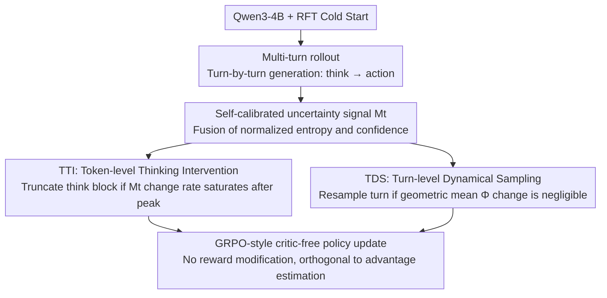

# T$^2$PO: Uncertainty-Guided Exploration Control for Stable Multi-Turn Agentic Reinforcement Learning

**Conference**: ICML 2026 Spotlight  
**arXiv**: [2605.02178](https://arxiv.org/abs/2605.02178)  
**Code**: https://github.com/WillDreamer/T2PO (Available)  
**Area**: LLM Reasoning / Agentic RL / Multi-turn Reinforcement Learning  
**Keywords**: Multi-turn RL, training collapse, self-calibrated uncertainty, token-level thinking intervention, turn-level dynamic resampling

## TL;DR
T$^2$PO attributes the training collapse of multi-turn agentic RL to "hesitation"—characterized by over-thinking at the token level and repetitive invalidity at the turn level. It utilizes a self-calibrated uncertainty signal $M_t$, which fuses entropy and confidence, to simultaneously drive Token-level Thinking Intervention (dynamically truncating think blocks) and Turn-level Dynamical Sampling (resampling ineffective turns). This approach consistently outperforms PPO, GRPO, and GiGPO across WebShop, ALFWorld, and Search QA.

## Background & Motivation

**Background**: Multi-turn agentic RL, where agents interact with environments like WebShop and ALFWorld for self-evolution, is a core paradigm for building reasoning-based LLM agents. Mainstream methods include PPO, GRPO, and GiGPO (group-based critic-free), often paired with rejection-FT cold starts and length penalties.

**Limitations of Prior Work**: All SOTA baselines suffer from "training collapse"—a sensitivity where success rates plummet and KL divergence/gradient norms explode across different random seeds. Existing mitigation strategies (fine-grained credit assignment, internal reward shaping, trajectory filtering) are either too coarse (trajectory-level filter) or rely on indirect reward shaping, resulting in training dynamics that are extremely sensitive to hyperparameters.

**Key Challenge**: Prior works treat "training efficiency" and "training stability" as a trade-off—accelerating rollouts introduces off-policy drift, while dense reward shaping distorts RL objectives. **Ours argues these are not contradictory**, provided the true cause of collapse is identified.

**Goal**: 1) Explain the causes of poor stability by identifying a unified failure mechanism; 2) Design dual-scale interventions at the token and turn levels; 3) Synchronously improve efficiency and stability without introducing additional reward shaping.

**Key Insight**: Analysis of training trajectories reveals that collapse stems from **low exploration efficiency**, manifested as two types of hesitation: (i) token-level over-thinking—long chains of thought where information gain has already saturated; (ii) turn-level repetitive invalidity—agents repeatedly attempting similar turns in an incorrect action space. This represents a systematic violation of the exploration-exploitation balance.

**Core Idea**: A self-calibrated signal $M_t = \alpha\tilde H_t + (1-\alpha)(1-\tilde C_t)$ is used to capture both "distribution sharpness" and "top-1 confidence." By monitoring the rate of change of $M_t$ between tokens, the think block is truncated when gain saturates. Similarly, if the change in $\Phi^k$ between turns is too small, the turn is resampled.

## Method

### Overall Architecture
The core assertion of T$^2$PO is that training collapse in multi-turn agentic RL is caused by low exploration efficiency due to "hesitation." Building upon a standard multi-turn RL pipeline (base LLM + RFT + GRPO-style updates), T$^2$PO keeps the reward function intact and inserts two interventions during rollout: **TTI (Token-level Thinking Intervention)** truncates think blocks when they saturate, and **TDS (Turn-level Dynamical Sampling)** resamples turns that fail to provide information gain. Both interventions share a underlying self-calibrated uncertainty signal $M_t$.

### Key Designs

**1. Self-calibrated uncertainty signal $M_t$: A reliable scalar for large vocabularies**

Interventions require measuring model certainty. However, single metrics have blind spots in large vocabularies like Qwen3 (152K). Shannon entropy $H_t=-\sum_i p_t^{(i)}\log p_t^{(i)}$ struggles to differentiate distributions at extremes, while top-$j$ confidence $C_t=-\frac{1}{j}\sum_{i=1}^j\log p_t^{(i)}$ ignores tail probabilities. T$^2$PO first performs intra-trajectory normalization: $\tilde H_t=(H_t-H_{\min})/(H_{\max}-H_{\min})$ and $\tilde C_t=(C_t-C_{\min})/(C_{\max}-C_{\min})$, then fuses them into:

$$M_t=\alpha\tilde H_t+(1-\alpha)(1-\tilde C_t).$$

Contour analysis demonstrates that $M_t$ inherits the tail sensitivity of entropy and the top-1 stratification of confidence, providing a consistent semantic threshold across different tokens and turns.

**2. TTI (Token-level Thinking Intervention): Precise truncation of think blocks**

Over-thinking at the token level involves long reasoning chains with saturated information gain. TTI monitors the adjacent change $\Delta_t^k=|M_t^k-M_{t-1}^k|$ starting from a minimum prefix length $L_{\min}$. Once the average change within a window $N$ falls below a threshold $\varepsilon$ (indicating "non-hesitation" convergence), the logit of the terminator `</think>` is set to $+\infty$ at step $t^*+1$, while others are set to $-\infty$. A fixed queue $\mathcal{Q}=[\texttt{</think>},\backslash n,\texttt{<action>}]$ is then injected to ensure structured output.

Crucial to TTI is **not truncating at the peak of $M_t$**. The uncertainty $M_t$ typically follows a "hump" shape. The peak often corresponds to task-specific tokens (e.g., product names in WebShop), which represent high information density rather than hesitation. TTI only acts in the "convergence zone" following the peak.

**3. TDS (Turn-level Dynamical Sampling): Resampling turns that fail to shift belief**

Collapse is also driven by agents repeating turns within an incorrect action space, wasting rollout budget and polluting gradients. TDS calculates a turn-level signal $\Phi^k=(\prod_{t=1}^T M_t)^{1/T}$ via the geometric mean (to ensure stability against outlier high-entropy tokens). If the change between adjacent turns $\Gamma^k=|\Phi^k-\Phi^{k-1}| < \eta$, the action $\mathbf{a}^k$ is discarded and the turn is resampled at the same state up to $B_{\max}$ times. This serves as a proxy for "accuracy" in multi-turn RL where dense rewards are absent.

### Loss & Training
The framework utilizes RFT cold starts, memory context windows (viewing the last $P$ turns), turn-level discounted returns $R(\tau^k)=\sum_{j=k}^K\beta^{j-k}r^j$, strict format penalties, and GRPO-style critic-free policy updates. Since TTI and TDS only intervene during the rollout phase, they are orthogonal to various advantage estimation methods.

## Key Experimental Results

### Main Results
Comparison on WebShop and ALFWorld benchmarks (average of 5 seeds ± std) using Qwen3-4B + RFT:

| Method | WebShop Task Score | WebShop Success Rate | ALFWorld Success Rate |
|------|---------------------|----------------------|------------------------|
| GPT-4o (Prompting) | 31.8 | 23.7 | 48.0 |
| Gemini-2.5-Pro (Prompting) | 42.5 | 35.9 | 60.3 |
| Claude Sonnet 4 (Prompting) | 45.6 | 39.8 | 63.7 |
| Qwen3-4B + SFT | 70.91 | 26.56 | 64.06 |
| PPO | 70.34 ± 8.63 | 61.93 ± 5.93 | 75.39 ± 3.81 |
| GRPO | 80.02 ± 7.94 | 68.56 ± 4.11 | 77.35 ± 0.62 |
| GiGPO | 86.03 ± 4.18 | 73.83 ± 3.04 | 80.47 ± 2.43 |
| **T$^2$PO (Ours)** | **Highest & Minimal std** | **Highest** | **Highest** |

Key Metric: T$^2$PO achieves the best performance across all three tasks while maintaining **significantly lower variance across seeds compared to baselines**, directly mitigating training collapse.

### Ablation Study

| Configuration | Key Observation | Description |
|------|---------|------|
| Full T$^2$PO | Optimal and stable | TTI + TDS both active |
| TTI only | Shorter think blocks, improved stability | Controls token-level hesitation |
| TDS only | Fewer invalid turns, high rollout efficiency | Controls turn-level hesitation |
| Pure entropy $H_t$ | Threshold failure due to low discriminative power | Validates necessity of $M_t$ |
| Pure confidence $C_t$ | Loss of tail info, TTI triggers at wrong locations | Validates necessity of fusion |
| Truncate at $M_t$ peak | Performance drop—removes critical task tokens | Validates sliding-window design |

### Key Findings
- The trajectory of $M_t$ follows a "hump" shape; the peak represents task-specific tokens, while the post-peak region represents redundant thinking.
- The combination of one-time activation, $L_{\min}$ prefix protection, and a sliding window is essential for TTI to avoid detrimental pruning.
- TDS utilizes the geometric mean for $\Phi^k$ because the arithmetic mean is too sensitive to individual high-entropy tokens.
- Efficiency and stability are improved without external reward shaping, validating that hesitation is the fundamental cause of collapse.

## Highlights & Insights
- **Unified Uncertainty**: Using a single self-calibrated signal ($M_t$) to unify interventions at two different scales (TTI and TDS) is a highly elegant approach.
- **Hard Intervention**: Using stop-gradient hard truncation and token queue injection in the rollout phase is more precise and effective than indirect "soft" length penalties.
- **Nuanced Peak Analysis**: The decision not to truncate at the $M_t$ peak recognizes that peaks often correspond to "high information density" rather than "over-thinking."
- **Turn-level Proxy**: The TDS mechanism, based on belief shifts, acts as a general-purpose trajectory quality controller that can be migrated to various multi-turn RL settings.

## Limitations & Future Work
- The abundance of thresholds ($\varepsilon, \eta, L_{\min}, N, B_{\max}$) currently requires manual tuning; automated tuning methods are not yet provided.
- Statistical normalization ($H_{\min}, H_{\max}$) may drift in very long-horizon tasks.
- Experiments were performed on 4B-scale models; scalability to 70B+ models or more complex environments like SWE-Bench remains to be tested.

## Related Work & Insights
- **vs. SimpleTIR / rStar2-Agent**: These methods filter entire trajectories post-hoc; T$^2$PO resamples individual turns during rollout, preserving effective data at a finer granularity.
- **vs. GiGPO / DAPO**: These modify advantage estimation; T$^2$PO modifies the rollout itself, making it orthogonal and compatible with these algorithms.
- **vs. SEED-GRPO / DeepConf**: These incorporate internal signals into the reward function; T$^2$PO uses signals for explicit intervention, avoiding the contamination of training dynamics caused by reward shaping.

## Rating
- Novelty: ⭐⭐⭐⭐ Dual-scale hesitation perspective + self-calibrated signal.
- Experimental Thoroughness: ⭐⭐⭐⭐ Coverage of multiple benchmarks with detailed variance analysis.
- Writing Quality: ⭐⭐⭐⭐ Strong logical flow articulating "hesitation is defeat."
- Value: ⭐⭐⭐⭐ Provides a plug-and-play stabilization tool for agentic RL.

<!-- RELATED:START -->

## Related Papers

- [\[ICLR 2026\] Unsupervised Evaluation of Multi-Turn Objective-Driven Interactions](../../ICLR2026/llm_nlp/unsupervised_evaluation_of_multi-turn_objective-driven_interactions.md)
- [\[AAAI 2026\] LILAD: Learning In-context Lyapunov-stable Adaptive Dynamics Models](../../AAAI2026/llm_nlp/lilad_learning_in-context_lyapunov-stable_adaptive_dynamics_models.md)
- [\[ACL 2026\] Confidence Estimation for LLMs in Multi-turn Interactions](../../ACL2026/llm_nlp/confidence_estimation_for_llms_in_multi-turn_interactions.md)
- [\[ACL 2026\] Generative Floor Plan Design with LLMs via Reinforcement Learning with Verifiable Rewards](../../ACL2026/llm_nlp/generative_floor_plan_design_with_llms_via_reinforcement_learning_with_verifiabl.md)
- [\[AAAI 2026\] Quantifying Conversational Reliability of Large Language Models under Multi-Turn Interaction](../../AAAI2026/llm_nlp/quantifying_conversational_reliability_of_large_language_models_under_multi-turn.md)

<!-- RELATED:END -->
