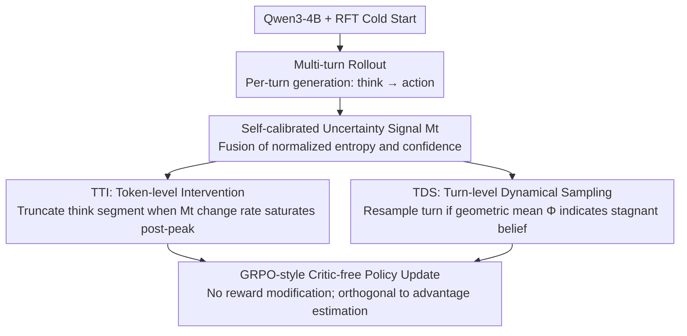

# T$^2$PO: Uncertainty-Guided Exploration Control for Stable Multi-Turn Agentic Reinforcement Learning

**Conference**: ICML 2026 Spotlight  
**arXiv**: [2605.02178](https://arxiv.org/abs/2605.02178)  
**Code**: https://github.com/WillDreamer/T2PO (Available)  
**Area**: LLM Reasoning / Agentic RL / Multi-turn Reinforcement Learning  
**Keywords**: Multi-turn RL, training collapse, self-calibrated uncertainty, token-level thinking intervention, turn-level dynamical resampling

## TL;DR
T$^2$PO attributes the training collapse of multi-turn agentic RL to "hesitation"—over-thinking at the token level and repetitive ineffectiveness at the turn level. By using a self-calibrated uncertainty signal $M_t$ that fuses entropy and confidence, it simultaneously drives Token-level Thinking Intervention (TTI) to dynamically truncate "think" segments and Turn-level Dynamical Sampling (TDS) to resample ineffective turns. It consistently outperforms PPO/GRPO/GiGPO on WebShop, ALFWorld, and Search QA with superior stability.

## Background & Motivation

**Background**: Multi-turn agentic RL, where agents undergo multiple interactions and self-evolution in environments like WebShop and ALFWorld, is a core paradigm for building reasoning-based LLM agents. Mainstream methods include PPO, GRPO, and GiGPO (group-based critic-free), often combined with techniques like rejection-FT cold starts and length penalties.

**Limitations of Prior Work**: All SOTA baselines suffer from "training collapse"—a sudden drop in success rates accompanied by exploding KL divergence and gradient norms across different random seeds. Existing mitigation strategies (fine-grained credit assignment, internal reward shaping, trajectory filtering) are either too coarse (trajectory-level) or rely on indirect reward shaping, making training dynamics extremely sensitive to hyperparameters.

**Key Challenge**: Prior works treat "training efficiency" and "training stability" as a trade-off. Accelerating rollouts introduces off-policy drift or stale policies, while dense reward shaping can distort the RL objective. **Ours argues these are not contradictory**—the key lies in identifying the true cause of collapse.

**Goal**: 1) Explain the causes of poor stability by identifying a unified failure mechanism; 2) Design dual-scale interventions at both the token and turn levels; 3) Synchronously improve efficiency and stability without introducing additional reward shaping.

**Key Insight**: Analysis of training trajectories reveals that collapse stems from **low exploration efficiency**, specifically manifesting as two types of "hesitation": (i) token-level over-thinking—long chains of thought where information gain has already saturated; (ii) turn-level repetition—agents repeatedly attempting the same ineffective turns in an incorrect action space. This represents a systematic violation of the exploration-exploitation trade-off.

**Core Idea**: Utilize a self-calibrated signal $M_t=\alpha\tilde H_t+(1-\alpha)(1-\tilde C_t)$ that captures both distributional sharpness and top-1 confidence. By monitoring the rate of change in $M_t$ between tokens, the "think" segment is truncated when information saturates. Similarly, if the change in the turn-level signal $\Phi^k$ is too small, the turn is resampled.

## Method

### Overall Architecture
The core premise of T$^2$PO is that training collapse in multi-turn agentic RL is caused by low exploration efficiency due to hesitation. Without altering rewards, it inserts two interventions into the rollout phase of a standard multi-turn RL pipeline (Base LLM + RFT + GRPO-style updates): **TTI (Token-level Thinking Intervention)** truncates saturated thinking chains, and **TDS (Turn-level Dynamical Sampling)** resamples turns that fail to provide information gain. Both interventions share the same underlying self-calibrated uncertainty signal $M_t$.

### Key Designs

**1. Self-calibrated Uncertainty Signal $M_t$: A Robust Scalar for Intervention**

Interventions require a reliable measure of model certainty. However, single metrics have blind spots in large vocabularies (e.g., Qwen3's 152K tokens). Shannon entropy $H_t=-\sum_i p_t^{(i)}\log p_t^{(i)}$ fails to distinguish sharp distributions effectively at extreme scales, while top-$j$ confidence $C_t=-\frac{1}{j}\sum_{i=1}^j\log p_t^{(i)}$ ignores the tail. T$^2$PO normalizes both within a trajectory to $\tilde H_t$ and $\tilde C_t$ and fuses them into:

$$M_t=\alpha\tilde H_t+(1-\alpha)(1-\tilde C_t).$$

The paper demonstrates that $M_t$ inherits both the tail-sensitivity of entropy and the top-1 layering of confidence, providing a consistent semantic threshold for both TTI and TDS across different turns.

**2. TTI (Token-level Thinking Intervention): Precise Truncation of Thinking Chains**

Token-level over-thinking occurs when the thought chain extends far beyond the point of information saturation. TTI monitors the adjacent change $\Delta_t^k=|M_t^k-M_{t-1}^k|$ starting after a minimum prefix length $L_{\min}$. If the average change within a window $N$ falls below a threshold $\varepsilon$ (indicating "non-hesitation" convergence), the logit for the terminator `</think>` is set to $+\infty$ to force stop the thinking.

Crucially, **truncation does not occur at the peak of $M_t$**. Uncertainty typically follows a "hump" shape; the peak often represents high-density task-specific tokens (e.g., product names in WebShop). TTI only activates in the "convergence zone" following the peak. Combined with a sliding window to smooth spikes and one-time activation per generation, it acts as an adaptive, precise hard-truncation mechanism.

**3. TDS (Turn-level Dynamical Sampling): Resampling Turns with Stagnant Belief**

Collapse is also driven by agents repeating turns in invalid action spaces, wasting rollout budgets and polluting gradients. TDS calculates a turn-level signal $\Phi^k=(\prod_{t=1}^T M_t)^{1/T}$ using a geometric mean (which is more robust to outlier high-entropy tokens than an arithmetic mean). If the change between adjacent turns $\Gamma^k=|\Phi^k-\Phi^{k-1}|$ is below a threshold $\eta$, the action $\mathbf{a}^k$ is discarded and the turn is resampled at the same state until $\Gamma^k \ge \eta$ or the limit $B_{\max}$ is reached. Unlike trajectory-level filters, TDS operates at a finer granularity during the rollout phase itself.

### Loss & Training
The system uses RFT cold starts, a memory context window (limited to recent $P$ turns), turn-level discounted returns $R(\tau^k)=\sum_{j=k}^K\beta^{j-k}r^j$, strict format penalties, and GRPO-style critic-free policy updates. Since TTI and TDS only intervene during rollouts, they are orthogonal and stackable with various advantage estimation methods.

## Key Experimental Results

### Main Results
Comparison on WebShop and ALFWorld (平均 ± std across 5 seeds), using Qwen3-4B + RFT as the base:

| Method | WebShop Task Score | WebShop Success Rate | ALFWorld Success Rate |
|------|---------------------|----------------------|------------------------|
| GPT-4o (Prompting) | 31.8 | 23.7 | 48.0 |
| Gemini-2.5-Pro (Prompting) | 42.5 | 35.9 | 60.3 |
| Claude Sonnet 4 (Prompting) | 45.6 | 39.8 | 63.7 |
| Qwen3-4B + SFT | 70.91 | 26.56 | 64.06 |
| PPO | 70.34 ± 8.63 | 61.93 ± 5.93 | 75.39 ± 3.81 |
| GRPO | 80.02 ± 7.94 | 68.56 ± 4.11 | 77.35 ± 0.62 |
| GiGPO | 86.03 ± 4.18 | 73.83 ± 3.04 | 80.47 ± 2.43 |
| **T$^2$PO (Ours)** | **Highest & Min Std** | **Highest** | **Highest** |

Key Finding: T$^2$PO achieves the best performance across all tasks with **significantly smaller variance across seeds**, directly addressing training collapse.

### Ablation Study

| Configuration | Key Phenomenon | Description |
|------|---------|------|
| Full T$^2$PO | Optimal and Stable | TTI + TDS both active |
| TTI Only | Shorter think segments, improved stability | Targets token-level hesitation |
| TDS Only | Fewer invalid turns, higher rollout efficiency | Targets turn-level hesitation |
| Pure Entropy $H_t$ | Threshold rules fail | Poor discriminative power in large vocab |
| Pure Confidence $C_t$ | Tail information lost, TTI misaligned | Validates necessity of fusion |
| Truncate at Peak $M_t$ | Performance drops | Cuts off critical task-specific tokens |

### Key Findings
- The trajectory of $M_t$ follows a "hump" shape. The peak correlates with critical reasoning, while the subsequent decline represents redundancy. This empirical finding is the soul of the TTI design.
- The combination of one-time activation, prefix protection ($L_{\min}$), and sliding windows ensures TTI does not inadvertently damage grounding.
- Using the geometric mean for $\Phi^k$ in TDS provides a more stable reflection of the overall turn belief by mitigating the impact of individual high-entropy tokens.
- Improving stability and efficiency without external reward shaping validates the core argument that hesitation is the root cause of collapse.

## Highlights & Insights
- **Unified Perspective**: Using a single self-calibrated uncertainty signal ($M_t$) to unify interventions across two different scales (TTI and TDS) is an elegant architectural choice.
- **Hard Intervention**: Using logit-driven hard truncation and token queue injection during rollouts is a "sharp tool" that is more deterministic and cleaner than indirect length penalties.
- **Post-Peak Logic**: The counter-intuitive detail of *not* truncating at the uncertainty peak shows a deep analysis of reasoning traces—truncating at the peak destroys task relevance.
- **Generalizability**: The TDS mechanism (resampling when belief shift is insufficient) is potentially applicable to any multi-turn RL setting, including tool-use and code agents.

## Limitations & Future Work
- The method introduces several hyperparameters ($\varepsilon, \eta, L_{\min}, N, B_{\max}$); an automated tuning method remains future work.
- The self-calibrated signal depends on normalization estimates ($H_{\min}, H_{\max}$), which might drift over very long horizons.
- Evaluation was focused on 4B-sized models; scalability to 70B+ models and highly complex environments like SWE-Bench has yet to be tested.

## Related Work & Insights
- **vs. SimpleTIR / rStar-Agent**: These methods filter entire trajectories post-rollout; T$^2$PO resamples at the turn level during rollout, saving data and increasing granularity.
- **vs. GiGPO / DAPO**: These modify advantage estimation; T$^2$PO modifies the rollout process itself, making the two approaches orthogonal.
- **vs. SEED-GRPO**: While others feed internal signals back into rewards (reward shaping), T$^2$PO uses them for explicit control, avoiding the risk of "polluting" the RL objective.

## Rating
- Novelty: ⭐⭐⭐⭐
- Experimental Thoroughness: ⭐⭐⭐⭐
- Writing Quality: ⭐⭐⭐⭐
- Value: ⭐⭐⭐⭐

<!-- RELATED:START -->

<!-- RELATED:END -->

## Related Papers

- [\[ICLR 2026\] Unsupervised Evaluation of Multi-Turn Objective-Driven Interactions](../../ICLR2026/llm_nlp/unsupervised_evaluation_of_multi-turn_objective-driven_interactions.md)
- [\[AAAI 2026\] LILAD: Learning In-context Lyapunov-stable Adaptive Dynamics Models](../../AAAI2026/llm_nlp/lilad_learning_in-context_lyapunov-stable_adaptive_dynamics_models.md)
- [\[ACL 2026\] Generative Floor Plan Design with LLMs via Reinforcement Learning with Verifiable Rewards](../../ACL2026/llm_nlp/generative_floor_plan_design_with_llms_via_reinforcement_learning_with_verifiabl.md)
- [\[AAAI 2026\] Quantifying Conversational Reliability of Large Language Models under Multi-Turn Interaction](../../AAAI2026/llm_nlp/quantifying_conversational_reliability_of_large_language_models_under_multi-turn.md)
- [\[ACL 2025\] SudoLM: Learning Access Control of Parametric Knowledge with Authorization Alignment](../../ACL2025/llm_nlp/sudolm_authorization_alignment.md)

<!-- RELATED:END -->
