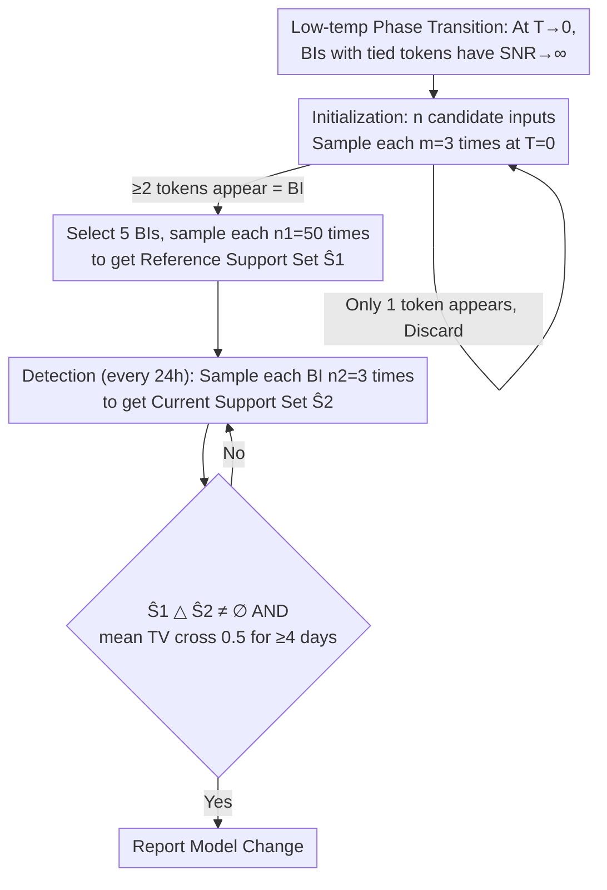

# Token-Efficient Change Detection in LLM APIs

**Conference**: ICML 2026  
**arXiv**: [2602.11083](https://arxiv.org/abs/2602.11083)  
**Code**: https://github.com/timothee-chauvin/token-efficient-change-detection-llm-apis  
**Area**: Trustworthy LLM Deployment / Model Change Detection  
**Keywords**: Black-box change detection, Border Inputs (BI), Low-temperature phase transition, Local Asymptotic Normality, B3IT

## TL;DR
The authors demonstrate that under low-temperature sampling, specific inputs where "two token logits are nearly tied" (Border Inputs) are extremely sensitive to parameter perturbations—theoretically, the SNR diverges as $T \to 0$. This allows for LLM API change detection using minimal requests by observing only output tokens (strict black-box). The proposed B3IT matches gray-box logprob methods at 1/30th the cost on the TinyChange benchmark and detected 8 real-world model replacements during 23 days of continuous monitoring across 93 commercial endpoints.

## Background & Motivation
**Background**: LLM API providers occasionally replace models silently (quantization, new versions, rollbacks) without user notification; in 2025, unannounced changes at Anthropic and Grok affected millions of requests. Existing change detection methods fall into three categories: white-box (ESF, TRAP, requiring weights/gradients), gray-box (LT, requiring logprobs), and black-box (MET, MMLU-ALG, observing only output tokens but requiring high request volume and cost).

**Limitations of Prior Work**: White-box methods require open weights, making them inapplicable to closed-source APIs. Gray-box methods require logprobs, which many APIs (including most endpoints on OpenRouter) do not return. Black-box methods like MET compare output distributions across multiple tokens using MMD, making continuous monitoring prohibitively expensive (DailyBench ceased operations after 40 days with only 5 endpoints).

**Key Challenge**: Black-box change detection must simultaneously satisfy (i) strict observation of output tokens only, (ii) low-cost sustainable monitoring, and (iii) high sensitivity to detect minor changes (quantization, single-step fine-tuning). These three objectives seem contradictory; intuitively, output tokens are lossy compressions of logits via argmax/softmax and should be insensitive to small perturbations.

**Goal**: (i) Establish a theoretical foundation for "output token black-box change detection" to identify conditions for high sensitivity; (ii) translate this theory into a practical algorithm; (iii) validate the method on both controlled benchmarks and real-world production APIs.

**Key Insight**: Starting from Neyman-Pearson optimal detection, the Local Asymptotic Normality (LAN) framework is used to analyze the optimal SNR under "small perturbation + multiple sampling" mechanisms. The authors find that $\text{SNR}^2$ is a quadratic form involving the Fisher information and the model's Jacobian. At the low-temperature limit, a sharp dichotomy appears: when the output distribution collapses to a single token, SNR $\to 0$ (undetectable); when two tokens are tied, SNR $\to \infty$ (extremely detectable). This "phase transition" inspires the concept of Border Inputs (BI).

**Core Idea**: Specifically identify inputs where exactly two tokens are nearly tied at low temperatures, using their output token distributions (uniform on $\{1, \dots, k\}$) as a model fingerprint. Any parameter perturbation causes the BI to collapse into a single-token output, making detection nearly free.

## Method

### Overall Architecture
B3IT aims to cheaply monitor whether an API endpoint has been silently replaced under strict black-box conditions. It operates in two phases: **Initialization**, where $n$ candidate inputs are sampled $m=3$ times at $T=0$ to identify "Border Inputs" (BI) that produce $\ge 2$ distinct output tokens, followed by selecting 5 BIs and sampling each $n_1=50$ times to store a reference distribution; then **Detection**, where each BI is sampled $n_2=3$ times daily to obtain the current support set $\hat S_2$. A change is reported if a token appears that was never seen in the reference set ($\hat S_1 \triangle \hat S_2 \ne \emptyset$). Each BI detection costs only 3 tokens, hence "token-efficient."

### Key Designs

**1. Border Inputs and Low-Temperature Phase Transition: Elevating BI from Empirical Trick to Mathematical Optimum**

Intuitively, output tokens are lossy results of argmax/softmax operations on logits, suggesting they should be insensitive to small parameter perturbations. The authors address this using the Local Asymptotic Normality (LAN) framework: for a parameter perturbation $\theta \mapsto \theta + \epsilon h$, the Type-II error of Neyman-Pearson optimal detection is dominated by a scalar $\text{SNR}^2(h) = h^T J^T F(\mathbf p_0)^{-1} h$ (where $J$ is the Jacobian of the output distribution and $F$ is the Fisher information). Expanding this for Transformer structures yields $\text{SNR}^2(h) = \frac{1}{\tau^2} h^T J_z^T \Sigma(\mathbf p^{(\tau)}) J_z h$, where temperature $\tau$ enhances the signal inversely by its square. A sharp dichotomy occurs at $\tau \to 0$: if logits have a unique maximum ($k=1$), the SNR $\to 0$ (undetectable); if $k \ge 2$ logits are tied (exactly what a BI is), SNR $\to +\infty$, making detection nearly free—this is a sharp phase transition (Theorem 3.3). Consequently, BIs are "singularities" in logit space where any perturbation affecting the rank of tied logits causes a discrete jump in token output.

**2. Black-box BI Discovery + Support Set Difference Detection: Detecting Without Weights via Set Comparison**

Theory points to BIs, but they must be found without weight access. The authors sample $n$ random inputs $m=3$ times at $T=0$: due to inference non-determinism and floating-point rounding, BIs are likely to produce $\ge 2$ different tokens, while non-BIs consistently output the same token. "Producing $\ge 2$ tokens" thus becomes the criterion for a BI. At $T=0$, a BI's output follows a uniform distribution $\text{Unif}(S_1)$ over its support set, collapsing the detection task from "estimating distribution distance" to a simple support set test: $H_0: S_1=S_2$ vs $H_1: S_1 \ne S_2$. The rejection region is $\mathcal R = (\hat S_1 \setminus \hat S_2) \cup (\hat S_2 \setminus \hat S_1) \ne \emptyset$—an alarm is triggered if an unseen token appears. The authors prove that for $k=2, n_1=n_2=n$, this five-line test is optimal up to a constant factor compared to Neyman-Pearson (Theorem 4.3).

**3. $m=3$ and Multi-prompt Aggregation: Minimizing Cost, Maximizing Accuracy**

Cost is the bottleneck for black-box methods. This work optimizes two engineering knobs. First, the number of samples during BI search: to determine if an input is a BI, an envelope calculation in Appendix C shows $m=3$ is optimal when the BI ratio is $< 75\%$. Second, the token budget during detection: rather than deep sampling a single prompt, averaging the TV distance across 5 distinct prompts as a detection statistic yields a significantly higher ROC AUC for the same budget. This confirms the statistical intuition that spreading checks "wide and shallow" across independent BIs is more efficient than going "narrow and deep" on one.

### Training Strategy
The method is entirely training-free and requires no gradient or weight access. The deployment protocol is fixed: BI count = 5, reference samples $n_1=50$, detection samples $n_2=3$, detection interval = 24 hours. A persistent change is identified only if the mean TV moves from $<0.5$ to $>0.5$ for $\ge 4$ consecutive days to filter out transient noise.

## Key Experimental Results

### Main Results
TinyChange in-vitro evaluation (9 models, 0.5B-9B, various perturbations):

| Method | Type | ROC AUC | Annual Cost |
|---|---|---|---|
| LT (Gray-box, requires logprob) | Gray-box | ~0.95 | <$1 |
| **B3IT (Ours)** | **Black-box** | **0.90** | **$2.2** |
| MET ($T=0$) | Black-box | 0.61→0.88 | $2.2→$67 |
| MMLU-ALG | Black-box | Much Lower | Higher |

For extremely weak perturbations (single-step fine-tuning), B3IT still achieves an ROC-AUC of 0.87.

In-vivo commercial endpoint evaluation (93 endpoints, 64 models, 20 providers, 23 days):

| Metric | Value |
|---|---|
| BI presence rate at $T=0$ | 62% |
| BI presence rate at $T>0$ | 80% |
| Endpoints unable to find BI | 18 (mostly reasoning models with failed reasoning-disable) |
| Persistent changes detected | 8 endpoints (including Together AI's Mistral-7B → Ministral-3-14B) |
| Avg BI monitoring cost | $0.52 / endpoint / year (hourly checks) |
| Initialization cost | $0.0045 / endpoint (negligible) |

### Ablation Study

| Configuration | Key Finding | Implication |
|---|---|---|
| Prompts × samples Pareto scan | 5×10 is better than 1×50 | Multi-prompt aggregation is superior |
| $m=1$ vs $m=3$ vs $m=10$ | $m=3$ is most efficient | Confirms envelope calculations |
| $T=0$ vs $T>0$ | $T>0$ finds more BIs but quality drops | Phase transition weakens as temperature increases |

### Key Findings
- BIs are prevalent in practice (62% of endpoints at $T=0$) because finite floating-point precision and inference non-determinism cause "theoretically zero-probability" logit ties to occur frequently.
- Among the 8 "persistent changes" detected on commercial endpoints, one directly matched an announcement by Together AI (Mistral-7B-Instruct-v0.3 replaced by Ministral-3-14B-Instruct-2512), proving the method works in the real world.
- 18 endpoints failed to yield BIs—predominantly reasoning models where reasoning could not be disabled or output token lengths were restricted.

## Highlights & Insights
- **Deriving Nomenclature from Theoretical Phenomena**: BI is not a "trick found by trial," but a singularity emerging naturally from LAN and low-temperature limit analysis. This transforms engineering research into science.
- **Support Set Difference as Neyman-Pearson Optimal**: Reducing complex distribution testing to "checking for new tokens" is simple enough for 5 lines of code yet proven optimal up to a constant factor.
- **Floating-Point Precision and Non-determinism as BI Sources**: While logit ties have zero probability in theory, GPU batch-size dependency and FP16/BF16 rounding turn hardware "bugs" into a "feature" for detection.

## Limitations & Future Work
- Only uses the first output token; dependencies between multiple tokens are ignored, losing significant signal.
- BI is a joint product of the model and the provider's infrastructure; changes in GPUs or CUDA versions may alter BI distributions, leading to false positives for "model changes" (though these are technically "deployment changes").
- Ineffective for reasoning models (reasoning cannot be disabled, making the first token delayed or unreadable).
- Adversarial providers could intentionally force BIs to output a single token (e.g., via "sticky-mode" system prompts) to deceive B3IT.
- Future directions: Expanding to multi-token sequences (modeling dependencies via Markov chains); hybrid detection with LT; studying robustness against adversarial changes.

## Related Work & Insights
- **vs MET (Gao et al. 2025)**: MET uses MMD + Hamming kernel on multi-token distributions and is 30x more expensive than B3IT.
- **vs LT (Chauvin et al. 2026)**: LT requires logprobs; B3IT performs nearly as well without them, offering broader coverage.
- **vs ESF / TRAP (White-box)**: These require weights; B3IT is strictly black-box.
- **vs LLM Fingerprinting (Pasquini et al. 2025)**: Fingerprinting seeks stability under small changes to identify models, whereas B3IT seeks maximum sensitivity to trigger alerts.

## Rating
- Novelty: ⭐⭐⭐⭐⭐ Successfully translates "low-temperature phase transition" into the practical BI concept.
- Experimental Thoroughness: ⭐⭐⭐⭐ Extensive in-vitro and in-vivo testing; lacks only adversarial scenarios.
- Writing Quality: ⭐⭐⭐⭐⭐ Flawless transition from mathematical theorems to a 5-line-of-code detector.
- Value: ⭐⭐⭐⭐⭐ A 1/30th cost black-box monitor is a massive asset for production systems relying on LLM APIs.

<!-- RELATED:START -->

## Related Papers

- [\[CVPR 2025\] The Change You Want To Detect: Semantic Change Detection In Earth Observation With Hybrid Data Generation](../../CVPR2025/llm_nlp/the_change_you_want_to_detect_semantic_change_detection_in_earth_observation_wit.md)
- [\[ICML 2026\] 结构化广义线性 token mixing：用 SND + Kronecker 在复杂度与表达力之间换挡](trading_complexity_for_expressivity_through_structured_generalized_linear_token_.md)
- [\[ACL 2025\] AgentDropout: Dynamic Agent Elimination for Token-Efficient and High-Performance LLM-Based Multi-Agent Collaboration](../../ACL2025/llm_nlp/agentdropout-dynamic-agent-elimination-for-multi-agent-collaboration.md)
- [\[ICML 2026\] YAQA: 端到端 KL 最小化的 LLM 自适应权重量化](model-preserving_adaptive_rounding.md)
- [\[ICML 2026\] Universal Reasoner: 冻结 LLM 的可组合即插即用推理器](universal_reasoner_a_single_composable_plug-and-play_reasoner_for_frozen_llms.md)

<!-- RELATED:END -->
