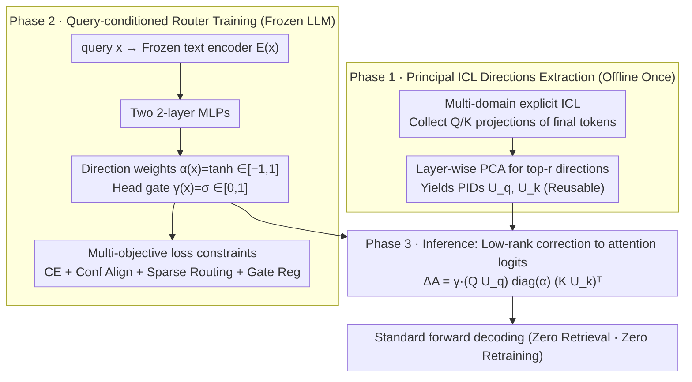

# In-Context Routing (ICR): Train-Once, Use-Everywhere Attention-Level Implicit ICL

**Conference**: ICML 2026  
**arXiv**: [2509.22854](https://arxiv.org/abs/2509.22854)  
**Code**: https://github.com/Lijiaqian1/In-Context-Routing.git  
**Area**: LLM Efficient Inference / Implicit ICL / Attention Editing  
**Keywords**: Implicit ICL, Attention Routing, Principal ICL Directions, Cross-domain Generalization, Zero-shot Inference

## TL;DR
Instead of injecting shift vectors into the residual stream, ICR extracts Principal ICL Directions (PIDs) from multi-domain ICL via PCA to serve as low-rank correction directions for attention logits, adaptively modulated by a query-conditioned router. After a single training phase, it enables zero-shot inference across 12 in/out-of-domain tasks without task-specific retrieval or retraining, avoiding the degradation on OOD tasks typical of vector-based methods.

## Background & Motivation

**Background**: In-Context Learning (ICL) allows LLMs to learn new tasks by adding few-shot examples (ICD) to the prompt. However, it faces two main pain points: (1) ICD increases sequence length, doubling inference costs; (2) performance is fragile and sensitive to the order/format of ICD. Implicit ICL converts ICD into dense vectors injected into the model's hidden layers to simulate ICL effects (Hendel et al. 2023, Liu et al. 2023, Li et al. 2024).

**Limitations of Prior Work**: Vector-based implicit ICL adds a shift vector $\mathbf{V}^l_{\mathrm{shift}}$ to the residual stream ($\tilde{\mathbf{h}}^l = \mathbf{h}^l + \beta^l \cdot \mathbf{V}^l_{\mathrm{shift}}$), which has significant limitations: (1) fixed-size vectors have limited capacity, requiring new vectors for new knowledge; (2) post-hoc addition to the residual stream cannot control internal information flow; (3) vectors are tied to specific tasks during training, leading to degradation or even performance worse than zero-shot on OOD tasks (e.g., M2IV collapses on 3 out of 7 OOD tasks).

**Key Challenge**: Generalization requires "task-agnostic ICL patterns," but shifts in vector-based methods are task-specific. To achieve task-agnosticism, the ICL mechanism itself (rather than ICD content) must be distilled.

**Goal**: To identify a task-agnostic ICL pattern that is reusable across domains after a single training phase, without relying on task retrieval or retraining.

**Key Insight**: Observations show that multi-task ICL prompting can sometimes exceed both zero-shot and the strongest single-source few-shot performance, but can also hinder it (Figure 1). This suggests that the "utility" of ICL lies in latent cross-task patterns rather than specific ICD content; explicit prompting introduces noise that masks these patterns. Therefore, these patterns should be distilled deep within the attention space.

**Core Idea**: Perform explicit ICL across multiple domains, collect query/key projections from the final token of each prompt at every layer, and use PCA to extract Principal ICL Directions (PIDs) $U_q^l, U_k^l \in \mathbb{R}^{d \times r}$. A query-conditioned router then calculates routing vectors $\alpha^l(x)$ and head gates $\gamma^l(x)$ to apply a low-rank correction $\Delta \mathbf{A}^l = (Q_{\mathrm{zs}} U_q^l) \mathrm{diag}(\alpha^l) (K_{\mathrm{zs}} U_k^l)^\top$ to the attention logits.

## Method

### Overall Architecture

ICR shifts "implicit ICL" from additive offsets in the residual stream to low-rank modulation of attention logits. The process involves three stages: (1) offline explicit ICL across $\mathbb{D}$ domains to extract task-agnostic PIDs $U_q^l, U_k^l$ using PCA; (2) training a query-conditioned router (with frozen LLM) to output layer-wise direction weights $\alpha(x)$ and head gates $\gamma(x)$; (3) zero-retrieval/zero-retraining inference by calculating $\alpha, \gamma$ for any new query and applying the low-rank correction to attention logits. The pipeline is illustrated below:

### Key Designs

**1. Principal ICL Directions: Distilling "How to ICL" into cross-domain stable attention directions via PCA**

Vector-based implicit ICL compresses entire ICD segments into a fixed-size shift vector, which is capacity-limited and task-bound, causing collapse when changing domains. ICR instead captures the structural "query-key matching geometry" that makes ICL effective. The final token of each prompt integrates context; its $Q^l, K^l$ projections carry the signal to "respond in ICL mode." By stacking these projections across $\mathbb{D}$ domains into ICL bases $\tilde{Q}^l, \tilde{K}^l \in \mathbb{R}^{N\times d}$ and applying PCA, the top-$r$ directions reveal the PIDs.

The theoretical basis for PCA extracting shared patterns is provided via the Spiked Covariance Model: the covariance $\Sigma_Q^{(\mathbb{d})} = S_q \Lambda_q S_q^\top + B_{q,\mathbb{d}} \Gamma_{q,\mathbb{d}} B_{q,\mathbb{d}}^\top + \sigma^2 I$, where $S_q$ is the shared ICL structure and $B_{q,\mathbb{d}}$ represents domain-specific variations. Given diverse domains, the domestic terms average out to near-isotropic noise in the pooled covariance, allowing PCA to recover $S_q$. Geometrically, this is more faithful to ICL mechanisms than additive shifts (as ICL is primarily driven by attention heads). PIDs are extracted independently per layer to accommodate varying linguistic roles.

**2. Query-conditioned router: Adaptive modulation of low-rank direction weights × head gates**

To decide how much to modulate along which directions for a specific query, ICR uses a frozen text encoder to compute query embeddings $E(x)$. Two 2-layer MLPs then output: direction weights $\alpha(x) = \tanh(g_{\theta_\alpha}(E(x))) \in \mathbb{R}^{L\times r}$, where $\tanh$ allows both enhancement and suppression of PID directions; and head gates $\gamma(x) = \sigma(g_{\theta_\gamma}(E(x))) \in \mathbb{R}^{L\times H}$, which act as soft binary switches for per-layer heads.

The final attention logits are modified as $\tilde{\mathbf{A}}^{l,h}(x) = \mathbf{A}^{l,h}(x) + \gamma^{l,h}(x)\,(Q_{\mathrm{zs}^l U_q^l)\,\mathrm{diag}(\alpha^l(x))\,(K_{\mathrm{zs}}^l U_k^l)^\top$. This correction is a layer-shared low-rank bias multiplied by per-head $\gamma^{l,h}$ gates, maintaining differentiability between heads while keeping parameter overhead minimal (router MLPs are $\le 10M$, negligible compared to a 7B LLM). Inference latency remains nearly identical to zero-shot.

### Loss & Training

With the LLM frozen, the router is trained using a weighted sum of four objectives $\mathcal{L} = \mathcal{L}_{\mathrm{CE}} + \lambda_{\mathrm{conf}}\mathcal{L}_{\mathrm{conf}} + \lambda_{\mathrm{spar}}\mathcal{L}_{\mathrm{spar}} + \lambda_{\mathrm{gate}}\mathcal{L}_{\mathrm{gate}}$:

- **Supervised CE** $\mathcal{L}_{\mathrm{CE}}$ guides the router to the correct answers, but alone it might create a shortcut that bypasses the ICL mechanism.
- **Confidence Alignment** $\mathcal{L}_{\mathrm{conf}} = \frac{1}{B}\sum \mathrm{ReLU}\big(H(\mathrm{softmax}(p_i^{\mathrm{ICR}})) - H(\mathrm{softmax}(p_i^{\mathrm{zs}}))\big)$ penalizes cases where ICR is less confident than zero-shot (lower entropy $H$ is better). This ensures the modulation doesn't degrade performance below the zero-shot baseline, which is critical for OOD stability.
- **Sparse Routing** $\mathcal{L}_{\mathrm{spar}} = \mathbb{E}_x\big[\frac{1}{L}\sum_l w^l \|\alpha^l(x)\|_1 / r\big]$ pushes weights toward zero to minimize intervention and improve interpretability. Weights $w^l$ increase linearly with depth, reflecting the layer-wise structure of LLMs (early layers process broadly, later layers make specific decisions).
- **Gate Regularization** $\mathcal{L}_{\mathrm{gate}} = \mathbb{E}_x\big[\frac{1}{L}\sum_l \|\gamma^l(x)\|_1 / H\big]$ similarly constrains head gates to be sparse, activating only essential heads.

## Key Experimental Results

### Main Results: 12 Benchmarks (5 ID + 4 Near OOD + 3 Far OOD)

| Model/Method | AG | SST-2 | TREC | CSQA | PIQA | SST-5 | MR | MRPC | CB | COPA | CREAK | AI2SciE | Average | Collapse |
|---|---|---|---|---|---|---|---|---|---|---|---|---|---|---|
| **Llama2-7B** | | | | | | | | | | | | | | |
| Zero-shot | 67.0 | 78.6 | 56.6 | 22.4 | 52.2 | 25.8 | 72.2 | 44.4 | 37.5 | 63.0 | 51.8 | 34.8 | 50.5 | – |
| Few-shot* | 81.0 | 95.2 | 84.6 | 58.0 | 59.8 | 37.4 | 98.6 | 68.2 | 41.1 | 82.0 | 50.8 | 45.4 | 66.8 | 1 |
| I2CL | 85.5 | 86.0 | 78.6 | 23.8 | 55.6 | 27.6 | 71.6 | 42.4 | 38.2 | 63.6 | 52.6 | 35.0 | 55.0 | **2** |
| LIVE | 86.0 | 86.2 | 81.0 | 24.2 | 56.4 | 32.8 | 73.8 | 47.6 | 40.8 | 64.8 | 51.0 | 34.6 | 56.6 | **2** |
| M2IV | 86.4 | 86.4 | 81.5 | 24.8 | 56.8 | 30.8 | 74.0 | 46.0 | 42.6 | 64.8 | 54.0 | 35.2 | 56.9 | 0 |
| **ICR** | 86.6 | 86.4 | 83.8 | 24.8 | 57.0 | **38.6** | **79.8** | **53.4** | **46.4** | **68.0** | **56.4** | **37.2** | **59.9** | **0** |
| **Qwen2.5-7B** | | | | | | | | | | | | | | |
| Zero-shot | 66.8 | 54.0 | 65.8 | 80.4 | 76.2 | 31.4 | 64.4 | 72.4 | 83.9 | 92.0 | 77.8 | 90.4 | 71.3 | – |
| Few-shot* | 80.2 | 95.6 | 67.6 | 82.2 | 86.0 | 37.2 | 70.2 | 76.2 | 83.9 | 95.0 | 59.7 | 95.8 | 77.5 | 1 |
| I2CL | 77.0 | 86.4 | 68.6 | 81.6 | 81.2 | 34.6 | 69.0 | 70.8 | 80.6 | 92.6 | 74.8 | 91.8 | 75.6 | **3** |
| LIVE | 79.0 | 87.8 | 70.4 | 81.6 | 82.0 | 30.8 | 68.6 | 69.4 | 81.0 | 93.2 | 72.8 | 91.8 | 75.7 | **4** |
| M2IV | 79.6 | 89.0 | 70.8 | 81.8 | 82.5 | 31.6 | 71.2 | 71.0 | 76.0 | 93.5 | 74.6 | 92.4 | 76.2 | **3** |
| **ICR** | 80.4 | 91.0 | 70.6 | 82.0 | 82.6 | **41.4** | **89.4** | 73.2 | **84.6** | 95.0 | **79.2** | **93.2** | **80.2** | **0** |

ICR achieves SOTA on both LLMs: Llama2-7B average 59.9 vs M2IV 56.9 (+3.0), Qwen2.5-7B average 80.2 vs M2IV 76.2 (+4.0). Most significantly, it maintains **Collapse=0**, whereas baselines frequently perform worse than zero-shot on OOD tasks.

### Key Findings

- **ICR is the only method that avoids OOD collapse**: While other baselines collapse on 3-4 tasks on Qwen, ICR never degrades, proving that attention-level patterns are more generalizable than residual-level vectors.
- **Model-Agnostic Effectiveness**: Results are consistent across architecture-diverse Llama2 and Qwen2.5 (7B), validating the PID + router design.
- **Significant Gains on Near OOD (MR)**: On Qwen, ICR scores 89.4 vs others ~70 (+19), showing high efficiency in tasks similar to the training domain.
- **Outperforming Few-Shot on Far OOD (CREAK)**: On Llama, ICR (56.4) exceeds few-shot (50.8), demonstrating that the distilled mechanism is more stable than explicit examples.
- **No Task Retrieval Required**: Unlike M2IV/LIVE which require task-specific vectors at inference, ICR uses a single set of PIDs and one router for all tasks.

## Highlights & Insights

- **Paradigm Shift**: Moves from "ICL as a hidden state offset" to "ICL as attention geometry modulation," aligning more closely with the mechanistic nature of ICL.
- **Theoretical Foundation**: Uses the Spiked Covariance Model to prove that PCA on multi-domain bases recovers shared ICL structures.
- **Train once, reuse everywhere**: The first implicit ICL method to truly achieve task-agnostic generalization.
- **Structural Loss Benefits**: Each loss term serves a clear purpose, such as prevents degradation via confidence alignment and utilizing layer-wise weighted sparsity to respect model architecture.
- **Minimal Parameters**: Router MLPs are $\le 10M$, and the system maintains zero-shot latency during inference.

## Limitations & Future Work

- **Dependence on Initial ICL Data**: Extracting PIDs requires labeled examples from multiple domains for the initial offline phase.
- **Optimal Domain Mix**: The impact of training data composition on OOD generalization has not been systematically analyzed.
- **Rank $r$ Selection**: The PID rank is a hyperparameter for which a thorough scan is missing.
- **Reasoning-Heavy Tasks**: Evaluations concentrated on classification/QA; effectiveness on long CoT tasks like math or code is unknown.
- **Model Scaling**: Experiments were limited to 7B models; scalability to 70B+ models is untested.

## Related Work & Insights

- **vs I2CL / LIVE / M2IV**: These prior works suffer from OOD collapse due to their residual-level shift paradigm; ICR solves this by shifting to the attention-level.
- **vs ICV / FV / TV / ELICIT**: These are attention-space methods but are task-specific; ICR is the first task-agnostic, train-once attention routing method.
- **vs PEFT (LoRA/Prefix Tuning)**: PEFT requires a separate group of adapters for each task, while ICR uses a single set for cross-task inference.
- **Mechanism Insight**: Drawing from MoE, ICR routes among low-rank directions in attention space rather than full MLP experts, reducing parameter count by three orders of magnitude.

## Rating

- Novelty: ⭐⭐⭐⭐⭐ 
- Experimental Thoroughness: ⭐⭐⭐⭐⭐ 
- Writing Quality: ⭐⭐⭐⭐ 
- Value: ⭐⭐⭐⭐⭐ 

<!-- RELATED:START -->

## Related Papers

- [\[AAAI 2026\] ICL-Router: In-Context Learned Model Representations for LLM Routing](../../AAAI2026/llm_nlp/icl-router_in-context_learned_model_representations_for_llm_routing.md)
- [\[ICML 2026\] SLAY: Geometry-Aware Spherical Linearized Attention with Yat-Kernel](slay_geometry-aware_spherical_linearized_attention_with_yat-kernel.md)
- [\[ICML 2026\] Deep Networks Learn to Parse Uniform-Depth Context-Free Languages from Local Statistics](deep_networks_learn_to_parse_uniform-depth_context-free_languages_from_local_sta.md)
- [\[ACL 2026\] C-World: A Computer Use Agent Environment Creator](../../ACL2026/llm_nlp/c-world_a_computer_use_agent_environment_creator.md)
- [\[ICLR 2026\] Near-Optimal Online Deployment and Routing for Streaming LLMs](../../ICLR2026/llm_nlp/near-optimal_online_deployment_and_routing_for_streaming_llms.md)

<!-- RELATED:END -->
