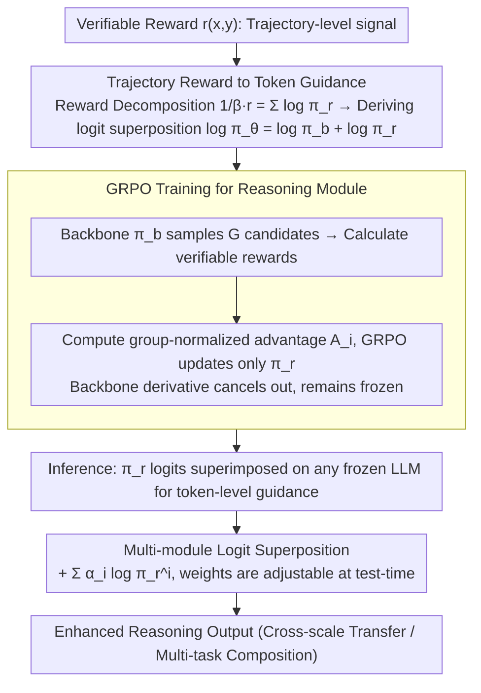

# Universal Reasoner: Composable Plug-and-Play Reasoners for Frozen LLMs

**Conference**: ICML 2026  
**arXiv**: [2505.19075](https://arxiv.org/abs/2505.19075)  
**Code**: https://github.com/hangeol/UniR  
**Area**: LLM Reasoning  
**Keywords**: Reasoning Enhancement, Modular Reasoning, Composable Reasoning, Frozen LLM, Verifiable Rewards

## TL;DR
The authors propose Universal Reasoner (UniR), which trains independent lightweight reasoning modules to capture reward-oriented behaviors. At inference, these modules are combined with frozen LLMs via logit superposition, enabling reasoning enhancement without fine-tuning the backbone, cross-model scale transfer, and multi-task composition.

## Background & Motivation

**Background**: Current methods enhance LLM reasoning via Reinforcement Learning Fine-Tuning (RFT), but they require significant compute and memory. PEFT methods like LoRA reduce costs but suffer from (1) strong architectural dependence, limiting transferability across scales (e.g., 3B to 14B), and (2) a lack of theoretical support for the linear combination of multiple LoRA adapters.

**Limitations of Prior Work**: Existing methods cannot flexibly and efficiently enhance reasoning without access to LLM internal parameters. They fail to reuse reasoning capabilities across model scales or compose multiple reasoning modules for different tasks.

**Key Challenge**: Reasoning enhancement typically requires parameter updates (traditional fine-tuning), yet models are often frozen. Multi-task learning requires end-to-end retraining, often leading to conflicting objectives.

**Goal**: Design a modular, transferable, and composable method for reasoning enhancement.

**Key Insight**: The authors observe that verifiable rewards (e.g., correctness in math) can be converted from trajectory-level signals to token-level guidance. By modeling trajectory reward as the sum of log-probabilities from a reasoning module, logit superposition emerges as a natural composition mechanism.

**Core Idea**: Separate reward model training from policy updates by training a dedicated reasoning module $\pi_r$ to maximize verifiable rewards. During inference, token generation is guided by adding its logits $\log\pi_r$ to the logits of a frozen backbone $\pi_b$.

## Method

### Overall Architecture
UniR decouples "reasoning enhancement" from the frozen LLM, treating it as a detachable component. During training, an independent reasoning module $\pi_r$ is optimized on a small backbone using GRPO to internalize "reward-oriented reasoning behavior." During inference, the logits of $\pi_r$ are directly superimposed onto the logits of any frozen LLM for token-level guidance. The backbone remains untouched, while modules can be swapped or combined in parallel.

### Key Designs

**1. Trajectory Reward to Token Guidance: Converting Global Correctness into Step-wise Navigation**

Verifiable rewards (e.g., final answer correctness) are inherently trajectory-level, as $r(x,y)$ is only known after the sequence is generated. However, generation occurs token-by-token. UniR addresses this by imposing a structural assumption: the trajectory reward is expressed as the sum of log-probabilities of the reasoning module: $\frac{1}{\beta}r(x,y)=\sum_{t=1}^{|y|}\log\pi_r(y_t|x,y_{<t};\phi)$. Substituting this into a KL-regularized policy optimization objective yields an optimal policy in the form of "backbone logits + module logits": $\log\pi_\theta(y_t|x,y_{<t})=\log\pi_b(y_t|x,y_{<t})+\log\pi_r(y_t|x,y_{<t})-\log Z'(x,y_{<t})$. Theorem 4.1 proves that at convergence, $\log\pi_r(y_t|x,y_{<t})=\frac{1}{\beta}Q^*(y_t|x,y_{<t})$. This indicates that the learned logits are proportional to the token-level optimal action-value $Q^*$, turning an engineering trick into a theoretically grounded solution.

**2. GRPO Training for Reasoning Module: Updating Only Small Modules while Freezing the Backbone**

To internalize rewards into $\pi_r$ without touching backbone parameters, UniR employs GRPO. For each prompt, $G$ candidate responses are sampled from $\pi_b$, and external verifiable rewards $r_i$ are calculated. These are normalized into advantages $A_i = \frac{r_i - \text{mean}(\{r_1, \dots, r_G\})}{\text{std}(\{r_1, \dots, r_G\})}$. The GRPO objective optimizes only the reasoning module parameters $\phi$. Since the derivative of the backbone term in the combined policy objective is zero, the backbone remains frozen. GRPO is preferred over PPO as it eliminates the need for a separate value network and handles sparse verifiable rewards effectively via group relative advantages.

**3. Multi-module Logit Superposition: Zero-cost Parallelization of Different Reasoning Tasks**

Since a single reward results in an additive module, multiple constraints can be learned independently and then combined. For $N$ different rewards $\{r_1, \dots, r_N\}$, $N$ modules $\{\pi_r^1, \dots, \pi_r^N\}$ are trained. At inference, they are linearly combined: $\log\pi_\theta(y_t|x,y_{<t})\propto\log\pi_b(y_t|x,y_{<t})+\sum_{i=1}^{N}\alpha_i\log\pi_r^i(y_t|x,y_{<t})$. Weights $\alpha_i$ can be adjusted in real-time. Traditional multi-task learning requires expensive retraining and suffers from objective interference, whereas logit superposition allows for modular, zero-cost assembly of reasoning capabilities.

## Key Experimental Results

### Main Results

| Model Configuration | GSM8K | MATH-500 | AIME24 | Average Gain |
| :--- | :--- | :--- | :--- | :--- |
| Llama3.2-3B Backbone | 65.6 | 33.0 | 3.7 | Baseline |
| + GRPO LoRA (3B) | 65.8 | 32.1 | 6.0 | -0.3% |
| UniR (1B + 3B) | 77.5 | 48.8 | 7.3 | +35.2% |
| Qwen2.5-3B Backbone | 74.4 | 44.2 | 6.3 | Baseline |
| UniR (1.5B + 3B) | 75.6 | 48.3 | 8.1 | +6.8% |

### Ablation Study

| Experiment Item | Description | Performance |
| :--- | :--- | :--- |
| Independent Reasoning Module | 1B $\pi_r$ generates alone | Significantly lower |
| Without Reasoning Module | Only frozen 3B backbone | 65.6 (GSM8K) |
| + Reasoning Module (Tuned) | After combination | 77.5 |
| Multi-module ($\alpha_1=1, \alpha_2=0.5$) | Math + Translation weighted | 72.3 |

### Key Findings
- **Weak-to-Strong Transfer**: A 1B reasoning module effectively guides larger models (e.g., 14B) without retraining.
- **Composability**: Weighted combinations of multiple modules perform robustly across various weights.
- **Reward Internalization**: Post-training, reasoning modules assign significantly higher log-probabilities to correct responses ($r=1$) compared to incorrect ones ($r=0$).

## Highlights & Insights
- **Elegant Theoretical Foundation**: Logit superposition is rigorously derived from KL-regularized multi-objective optimization.
- **Zero-retraining Transfer**: Reasoning modules can transfer across model scales without fine-tuning.
- **Inference-time Flexibility**: Multi-module weighted fusion is adjustable on-the-fly during the inference stage.
- **Empirical Q-function Learning**: Separating log-probabilities demonstrates that reasoning modules indeed learn token-level optimal decision signals.

## Limitations & Future Work
- **Assumptions**: The method assumes trajectory rewards can be decomposed into a sum of token log-probabilities.
- **Capacity Bottleneck**: Performance is limited by the reasoning module's initial size and training data.
- **Weight Selection**: Weights $\alpha_i$ for multi-module composition currently require manual tuning.
- **Future Improvements**: Exploring token-level decomposition for non-separable rewards and designing adaptive weight learning.

## Related Work & Insights
- **vs PEFT (LoRA)**: LoRA depends on internal model dimensions, making cross-scale transfer difficult; UniR decouples architecture via logit-level guidance.
- **vs Reasoning Vectors**: The latter uses RL and SFT differences to modify parameters; UniR is more lightweight using independent modules.
- **vs RAST/GenARM**: UniR is more principled by directly utilizing verifiable rewards for module training.

## Rating
- Novelty: ⭐⭐⭐⭐⭐  Systematically maps trajectory-level rewards to token-level log-probabilities of reasoning modules.
- Experimental Thoroughness: ⭐⭐⭐⭐⭐  Benchmarks across multiple math datasets and validates weak-to-strong transfer and multi-module composition.
- Writing Quality: ⭐⭐⭐⭐⭐  Clear motivation, rigorous derivation, and evidence-based experiments.
- Value: ⭐⭐⭐⭐⭐  Addresses the core challenge of reasoning enhancement for frozen LLMs with a universal, low-cost, and deployable solution.

<!-- RELATED:START -->

## Related Papers

- [\[ACL 2025\] Efficient Universal Goal Hijacking with Semantics-guided Prompt Organization](../../ACL2025/llm_nlp/goal_hijacking_attack.md)
- [\[ICML 2025\] Towards Universal Offline Black-Box Optimization via Learning Language Model Embeddings](../../ICML2025/llm_nlp/towards_universal_offline_black-box_optimization_via_learning_language_model_emb.md)
- [\[ICML 2026\] YAQA: 端到端 KL 最小化的 LLM 自适应权重量化](model-preserving_adaptive_rounding.md)
- [\[ICML 2026\] "I've Seen How This Goes"：用渐进条件惊奇度刻画 LLM 与人类写作的多样性](ive_seen_how_this_goes_characterizing_diversity_via_progressive_conditional_surp.md)
- [\[ICML 2026\] Token-Efficient Change Detection in LLM APIs](token-efficient_change_detection_in_llm_apis.md)

<!-- RELATED:END -->
