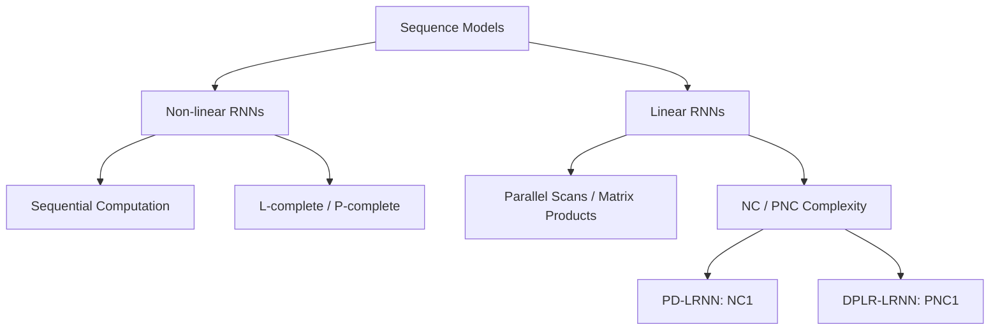

# Why Are Linear RNNs More Parallelizable?

**Conference**: ICML2026  
**arXiv**: [2603.03612](https://arxiv.org/abs/2603.03612)  
**Code**: https://arg-git.informatik.uni-kl.de/pub/LinearRNN  
**Area**: LLM Efficiency / Sequence Model Theory / Parallel Computing  
**Keywords**: Linear RNN, Parallelization, Circuit Complexity, Expressivity, Long Context Architectures  

## TL;DR
This paper provides a rigorous explanation via circuit complexity for why Linear RNNs (LRNNs) are more parallelizable than traditional non-linear RNNs, akin to Transformers. The study demonstrates that LRNNs fall into arithmetic circuit classes with approximately log-depth, whereas non-linear RNNs can express $\mathsf{L}$-complete or $\mathsf{P}$-complete problems that are inherently harder to parallelize, establishing a fundamental trade-off between expressivity and parallelizability.

## Background & Motivation
**Background**: Long-context LLM architectures are refocusing on RNNs and state-space/linear attention models. Variants like Mamba, RWKV, and DeltaNet aim to combine the length generalization of recurrent states with the high parallel throughput of Transformers. Consequently, understanding why linear recurrence is easily parallelizable has shifted from a theoretical curiosity to a core principle of long-sequence model design.

**Limitations of Prior Work**: While it is known that traditional RNNs rely on sequential updates and Transformers support parallelism, and that certain LRNNs can be parallelized via scans, these are largely algorithmic intuitions. Two specific questions remain unanswered: first, whether non-linear RNNs face unavoidable parallelization barriers; second, whether differences between LRNN variants are merely engineering details or reflect formal hierarchies in expressivity.

**Key Challenge**: Increased expressivity often mirrors general sequential computation, making it difficult to compress into shallow parallel circuits. Conversely, easily parallelizable models may sacrifice expressivity in algorithmic tasks. LRNNs occupy a middle ground: stronger than simple sub-classes of Transformers but seemingly less difficult to parallelize than traditional non-linear RNNs.

**Goal**: The paper establishes a complexity map for the RNN/LRNN family, identifying the complexity classes expressed by non-linear RNNs, the upper bounds for LRNNs, and the fine-grained differences between linear update parameterizations (e.g., DPLR, PD, Mamba).

**Key Insight**: The authors map the problem of neural networks recognizing languages to circuit complexity and automata theory. Non-linear RNNs demonstrate sequential computing power via counter/stack machines, while LRNNs demonstrate parallelizability through matrix multiplication and arithmetic circuits. Different LRNN parameterizations correspond to different Weighted Finite Automata (WFA) capabilities.

**Core Idea**: Linear state updates can be formulated as matrix products and sums, which can be simulated in parallel by log-depth arithmetic circuits. Non-linear recurrences can simulate more powerful sequential machines, implying they cannot be parallelized as efficiently unless major complexity theory conjectures collapse.

## Method
The paper classifies existing RNN families theoretically rather than proposing a new model. The core logic involves converting "ease of parallelization" into the ability to be simulated by shallow, bounded fan-in circuits, and "expressivity" into the ability to solve complete problems of specific complexity classes.

### Overall Architecture
The paper defines two major categories of sequence layers. Non-linear RNN state updates are defined as $h_t=f(h_{t-1},x_t)$, where $f$ includes non-linearities like ReLU or MLP. Linear RNN state updates follow $S_t=A_t(x_t)S_{t-1}+b_t(x_t)$, where each step applies a linear transformation to the previous state plus an input-dependent term. Multi-layer models can interleave recurrent sublayers and feedforward sublayers similarly to Transformers.

### Key Designs
1. **Characterizing Parallelization Boundaries via Complexity Classes**:
	- **Function**: Transitions "parallelizability" from an empirical claim to provable circuit depth upper/lower bounds.
	- **Mechanism**: If a model can be simulated by $\mathsf{NC}^1$ or roughly $O(\log n \log^* n)$ depth circuits, it is considered close to Transformer-level log-depth parallelism. If it expresses $\mathsf{L}$-complete or $\mathsf{P}$-complete problems, it cannot be compressed into such shallow circuits under standard complexity assumptions.
	- **Design Motivation**: At context lengths of 64K to 1M, $\log n$ is $\approx 16-20$, while $\log^2 n$ can reach $256-400$. Theoretical depth differences translate to actual sequential time differences on hardware.

2. **Expressivity Lower Bound of Non-linear RNNs**:
	- **Function**: Explains why traditional RNNs struggle to parallelize like LRNNs/Transformers.
	- **Mechanism**: MLP RNNs with polynomial precision can simulate multi-stack machines, thus recognizing $\mathsf{P}$-complete languages. With log precision, they can simulate counter machines to solve $\mathsf{L}$-complete problems like sorted deterministic graph connectivity.
	- **Design Motivation**: Non-linear recurrence treats states as updatable sequential memory. While this yields stronger algorithmic expressivity, it necessitates sequential computation.

3. **Fine-grained Classification of LRNN Parameterizations**:
	- **Function**: Shows that LRNN variants have strict expressivity hierarchies beyond simply being "scannable."
	- **Mechanism**: General LRNNs can be written as convolutions or matrix products, placing their language recognition in $\mathsf{PNC}^1$. DPLR LRNNs (e.g., RWKV-7, DeltaNet) can solve iterated $3\times3$ matrix multiplication ($\mathsf{PNC}^1$-complete). PD LRNNs, where matrix products maintain a permutation-diagonal structure, are restricted to $\mathsf{NC}^1$ but can recognize $\mathsf{NC}^1$-complete languages.
	- **Design Motivation**: Provides a scale for architectural design. DPLR is stronger than PD while remaining approximately log-depth parallelizable, whereas simpler structures like Mamba/S4 are more efficient but expressively limited.

### Loss & Training
The theoretical sections contain no training loss. The experimental sections utilize synthetic algorithmic tasks for binary or stepwise classification. All models are trained using AdamW, `BCEWithLogitsLoss`, a batch size of 128, and a gradient clip of 1.0 for up to 60K steps. Baselines include non-linear RNNs, Transformers, Mamba, RWKV-7, and DeltaNet. Training lengths range in $[1,100]$, with tests including length extrapolation in $[101,200]$ and $[201,300]$.

## Key Experimental Results

### Main Results
The primary result is the theoretical classification table, which identifies the maximum expressivity and minimum parallel depth for different model families.

| Model Category | Complexity Class | Parallel Depth | Representative Models/Tasks | Conclusion |
|----------|------------|--------------|---------------|------|
| Transformer / Simple LRNN | $\approx \mathsf{TC}^0 \subseteq \mathsf{NC}^1$ | $O(\log n)$ (bounded fan-in) | Transformer, Mamba | Most parallelizable; limited expressivity |
| General LRNN | $\mathsf{PNC}^1$ Upper Bound | $O(\log n \log^* n)$ | Linear state update family | Negligible parallel overhead over Transformers |
| DPLR LRNN | $\mathsf{PNC}^1$-complete | Near LRNN upper bound | RWKV-7, DeltaNet | Strongest expressivity within linear parallelizable range |
| PD LRNN | $\mathsf{NC}^1$-complete | Log-depth | Permutation-diagonal LRNN | Stronger than Finite State; weaker than DPLR |
| Log-precision Non-linear RNN | $\mathsf{L}$-complete | Likely $\Omega(\log^2 n)$ | MLP RNN Graph Connectivity | High expressivity; higher parallel cost |
| Poly-precision Non-linear RNN | $\mathsf{P}$-complete | Not polylog-depth parallelizable | MLP RNN Multi-stack simulation | Strongest; most sequential |

### Ablation Study
| Configuration | Key Metric | Description |
|------|---------|------|
| Nonlinear RNN on Graph Connectivity | Near-perfect OOD | Consistent with $\mathsf{L}$-complete capability. |
| LRNN/Transformer on Graph Connectivity | Degradation with length | Theoretically unable to cover sequential reachability. |
| RWKV-7 / DeltaNet on IMM | Strong ID and OOD | DPLR expresses $\mathsf{PNC}^1$-complete matrix products. |
| Mamba on IMM | Significantly weaker than DPLR | Simple linear parameterization lacks expressivity. |
| Transformer on IMM | Unstable and poor extrapolation | Shallow parallel advantage does not equal algebraic recurrence ability. |

### Key Findings
- The fundamental reason LRNNs are more parallelizable is that linear recurrence reduces to matrix products/scans, which have log-depth arithmetic circuit implementations.
- The "parallelization difficulty" of non-linear RNNs is not a result of poor implementation but their ability to simulate stronger sequential computation models.
- DPLR represents a compelling middle ground: it outperforms simple structures like Mamba/S4 in iterated algebraic computation while maintaining near log-depth parallelism.
- Experimental results on synthetic tasks align with theoretical predictions, showing that these complexity results reflect training behavior and length generalization.

## Highlights & Insights
- The primary contribution is elevating the RNN architectural debate from "empirical speed" to "complexity classes and complete problems."
- It presents a clear trade-off: to attain the sequential algorithmic power of non-linear RNNs, one must accept deeper parallel simulation; to maintain Transformer-like efficiency, state updates must be restricted to linear/scannable forms.
- The distinction between DPLR and PD is insightful; choices like low-rank terms and permutation-diagonal structures fundamentally change expressivity upper bounds.

## Limitations & Future Work
- Complexity analysis relies on formal assumptions (precision, uniformity, bounded fan-in) and focuses on asymptotic depth, which does not directly map to GPU kernels or memory bandwidth.
- Synthetic tasks verify expressivity trends but do not directly prove performance in large-scale language modeling.
- Theoretical discussions focus on exact simulation; actual networks might use approximation or hybrid structures to bypass single-layer limitations.

## Related Work & Insights
- **Vs. Transformer Complexity**: Transformers are placed in $\mathsf{TC}^0/\mathsf{NC}^1$; this paper places LRNNs in $\mathsf{PNC}^1$, explaining their minor parallel overhead and additional expressivity.
- **Vs. Mamba/S4 Theory**: Identifies that DPLR structures (RWKV-7, DeltaNet) reach higher complexity classes than simpler state-space models.
- **Vs. Non-linear RNN Parallelization**: Recent Newton-style methods parallelize non-linear RNNs to $O(\log^2 n)$, which aligns with the predicted depth for $\mathsf{L}$-complete problems.

## Rating
- **Novelty**: ⭐⭐⭐⭐⭐ Systematically explains LRNN parallelizability via complexity theory.
- **Experimental Thoroughness**: ⭐⭐⭐☆☆ Strong theoretical alignment; however, scale is limited to synthetic tasks.
- **Writing Quality**: ⭐⭐⭐⭐☆ Clear structure, though notation-heavy for non-theoreticians.
- **Value**: ⭐⭐⭐⭐☆ Highly impactful for long-context architecture selection.

<!-- RELATED:START -->

## Related Papers

- [\[ICLR 2026\] Fine-Grained Activation Steering: Steering Less, Achieving More](../../ICLR2026/llm_nlp/fine-grained_activation_steering_steering_less_achieving_more.md)
- [\[NeurIPS 2025\] Composing Linear Layers from Irreducibles](../../NeurIPS2025/llm_nlp/composing_linear_layers_from_irreducibles.md)
- [\[ICLR 2026\] Weight Decay may matter more than μP for Learning Rate Transfer in Practice](../../ICLR2026/llm_nlp/weight_decay_may_matter_more_than_mup_for_learning_rate_transfer_in_practice.md)
- [\[ACL 2026\] Why Did Apple Fall: Evaluating Curiosity in Large Language Models](../../ACL2026/llm_nlp/why_did_apple_fall_evaluating_curiosity_in_large_language_models.md)
- [\[ICML 2026\] Structured Generalized Linear Token Mixing: Shifting Gears Between Complexity and Expressivity with SND + Kronecker](trading_complexity_for_expressivity_through_structured_generalized_linear_token_.md)

<!-- RELATED:END -->
## Related Papers

- [\[ACL 2025\] Language Models, Graph Searching, and Supervision Adulteration: When More Supervision is Less and How to Make More More](../../ACL2025/llm_nlp/lm_graph_search_supervision.md)
- [\[NeurIPS 2025\] Composing Linear Layers from Irreducibles](../../NeurIPS2025/llm_nlp/composing_linear_layers_from_irreducibles.md)
- [\[ICLR 2026\] Fine-Grained Activation Steering: Steering Less, Achieving More](../../ICLR2026/llm_nlp/fine-grained_activation_steering_steering_less_achieving_more.md)
- [\[ACL 2026\] Why Did Apple Fall: Evaluating Curiosity in Large Language Models](../../ACL2026/llm_nlp/why_did_apple_fall_evaluating_curiosity_in_large_language_models.md)
- [\[ICLR 2026\] Weight Decay may matter more than μP for Learning Rate Transfer in Practice](../../ICLR2026/llm_nlp/weight_decay_may_matter_more_than_mup_for_learning_rate_transfer_in_practice.md)

<!-- RELATED:END -->
