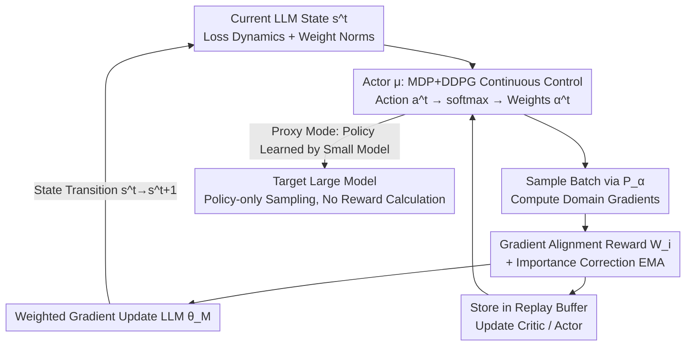

# AC-ODM: Actor–Critic Online Data Mixing for Sample-Efficient LLM Pretraining

**Conference**: ICML2026  
**arXiv**: [2505.23878](https://arxiv.org/abs/2505.23878)  
**Code**: https://github.com/DANG-ai/AC-ODM  
**Area**: LLM Pre-training / Data Mixing / Reinforcement Learning  
**Keywords**: Data Mixing, Online Domain Weighting, Actor-Critic, Gradient Alignment, Sample Efficiency

## TL;DR
AC-ODM formulates the dynamic adjustment of pre-training data domain weights as a continuous control problem in reinforcement learning. Using the DDPG Actor-Critic framework, it perceives the model state in real-time, outputs sampling weights for each domain, and employs "inter-domain gradient alignment" as the reward. Theoretically, this is proven equivalent to maximizing constructive interference of gradients (effective descent step size). On Pythia-1B, it achieves optimal perplexity with approximately 66% fewer steps than strong baselines, scores a 27.5% relative improvement on MMLU, and increases HumanEval pass@1 by 2.23 times, with only a 0.4% increase in wall-clock time per step and 2% extra memory.

## Background & Motivation
**Background**: The domain ratio of pre-training corpora (e.g., proportions of GitHub, Wikipedia, etc.) significantly impacts the sample efficiency, convergence speed, and downstream accuracy of LLMs, often outweighing the effects of simply increasing data volume. Current approaches fall into two categories: **Static Mixing** (DoReMi, DoGE, RegMix, CHAMELEON, etc., which determine global weights offline using small proxy models or heuristic leverage scores before training) and **Dynamic Mixing** (ODM, PiKE, etc., which adjust weights in real-time based on the current state during training).

**Limitations of Prior Work**: Static weights fail to adapt to the **evolving learning dynamics** of a model during lengthy pre-training, often resulting in sub-optimality. Existing dynamic methods face a trilemma: sophisticated selection algorithms (e.g., PiKE, which estimates gradient conflicts) suffer from high runtime overhead, while lightweight heuristics struggle to adapt to diverse training pipelines (e.g., end-to-end training from scratch vs. pre-prepared corpora).

**Key Challenge**: Existing dynamic mixing methods **lack a unified framework that balances computational efficiency, sample efficiency, and structural flexibility**—they are either computationally efficient but inflexible, or effective but prohibitively expensive per step.

**Goal**: (1) Provide a theoretical foundation for data mixing based on optimization geometry rather than pure heuristics; (2) Minimize the per-step overhead of dynamic weighting; (3) Develop a mechanism that covers both "fixed corpora" and "from-scratch" training pipelines.

**Key Insight**: Treat the entire LLM pre-training process as an **environment**, where domain weights represent the **continuous actions of an agent**. Since both states (loss dynamics, weight norms) and actions (domain weights) are continuous, the problem naturally fits within deterministic policy gradient frameworks like DDPG.

**Core Idea**: Utilize a parameterized policy (Actor) to maximize "inter-domain gradient alignment" online. The authors theoretically prove that this reward serves as a linear proxy for the interaction energy of the Gram matrix, effectively transforming "data ratio adjustment" into "explicit optimization of the effective descent step size."

## Method

### Overall Architecture
AC-ODM formulates data mixing as a Markov Decision Process (MDP) solved via DDPG. At step $t$: the Actor $\mu_{\theta_A}$ observes the current LLM state $s^t$ (iteration count, samples drawn per domain, domain loss vectors and their differences, $L_2$ norm of weights and update magnitudes of selected layers) and outputs action $a^t$. This is mapped via softmax to domain weights $\boldsymbol{\alpha}^t$ on the probability simplex. A batch is sampled according to $P_{\boldsymbol{\alpha}^t}=\sum_i \alpha_i^t\cdot\mathrm{UNIF}(D_i)$. Domain gradients and the "gradient alignment vector" $W^t$ are calculated; the LLM parameters $\theta_M$ are updated with weighted gradients, and $W^t$ is used as the reward $r^t$. The transition tuple $(s^t,a^t,r^t,s^{t+1})$ is stored in a replay buffer, which is sampled to update the Critic and Actor. This forms a closed loop: model state → policy adjusts weights → sampled training → gradient alignment feedback → policy update, explicitly pushing optimization toward "mutually reinforcing gradients."

### Key Designs

**1. Modeling online data mixing as MDP + DDPG continuous control: State and Action design**

Data proportions are continuous and require dynamic adjustment, making this a natural continuous control problem. The state $s^t$ must be compact yet reflective of training dynamics, aggregating observable signals:

$$s^t=(n,\ t,\ \ell(\theta_M,B),\ \Delta\ell(\theta_M,B),\ \|\omega\|_2,\ \|\Delta\omega\|_2),$$

where $n$ is the cumulative samples per domain, $\ell$ is the domain loss vector, $\Delta\ell$ is the step difference, and $\|\omega\|_2, \|\Delta\omega\|_2$ represent the weight norm of selected layers and their update magnitudes. Action $a^t\in\mathbb{R}^K$ is processed via softmax to yield valid weights $\boldsymbol{\alpha}^{t+1}$. Unlike the Multi-Armed Bandit in ODM or discrete conflict estimation in PiKE, DDPG learns a deterministic policy in continuous space, avoiding discretization loss and enabling smooth weight transitions. For efficiency, weight norms are computed only for specific layers (first layer + all even layers).

**2. Gradient Alignment Reward $W_i$ + Importance Correction EMA: "Constructive Interference" as reward and preventing policy collapse**

Efficient pre-training requires domains that not only reduce their own loss but also accelerate learning in other domains. The reward for domain $i$ is defined as the inner product of its gradient with the aggregated gradient of other domains:

$$W_i\triangleq\big\langle \nabla\ell_i(\theta_M),\ \textstyle\sum_{j\neq i}\nabla\ell_j(\theta_M)\big\rangle.$$

A positive inner product indicates that the domain's update direction aligns with others (constructive interference), while a negative value signifies conflict. To stabilize training, the final reward uses an **importance-corrected Exponential Moving Average (EMA)**:

$$\hat r_i^t=\xi\,\hat r_i^{t-1}+(1-\xi)\frac{W_i^t}{P_{\alpha_i}^{t-1}},$$

Dividing by the sampling probability $P_{\alpha_i}^{t-1}$ is crucial—it prevents the policy from collapsing into the trivial solution of "only sampling naturally high-frequency domains" (as high-frequency domains naturally yield larger inner products). This design distinguishes AC-ODM from PiKE: PiKE **reduces** gradient conflict, while AC-ODM **explicitly maximizes** constructive interference, directly corresponding to more efficient descent directions.

**3. Theoretical assurance from optimization geometry: Reward as a linear proxy for Gram matrix interaction energy**

The authors provide a foundation based on optimization geometry rather than statistical prediction (unlike DoGE). Let the columns of the gradient matrix $\mathbf{G}^t$ be the domain gradients, and the effective update direction be $\mathbf{g}_{total}^t=\mathbf{G}^t\boldsymbol{\alpha}^t$. Its squared norm is expanded using the empirical Gram matrix $\mathbf{H}^t=(\mathbf{G}^t)^\top\mathbf{G}^t$:

$$\|\mathbf{g}_{total}^t\|^2=(\boldsymbol{\alpha}^t)^\top\mathbf{H}^t\boldsymbol{\alpha}^t=\underbrace{\textstyle\sum_i(\alpha_i^t)^2 H_{ii}^t}_{\text{Self-Magnitude}}+\underbrace{\textstyle\sum_{i\neq j}\alpha_i^t\alpha_j^t H_{ij}^t}_{\text{Interaction Energy}}.$$

First-order convergence is dominated by the magnitude of the update vector, while the interaction energy is determined by the off-diagonal elements $H_{ij}=\langle\mathbf{g}_i,\mathbf{g}_j\rangle$ of $\mathbf{H}^t$. Directly maximizing this quadratic form is expensive, but the AC-ODM reward $r_i=\langle\mathbf{g}_i,\sum_{j\neq i}\mathbf{g}_j\rangle$ is the row sum of the off-diagonal elements of $\mathbf{H}^t$. Thus, the policy objective $J(\boldsymbol{\alpha})=\sum\alpha_i r_i$ becomes a **linear proxy** for interaction energy. Assigning more probability mass to domains with high $r_i$ pushes the optimization trajectory toward regions of maximum spectral coherence, allowing sampled gradients to reinforce each other and amplify the effective step size $\|\mathbf{g}_{total}^t\|$.

**4. Proxy / Non-Proxy running modes: One mechanism for two pipelines**

**Non-Proxy (End-to-End)**: Actor, Critic, and the target LLM are trained jointly from scratch. This is suitable for scenarios with no prior knowledge where domains may emerge dynamically. Overhead is negligible (<0.5% wall-clock). **Proxy (Policy Transfer)**: A policy is learned on a small proxy model, then the Actor is frozen and transferred to guide sampling for the large target model without reward calculation (see Algorithm 2). This is ideal for standard pipelines with fixed corpora seeking maximum downstream performance, as it decouples policy learning from target training to avoid noise in the early stages of large model training.

### Loss & Training
Three sets of parameters are updated per step. **LLM**: $\theta_M^{t+1}=\theta_M^t-\eta^t\sum_i\alpha_i^t\nabla\ell_i(\theta_M^t)$. **Critic**: Minimizes MSE $L=\frac1N\sum_k(y_k-Q_{\theta_C}(s_k,a_k))^2$ using TD targets $y_k=r_k+\gamma Q_{\bar\theta_C}(s_k',\mu_{\bar\theta_A}(s_k'))$. **Actor**: Ascends along the deterministic policy gradient $\nabla_{\theta_A}J\approx\frac1N\sum_k\nabla_{\theta_A}\mu_{\theta_A}(s_k)\nabla_a Q_{\theta_C}(s_k,a)|_{a=\mu(s_k)}$. Target networks are maintained for soft updates $\bar\theta\leftarrow\tau\theta+(1-\tau)\bar\theta$. Experiments use The Pile (22 domains) and SlimPajama (7 domains). Pythia-1B is trained for 41,667 steps (≈50B tokens). During the first 833 warmup steps, Gaussian noise $N(0,0.02)$ is added to domain weights for exploration.

## Key Experimental Results

### Main Results: Downstream Tasks

| Method | MMLU 0-shot | MMLU 5-shot | HumanEval pass@1 |
|------|-------------|-------------|-------------------|
| TPW (Original Heuristic) | 0.207 | 0.275 | 0.141 |
| DoGE-10k | 0.223 | 0.281 | 0.157 |
| CHAMELEON (Static) | 0.221 | 0.283 | 0.148 |
| ODM (Dynamic Bandit) | 0.235 | 0.284 | 0.325 |
| PiKE (Reduces Conflict) | 0.248 | 0.304 | 0.522 |
| AC-ODM (Non-proxy) | 0.251 | 0.299 | 0.603 |
| **AC-ODM-410M (Proxy)** | **0.300** | **0.352** | **0.726** |

On The Pile, proxy mode AC-ODM-410M shows relative gains of **27.5%/23.9%** on 0-shot/5-shot MMLU over the strongest baseline ODM, with HumanEval pass@1 reaching **2.23x** that of ODM. Compared to PiKE, it achieves +5.1% 0-shot MMLU and +39% relative HumanEval improvement. AC-ODM-410M reaches ODM's best perplexity with **66%** fewer steps.

### Key Experimental Results: Computational Overhead

| Method | AC Params | Time/Step (s) | Convergence Steps | End-to-End Speedup |
|------|---------|-------------|----------|------------|
| ODM | 0 | 2.47 | 41,667 | 1.00× |
| PiKE | 0 | 2.53 | 31,250 | 1.30× |
| AC-ODM (Non-proxy) | 17M | 2.48 | 28,356 | 1.46× |
| AC-ODM(160M proxy)→1B | 17M | — | 12,500 | 2.08× |
| AC-ODM(410M proxy)→1B | 17M | — | 12,010 | 1.47× |

Non-proxy AC-ODM is only 0.4% slower per step than ODM (2.48s vs 2.47s) but reduces total steps by 31.95%, yielding a 1.46x end-to-end acceleration.

## Key Findings
- **Reward design provides the greatest contribution**: Replacing "conflict reduction" with "maximizing constructive interference + importance correction" is the primary reason for outperforming PiKE.
- **Sensitivity to domain granularity**: Perplexity degrades when The Pile's 22 domains are merged into 11 or 5. AC-ODM benefits most from finely-grained, distinct corpora where rewards are more discriminative.
- **Mechanism, not a task shortcut**: The HumanEval surge corresponds to increased weights for StackExchange and high-quality general domains, rather than simple code data dumping, suggesting gains from better global optimization signals.
- **Cross-architecture generalization**: Experiments on LLaMA-style 0.9B confirm that proxy mode reduces the steps needed for a given perplexity by ~65% relative to TPW.

## Highlights & Insights
- Links "data mixing" and "optimization geometry" through Gram matrix interaction energy, providing a provable reward basis rather than another heuristic.
- The "importance correction" in the reward prevents policy collapse toward high-frequency domains, a trick applicable to any online selection problem using sampled signals as rewards.
- The dual Proxy/Non-Proxy modes provide production-level flexibility: transfer for performance on fixed corpora, end-to-end for changing corpora.
- A 17M parameter Actor-Critic yields a 1.46x~2.08x speedup with almost zero impact on training infrastructure.

## Limitations & Future Work
- **Dependence on meaningful domain partitioning**: Performance degrades if the taxonomy is too coarse, requiring pre-defined, discriminative domain labels.
- **Greedy first-order alignment**: Constructive interference is a local, greedy proxy and may not lead to long-term optimal curriculum learning.
- **Sampling approximations**: Weight norms are calculated on subsets of layers/parameters to save compute; the fidelity of these approximations depends on the architecture.

## Related Work & Insights
- **vs. DoReMi / CHAMELEON (Static)**: These determine global weights offline and cannot adapt to dynamics; AC-ODM consistently outperforms static methods by adapting online.
- **vs. DoGE**: Though DoGE uses alignment, it treats it as a statistical predictor of generalization loss; AC-ODM views it as a linear proxy for interaction energy in optimization geometry.
- **vs. ODM**: ODM uses bandits; AC-ODM uses DDPG continuous control and gradient alignment, achieving faster convergence and 2.23x HumanEval results.
- **vs. PiKE**: PiKE focuses on **reducing** conflict with higher per-step cost; AC-ODM **maximizes** alignment with negligible cost.

## Rating
- Novelty: ⭐⭐⭐⭐ Treats data mixing as DDPG continuous control and provides an optimization geometry basis for the reward.
- Experimental Thoroughness: ⭐⭐⭐⭐ Covers various corpora, architectures, and dimensions like granularity and overhead.
- Writing Quality: ⭐⭐⭐⭐ Technical and engineering details are clear, with strong theoretical-empirical links.
- Value: ⭐⭐⭐⭐ Significant end-to-end speedup with minimal overhead; highly practical for large-scale pre-training.

<!-- RELATED:START -->

## Related Papers

- [\[ICML 2026\] Explaining Data Mixing Scaling Laws](explaining_data_mixing_scaling_laws.md)
- [\[ICLR 2026\] Beyond URLs: Metadata Diversity and Position for Efficient LLM Pretraining](../../ICLR2026/llm_pretraining/beyond_urls_metadata_diversity_and_position_for_efficient_llm_pretraining.md)
- [\[ICML 2025\] Chameleon: A Flexible Data-mixing Framework for Language Model Pretraining and Finetuning](../../ICML2025/llm_pretraining/chameleon_a_flexible_data-mixing_framework_for_language_model_pretraining_and_fi.md)
- [\[ICML 2026\] POET-X: Memory-efficient LLM Training by Scaling Orthogonal Transformation](poet-x_memory-efficient_llm_training_by_scaling_orthogonal_transformation.md)
- [\[ICLR 2026\] Beyond Length: Quantifying Long-Range Information for Long-Context LLM Pretraining Data](../../ICLR2026/llm_pretraining/beyond_length_quantifying_long-range_information_for_long-context_llm_pretrainin.md)

<!-- RELATED:END -->
