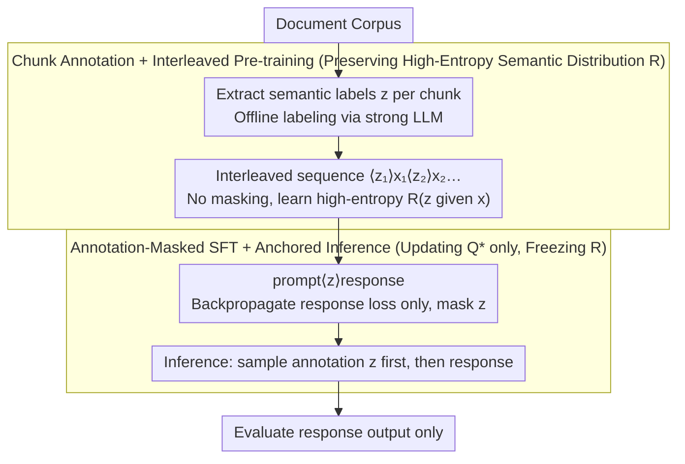

# Annotations Mitigate Post-Training Mode Collapse

**Conference**: ICML 2026  
**arXiv**: [2605.09995](https://arxiv.org/abs/2605.09995)  
**Code**: Not explicitly released in the paper  
**Area**: LLM Pre-training / Post-training Alignment / Generative Diversity  
**Keywords**: Mode Collapse, SFT, Semantic Entropy, Annotation Anchoring, Diversity-Quality Trade-off

## TL;DR
The authors observe that SFT aligns models with a low-entropy semantic prior, leading to "inverse scaling" where larger instruction-tuned models become increasingly repetitive. They propose "Annotation-Anchored Training"—tagging documents with semantic tags during pre-training and masking the loss on these tags during SFT—enabling the model to sample semantics before generating responses, which reduces the semantic diversity gap by 85% while maintaining instruction-following performance.

## Background & Motivation
**Background**: The current mainstream alignment pipeline involves unsupervised pre-training on massive web corpora followed by Supervised Fine-Tuning (SFT) and RLHF on narrow instruction datasets to refine base models into helpful and well-formatted assistants.

**Limitations of Prior Work**: While base models produce outputs of varying quality, they possess wide semantic coverage. Post-SFT models often generate highly similar responses in terms of themes, names, locations, and styles for the same prompt—a phenomenon known as "semantic mode collapse." Furthermore, the authors expand on NoveltyBench findings: while base models become more diverse with scale, SFT models exhibit greater collapse as they grow larger. This collapse persists even under diversity-promoting prompting strategies like brainstorming or multiple sampling.

**Key Challenge**: The optimization objective of SFT is to match the model distribution with the post-training data distribution. However, post-training data is inherently a low-entropy semantic set (reflecting specific annotator preferences). Maximum likelihood training indiscriminately forces this low-entropy semantic prior into the model. Consequently, SFT entangles "how to write a response given a semantic" (desired) with "which semantics to express" (undesired).

**Goal**: To decouple these distributions so that post-training only updates the conditional response behavior $Q^\star(y\mid x,z)$ while anchoring the semantic distribution $R(z\mid x)$ to the high-entropy state learned during pre-training.

**Key Insight**: An explicit semantic variable $z$ (a set of key-value tags such as topic/location/entities/genre) is introduced to factorize response generation as $P^\star_R(y\mid x)=\int R(z\mid x)\,Q^\star(y\mid x,z)\,dz$. As long as the training process preserves the high-entropy nature of $R$, diversity will not collapse.

**Core Idea**: Each document chunk is paired with annotations during pre-training, forming interleaved `<z>x` training sequences. During SFT, the loss for the $z$ tokens is masked. During inference, the model first generates an annotation and then the response; the sampling diversity of the annotation naturally inherits the pre-training distribution.

## Method

### Overall Architecture
The proposed method, annotation-anchored training, aims to ensure SFT updates only the conditional response logic without affecting semantic selection. Semantic tags $z$ in `<key>:<value>` format are generated offline using a strong LLM. During pre-training, tags and text are interleaved. During SFT, the loss on the tags is masked. During inference, the model samples an annotation first and generates a response conditioned on it, naturally incorporating diversity into the output. This approach is minimal: it only requires slight adjustments to data formatting and loss masking, remaining fully compatible with standard auto-regressive LMs.

### Key Designs

**1. Explicit Semantic Variable $z$: Decoupling "What to Say" from "How to Say It"**
Mode collapse stems from the fact that SFT's maximum likelihood objective indiscriminately forces the low-entropy semantic prior of post-training data into the model. Traditional entropy regularization or KL constraints struggle to differentiate between which parts of the distribution to modify. By introducing an explicit semantic variable $z$ (variable-length `<key>:<value>` tags), the authors factorize the pre-training distribution as $P(y)=\int R(z)Q(y\mid z)\,dz$ and the post-training distribution as $P^\star(y\mid x)=\int R^\star(z\mid x)Q^\star(y\mid x,z)\,dz$. Since collapse is caused by $R^\star$ having much lower entropy than $R$, the solution is to target $P^\star_R(y\mid x)=\int R(z\mid x)\,Q^\star(y\mid x,z)\,dz$. This factorization is 100% compatible with standard LMs as $z$ consists of natural language tokens.

**2. Chunk-level Annotation + Interleaved Pre-training: Infusing High-Entropy $z\mid x$ During Pre-training**
Diversity in inference must originate from the pre-training phase. To avoid losing local signals, the authors split documents into chunks $x_1,\dots,x_n$ and extract independent labels for each, creating interleaved sequences. The model learns a conditional chain: "context → next segment semantics → next segment text." This structure serves as a format prior for the "prompt → annotation → response" flow in SFT. This design is robust to annotation noise, as the high entropy of the overall distribution is what matters, rather than the absolute accuracy of individual tags.

**3. Annotation-masked SFT + Anchored Inference: Locking the Semantic Distribution via Loss Masking**
This is the "one line of code" core of the method. In SFT, data follows the `prompt <annotation> response` format. Loss is backpropagated only for response tokens; annotation tokens are masked (with minor exceptions to stabilize formatting). Because annotation tokens do not receive gradient updates, the model's prediction of $p(z\mid x)$ remains frozen at the high-entropy pre-training state, while $p(y\mid x,z)$ is reshaped by SFT data. This effectively applies an implicit KL constraint on $R$ while leaving $Q$ unconstrained. During inference, sampling at temperature 1 allows the randomness of $z$ to carry semantic diversity into the final output.

### Loss & Training
Pre-training uses standard next-token loss without masking. SFT also uses next-token loss but masks the annotation tokens. Annotations occupy a portion of the token budget to maintain FLOPs/token alignment. Learning rates are tuned via validation perplexity; training volume follows Chinchilla-optimal settings (e.g., 2.5B model using 50B tokens).

## Key Experimental Results

### Main Results
Evaluations were conducted on Stories, NoveltyBench, WildChat, and InfinityChat benchmarks. Semantic entropy was calculated using LLM judges for Stories, and pairwise cosine distances (Qwen3-Embedding-0.6B) were used for dialogue.

| Evaluation Metric | Model Scale | Standard SFT | Annotation-Anchored | Note |
|-------------------|-------------|--------------|---------------------|------|
| Stories Semantic Entropy | 2.5B | Significant collapse (far below base) | Gap with base reduced to ~15% | 6× less collapse |
| NoveltyBench / WildChat / InfinityChat | 0.6B / 1B / 2.5B | Collapse at all scales | Higher than SFT at all scales | Consistent across benchmarks |
| Inference Sampling | temp 0.6~1.1 | Higher temp drops quality without gaining diversity | Pareto frontier for diversity-quality shifts outward | See Fig 6 |

| Task Capability Evaluation | 0.6B | 1B | 2.5B | Description |
|----------------------------|------|----|------|-------------|
| Avg. of 9 tasks (ARC/BoolQ/HellaSwag, etc.) (SFT) | 53.1 | 57.7 | 62.4 | Standard Baseline |
| Same as above (Ours) | 54.5 | 56.6 | 62.3 | Gap ≤ 1 point across scales |
| GSM8k (SFT / Ours) | 11.3 / 10.8 | 19.4 / 18.9 | 35.4 / 36.4 | Reasoning performance nearly intact |

### Ablation Study

| Configuration | Key Conclusion |
|---------------|----------------|
| Anchored SFT only (no annotated pre-training) | Performance drops significantly, proving pre-training with high-entropy annotations is essential. |
| Increased SFT data volume | Standard SFT diversity decreases further; Annotated maintains or improves. |
| Higher validation likelihood | Standard SFT: higher likelihood correlates with lower diversity; Annotated: positive correlation. |
| Various temperatures (0.6~1.1) | Annotated maintains higher diversity than SFT at all temperatures with similar quality. |

### Key Findings
- The correlation "tighter fit to post-training data → worse diversity" holds across hyperparameters. Annotation-anchoring flips this to a positive correlation, suggesting it addresses the mechanism of collapse rather than masking it.
- The inverse scaling phenomenon (larger models becoming narrower) only appears in standard SFT pipelines; annotation-anchoring restores positive scaling (larger equals more diverse).
- At the 2.5B scale, the semantic diversity gap on Stories is narrowed by 85%, indicating that collapse is not an inevitable byproduct of SFT but a result of poorly designed optimization objectives.

## Highlights & Insights
- **Elegant Distribution Factorization**: Separating "semantic prior" from "conditional response" via $R \cdot Q$ provides a theoretical explanation for inverse scaling and an engineering solution.
- **Masking as an Anchor**: Not updating annotation tokens is equivalent to a zero-cost implicit KL constraint on $R$, which is more precise than explicit KL or entropy regularization.
- **Extensible Paradigm**: Annotations are not limited to topics/entities; they could represent "proof strategies" for math or "algorithmic logic" for code. This provides a template for preserving diversity in chains-of-thought and reasoning paths.

## Limitations & Future Work
- Generating annotations requires a relatively strong LLM (e.g., Qwen3-30B-A3B), which may be costly for smaller teams, although the authors note the annotators do not need to be perfectly accurate.
- Experiments peaked at 2.5B scale and 50B tokens; behavior at the frontier (70B+ models, trillion tokens) remains to be seen.
- Inference involves the overhead of generating the annotation prefix, requiring trade-offs for latency-sensitive applications.
- Annotation schemas are manually designed and task-coupled; automatic discovery of "dimensions of $z$ that should be diverse" remains an open question.

## Related Work & Insights
- **vs NoveltyBench (Zhang et al. 2025b)**: While they first reported the inverse scaling phenomenon, this work provides the mechanistic explanation and engineering solution.
- **vs Entropy Regularization / KL-constrained SFT**: Those methods constrain the entire response distribution; this method precisely anchors the semantic marginal distribution using explicit $z$.
- **vs Latent variable / CVAE models**: Similar in using latent variables for diversity, but this work focuses on preserving pre-training semantic priors rather than user-controllable attributes.

## Rating
- Novelty: ⭐⭐⭐⭐⭐ Combining distribution factorization with loss masking in SFT is a novel and minimalist perspective.
- Experimental Thoroughness: ⭐⭐⭐⭐ Solid across 4 diversity benchmarks and 9 capability benchmarks, though scale is limited to 2.5B.
- Writing Quality: ⭐⭐⭐⭐⭐ Clear concepts with an elegant factorization argument.
- Value: ⭐⭐⭐⭐⭐ High potential to become a default component in alignment pipelines for creative generation and synthetic data diversity.

<!-- RELATED:START -->

## Related Papers

- [\[ICML 2026\] Beyond Structural Symmetries: Linear Mode Connectivity via Neuron Identifiability](beyond_structural_symmetries_linear_mode_connectivity_via_neuron_identifiability.md)
- [\[ICLR 2026\] Scaling with Collapse: Efficient and Predictable Training of LLM Families](../../ICLR2026/llm_pretraining/scaling_with_collapse_efficient_and_predictable_training_of_llm_families.md)
- [\[ICCV 2025\] FlowMo: Flow to the Mode — Mode-Seeking Diffusion Autoencoders for State-of-the-Art Image Tokenization](../../ICCV2025/llm_pretraining/flow_to_the_mode_mode-seeking_diffusion_autoencoders_for_state-of-the-art_image_.md)
- [\[ACL 2025\] Synthesizing Post-Training Data for LLMs through Multi-Agent Simulation](../../ACL2025/llm_pretraining/synthesizing_post-training_data_for_llms_through_multi-agent_simulation.md)
- [\[ICLR 2026\] Explaining Grokking and Information Bottleneck through Neural Collapse Emergence](../../ICLR2026/llm_pretraining/explaining_grokking_and_information_bottleneck_through_neural_collapse_emergence.md)

<!-- RELATED:END -->
