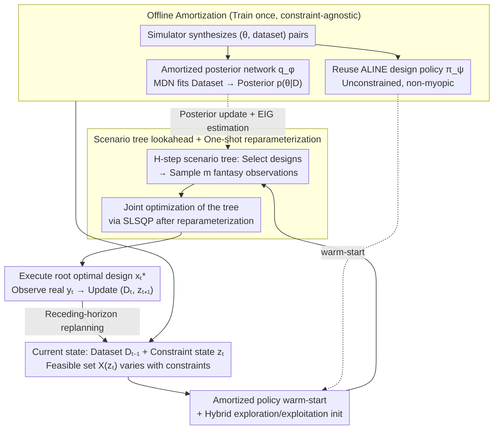

# Constrained Bayesian Experimental Design via Online Planning

**Conference**: ICML 2026  
**arXiv**: [2605.26990](https://arxiv.org/abs/2605.26990)  
**Code**: https://github.com/yujiag21/COPEx  
**Area**: Optimization / Bayesian Experimental Design / Active Learning / Sequential Decision Making  
**Keywords**: Bayesian experimental design, EIG, scenario tree, amortized inference, constrained planning

## TL;DR
This paper proposes COPEx: a semi-amortized scheme combining "offline pre-trained amortized posterior networks + design policies + online multi-step lookahead scenario trees." This allows Bayesian experimental design (BED) to dynamically adapt to budget, cost, and transition constraints at test time. COPEx consistently outperforms baselines such as VPCE, ALINE, and RL-BOED in EIG/RMSE across three types of tasks: constrained location finding, CES, and cost-aware AL.

## Background & Motivation

**Background**: Bayesian Experimental Design (BED) selects the next experiment by maximizing Expected Information Gain (EIG). Recent "amortized BED" approaches (Foster 2021, Ivanova 2021, Blau 2022, Huang 2026, etc.) train a transformer or RL design policy $\pi_\psi(x \mid \mathcal{D})$ offline, enabling non-myopic design sequences with near-zero latency during testing.

**Limitations of Prior Work**: Real-world scientific experiments almost always involve dynamic constraints—instrument measurement costs change, total budgets are limited, sensor movement distance/energy is restricted, or adjacent stimuli cannot differ significantly. However, amortized policies are trained on a fixed feasible set. If constraints like "adjacent design $\|x_t - x_{t-1}\| \le \delta$" or "total budget $B_{\text{total}}$" are added during deployment, one must either retrain the policy network or rely on post-hoc masking to force actions into the feasible set. The latter pushes trajectories out of the training distribution, leading to significantly degraded performance (Figure 1 shows ALINE explores poorly when $\delta=0.1$, with the posterior failing to converge).

**Key Challenge**: Constraints are not merely trivial operational details but fundamentally reshape the optimal design strategy. However, "constraint-aware + non-myopic" approaches are either computationally infeasible (nested posterior and EIG estimation for every candidate trajectory) or lack generality (requiring retraining for every new constraint).

**Goal**: Design a BED method that adapts online to arbitrary budget, transition, and feasibility constraints at test time while maintaining the non-myopic advantages of amortized methods and controllable computational overhead.

**Key Insight**: Model BED explicitly as a finite-horizon dynamic program with "constraint state $z_t$ evolution + Bellman recurrence," solved via an H-step lookahead scenario tree. The explosion in tree search cost is mitigated by "offline amortized posterior + amortized policy warm-start + one-shot reparameterization," transforming nested posterior updates into differentiable forward passes.

**Core Idea**: Decouple "constraint awareness" (online planning layer) from "computational speed" (offline amortization layer), ensuring that changing constraints does not require retraining.

## Method

### Overall Architecture

COPEx decouples the ability to change constraints without retraining into two layers. It formulates constrained BED as a finite-horizon MDP over states $(\mathcal{D}_{t-1}, z_t)$. The reward is the step-wise expected information gain $\text{EIG}(x_t;\mathcal{D}_{t-1})$, the dataset grows with observations $\mathcal{D}_t = \mathcal{D}_{t-1}\cup\{(x_t,y_t)\}$, the constraint state evolves according to $z_{t+1}=f(z_t,x_t)$, and the feasible set $\mathcal{X}(z_t)$ varies over time. This $z/f$ framework covers three typical constraints: bounded-change transitions $\|x_t-x_{t-1}\|\le\delta$, global budget $b_{t+1}=b_t-c(x_t, z_t)$, and design-dependent costs.

At test time, it employs a receding-horizon approach: at each step $t$, it expands an H-step lookahead scenario tree. The root is the current $(\mathcal{D}_{t-1},z_t)$; each decision node selects a design $x_k^{j_{1:\ell}}$, and each design branches into $m_k$ fantasy observation samples up to depth $H+1$. All decision variables $\mathbf{X}_{\text{tree}}$ in the tree are jointly optimized in a one-shot fashion. Only the optimal root design $x_t^\star$ is executed, the actual $y_t$ is observed, and the state is updated for the next round of planning. This tree is supported by two offline pre-trained components: an amortized posterior network $q_\phi(\theta\mid\mathcal{D})$ (a Mixture Density Network fitting $\mathcal{D}\mapsto p(\theta\mid\mathcal{D})$ for speed) and an amortized design policy $\pi_\psi$ (leveraging the ALINE transformer from Huang et al. 2026 for high-quality initialization).

### Key Designs

**1. H-step scenario tree lookahead + One-shot reparameterization: Collapsing Bellman recurrence into differentiable optimization**

To achieve "non-myopic + constraint-aware" design, the direct approach is solving the Bellman recurrence $V_t(\mathcal{D}_{t-1},z_t) = \max_{x_t}\{\text{EIG}(x_t;\mathcal{D}_{t-1}) + \gamma\mathbb{E}_{y_t}[V_{t+1}]\}$. However, this requires nested posterior updates and EIG estimation for every candidate trajectory, which is infeasible for non-conjugate models. COPEx uses the one-shot tree BO approach (Jiang 2020b) to avoid nesting: by pre-sampling a fixed set of base noise $\varepsilon=(\varepsilon_\theta,\varepsilon_y)$, all fantasy posterior samples $\theta_k^{j_{1:\ell}} = g_\phi(\mathcal{D}_{k-1}^{j_{1:\ell}}, \varepsilon_{\theta,k}^{j_{1:\ell}})$ and fantasy observations $\tilde y_k = h(x_k, \theta_k, \varepsilon_y)$ become deterministic functions of the decision variables. Thus, the entire tree objective

$$\widehat V^{(H)}(\mathbf{X}_{\text{tree}};\varepsilon) = \sum_{\ell=0}^H \gamma^\ell \frac{1}{\prod m}\sum_{j_{1:\ell}}\widehat{\text{EIG}}$$

collapses into a single nonlinear program solved by SLSQP, with gradients accessible across the entire tree. Constraints are directly applied to variables—transition constraints in $\mathcal{X}(z_k^{j_{1:\ell}})$ and budget constraints via $z$ accumulation—instead of being embedded in a policy network. Changing constraints only requires modifying the $\mathcal{X}(z)$ and $f$ functions without touching network weights.

**2. Amortized posterior network + Adaptive contrastive EIG estimator: Compressing nested expectations into forward passes**

The number of scenario tree nodes grows exponentially with $H$. At each node, performing posterior updates, fantasy sampling, and EIG estimation is computationally heavy. COPEx amortizes these using a Mixture Density Network (MDN) $q_\phi(\theta\mid\mathcal{D})$ by minimizing NLL on synthesized training data. Online, posterior updates consist of evaluating $q_{\hat\phi}(\theta\mid\mathcal{D}\cup\{(x,\tilde y)\})$, and fantasy sampling involves drawing $\tilde\theta\sim q_{\hat\phi}(\cdot\mid\mathcal{D}_{k-1}^{j_{1:\ell}})$ followed by likelihood sampling. EIG is estimated using the adaptive contrastive objective (Foster 2020):

$$\widehat{\text{EIG}}(x;\mathcal{D},\hat\phi) := \mathbb{E}\Big[\log\frac{p(\tilde y\mid x,\theta_0)}{\frac{1}{L+1}\sum_l q_{\hat\phi}(\theta_l\mid\mathcal{D})\,p(\tilde y\mid x,\theta_l)/q_{\hat\phi}(\theta_l\mid\mathcal{D}\cup\{(x,\tilde y)\})}\Big],$$

replacing expensive nested expectations with a few MDN evaluations. This step makes "online planning" practical.

**3. Amortized policy $\pi_\psi$ warm-start + Hybrid exploration/exploitation initialization: Efficient priors over random restarts**

High-dimensional non-convex scenario tree optimization easily gets stuck in local optima, and tight constraints often push the feasible region away from the policy's training distribution. COPEx addresses this by using the pre-trained unconstrained ALINE policy for initialization: $x_{t+\ell}^{j_{1:\ell}}\leftarrow \pi_\psi(\mathcal{D}_{t+\ell-1}^{j_{1:\ell}})$. When constraints significantly shift the feasible region, multiple trees are run simultaneously—some using $\pi_\psi$ for exploitation and others using random strategies for exploration—selecting the best result. Figure 3(a) shows that a single policy-initialized tree achieves higher cumulative EIG than 10 random-initialization trees in less time.

### Loss & Training

Offline: (i) Amortized posterior $q_\phi$ is trained with NLL on simulated sequences $(\theta_i, \mathcal{D}_i)$. (ii) The design policy $\pi_\psi$ is adopted from ALINE (Huang 2026) without further training. Online: An H-step scenario tree ($H\in\{0,\dots,3\}$, $m\in\{1,2\}$) is solved using SLSQP for constrained nonlinear programming.

## Key Experimental Results

### Main Results

| Task | Constraint | Metric | COPEx | Best Baseline |
|------|------------|--------|-------|---------------|
| Location finding ($T=30$) | $\delta\in\{0.05,0.1,0.2\}$ Transition | Cum. EIG | Consistently highest; gap widens as $\delta$ decreases | ALINE / VPCE fail at small $\delta$ |
| CES ($B_{\text{total}}=100$) | Global Budget | Cum. EIG | **7.03 ± 0.55** ($H=1$) | ALINE 4.46 / RL-BOED 4.93 / VPCE 2.18 |
| CES ($B_{\text{total}}=150$) | Global Budget | Cum. EIG | **7.47 ± 0.55** ($H=1$) | ALINE 5.70 / RL-BOED 4.98 |
| Cost-aware AL (Ackley/Branin/Goldstein-Price × Hazard/Rough) | Cost + Transition | RMSE @ Same Cost | Consistently lower than GP-EPIG/US/VR/RS | 4 GP-based baselines |

### Ablation Study

| Configuration | Result / Description |
|------|-------------|
| Policy-init (1 tree) vs. Random-init (10 trees) | Policy-init achieves higher EIG with significantly lower runtime (Fig 3a). |
| Planning Horizon $H\in\{0,\dots,5\}$ | EIG saturates at $H=2,3$, while runtime grows exponentially (Fig 3b). |
| Number of branches $m_k=m$ | Increasing $m$ shows little benefit in Location Finding but increases runtime. |
| $H=0$ vs. $H=1$ vs. $H=3$ (CES) | $H=1$ is best (7.03); $H=3$ drops to 6.36 as amortized bias accumulates along rollouts. |
| Hazard Center vs. Rough Terrain (AL) | In more rugged cost terrains, the non-myopic advantage of COPEx is more pronounced. |

### Key Findings
- Amortized policy warm-start provides the best trade-off: the policy itself doesn't need to be constraint-aware; acting as an initializer is sufficient to push SLSQP toward high-quality local optima.
- Short horizons ($H=1$ or $2$) are largely sufficient: the marginal benefit of EIG decreases rapidly, and deeper planning can amplify systemic biases in $q_{\hat\phi}$.
- Advantages of COPEx increase as constraints tighten: post-hoc masking baselines (ALINE) and myopic methods (VPCE) suffer more as $\delta$ or $B_{\text{total}}$ decreases.
- Transferability: Even without explicit latent variables $\theta$, the framework applies to Active Learning by replacing the amortized posterior with an amortized predictive $q_\phi(y\mid x,\mathcal{D})$ and EIG with EPIG.

## Highlights & Insights
- **Decoupling Philosophy**: "Online constraints, offline models." Amortization handles the expensive parts (posterior + EIG estimation), while online planning handles the "messy" parts (arbitrary feasible sets + costs). This is highly valuable for real-world scientific experimental pipelines.
- **One-shot Reparameterized Tree**: Collapsing an H-step lookahead (usually requiring nested backward induction) into a single differentiable nonlinear program is the key to migrating Jiang 2020b's BO techniques to BED.
- **Honest Horizon Reporting**: The authors report that $H=3$ can be inferior to $H=1$ due to bias accumulation, avoiding the "deeper is always better" trope and providing realistic guidance.
- **Broad Applicability**: Can be transferred to any high-cost sequential decision-making scenario where the state can be modeled by neural networks (e.g., clinical trials, robotic sensing, adaptive physics simulation).

## Limitations & Future Work
- **Amortized Posterior Bias**: Small errors in $q_{\hat\phi}$ can amplify exponentially during deep tree rollouts, necessitating more robust density estimation.
- **Constraints Far from Training Distribution**: If constraints severely shift the feasible region, the $\pi_\psi$ initializer may fail, leaving random restarts as the only fallback.
- **Online Computational Overhead**: In CES, $H=1$ takes ~19.5s per step, which may be too slow for high-frequency applications like robotic online control.
- **Dependency on Simulators**: Training the amortized posterior requires large amounts of simulated $(\theta, \mathcal{D})$ pairs, which is difficult for scientific scenarios with high-fidelity, high-cost simulators.

## Related Work & Insights
- **vs. ALINE (Huang 2026)**: ALINE is fully amortized and non-myopic but cannot adapt to new constraints at test time. COPEx reuses it as a warm-start but adds an online planning layer for constraint awareness.
- **vs. VPCE (Foster 2020)**: VPCE is a non-amortized variational EIG optimizer. It is inherently myopic and requires retraining the variational distribution at each step (CES step time: 105s vs. COPEx 19s).
- **vs. One-shot tree BO (Jiang 2020b)**: This paper migrates the one-shot trick to BED. Since BED's nested EIG is more expensive than BO's GP mean/variance, it requires amortized posteriors to remain tractable.

## Rating
- Novelty: ⭐⭐⭐⭐ — Natural combination of one-shot trees, amortized posteriors, and amortized policies for constrained BED.
- Experimental Thoroughness: ⭐⭐⭐⭐ — Covers three heterogeneous tasks with various constraints and thorough ablations.
- Writing Quality: ⭐⭐⭐⭐ — Clear derivations and well-structured method section; Figure 1 is highly persuasive.
- Value: ⭐⭐⭐⭐ — Effectively solves the "adaptation to constraints without retraining" problem, crucial for real-world laboratory automation.

<!-- RELATED:START -->

## Related Papers

- [\[ICML 2025\] Position: The Future of Bayesian Prediction Is Prior-Fitted](../../ICML2025/llm_pretraining/position_the_future_of_bayesian_prediction_is_prior-fitted.md)
- [\[NeurIPS 2025\] Composition and Alignment of Diffusion Models using Constrained Learning](../../NeurIPS2025/llm_pretraining/composition_and_alignment_of_diffusion_models_using_constrai.md)
- [\[CVPR 2026\] Watch and Learn: Learning to Use Computers from Online Videos](../../CVPR2026/llm_pretraining/watch_and_learn_learning_to_use_computers_from_online_videos.md)
- [\[ICML 2026\] AC-ODM: Actor–Critic Online Data Mixing for Sample-Efficient LLM Pretraining](ac-odm_actor--critic_online_data_mixing_for_sample-efficient_llm_pretraining.md)
- [\[ACL 2025\] Data-Constrained Synthesis of Training Data for De-Identification](../../ACL2025/llm_pretraining/data-constrained_synthesis_of_training_data_for_de-identification.md)

<!-- RELATED:END -->
## Related Papers

- [\[CVPR 2026\] Watch and Learn: Learning to Use Computers from Online Videos](../../CVPR2026/llm_pretraining/watch_and_learn_learning_to_use_computers_from_online_videos.md)
- [\[NeurIPS 2025\] Composition and Alignment of Diffusion Models using Constrained Learning](../../NeurIPS2025/llm_pretraining/composition_and_alignment_of_diffusion_models_using_constrai.md)
- [\[ACL 2025\] Data-Constrained Synthesis of Training Data for De-Identification](../../ACL2025/llm_pretraining/data-constrained_synthesis_of_training_data_for_de-identification.md)
- [\[ICML 2025\] Position: The Future of Bayesian Prediction Is Prior-Fitted](../../ICML2025/llm_pretraining/position_the_future_of_bayesian_prediction_is_prior-fitted.md)
- [\[NeurIPS 2025\] Optimal Online Change Detection via Random Fourier Features](../../NeurIPS2025/llm_pretraining/optimal_online_change_detection_via_random_fourier_features.md)

<!-- RELATED:END -->
