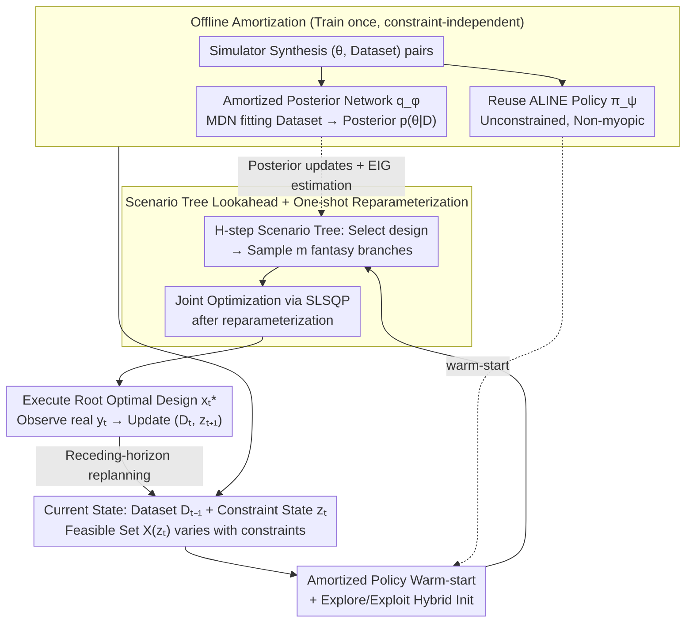

# Constrained Bayesian Experimental Design via Online Planning

**Conference**: ICML 2026  
**arXiv**: [2605.26990](https://arxiv.org/abs/2605.26990)  
**Code**: https://github.com/yujiag21/COPEx  
**Area**: Optimization / Bayesian Experimental Design / Active Learning / Sequential Decision Making  
**Keywords**: Bayesian experimental design, EIG, scenario tree, amortized inference, constrained planning

## TL;DR
This paper proposes COPEx: a semi-amortized scheme combining "offline pre-trained amortized posterior networks + design strategies + online multi-step lookahead scenario trees." This allows Bayesian experimental design to dynamically adapt to budget, cost, and transition constraints at test time. COPEx consistently outperforms baselines such as VPCE, ALINE, and RL-BOED in EIG and RMSE across constrained location finding, CES, and cost-aware AL tasks.

## Background & Motivation

**Background**: Bayesian Experimental Design (BED) selects the next experiment by maximizing Expected Information Gain (EIG). Recent "amortized BED" approaches (Foster 2021, Ivanova 2021, Blau 2022, Huang 2026, etc.) train a transformer or RL design policy $\pi_\psi(x \mid \mathcal{D})$ offline, enabling non-myopic design sequences with near-zero latency during testing.

**Limitations of Prior Work**: Practical scientific experiments involve dynamic constraints—fluctuating measurement costs, limited total budgets, sensor movement distance/energy constraints, or limits on differences between adjacent stimuli. However, amortized policies are trained on specific feasible sets. Adding constraints like $\|x_t - x_{t-1}\| \le \delta$ or total budget $B_{\text{total}}$ during deployment requires either retraining the entire network or applying post-hoc masks to force actions into the feasible set. The latter often pushes trajectories out of the training distribution, leading to severe performance degradation (Figure 1 shows ALINE fails to converge under $\delta=0.1$ due to poor exploration).

**Key Challenge**: Constraints are not mere implementation details but fundamentally reshape the optimal design policy. Achieving "constraint-awareness + non-myopia" naively is either computationally prohibitive (requiring nested posterior and EIG estimation for every candidate trajectory) or lacks generality (requiring retraining for every new constraint).

**Goal**: Design a BED method that adapts online to arbitrary budget, transition, or feasibility constraints while maintaining the non-myopic advantages of amortized methods and manageable computational overhead.

**Key Insight**: Explicitly model BED as a finite-horizon dynamic program involving "evolution of constraint state $z_t$ + Bellman recursion," solved via an $H$-step lookahead scenario tree. The computational explosion of scenario trees is mitigated through "offline amortized posterior + amortized policy warm-start + one-shot reparameterization," converting nested posterior updates into differentiable forward passes.

**Core Idea**: Decouple planning and efficiency by placing constraint-awareness in the online planning layer and computational speed in the offline amortization layer; constraints can be modified without retraining.

## Method

### Overall Architecture

COPEx achieves "test-time constraint adaptation without retraining" by decoupling constraint-awareness (online planning) from computational speed (offline amortization). It formulates constrained BED as a finite-horizon MDP over state $(\mathcal{D}_{t-1}, z_t)$: the reward is the step-wise EIG $\text{EIG}(x_t;\mathcal{D}_{t-1})$, the dataset grows with observations $\mathcal{D}_t = \mathcal{D}_{t-1}\cup\{(x_t,y_t)\}$, the constraint state evolves via $z_{t+1}=f(z_t,x_t)$, and the feasible set $\mathcal{X}(z_t)$ varies over time. This $z$/$f$ framework covers typical constraints: bounded-change transitions $\|x_t-x_{t-1}\|\le\delta$, global budget $b_{t+1}=b_t-c(x_t,\breve z_t)$, and design-dependent costs.

At test time, it employs receding-horizon planning: at each step $t$, an $H$-step lookahead scenario tree is expanded from the current $(\mathcal{D}_{t-1},z_t)$. Each decision node selects a design $x_k^{j_{1:\ell}}$, and each design produces $m_k$ fantasy observation branches, truncated at depth $H+1$. All decision variables $\mathbf{X}_{\text{tree}}$ in the tree are optimized jointly. Only the root's optimal design $x_t^\star$ is executed, the real $y_t$ is observed, and the process repeats. The efficiency of this tree is supported by two offline pre-trained components: an amortized posterior network $q_\phi(\theta\mid\mathcal{D})$ (a Mixture Density Network fitting $\mathcal{D}\mapsto p(\theta\mid\mathcal{D})$ for speed) and an amortized design policy $\pi_\psi$ (reusing the ALINE transformer from Huang et al. 2026 for initialization).

### Key Designs

**1. One-shot Reparameterized Scenario Tree: Converting Bellman Recursion to Differentiable Optimization**

To achieve "non-myopia + constraint-awareness," the direct approach is solving the Bellman recursion $V_t(\mathcal{D}_{t-1},z_t) = \max_{x_t}\{\text{EIG}(x_t;\mathcal{D}_{t-1}) + \gamma\mathbb{E}_{y_t}[V_{t+1}]\}$. This is infeasible for non-conjugate models due to nested posterior updates. COPEx adopts the one-shot tree BO approach (Jiang 2020b): by sampling fixed base noise $\varepsilon=(\varepsilon_\theta,\varepsilon_y)$, fantasy posterior samples $\theta_k^{j_{1:\ell}} = g_\phi(\mathcal{D}_{k-1}^{j_{1:\ell}}, \varepsilon_{\theta,k}^{j_{1:\ell}})$ and fantasy observations $\tilde y_k = h(x_k, \theta_k, \varepsilon_y)$ become deterministic functions of decision variables. The tree objective:

$$\widehat V^{(H)}(\mathbf{X}_{\text{tree}};\varepsilon) = \sum_{\ell=0}^H \gamma^\ell \frac{1}{\prod m}\sum_{j_{1:\ell}}\widehat{\text{EIG}}$$

collapses into a single nonlinear program solved via SLSQP, where gradients are accessible across the entire tree. Constraints are applied directly to variables—transition constraints in $\mathcal{X}(z_k^{j_{1:\ell}})$ and budget constraints via $z$ accumulation—without modifying the policy network.

**2. Amortized Posterior Network + Adaptive Contrastive EIG: Compressing Nested Expectations**

Since scenario tree nodes grow exponentially with $H$, performing "posterior updates + fantasy sampling + EIG estimation" at each node is prohibitive. COPEx amortizes these using an MDN $q_\phi(\theta\mid\mathcal{D})$ trained to minimize NLL on synthetic data. Online, posterior updates consist of evaluating $q_{\hat\phi}(\theta\mid\mathcal{D}\cup\{(x,\tilde y)\})$, and fantasy sampling involves $\tilde\theta\sim q_{\hat\phi}(\cdot\mid\mathcal{D}_{k-1}^{j_{1:\ell}})$ followed by likelihood sampling $p(\cdot\mid x,\tilde\theta)$. EIG uses the adaptive contrastive objective (Foster 2020):

$$\widehat{\text{EIG}}(x;\mathcal{D},\hat\phi) := \mathbb{E}\Big[\log\frac{p(\tilde y\mid x,\theta_0)}{\frac{1}{L+1}\sum_l q_{\hat\phi}(\theta_l\mid\mathcal{D})\,p(\tilde y\mid x,\theta_l)/q_{\hat\phi}(\theta_l\mid\mathcal{D}\cup\{(x,\tilde y)\})}\Big],$$

replacing expensive nested expectations with a few MDN evaluations.

**3. Amortized Policy $\pi_\psi$ Warm-start: Exploiting Priors over Random Restarts**

Scenario tree optimization is non-convex and sensitive to local optima, especially when constraints move the feasible region away from the training distribution. COPEx initializes decision nodes $(t+\ell,j_{1:\ell})$ using the unconstrained pre-trained ALINE policy: $x_{t+\ell}^{j_{1:\ell}}\leftarrow \pi_\psi(\mathcal{D}_{t+\ell-1}^{j_{1:\ell}})$. To handle cases where constraints deviate significantly, it runs multiple trees—some initialized with the policy for exploitation and others randomly for exploration—selecting the best. A policy-initialized single tree achieves higher cumulative EIG in less time than multiple random restarts.

## Key Experimental Results

### Main Results

| Task | Constraint | Metric | COPEx | Best Baseline |
|------|------|------|-------|----------|
| Location finding ($T=30$) | $\delta\in\{0.05,0.1,0.2\}$ Transition | Cum. EIG | Consistently highest; gap grows as $\delta$ decreases | ALINE/VPCE fail at small $\delta$ |
| CES ($B_{\text{total}}=100$) | Global Budget | Cum. EIG | **7.03 ± 0.55** ($H=1$) | ALINE 4.46 / RL-BOED 4.93 / VPCE 2.18 |
| CES ($B_{\text{total}}=150$) | Global Budget | Cum. EIG | **7.47 ± 0.55** ($H=1$) | ALINE 5.70 / RL-BOED 4.98 |
| Cost-aware AL | Design-cost + Trans. | RMSE @ Same Cost | Consistently lower than GP-EPIG/US/VR/RS | 4 GP Baselines |

### Ablation Study

| Config | Result / Description |
|------|-------------|
| Policy-init (1 tree) vs Random-init (10 trees) | Policy-init achieves higher EIG with significantly lower runtime. |
| Horizon $H\in\{0,\dots,5\}$ | EIG saturates at $H=2,3$ while runtime grows exponentially. |
| Branching factor $m_k=m$ | Increasing $m$ yields negligible EIG gains but exponential runtime increases. |
| CES: $H=0$ vs $H=1$ vs $H=3$ | $H=1$ is optimal (7.03); $H=3$ drops to 6.36 due to $q_{\hat\phi}$ bias accumulation along rollouts. |

### Key Findings
- **Warm-start efficiency**: The policy does not need to be constraint-aware; acting as an initializer for SLSQP is enough to reach high-quality local optima.
- **Short horizons are sufficient**: EIG marginal returns diminish quickly; deep planning is often counterproductive as it amplifies systematic biases in $q_{\hat\phi}$.
- **Scaling with constraints**: As constraints tighten (smaller $\delta$ or $B_{\text{total}}$), COPEx's advantage over post-hoc mask baselines and myopic methods increases.

## Highlights & Insights
- **Decoupling Philosophy**: "Constraints online, models offline." Moving constraint-awareness to the test phase while keeping heavy computation amortized is highly practical for scientific experiment pipelines.
- **One-shot Reparameterized Tree**: Adapting the tree-based BO technique to BED via amortized posteriors effectively solves the "nested EIG" bottleneck.
- **Honest Horizon Reporting**: The acknowledgment that $H=3$ performs worse than $H=1$ due to bias accumulation provides a realistic assessment of planning limits.

## Limitations & Future Work
- **Bias Accumulation**: Small errors in $q_{\hat\phi}$ propagate during tree rollouts, necessitating more robust density estimation.
- **Out-of-distribution Constraints**: If constraints push the design space too far from the training data, the $\pi_\psi$ initialization fails, requiring random restarts as a fallback.
- **Online Overhead**: Online planning is still computationally heavy (~19s per step for CES), limiting its use in high-frequency real-time applications.
- **Simulator Dependency**: Training the amortized posterior requires a large number of $(\theta,\mathcal{D})$ pairs, which is difficult for high-fidelity simulators that are themselves expensive.

## Related Work & Insights
- **vs ALINE**: ALINE is fully amortized and lacks test-time adaptation for new constraints beyond masking.
- **vs VPCE**: VPCE is a myopic non-amortized variational approach; it is significantly slower and lacks the non-myopic benefits of COPEx's lookahead.
- **vs One-shot Tree BO**: COPEx migrates the tree optimization trick to BED, using amortized posteriors to handle the complex EIG estimation that makes BED more difficult than standard BO.

## Rating
- Novelty: ⭐⭐⭐⭐
- Experimental Thoroughness: ⭐⭐⭐⭐
- Writing Quality: ⭐⭐⭐⭐
- Value: ⭐⭐⭐⭐

<!-- RELATED:START -->

## Related Papers

- [\[CVPR 2026\] Watch and Learn: Learning to Use Computers from Online Videos](../../CVPR2026/llm_pretraining/watch_and_learn_learning_to_use_computers_from_online_videos.md)
- [\[NeurIPS 2025\] Composition and Alignment of Diffusion Models using Constrained Learning](../../NeurIPS2025/llm_pretraining/composition_and_alignment_of_diffusion_models_using_constrai.md)
- [\[NeurIPS 2025\] Optimal Online Change Detection via Random Fourier Features](../../NeurIPS2025/llm_pretraining/optimal_online_change_detection_via_random_fourier_features.md)
- [\[ACL 2025\] Data-Constrained Synthesis of Training Data for De-Identification](../../ACL2025/llm_pretraining/data-constrained_synthesis_of_training_data_for_de-identification.md)
- [\[ICML 2025\] Position: The Future of Bayesian Prediction Is Prior-Fitted](../../ICML2025/llm_pretraining/position_the_future_of_bayesian_prediction_is_prior-fitted.md)

<!-- RELATED:END -->
