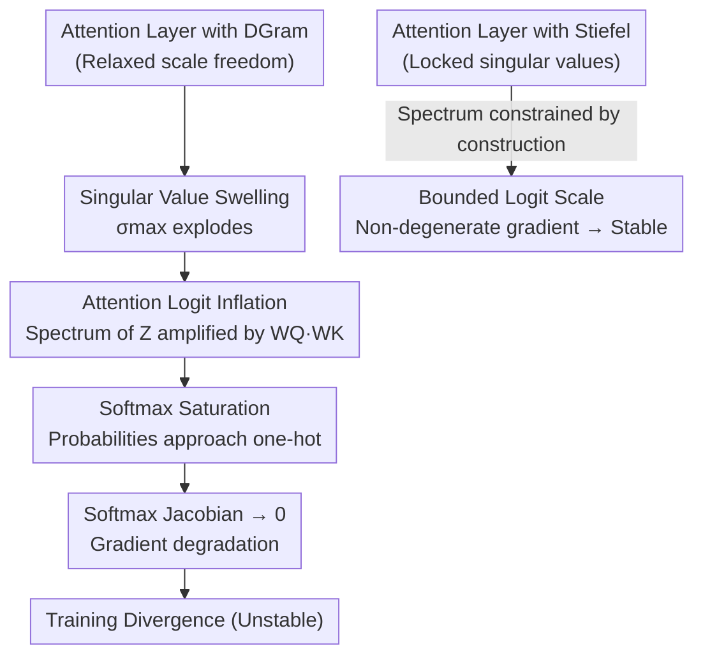

# Different Layers, Different Manifolds: Module-Wise Weight-Space Geometry in Transformer Optimization

**Conference**: ICML2026 (Workshop on Weight-Space Symmetries)  
**arXiv**: [2606.13276](https://arxiv.org/abs/2606.13276)  
**Code**: https://github.com/kiratoyoshihara/module-wise-manifold-muon  
**Area**: LLM Pre-training / Optimizer Geometry  
**Keywords**: Manifold Muon, Stiefel Manifold, DGram Constraint, Singular Value Swelling, Softmax Saturation

## TL;DR
This workshop paper systematically compares "module-wise manifold constraint" schemes during GPT-2 small pre-training. It discovers that applying strong spectral constraints (Stiefel) to Attention layers while applying weak constraints (DGram) to MLP layers achieves the best performance. Conversely, training Attention layers with DGram leads to divergence, for which the authors provide a mechanistic explanation: "Singular value swelling $\rightarrow$ Logit inflation $\rightarrow$ Softmax saturation $\rightarrow$ Gradient degradation."

## Background & Motivation

**Background**: Recent Muon optimizers have shifted from updating parameters as independent scalars to performing "matrix-normalized updates" on hidden layer weight matrices, thereby controlling the geometric structure of updates. Manifold Muon further advances this by ensuring weight matrices remain on specific structured matrix manifolds during optimization, such as the Stiefel manifold (column-orthogonal).

**Limitations of Prior Work**: Previously, when performing orthogonal/manifold-constrained training, the same family of constraints was typically applied **indiscriminately to all constrained weight matrices** in the network (either all orthogonal or all Stiefel). However, in a Transformer, the computational roles of Attention and MLP layers are distinct: Attention weights are multiplied pair-wise before passing through a softmax, whereas MLP weights simply undergo a point-wise GELU. Constraining them with the same geometry may be suboptimal.

**Key Challenge**: Weaker constraints (such as DGram) preserve some structure while relaxing the "scale freedom of column norms/singular values." While this scale freedom might be beneficial in some modules (providing more expressive freedom), it can be catastrophic in others (amplified by global competition mechanisms like softmax). A one-size-fits-all constraint allocation cannot balance these needs.

**Goal**: To answer a fundamental but previously unverified question: **Do different module types in a Transformer prefer different weight-space geometries?** Specifically, between Attention vs. MLP, should the same manifold constraint be used?

**Key Insight**: Instead of proposing a new optimizer, the authors use Manifold Muon as a tool to run all combinations of "Stiefel or DGram for Attention/MLP" under strictly shared hyperparameters. Preferences are inferred from validation loss and training stability. The behavior is then explained through the lenses of spectra (singular values) and the softmax Jacobian.

**Core Idea**: Manifold constraints should be **module-specific rather than uniformly applied**. Attention layers require the strong spectral control of Stiefel, while MLP layers can benefit from the weak scale freedom of DGram.

## Method

### Overall Architecture

Rather than proposing a new method, this work designs a series of **controlled experiments + mechanism analysis**. The study uses Manifold Muon, which projects weight matrices back to specified manifolds after each update. Constraints are categorized into two families: **Stiefel** (strong spectral control, $W^{\top}W=I$, column-orthogonal, locked singular values) and **DGram** (weak constraint, $\operatorname{Off}(W^{\top}W)=0$, diagonal Gram matrix without fixed diagonal entries, allowing singular values to grow).

Weight matrices are grouped into "Attention" and "MLP/FFN" categories. Independent selection of Stiefel or DGram for each group results in 5 allocation schemes: Unconstrained, All-Stiefel, All-DGram, **Hetero** (Attn-Stiefel + MLP-DGram), and **Hetero-Inv** (Attn-DGram + MLP-Stiefel). All schemes are used to train GPT-2 small (~124M, nanoGPT style, OpenWebText) using **identical architectures, data, schedules, and hyperparameters**. The only variable is the geometry allocation, isolating its effect.

Following the observation of a clear asymmetrical conclusion, the authors explain why "DGram on Attention" fails via a causal chain:

### Key Designs

**1. Stiefel and DGram: Strong vs. Weak Spectral Constraints**

Stiefel requires $W^{\top}W=I$, locking all singular values to 1 and providing **strong spectral control** at the cost of expressive freedom. DGram is a relaxed version requiring only the off-diagonal elements of the Gram matrix to be zero—$(W^{\top}W)_{ij}=0,\ i\neq j$. This maintains orthogonality between columns but **does not fix column norms**, allowing singular values to grow and providing "scale freedom." The authors argue that the consequences of this scale freedom vary drastically across modules.

**2. Module-Specific Heterogeneous Allocation (Hetero): Stiefel for Attention, DGram for MLP**

The most significant finding is the Hetero configuration. Constraining Attention weights to Stiefel and MLP weights to DGram yielded the **lowest stable validation loss (3.3544)**, outperforming both Unconstrained (3.3855) and All-Stiefel (3.3679). The intuition is that Attention naturally requires "scale governance," whereas MLPs benefit from the extra freedom of weak constraints. This suggests that **Transformer optimization should allocate geometry per module**.

**3. Instability Mechanism: Singular Value Swelling $\rightarrow$ Softmax Saturation $\rightarrow$ Gradient Degradation**

This technical analysis explains why Stiefel is necessary for Attention. The pre-softmax logit is $Z=\frac{XW_QW_K^{\top}X^{\top}}{\sqrt{d}}$, with its scale controlled by the spectral norms of $W_Q, W_K$: $\|Z\|_2\le \frac{\|X\|_2^2\,\|W_Q\|_2\,\|W_K\|_2}{\sqrt{d}}$. DGram allows singular values to grow indefinitely, inflating the logits. Large logits push softmax into saturation: if the maximum logit leads others by a margin $\Delta$, then $1-p_1\le (T-1)e^{-\Delta}$. As the probability exponentially approaches one-hot, the Frobenius norm of its Jacobian $J_{\text{softmax}}=\operatorname{diag}(p)-pp^{\top}$ tends to 0, causing **gradient degradation**. This is formalized in:
- **Prop 4.1**: Stiefel attention gradients are non-degenerate for bounded inputs ($|J_{\text{softmax}}(z)\|_F\ge c$).
- **Prop 4.2**: DGram attention allows singular value growth such that for any $\varepsilon>0$, directions exist where $\|J_{\text{softmax}}(z)\|_F<\varepsilon$.
Experimental $\sigma_{\max}$ curves for All-DGram and Hetero-Inv align perfectly with this theory.

**4. Why MLPs Tolerate DGram While Attention Does Not**

The same scale freedom in an MLP—$\operatorname{MLP}(x)=W_{\text{out}}\,\phi(W_{\text{in}}x)$—is harmless because GELU operates point-wise. Each coordinate's derivative is independent, **lacking the global competition of softmax** that couples all scores into a single probability simplex. Saturation in one coordinate does not collapse the entire module's routing. Furthermore, LayerNorm and residual connections in Transformer blocks partially absorb changes in activation scale before the next block, allowing DGram to exhibit spectral growth in MLPs without causing divergence.

## Key Experimental Results

### Main Results

GPT-2 small (124M) pre-training on OpenWebText. All five allocations share hyperparameters.

| Allocation | Attention Constraint | MLP Constraint | Val Loss / Result |
|------------|----------------------|----------------|-------------------|
| Unconstrained | None | None | 3.3855 |
| All-Stiefel | Stiefel | Stiefel | 3.3679 |
| All-DGram | DGram | DGram | **Unstable** |
| **Hetero** | **Stiefel** | **DGram** | **3.3544 (Best Stable)** |
| Hetero-Inv | DGram | Stiefel | **Unstable** |

### Spectral Evolution Analysis

| Config | Attention $\sigma_{\max}$ | MLP $\sigma_{\max}$ | Result |
|--------|---------------------------|---------------------|--------|
| Stiefel Attention (All-Stiefel / Hetero) | Bounded (Fixed) | Growth in Hetero (DGram) | Stable |
| DGram Attention (All-DGram / Hetero-Inv) | Explosive Growth | — | Divergent |

### Key Findings
- **"DGram for Attention" is a sufficient condition for instability**: Both All-DGram and Hetero-Inv (the only configurations with DGram for Attention) diverged, preceded by $\sigma_{\max}$ explosions.
- **MLPs accommodate DGram scale freedom**: Under Hetero, MLP spectral norms grow, but due to the lack of global softmax competition and the presence of LayerNorm/residuals, training remains stable and achieves optimal results.
- **Loss gap between Hetero vs. All-Stiefel is small (3.3544 vs. 3.3679)**: The authors caution that this gap requires more seeds and larger-scale replication; the consistent instability patterns are more robust.

## Highlights & Insights
- **Module-wise geometry as an independent design axis**: Previously, manifold constraints were one-size-fits-all. This work demonstrates that Attention and MLPs prefer different geometries, opening a new dimension for optimizer design.
- **Mechanistic "Why" over quantitative "What"**: By tracing the link from singular value swelling to softmax Jacobian collapse, the paper provides a translatable analysis chain for stability research.
- **Restrained academic tone**: The authors repeatedly emphasize the small loss differences and limited scale, avoiding the overstatement of workshop-level conclusions as universal laws.

## Limitations & Future Work
- **Scale and Sample Size**: Experiments are limited to GPT-2 small with few runs. Whether these conclusions scale to larger models remains to be seen.
- **Shared Hyperparameters**: While it isolates variables, it does not rule out the possibility that DGram Attention could be stabilized with different learning rates or explicit weight decay.
- **Mechanistic Proof**: Direct measurements of logit scales, attention entropy, and gradient flow across training are not fully provided. Automated manifold allocation across architectures is a suggested future direction.

## Related Work & Insights
- **vs. Muon / Manifold Muon (Jordan 2024 / Bernstein 2025)**: While they propose the optimizers, this work studies how constraints within those optimizers should be allocated.
- **vs. Unified Orthogonal Training (Huang 2018)**: Unlike previous uniform approaches, this proves that Transformers require differentiated treatment of modules.
- **vs. DGram / Gram-space Muon (Keigwin 2025)**: This work utilizes the DGram constraint but reveals its module-dependent nature—beneficial for MLPs but fatal for Attention.

## Rating
- Novelty: ⭐⭐⭐⭐ The module-wise manifold perspective is novel and explained with a clear mechanism.
- Experimental Thoroughness: ⭐⭐ Limited to GPT-2 small and few samples.
- Writing Quality: ⭐⭐⭐⭐ Logical, honest about caveats, and provides deep mechanistic insight.
- Value: ⭐⭐⭐⭐ Adds the dimension of "module customization" to geometric optimizer design.

<!-- RELATED:START -->

## Related Papers

- [\[ICML 2026\] On the Expressive Power of Permutation-Equivariant Weight-Space Networks](on_the_expressive_power_of_permutation-equivariant_weight-space_networks.md)
- [\[NeurIPS 2025\] Predict Training Data Quality via Its Geometry in Metric Space](../../NeurIPS2025/llm_pretraining/predict_training_data_quality_via_its_geometry_in_metric_space.md)
- [\[AAAI 2026\] PrefixGPT: Prefix Adder Optimization by a Generative Pre-trained Transformer](../../AAAI2026/llm_pretraining/prefixgpt_prefix_adder_optimization_by_a_generative_pre-trained_transformer.md)
- [\[ICML 2026\] Inverse Depth Scaling From Most Layers Being Similar](inverse_depth_scaling_from_most_layers_being_similar.md)
- [\[ICML 2026\] Names Don't Matter: Symbol-Invariant Transformer for Open-Vocabulary Learning](names_dont_matter_symbol-invariant_transformer_for_open-vocabulary_learning.md)

<!-- RELATED:END -->
