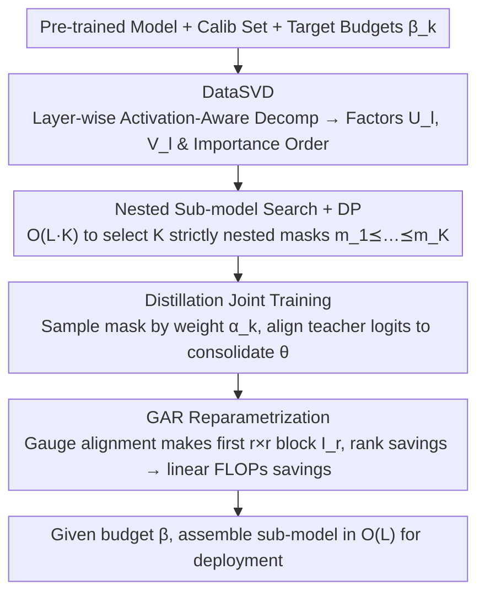

# FlexRank: Nested Low-Rank Knowledge Decomposition for Adaptive Model Deployment

**Conference**: ICML 2026 Spotlight  
**arXiv**: [2602.02680](https://arxiv.org/abs/2602.02680)  
**Code**: https://github.com/RickZack/FlexRank  
**Area**: Model Compression / Elastic Inference / Low-Rank Decomposition  
**Keywords**: Elastic Models, Low-Rank Decomposition, Nested Sub-models, Knowledge Distillation, Pareto Frontier

## TL;DR
FlexRank performs activation-aware low-rank decomposition (DataSVD) on each linear layer of a pre-trained large model, uses dynamic programming to select a set of **strictly nested** sub-models corresponding to different compute budgets in $O(L\cdot K)$ time, and jointly trains this shared weight set using knowledge distillation. Finally, via Gauge-Aligned Reparametrization, rank savings are translated into actual FLOPs savings—yielding a "family" of deployable models for LLMs and ViTs that approach the true Pareto frontier with a single training run.

## Background & Motivation

**Background**: LLMs and ViTs have expanded to billions of parameters, which only a few institutions can afford to train from scratch. The mainstream approach in the community is to reuse pre-trained weights, perform downstream adaptation with PEFT (e.g., LoRA), or reduce costs at deployment using quantization/pruning.

**Limitations of Prior Work**: PEFT only modifies a small portion of parameters, leaving the backbone's computational structure unchanged—the deployment cost remains "one-size-fits-all." While quantization and pruning reduce computation, quantization-aware training requires pipeline modifications, and structured sparsity depends on hardware kernels. Crucially, these methods produce only a **single compression ratio** model; providing different sizes for a mobile phone versus a server requires repeated retraining or maintaining multiple sets of weights.

**Key Challenge**: Existing elastic solutions either (i) train a full model first and then perform post-hoc subnet selection (PTS)—where Theorem 4.1 proves the probability of obtaining a Pareto-optimal sub-model is "zero"; or (ii) jointly train all sub-models (ASL), but all subnets **compete for the same representation capacity**, with Theorem 4.2 proving the sub-optimality gap for each rank is strictly greater than zero. Neither path yields a family of sub-models truly close to the Pareto frontier.

**Goal**: Starting from a pre-trained model, construct **a single set of shared weights $\theta$** and a sequence of **strictly nested** masks $\mathbf{m}_1 \preceq \mathbf{m}_2 \preceq \dots \preceq \mathbf{m}_K$, such that the sub-models extracted under $K$ different compute budgets $\beta_k$ simultaneously approach the true Pareto frontier.

**Key Insight**: The authors observe that SVD provides a natural "importance order" for each layer weight (singular values from largest to smallest). The seemingly stricter constraint of **nesting** actually prevents mutual interference in ASL: the $(r+1)$-th column only needs to learn the residual between the $(r+1)$-th order SVD truncation and the $r$-th order, without competing for capacity with smaller sub-models.

**Core Idea**: Use layer-wise activation-aware SVD to provide local importance, apply DP to aggregate local orders into a global nested sub-model family, and use distillation to consolidate "independent layer decompositions" into a "collaborative end-to-end elastic model." Finally, use gauge reparametrization during inference to transform $r$-th order truncations into actual $\mathcal{O}((m+n-r)r)$ FLOPs.

## Method

### Overall Architecture
FlexRank starts from a pre-trained model $f(\cdot;\theta_{\mathrm{orig}})$, utilizes a small calibration set $\mathcal{Z}$ of approximately $10^3$ samples and a set of target budgets $\mathcal{B}=\{\beta_k\}_{k=1}^K$, and finally delivers a **single set** of shared parameters $\theta=\{(U_l,V_l)\}_{l=1}^L$ along with a strictly nested sequence of masks $\mathcal{M}^\star=\{\mathbf{m}_k^\star\}$. During deployment, given a budget $\beta$, the corresponding sub-model $\theta_\beta$ can be assembled in $O(L)$ time without additional training. The pipeline consists of three steps: first, performing independent activation-aware SVD on each layer's weights to obtain low-rank factors $(U_l,V_l)$ with an "importance order"; second, using dynamic programming to search for $K$ mutually nested sub-models among $K^L$ global rank combinations; and finally, sampling masks alternately for distillation against teacher logits to consolidate independent layer decompositions into an end-to-end collaborative elastic model. These three steps produce the shared weights, and Gauge-Aligned Reparametrization (GAR) is applied during deployment to convert rank savings into FLOPs savings.

### Key Designs

**1. DataSVD: Aligning Decomposition with Real Inputs rather than Weights**

Performing SVD directly on $W_l$ leads to significant performance drops in LLMs (Fig. 4 shows collapse after removing 20% of parameters) because large weight magnitudes do not necessarily imply high contribution to real inputs. DataSVD changes the decomposition objective from minimizing weight reconstruction error $\|W_l - U_l V_l^\top\|_F^2$ to minimizing **output error** $\mathbb{E}_{\mathbf{x}_l}\bigl[\|(W_l-U_l V_l^\top)\mathbf{x}_l\|_2^2\bigr]$. Thus, singular directions are determined by the activation covariance, and "important directions" naturally align with the real input distribution. This is implemented by collecting an activation matrix $\mathbf{X}_l$ from the calibration set and solving the weighted SVD in closed form. The authors prove the space complexity is $\mathcal{O}(n_l^2)$, independent of the sample size $N$. However, this step is only an initialization to provide a reliable "importance order" for the subsequent DP; Remark 3.1 explicitly notes that DataSVD alone is insufficient and relies on subsequent distillation.

**2. Nested Sub-model Search + Dynamic Programming: Taming Combinatorial Explosion to $O(LK)$**

Selecting $K$ **strictly nested** sub-models $\mathbf{m}_1 \preceq \dots \preceq \mathbf{m}_K$ from $K^L$ global rank combinations, where each approaches the Pareto optimum under its budget $\beta_k$, is infeasible via exhaustive search. FlexRank first enumerates $K$ candidate ranks for each layer $l$, calculates the cost saving $\Delta c$ and error increase $\Delta e$ for "truncating to that rank," and obtains a local Pareto table $\mathcal{Q}_l$ for that layer. Under the standard but strong **additivity** assumption of inter-layer errors, DPRankSelection is used to combine global nested mask sequences from these local tables in $\mathcal{O}(L\cdot K)$ time (the authors verified its ranking fidelity in an enumerable setting with 4 layers and $K=10$ total subnets).

The insistence on the "nested" constraint is derived theoretically and is the most significant contribution: Thm 4.1 proves that "training a full model and then post-hoc selecting subnets" (PTS) has zero probability of finding a Pareto optimum; Thm 4.2 proves that "jointly training all subnets" (ASL) leaves a sub-optimality gap of at least $\frac{1}{k}(r\lambda-\sum_{i\le r}\sigma_i)^2$ at each rank due to capacity competition; while Thm 4.3 proves nested training (NSL) can achieve a gap of exactly 0—the key is that the $(r+1)$-th column only learns the residual $A_{r+1}-A_r$ without competing with smaller sub-models.

**3. Gauge-Aligned Reparametrization (GAR): Translating Rank Savings into FLOPs Savings**

Low-rank decomposition has an awkward threshold: the original $(U,V)$ form's FLOPs only beat a dense kernel when $r\ll\min(m,n)$. If the rank is not low enough, computation is not saved. GAR exploits the non-uniqueness of $UV^\top$ by introducing a gauge $G=U_{1:r,:}^{-1}$ and rewriting the decomposition as $UV^\top = (UG)(G^{-1}V^\top) = \tilde{U}\tilde{V}^\top$, such that the first $r \times r$ block of $\tilde{U}$ is **exactly aligned to $I_r$**. This portion requires neither storage nor computation, leaving only the $(m-r)\times r$ part of $\hat{U}$ for actual calculation. This reduces inference cost from $\mathcal{O}(mr+nr)$ to $\mathcal{O}((m+n-r)r)$, which is strictly less than the dense $\mathcal{O}(mn)$. Consequently, any reduction in $r$ translates **linearly** into FLOPs reduction, eliminating the threshold. GAR preprocessing is a one-time $\mathcal{O}(r^3)$ matrix inversion; it is independent of the specific elastic algorithm, and the authors applied GAR to all baselines for fairness.

### Loss & Training
After fixing the searched $\mathcal{M}^\star$, at each step, a mask $\mathbf{m}_t^\star$ is sampled from $\mathcal{M}^\star$ according to weights $\alpha_k$. The output of the corresponding sub-model is aligned with the original teacher $f(\cdot;\theta_{\mathrm{orig}})$:

$$\ell_k(\theta)=\mathbb{E}_{\mathbf{d}}\bigl[\mathcal{L}_{\text{KD}}(f(\mathbf{d};\mathcal{T}_{\mathbf{m}_k^\star}(\theta)), f(\mathbf{d};\theta_{\mathrm{orig}}))\bigr]$$

The total objective is $\min_\theta \sum_k \alpha_k \ell_k(\theta)$, optimized via standard gradient descent. On Llama-3.2-1B, using only 5B tokens (167× less than LayerSkip's 839B tokens) allows matching or exceeding heavier baselines across many budgets.

## Key Experimental Results

### Main Results

| Setting | Evaluation | FlexRank | SOTA Comparison | Description |
|------|------|----------|-----------|------|
| Llama-3.2-1B/3B/8B, 5B tokens | Average accuracy on commonsense lm-eval-harness | Consistently leads at budgets of 20–80% | Pure SVD/DataSVD performance collapses at 20% parameter reduction; ACIP (SOTA elastic low-rank method) suppressed at low budgets | Fig. 4-top |
| DINOv3 ViT-L/16 → ViT-7B/16, ImageNet-1K | Top-1 accuracy | Remains close to full model at 30% compression | Baseline performance significantly lags at various budgets | Fig. 4-bottom; gap within 5% even at 70% compression |
| Llama-3.2-1B, LoRA fine-tuning for math/code | Math/code avg accuracy | Smooth decay: base→1×→0.8×→0.4× (math: 25.7→25.0→20.5→13.6) | — | Tab. 1; sub-models can directly use LoRA for downstream adaptation |

### Ablation Study

| Configuration | Key Finding | Implication |
|------|----------|------|
| PTS (Train full, then cut) | Pareto gap always > 0 (Thm 4.1) | "Post-hoc subnet" routes are destined to be sub-optimal |
| ASL (Jointly train all subnets) | Strictly positive gap $\ge \frac{1}{k}(r\lambda-\sum\sigma_i)^2$ (Thm 4.2) | Subnets interfere and compete for capacity |
| NSL = FlexRank Nested Training | gap = 0 (Thm 4.3) | Nesting is a sufficient condition to recover the Pareto frontier |
| Independent layer training (No E2E distillation) | Performance remains poor (Fig. 7b) | Non-linear information flow must be consolidated via E2E distillation |
| DataSVD calibration samples | Saturates at 128 samples (Fig. 7a) | Calibration overhead is minimal; SVD precision is not the bottleneck |
| Layer-wise compression heatmap for GPT-2 | Middle attention layer c_proj is pruned last (Fig. 6) | DP differentiates importance rather than uniform truncation |

### Key Findings
- **Nesting is a "requirement" for Pareto elasticity, not just a heuristic**: Three theorems (4.1/4.2/4.3) theoretically bound the optimality gaps of PTS, ASL, and NSL, concluding that "nesting + joint training" is the only scheme allowing all ranks to simultaneously reach Pareto optimality.
- **GAR makes low-rank compression "immediately save FLOPs"**: Traditional low-rank decomposition requires a very small $r$ to beat dense kernels; GAR eliminates this threshold and is the key engineering trick to translate theoretical rank savings into actual inference speedup.
- **Amortized training cost**: During training, ranks are full, making it ~2× memory and 2× slower than dense forward; however, one training cycle produces $K$ deployable models, making it much more cost-effective than retraining for each budget.

## Highlights & Insights
- **"Theoretically refuting wrong paths before designing the right one"**: Section 4 uses Thm 4.1/4.2 to "sentence" PTS and ASL (the most intuitive routes) to death before using Thm 4.3 to prove nesting is sufficient for Pareto recovery. This "refutation-driven design" is more persuasive than the typical "method + experimental win" approach.
- **GAR as an algorithm-agnostic trick**: The authors applied GAR to all low-rank baselines, ensuring the comparison is between "algorithms" rather than "engineering optimization gaps." This fair-by-construction comparison makes FlexRank's success more credible.
- **DP + additivity assumption as the key to taming $K^L$ complexity**: Although additivity is a strong assumption, the authors verified "ranking fidelity" in smaller enumerable experiments—this is the core step in turning an unsolvable $K^L$ search into a tractable algorithm, an insight transferable to any pruning/quantization scenario involving layer scoring and global budgets.
- **Scalability**: The Nesting + KD paradigm can be applied to depth elasticity (varying layers), width elasticity (varying heads), or even bit-width elasticity, provided an "importance order" is found.

## Limitations & Future Work
- The additivity assumption (inter-layer error additivity) is strictly incorrect for deep non-linear networks; the authors only verified it on a 4-layer network. The quantitative impact on DP solutions for Llama 8B scales is not bounded.
- The training phase requires storing full-rank $(U,V)$, leading to ~2× memory overhead, which is currently infeasible for truly giant models (70B+). Using partial ranks or sharded factors during training is an engineering barrier.
- Input-adaptive routing (dynamically selecting budget per token difficulty) was not evaluated, though FlexRank naturally provides this capability. Combining it with a difficulty estimator is a low-hanging fruit for follow-up work.
- Only a few cross-family (e.g., LLM-Pruner/LayerSkip) baselines were compared; potential synergies with quantization, depth elasticity, or MoE remain unexplored.

## Related Work & Insights
- **vs ACIP (Genzel et al., 2025)**: ACIP also uses SVD-decomposition + LoRA adapters, but a frozen base + joint optimization of adapters and pruning scores is essentially a PTS+ASL hybrid. FlexRank directly updates $(U,V)$ shared weights and enforces nesting, which is theoretically superior and shows a clear advantage in low-budget segments while avoiding ACIP's "adapter drag" at full budgets.
- **vs SVD-LLM / DRONE / ASVD**: These are activation-aware low-rank compression methods but only output a **single compression ratio** model. FlexRank's DP + nested training produces a family of sub-models from one training run.
- **vs MatFormer / Once-For-All / Flextron**: These are elastic schemes for width/depth/architecture. FlexRank is the first to build elasticity in the **factorization space** with theoretical support; they are complementary.
- **vs LLM-Pruner / LayerSkip**: Structured pruning and early-exit methods on Llama-3.2-1B are outperformed by FlexRank with 5B tokens, compared to LayerSkip's 839B (167×). This highlights the unique cost-performance ratio of low-rank elasticity.

## Rating
- Novelty: ⭐⭐⭐⭐⭐ Elevates "nested sub-model training" to a theoretical proof, complemented by DP + GAR; a rare work combining theory and engineering in low-rank elasticity.
- Experimental Thoroughness: ⭐⭐⭐⭐ Covers GPT-2 / Llama 3.2-1B/3B/3.1-8B / DINOv3 ViT-L to 7B; 5B token training is fair, and downstream LoRA is verified—though cross-family comparisons are relatively sparse.
- Writing Quality: ⭐⭐⭐⭐⭐ Motivation is clearly explained via PTS→ASL→NSL theorems, with appendices providing enumerable verification, complexity derivations, and engineering details.
- Value: ⭐⭐⭐⭐⭐ "Train-once, deploy-everywhere" is a real pain point for heterogeneous LLM/ViT deployment; FlexRank provides a theoretically sound and practically viable solution.

<!-- RELATED:START -->

## Related Papers

- [\[ICLR 2026\] Implicit Bias and Loss of Plasticity in Matrix Completion: Depth Promotes Low-Rank](../../ICLR2026/llm_pretraining/implicit_bias_and_loss_of_plasticity_in_matrix_completion_depth_promotes_low-ran.md)
- [\[NeurIPS 2025\] Breaking the Frozen Subspace: Importance Sampling for Low-Rank Optimization in LLM Pretraining](../../NeurIPS2025/llm_pretraining/breaking_the_frozen_subspace_importance_sampling_for_low-rank_optimization_in_ll.md)
- [\[ACL 2026\] KoCo: Conditioning Language Model Pre-training on Knowledge Coordinates](../../ACL2026/llm_pretraining/koco_conditioning_language_model_pre-training_on_knowledge_coordinates.md)
- [\[ICML 2026\] SPARe: Stacked Parallelism with Adaptive Reordering for Fault-Tolerant LLM Pretraining Systems with 100k+ GPUs](spare_stacked_parallelism_with_adaptive_reordering_for_fault-tolerant_llm_pretra.md)
- [\[ICLR 2026\] FictionalQA: A Dataset for Studying Memorization and Knowledge Acquisition](../../ICLR2026/llm_pretraining/fictionalqa_a_dataset_for_studying_memorization_and_knowledge_acquisition.md)

<!-- RELATED:END -->
