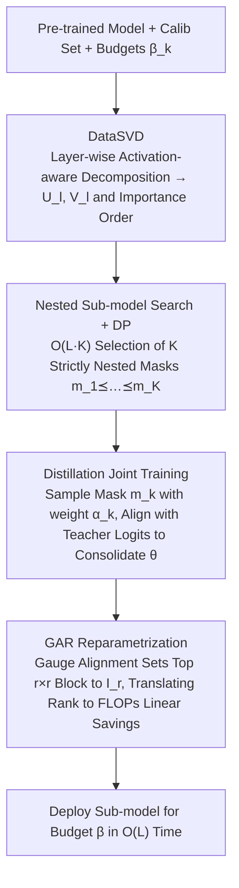

# FlexRank: Nested Low-Rank Knowledge Decomposition for Adaptive Model Deployment

**Conference**: ICML 2026 Spotlight  
**arXiv**: [2602.02680](https://arxiv.org/abs/2602.02680)  
**Code**: https://github.com/RickZack/FlexRank  
**Area**: Model Compression / Elastic Inference / Low-Rank Decomposition  
**Keywords**: Elastic Models, Low-Rank Decomposition, Nested Sub-models, Knowledge Distillation, Pareto Frontier

## TL;DR
FlexRank performs activation-aware low-rank decomposition (DataSVD) for each linear layer of a pre-trained large model. It employs dynamic programming to select a set of **strictly nested** sub-models corresponding to different computational budgets within $O(L\cdot K)$ time. These shared weights are jointly trained via knowledge distillation. Finally, Gauge-Aligned Reparametrization is used to translate rank savings directly into FLOPs savings. A single training process yields a "family" of deployable models on LLMs and ViTs that approach the true Pareto frontier.

## Background & Motivation

**Background**: LLMs and ViTs have expanded to billions of parameters, making training from scratch affordable for only a few institutions. The mainstream practice involves reusing pre-trained weights, adapting them via PEFT (e.g., LoRA), or reducing deployment costs through quantization/pruning.

**Limitations of Prior Work**: PEFT only modifies a small subset of parameters while the backbone's computational structure remains unchanged, leading to "one-size-fits-all" deployment costs. Quantization and pruning reduce computation but often require pipeline changes for quantization-aware training or depend on hardware kernels for structured sparsity. Crucially, these methods produce models with a **single compression ratio**, requiring repeated retraining or maintenance of multiple weight sets for different hardware budgets.

**Key Challenge**: Existing elastic solutions either (i) train a full model first and then perform post-hoc sub-network extraction (PTS)—where Theorem 4.1 proves the probability of obtaining a Pareto-optimal sub-model is zero; or (ii) jointly train all sub-models (ASL), where all sub-networks **compete for the same representational capacity**. Theorem 4.2 proves the sub-optimality gap for each rank is strictly greater than zero. Neither path provides a sub-model family that truly touches the Pareto frontier.

**Goal**: Starting from a pre-trained model, construct **a single set of shared weights $\theta$** and a sequence of **strictly nested** masks $\mathbf{m}_1 \preceq \mathbf{m}_2 \preceq \dots \preceq \mathbf{m}_K$, such that the sub-models extracted under $K$ different computational budgets $\beta_k$ are as close to the true Pareto frontier as possible.

**Key Insight**: The authors observe that SVD naturally provides an "importance order" for each layer weight (singular values from largest to smallest). The seemingly stricter constraint of **nesting** actually prevents interference in ASL: the $(r+1)$-th column only needs to learn the residual $A_{r+1}-A_r$ between the $(r+1)$-th and $r$-th rank SVD truncations, avoiding capacity competition with smaller sub-models.

**Core Idea**: Utilize layer-wise activation-aware SVD to provide local importance. Use DP to aggregate local orders into a global nested sub-model family. Employ distillation to consolidate independent layer decompositions into a collaborative end-to-end elastic model. Finally, use GAR during inference to transform $r$-rank truncation into actual $\mathcal{O}((m+n-r)r)$ FLOPs.

## Method

### Overall Architecture
FlexRank starts from a pre-trained model $f(\cdot;\theta_{\mathrm{orig}})$, using a small calibration set $\mathcal{Z}$ of approximately $10^3$ samples and a set of target budgets $\mathcal{B}=\{\beta_k\}_{k=1}^K$. The final output is a **single set** of shared parameters $\theta=\{(U_l,V_l)\}_{l=1}^L$ and a sequence of strictly nested masks $\mathcal{M}^\star=\{\mathbf{m}_k^\star\}$. During deployment, given a budget $\beta$, the corresponding sub-model $\theta_\beta$ can be assembled in $O(L)$ time without additional training. The pipeline consists of three steps: performing activation-aware SVD on each layer independently to obtain factors $(U_l,V_l)$ with an importance order; using dynamic programming to search for $K$ nested sub-models among $K^L$ global rank combinations; and performing joint distillation training by sampling masks to align with teacher logits. Finally, GAR is applied to translate rank reduction into FLOPs reduction.

### Key Designs

**1. DataSVD: Aligning Decomposition with Real Inputs**

Direct SVD on $W_l$ causes significant performance drops in LLMs (Fig. 4 shows collapse at 20% parameter reduction) because weight magnitude does not represent contribution to real inputs. DataSVD shifts the objective from minimizing weight reconstruction error $\|W_l - U_l V_l^\top\|_F^2$ to minimizing **output error** $\mathbb{E}_{\mathbf{x}_l}\bigl[\|(W_l-U_l V_l^\top)\mathbf{x}_l\|_2^2\bigr]$. Thus, singular directions are determined by the activation covariance, aligning "important directions" with the real input distribution. This is implemented using a closed-form SVD on the weighted problem via the calibration set $\mathbf{X}_l$. The space complexity is $\mathcal{O}(n_l^2)$, independent of sample size $N$. Remark 3.1 notes that this is only an initialization; subsequent distillation is essential.

**2. Nested Sub-model Search + DP: Taming Combinatorial Explosion to $O(LK)$**

Selecting $K$ **strictly nested** sub-models $\mathbf{m}_1 \preceq \dots \preceq \mathbf{m}_K$ from $K^L$ global rank combinations is intractable. FlexRank first enumerates $K$ candidate ranks for each layer $l$, calculating the cost saving $\Delta c$ and error increase $\Delta e$ to form a local Pareto table $\mathcal{Q}_l$. Under the additivity assumption that errors across layers are additive, `DPRankSelection` is used to combine these local tables into a global nested sequence in $\mathcal{O}(L\cdot K)$ time.

The theoretical justification for the "nesting" constraint is the core contribution: Thm 4.1 proves the probability of finding the Pareto optimum via "post-hoc sub-network extraction" (PTS) is zero. Thm 4.2 proves that "jointly training all sub-networks" (ASL) leaves an sub-optimality gap of at least $\frac{1}{k}(r\lambda-\sum_{i\le r}\sigma_i)^2$ at each rank due to capacity competition. Thm 4.3 proves that nested training (NSL) allows the gap for each rank to be exactly zero, as the $(r+1)$-th column learns only the residual between rank levels.

**3. Gauge-Aligned Reparametrization (GAR): Translating Rank Gains to FLOPs Gains**

Low-rank forms $(U,V)$ only outperform dense kernels in FLOPs if $r\ll\min(m,n)$. GAR exploits the non-uniqueness of $UV^\top$ decomposition by introducing a gauge $G=U_{1:r,:}^{-1}$. The decomposition is rewritten as $UV^\top = (UG)(G^{-1}V^\top) = \tilde{U}\tilde{V}^\top$, making the first $r\times r$ block of $\tilde{U}$ **exactly equal to $I_r$**. This block requires no storage or computation, leaving only the $(m-r)\times r$ part of $\hat{U}$ for actual calculation. Inference cost drops from $\mathcal{O}(mr+nr)$ to $\mathcal{O}((m+n-r)r)$, ensuring any reduction in $r$ translates **linearly** into FLOPs reduction.

### Loss & Training
After fixing $\mathcal{M}^\star$, each step samples a mask $\mathbf{m}_t^\star \in \mathcal{M}^\star$ with weight $\alpha_k$ and aligns the sub-model output with the original teacher $f(\cdot;\theta_{\mathrm{orig}})$:

$$\ell_k(\theta)=\mathbb{E}_{\mathbf{d}}\bigl[\mathcal{L}_{\text{KD}}(f(\mathbf{d};\mathcal{T}_{\mathbf{m}_k^\star}(\theta)), f(\mathbf{d};\theta_{\mathrm{orig}}))\bigr]$$

The total objective is $\min_\theta \sum_k \alpha_k \ell_k(\theta)$, optimized via standard gradient descent. On Llama-3.2-1B, using only 5B tokens (167× less than LayerSkip's 839B) matches or exceeds heavy baselines across various budgets.

## Key Experimental Results

### Main Results

| Setup | Evaluation | FlexRank | Prev. SOTA Comparison | Description |
|------|------|----------|-----------|------|
| Llama-3.2-1B/3B/8B, 5B tokens | Avg accuracy on commonsense lm-eval-harness | Leads consistently across 20–80% budgets | SVD/DataSVD collapse at 20% reduction; ACIP (SOTA elastic low-rank) outperformed at low budgets | Fig. 4-top |
| DINOv3 ViT-L/16 → ViT-7B/16, ImageNet-1K | Top-1 acc | Remains close to full model at 30% budget | Baselines lag significantly across all budgets | Fig. 4-bottom; gap < 5% at 70% budget |
| Llama-3.2-1B, LoRA fine-tuning for math/code | Math/code avg acc | Smooth degradation: base→1×→0.8×→0.4× (math: 25.7→25.0→20.5→13.6) | — | Tab. 1; sub-models support LoRA for downstream tasks |

### Ablation Study

| Configuration | Key Findings | Meaning |
|------|----------|------|
| PTS (Post-hoc) | Pareto gap always > 0 (Thm 4.1) | Post-hoc sub-network extraction is inherently sub-optimal |
| ASL (Joint All) | Strictly positive gap $\ge \frac{1}{k}(r\lambda-\sum\sigma_i)^2$ (Thm 4.2) | Sub-networks interfere and compete for capacity |
| NSL (Nest-aware) | Gap = 0 (Thm 4.3) | Nesting is a sufficient condition for recovering the Pareto frontier |
| Independent Training | Performance remains poor (Fig. 7b) | End-to-end distillation is necessary to consolidate non-linear information flow |
| DataSVD Samples | Saturates at 128 samples (Fig. 7a) | Minimal calibration overhead |
| GPT-2 Heatmap | Middle attention layer `c_proj` is pruned last (Fig. 6) | DP allocates budget based on importance rather than uniform truncation |

### Key Findings
- **Nesting is a requirement for Pareto elasticity, not a heuristic**: Theorems 4.1/4.2/4.3 bracket the optimality gaps of PTS, ASL, and NSL, concluding that "nesting + joint training" is the only way for all ranks to reach the Pareto optimum simultaneously.
- **GAR enables immediate FLOPs savings**: Traditional low-rank decomposition requires very small $r$ to be efficient; GAR eliminates this threshold and is key to translating theoretical rank reduction to actual wall-clock speedup.
- **Amortized training cost**: While training uses full ranks (approx. 2× VRAM and 2× slower forward pass), it yields $K$ deployable models in one run, proving more efficient than retraining for each budget.

## Highlights & Insights
- **Structure of "Theory First, Design Second"**: Section 4 utilizes Thm 4.1/4.2 to "invalidate" the most intuitive paths (PTS and ASL) before proving nesting as a sufficient condition for Pareto recovery. This "proof-driven design" is more compelling than empirical-only methods.
- **GAR as a Decoupled Trick**: The authors apply GAR to all low-rank baselines, ensuring comparisons reflect algorithmic superiority rather than engineering optimizations.
- **DP + Additivity for Tractability**: While additivity is a strong assumption, its "ranking fidelity" is verified in small-scale experiments. This turns an intractable $K^L$ search into a solvable $O(LK)$ algorithm.
- **Extensibility**: The Nesting + KD paradigm can be applied to depth elasticity (layer counts), width elasticity (heads), or bit-width elasticity, provided an importance order exists.

## Limitations & Future Work
- The additivity assumption (additive errors across layers) may not strictly hold for very deep non-linear networks; the impact of this bias on 8B+ models is not fully quantified.
- Training requires storing full-rank $(U,V)$, leading to ~2× VRAM overhead, which might be challenging for ultra-large models (70B+).
- Input-adaptive routing (dynamic budget per token) was not evaluated, though FlexRank naturally provides the necessary sub-models for such an application.
- Evaluations focused on the same family (rank-based) or a few cross-family baselines; combinations with quantization or MoE remain unexplored.

## Related Work & Insights
- **vs ACIP (Genzel et al., 2025)**: ACIP uses SVD + LoRA adapters, but joint optimization of adapters/pruning scores is essentially a PTS/ASL hybrid. FlexRank updates shared $(U,V)$ weights with nesting, proving theoretically superior and more robust at full budgets.
- **vs SVD-LLM / DRONE / ASVD**: These focus on activation-aware low-rank compression but only output a single model version. FlexRank provides a family of models from a single training run.
- **vs MatFormer / Once-For-All**: These are elasticity schemes for width/depth/architecture. FlexRank is the first to establish elasticity in the **factorization space** with theoretical backing.
- **vs LLM-Pruner / LayerSkip**: FlexRank outperforms structured pruning and early-exit methods on Llama-3.2-1B with significantly fewer training tokens (167× less than LayerSkip), highlighting the efficiency of low-rank elasticity.

## Rating
- Novelty: ⭐⭐⭐⭐⭐ Elevates "nested sub-model training" to a theoretical proof, complemented by DP and GAR.
- Experimental Thoroughness: ⭐⭐⭐⭐ Broad coverage (Llama, ViT) and fair training volume, though cross-family comparisons could be expanded.
- Writing Quality: ⭐⭐⭐⭐⭐ Excellent motivation via three theorems. Paradigm-setting structure for this sub-field.
- Value: ⭐⭐⭐⭐⭐ Real-world "train-once, deploy-everywhere" solution for heterogeneous hardware with solid theoretical grounding.

<!-- RELATED:START -->

## Related Papers

- [\[ICLR 2026\] Implicit Bias and Loss of Plasticity in Matrix Completion: Depth Promotes Low-Rank](../../ICLR2026/llm_pretraining/implicit_bias_and_loss_of_plasticity_in_matrix_completion_depth_promotes_low-ran.md)
- [\[NeurIPS 2025\] Breaking the Frozen Subspace: Importance Sampling for Low-Rank Optimization in LLM Pretraining](../../NeurIPS2025/llm_pretraining/breaking_the_frozen_subspace_importance_sampling_for_low-rank_optimization_in_ll.md)
- [\[ACL 2026\] KoCo: Conditioning Language Model Pre-training on Knowledge Coordinates](../../ACL2026/llm_pretraining/koco_conditioning_language_model_pre-training_on_knowledge_coordinates.md)
- [\[ICML 2026\] SPARe: Stacked Parallelism with Adaptive Reordering for Fault-Tolerant LLM Pretraining Systems with 100k+ GPUs](spare_stacked_parallelism_with_adaptive_reordering_for_fault-tolerant_llm_pretra.md)
- [\[ACL 2026\] SAGE: Sign-Adaptive Gradient for Memory-Efficient LLM Optimization](../../ACL2026/llm_pretraining/sage_sign-adaptive_gradient_for_memory-efficient_llm_optimization.md)

<!-- RELATED:END -->
