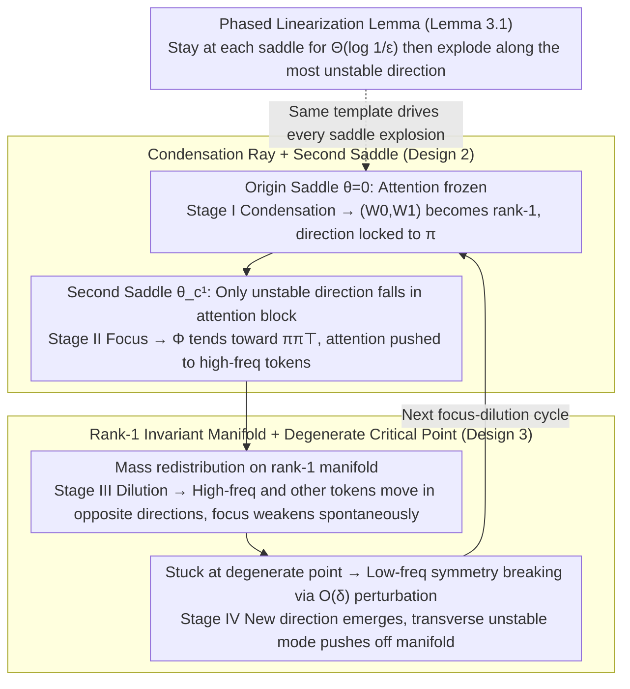

# Focus and Dilution: The Multi-stage Learning Process of Attention

**Conference**: ICML 2026 Spotlight  
**arXiv**: [2605.01199](https://arxiv.org/abs/2605.01199)  
**Code**: None  
**Area**: LLM Pre-training / Transformer Training Dynamics  
**Keywords**: Attention Training Dynamics, Focus-Dilution Cycle, Condensation Phenomenon, Markovian Data, Saddle-point Linearization

## TL;DR
By performing phased linearization of gradient flow around a series of critical points in a simplified setting where a single-layer Transformer learns Markovian data, this paper reveals and rigorously characterizes the recurring "focus–dilution" cycles in attention training, observing consistent phenomena on WikiText and TinyStories.

## Background & Motivation
**Background**: While many theoretical results exist regarding the approximation capabilities of Transformers, the mechanistic understanding of how attention gradually forms during the training process remains weak. Existing analyses often rely on reparameterization or proxy dynamics to bypass real coupling, thereby missing the genuine interaction between embeddings, projections, and attention.

**Limitations of Prior Work**: Empirical studies have observed multi-stage transitions in Transformer training, where attention suddenly shifts from highly concentrated to diffuse; however, there is no theoretical explanation for "why the switch from focus to dilution occurs" or "why focus reappears." Common NTK/proxy dynamics either drown out these phase transitions or require treating attention as a pre-fixed structure.

**Key Challenge**: To maintain the essential coupling of "embedding–projection–attention" while simplifying the dynamics enough for closed-form analysis. Previous works have almost all made compromises between these two.

**Goal**: Without breaking the coupled structure, provide a provable mechanistic description that explains the segmented shape of the entire training curve: explaining why condensation appears first, why attention suddenly grows at a certain moment, why it spontaneously dilutes, and how it restarts a new cycle from the symmetry breaking of low-frequency tokens.

**Key Insight**: Choose the minimal viable setting—single-layer Transformer + Markovian data + population gradient flow—and perform local linearization near each critical point. Then, "stitch" multiple linearization stages together, where the stable/unstable directions of each stage determine the behavior of the next.

**Core Idea**: Training dynamics do not follow monotonic convergence but rather a trajectory that jumps between multiple saddle points in segments; the "unstable feature direction" at each saddle point determines whether the next stage is condensation, attention growth, or dilution.

## Method

### Overall Architecture
Rather than proposing a new algorithm, the paper provides a provable dynamical narrative explaining the piecewise shape of the complete training curve for the minimalist setting of "single-layer Transformer + Markovian data + cross-entropy + population gradient flow." Let the vocabulary be $\mathcal{V}=[d]$, with sequences generated by a transition matrix $P=\lambda I+(1-\lambda)\mathbf{1}\pi^{\top}$ of length $s$. The model contains embeddings $W_0$, attention $W_Q, W_K$, and output $W_1$. The authors pack these into three equivalent matrices $M=W_0W_1$, $\Phi=W_0W_QW_K^{\top}W_0^{\top}$, and $W_{QK}=W_QW_K^{\top}$, deriving closed-form expressions for population gradients $\partial\mathcal{L}/\partial M$ and $\partial\mathcal{L}/\partial \Phi$. The core narrative follows a sequence of critical points: "Origin → Second saddle on the condensation ray → Degenerate critical point on the rank-1 manifold → New critical point after symmetry breaking," performing local linearization at each point and stitching the stages. The unstable directions at each saddle determine the next segment of the trajectory:

### Key Designs

**1. Phased Linearization Lemma (Lemma 3.1): Turning "Saddle Lag → Directional Explosion" into a Provable Template**

Training curves in experiments show stages of plateaus followed by sudden changes, but a tool to characterize this piecewise was missing. The lemma performs Taylor expansion $\dot{\Delta\theta}=J\Delta\theta+O(\|\Delta\theta\|^2)$ at each critical point $\theta_*$. It proves that if the initial perturbation $\|\Delta\theta(0)\|=\varepsilon$ is small enough, the maximum real part of the Jacobian is $\mu>0$, and there is a spectral gap $\rho>0$, then the nonlinear flow aligns with the linearized flow $\dot{\widetilde{\Delta\theta}}=J\widetilde{\Delta\theta}$ within an error of $C\varepsilon^2 e^{2\mu t}$. Within time $t=\Theta(\log(1/\varepsilon))$, the normalized direction $\Delta\theta(t)/\|\Delta\theta(t)\|$ is forced to align with the most unstable eigenvector $v_u$. Its utility lies in turning the intuition of "staying near a saddle for a long time and then rushing out along the most unstable direction" into a theorem with error bounds, allowing all four stages to be analyzed under one template.

**2. Condensation Ray + Second Saddle (Theorems 3.2–3.5): Explaining Why Attention Stays Still then Suddenly Focuses on High-Frequency Tokens**

Empirically, it is observed that attention often does nothing before suddenly concentrating, but the trigger conditions were unclear. The key is that at the origin $\partial\mathcal{L}/\partial\Phi=0$, so the attention subsystem has no gradient drive and remains static. Only $(W_0, W_1)$ are driven to condense into rank-1 according to $W_0/\|W_0\|\to\pi/\|\pi\|\,\alpha_1^{\top}$—this is Stage I Condensation. The trajectory slides along this condensation ray to a second critical point $\theta_c^1$, where the Jacobian cleanly decomposes into a "negative semi-definite outer block + positive semi-definite attention block." Thus, the only unstable direction falls in the attention block. The subsystem satisfies the closed-form $\dot{\Delta W_Q}=c\alpha_1\alpha_1^{\top}\Delta W_K$, where $(W_Q, W_K)$ grow exponentially in the same direction, pushing $\Phi/\|\Phi\|$ towards $\pi\pi^{\top}$. Attention for all tokens concentrates on high-frequency tokens—this is Stage II Focus. Consequently, "why focus must happen and must follow condensation" is reduced to the provable fact that the unstable direction exists only in the attention block.

**3. Rank-1 Invariant Manifold + Mass Redistribution + Degenerate Critical Point (Props 3.6–3.8, Theorem 3.9): Explaining Spontaneous Dilution and Cycle Restart**

After focusing, parameters are trapped on a rank-1 manifold where $W_0=\gamma(t)\alpha_1^{\top}$, $W_1=\alpha_1\beta(t)^{\top}$, and $W_{Q,K}=\lambda_{Q,K}(t)\alpha_1\tilde\alpha_1^{\top}$. Here, standard linearization is insufficient; next-order feedback from attention must be preserved. Reduced dynamics show $(1-\pi_1)\gamma_1(t)-(d-1)\pi_1\gamma_{i\neq 1}(t)\propto e^{ct}$, meaning embeddings of high-frequency tokens and others are forced to move in opposite directions. This "mass redistribution" occurs without any regularization or scheduler, causing attention to automatically undergo dilution (Stage III). When low-frequency tokens are perfectly symmetric, a degenerate critical point appears on the rank-1 manifold where $\partial\mathcal{L}/\partial M=\partial\mathcal{L}/\partial\Phi=0$, causing the system to get stuck. The authors explicitly acknowledge this and introduce $O(\delta)$ low-frequency symmetry-breaking perturbations. Using Lyapunov–Schmidt reduction, they prove the Hessian produces a transverse unstable mode of $\Theta(\delta)$ and a tangential unstable mode of at most $O(\delta^2)$, pushing the trajectory off the rank-1 manifold and birthing new embedding directions to start the next cycle—this is Stage IV, providing a physical picture where slight frequency asymmetries in real corpora are sufficient to keep the cycles restarting.

### Loss & Training
The training objective is the cross-entropy of the final token $\mathcal{L}(\theta)=N^{-1}\sum_i\ell(f_\theta(X_i)_s,y_i)$. The analysis uses population gradient flow $\dot\theta=-\nabla\mathcal{L}(\theta)$ in the $(N,s)\to\infty$ limit. All stages assume initialization $\mathcal{N}(0,\varepsilon^2)$ with a minimal scale $\varepsilon\ll 1$, ensuring the trajectory starts within an $O(\varepsilon)$ neighborhood of the origin critical point.

## Key Experimental Results

### Main Results

| Experimental Data | Observed Stages | Correspondence to Theory |
| :--- | :--- | :--- |
| Synthetic Markovian data, $\pi=(0.75,0.19,0.05,0.01)$ | Stages I–IV fully appear | $(W_0,W_1)$ become rank-1 first, $W_Q,W_K$ high-rank unchanged (Thm 3.2); then sudden shift to rank-1 concentrating all attention on token 0; then low-freq token embeddings retract; finally orthogonal directions emerge |
| WikiText real corpus | Mid-frequency token "continue" shows 4-phase change: Dilution → Focus on whitespace → Dilution again → Focus back on itself | Consistent with periodic "focus-dilution" predictions |
| TinyStories | Attention evolution for input [the, comma, a, full, been] is isomorphic to WikiText | Validates applicability of Markovian approximation on weakly non-Markovian text |

### Ablation Study

| Configuration | Key Observation | Explanation |
| :--- | :--- | :--- |
| Different $P$ matrices, same $\pi$ | All reproduce four stages in same order | Stage transitions are determined by the frequency structure of $\pi$ rather than specific $P$ |
| PCA embedding trajectories | Stage I–II growth in one direction, Stage III contraction, Stage IV explosion in orthogonal direction | Directly corresponds to "mass redistribution" and "degeneracy removal" on the rank-1 manifold |
| Attention entropy and $\|W_0\|$ time series | Entropy decreases then increases then decreases; norms of low-freq tokens oscillate | "Focus–dilution" cycles appear more than once, validating the predicted periodicity |

### Key Findings
- The emergence of the focus phase is entirely determined by the fact that "at the saddle point on the condensation ray, the attention block is the only unstable direction"; this explains why attention always "stays still first, then suddenly concentrates on high-frequency tokens."
- The dilution phase requires no scheduler; it is a spontaneous result of "high-frequency vs. other token reverse movement" among embeddings on the rank-1 manifold, independent of regularization or learning rate decay.
- On data with perfectly symmetric low-frequency tokens, the theory predicts the system will get stuck at a degenerate critical point. In experiments, manually alignment of low-frequency frequencies indeed leads to long-term training stagnation, proving that weak asymmetry in real corpora is key to restarting the cycle.

## Highlights & Insights
- The authors unify seemingly indescribable "phase transitions" on training curves into a framework of "linearization around saddles + unstable modes," avoiding the introduction of extra proxy dynamics. This "phased linearization + stitching" approach can be borrowed for other networks with phase transitions (e.g., two-layer MLPs, GAN training).
- "Mass redistribution" is the most significant discovery: even when attention is already fixed on high-frequency tokens, next-order feedback alone causes embeddings to dilute themselves without external scheduling. This suggests many empirical "self-correction" behaviors might not be mysterious.
- Using "slight asymmetry among low-frequency tokens" to resolve degenerate critical points raises subtle data distribution asymmetries to the status of key parameters in training dynamics, a lens that could be transferred to analyze "plateau" phenomena in fine-tuning or continual learning.

## Limitations & Future Work
- The theory only covers minimalist models: single-layer, single-head, no LayerNorm, and population gradient flow. Multi-layer and multi-head setups introduce extra coupling, and it is unclear if the stage structure remains as distinct.
- The assumption of very small initialization $\varepsilon\ll 1$ is required for phased linearization; under standard initialization, the condensation stage might be skipped entirely, and phase transitions could be disrupted.
- Validation on real corpora is limited to small-scale, single-epoch settings like WikiText/TinyStories. To show that these focus–dilution cycles persist throughout LLM pre-training, the analysis needs to be extended to practical optimizers with LayerNorm, AdamW, and warmups, characterizing the interaction between perturbation $\delta$ and sampling noise.

## Related Work & Insights
- **vs. Chen & Luo (2025) on condensation**: This work reviews and refines the condensation theorem, explicitly locking the condensation direction to the steady-state distribution $\pi$ and analyzing everything that happens after condensation.
- **vs. Tian et al. (2024) experimental observations of attention from concentrated to diffuse**: This paper provides the first saddle-to-saddle explanation for this phenomenon, noting that "dilution" is not an over-fitting or regularization effect but an inevitable mass-redistribution on the rank-1 manifold.
- **vs. Chang et al. (2024) on staged learning curves**: This paper elevates multi-stage studies from empirical description to provable dynamical structures, providing the specific mechanism for "how the next stage is triggered" (unstable eigenvectors + symmetry breaking).

## Rating
- Novelty: ⭐⭐⭐⭐⭐ Uses linearization to stitch a multi-stage phase transition map and provides a unique theoretical explanation for "dilution" and "cycle restart."
- Experimental Thoroughness: ⭐⭐⭐ Synthetic experiments align highly with theory, but real corpus validation covers only two small datasets.
- Writing Quality: ⭐⭐⭐⭐ Concepts are clear, but theorem statements are dense, requiring background in spectral theory and Lyapunov–Schmidt reduction.
- Value: ⭐⭐⭐⭐ Provides a universal language for "reading Transformer training curves," making it a strong starting point for explaining more complex phase transitions.

<!-- RELATED:START -->

## Related Papers

- [\[ICML 2025\] On the Role of Label Noise in the Feature Learning Process](../../ICML2025/llm_pretraining/on_the_role_of_label_noise_in_the_feature_learning_process.md)
- [\[ICLR 2026\] Conditioned Initialization for Attention](../../ICLR2026/llm_pretraining/conditioned_initialization_for_attention.md)
- [\[ICLR 2026\] Late-to-Early Training: Enabling LLMs to Learn Late-Stage Knowledge Earlier for Faster and Better Training](../../ICLR2026/llm_pretraining/late-to-early_training_let_llms_learn_earlier_so_faster_and_better.md)
- [\[NeurIPS 2025\] The Atlas of In-Context Learning: How Attention Heads Shape In-Context Retrieval Augmentation](../../NeurIPS2025/llm_pretraining/the_atlas_of_in-context_learning_how_attention_heads_shape_in-context_retrieval_.md)
- [\[ICLR 2026\] Avey-B: Refactoring Attention-Free Architectures into Bidirectional Encoders](../../ICLR2026/llm_pretraining/avey-b.md)

<!-- RELATED:END -->
