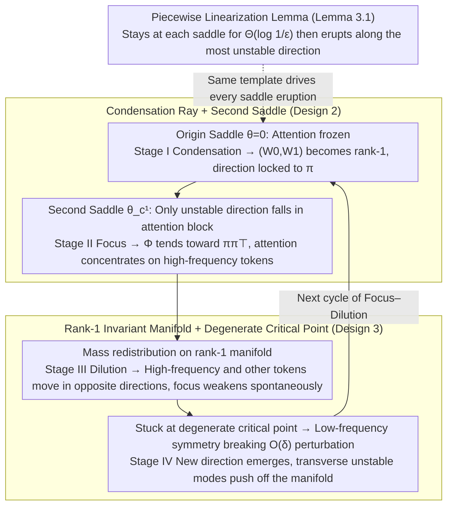

# Focus and Dilution: The Multi-stage Learning Process of Attention

**Conference**: ICML 2026 Spotlight  
**arXiv**: [2605.01199](https://arxiv.org/abs/2605.01199)  
**Code**: None  
**Area**: LLM Pre-training / Transformer Training Dynamics  
**Keywords**: Attention Training Dynamics, Focus–Dilution Cycle, Condensation Phenomenon, Markovian Data, Saddle Point Linearization

## TL;DR
In a simplified scenario where a single-layer Transformer learns Markovian data, this paper reveals and rigorously characterizes the recurring "focus–dilution" cycle in attention training through a stage-by-stage linearized gradient flow analysis around a sequence of critical points. Consistent phenomena are observed on WikiText and TinyStories.

## Background & Motivation
**Background**: While many theoretical results exist regarding the approximation capabilities of Transformers, the mechanistic understanding of how attention progressively forms during the training process remains very weak. Existing analyses often rely on reparameterization or proxy dynamics to bypass real coupling, thereby missing the genuine interaction between embeddings, projections, and attention.

**Limitations of Prior Work**: Empirical studies have observed multi-stage switching in Transformer training, where attention can suddenly shift from highly concentrated to diffuse; however, there is no theoretical explanation for "why the switch from focus to dilution occurs" or "why focus reappears." Common NTK or proxy dynamics either wash out these phase transitions or require treating attention as a pre-fixed structure.

**Key Challenge**: To preserve the essential "embedding–projection–attention" coupling while simplifying the dynamics enough for closed-form analysis. Past works have almost all made compromises between these two requirements.

**Goal**: Without breaking the coupled structure, provide a provable mechanistic description that explains the piecewise shape of the complete training curve: explaining why condensation appears first, why attention suddenly grows at a certain moment, why it then dilutes spontaneously, and how it restarts a new cycle from symmetry breaking of low-frequency tokens.

**Key Insight**: Choosing a minimal viable setting—single-layer Transformer + Markovian data + population gradient flow—and performing local linearization near each critical point. Multiple linearized stages are then "stitched" together, where the stable/unstable directions of each stage determine the behavior of the next.

**Core Idea**: Training dynamics do not follow monotonic convergence but rather a trajectory that jumps segment-by-segment between multiple saddle points; the "unstable eigen-directions" at each saddle point determine whether the next stage is condensation, attention growth, or dilution.

## Method

### Overall Architecture
The paper does not propose a new algorithm but rather provides a provable dynamical narrative for the complete training curve shape under the minimal setting of "single-layer Transformer + Markovian data + cross-entropy + population gradient flow." Let the vocabulary be $\mathcal{V}=[d]$, with sequences generated by a transition matrix $P=\lambda I+(1-\lambda)\mathbf{1}\pi^{\top}$ of length $s$. The model includes embeddings $W_0$, attention $W_Q, W_K$, and output $W_1$. The authors pack these into three equivalent matrices $M=W_0W_1$, $\Phi=W_0W_QW_K^{\top}W_0^{\top}$, and $W_{QK}=W_QW_K^{\top}$, deriving closed-form expressions for population gradients $\partial\mathcal{L}/\partial M$ and $\partial\mathcal{L}/\partial \Phi$. The core narrative follows a sequence of critical points: "origin $\to$ second saddle on the condensation ray $\to$ degenerate critical point on the rank-1 manifold $\to$ new critical point after symmetry breaking." Local linearization is performed at each point, and the stages are stitched together. The unstable direction at each saddle determines the next segment of the trajectory. The entire trajectory is a self-restarting loop rather than mono-convergence:

### Key Designs

**1. Piecewise Linearization Lemma (Lemma 3.1): Transforming "Saddle Stalling $\to$ Directional Eruption" into a Provable Template**

In experiments, training curves show plateaus followed by sudden changes, but a tool to characterize these piecewise was missing. The lemma performs Taylor expansion $\dot{\Delta\theta}=J\Delta\theta+O(\|\Delta\theta\|^2)$ at each critical point $\theta_*$. It proves that if the initial perturbation $\|\Delta\theta(0)\|=\varepsilon$ is sufficiently small, the maximum real part of the Jacobian $\mu>0$, and there is a spectral gap $\rho>0$, then the nonlinear flow aligns with the linearized flow $\dot{\widetilde{\Delta\theta}}=J\widetilde{\Delta\theta}$ within an error of $C\varepsilon^2 e^{2\mu t}$. Within time $t=\Theta(\log(1/\varepsilon))$, the normalized direction $\Delta\theta(t)/\|\Delta\theta(t)\|$ is forced to align with the most unstable eigenvector $v_u$. This works because it converts the intuition of "staying near a saddle for a long time then rushing out along the most unstable direction" into a theorem with error bounds, allowing all four subsequent stages to be analyzed using the same template.

**2. Condensation Ray + Second Saddle (Theorems 3.2–3.5): Explaining why attention stays idle first, then suddenly focuses on high-frequency tokens**

Empirically, attention is observed to do nothing initially and then suddenly concentrate, but the trigger condition was unclear. The key is that at the origin, $\partial\mathcal{L}/\partial\Phi=0$, so the attention subsystem has no gradient drive and remains static. Only $(W_0, W_1)$ are driven to condense into rank-1 according to $W_0/\|W_0\|\to\pi/\|\pi\|\,\alpha_1^{\top}$—this is Stage I Condensation. The trajectory slides along this condensation ray to a second critical point $\theta_c^1$, where the Jacobian cleanly decomposes into a "negative semi-definite outer block + positive semi-definite attention block." Thus, the only unstable direction lies in the attention block. The subsystem satisfies the closed form $\dot{\Delta W_Q}=c\alpha_1\alpha_1^{\top}\Delta W_K$, making $(W_Q, W_K)$ grow exponentially in the same direction, pushing $\Phi/\|\Phi\|$ toward $\pi\pi^{\top}$. Attention for all tokens concentrates on high-frequency tokens—this is Stage II Focus. Consequently, "why focus must happen and must follow condensation" is reduced to the provable fact that "unstable directions exist only in the attention block."

**3. Rank-1 Invariant Manifold + Mass Redistribution + Degenerate Critical Point (Props 3.6–3.8, Theorem 3.9): Explaining spontaneous dilution and cycle restart**

After focus, parameters are trapped on the rank-1 manifold $W_0=\gamma(t)\alpha_1^{\top}$, $W_1=\alpha_1\beta(t)^{\top}$, $W_{Q,K}=\lambda_{Q,K}(t)\alpha_1\tilde\alpha_1^{\top}$. Here, standard linearization is insufficient; next-order feedback from attention must be retained. Reduced dynamics yield $(1-\pi_1)\gamma_1(t)-(d-1)\pi_1\gamma_{i\neq 1}(t)\propto e^{ct}$, meaning embeddings of high-frequency tokens and other tokens are forced to move in opposite directions. This "mass redistribution" occurs without any regularization or schedule, causing attention to undergo automatic dilution (Stage III). When low-frequency tokens are perfectly symmetric, a degenerate critical point where $\partial\mathcal{L}/\partial M=\partial\mathcal{L}/\partial\Phi=0$ appears on the rank-1 manifold, causing linearization to fail and the system to stall. The authors explicitly acknowledge this and introduce an $O(\delta)$ low-frequency symmetry-breaking perturbation. Using Lyapunov–Schmidt reduction, they prove the Hessian develops a $\Theta(\delta)$ transverse unstable mode and at most an $O(\delta^2)$ tangential unstable mode, pushing the trajectory off the rank-1 manifold and birthing a new embedding direction. This initiates the next focus–dilution cycle—Stage IV—providing a physical picture where slight frequency asymmetries in real-world corpora are sufficient to keep the cycle restarting.

### Loss & Training
The training objective is the cross-entropy of the final token $\mathcal{L}(\theta)=N^{-1}\sum_i\ell(f_\theta(X_i)_s,y_i)$. The analysis uses population gradient flow $\dot\theta=-\nabla\mathcal{L}(\theta)$ in the $(N,s)\to\infty$ limit. All stages assume an initialization of $\mathcal{N}(0,\varepsilon^2)$ with a tiny scale $\varepsilon\ll 1$, ensuring the trajectory starts within an $O(\varepsilon)$ neighborhood of the origin.

## Key Experimental Results

### Main Results

| Experimental Data | Observed Stages | Theoretical Correspondence |
|----------|--------------|--------------|
| Synthetic Markovian data, $\pi=(0.75,0.19,0.05,0.01)$ | Full Stage I–IV appear | $(W_0,W_1)$ become rank-1 first, $W_Q,W_K$ high-rank unchanged (Thm 3.2); then a sudden jump into rank-1 pulls all attention to token 0; subsequently, low-frequency token embeddings retreat; finally, orthogonal directions emerge |
| WikiText real-world corpus | Mid-frequency token "continue" shows four-phase change: Dilution $\to$ focus to whitespace $\to$ dilution again $\to$ focus back to itself | Consistent with "focus–dilution" periodic prediction |
| TinyStories | Attention evolution for input [the, comma, a, full, been] is isomorphic to WikiText | Validates applicability of Markov approximation on weakly non-Markovian text |

### Ablation Study

| Configuration | Key Observation | Explanation |
|------|----------|------|
| Different $P$, same $\pi$ | All reproduce four stages in the same order | Stage switching is determined by the frequency structure of $\pi$ rather than specific $P$ |
| PCA embedding trajectories | Stage I–II unidirectional growth, Stage III contraction, Stage IV orthogonal eruption | Directly corresponds to "mass redistribution" and "de-degeneration" on the rank-1 manifold |
| Attention entropy and $\|W_0\|$ time series | Entropy decreases then increases then decreases; norm repeatedly expands and contracts on low-freq tokens | "Focus–dilution" cycles occur more than once, validating the predicted periodicity |

### Key Findings
- The emergence of the focusing phase is entirely determined by the fact that "at the saddle point on the condensation ray, the attention block is the only unstable direction." This is why attention always "stays idle first, then suddenly concentrates on high-frequency tokens."
- The dilution phase requires no scheduling; it is a spontaneous result of the "high-frequency vs. other tokens" opposite motion of embeddings on the rank-1 manifold, independent of regularization or learning rate decay.
- On data with perfectly symmetric low-frequency tokens, the theory predicts the system will stall at a degenerate critical point. Experiments show that if low-frequency frequencies are forced to align manually, training indeed stalls for a long time, proving that weak asymmetry in real corpora is critical for restarting the cycle.

## Highlights & Insights
- The seemingly indescribable "phase transitions" on the training curve are unified into a framework of "linearization around saddles + unstable modes," avoiding the introduction of extra proxy dynamics. This "piecewise linearization + stitching" approach can be applied to other networks with phase transitions (e.g., two-layer MLPs, GAN training).
- "Mass redistribution" is the most "aha" discovery of this paper: even when attention is fixed toward high-frequency tokens, next-order feedback alone can cause embeddings to dilute themselves without external scheduling. This implies many empirical "self-correction" behaviors might not be so mysterious.
- Using "tiny asymmetries between low-frequency tokens" to resolve degenerate critical points elevates subtle distribution non-symmetries to key parameters of training dynamics. This lens can be transferred to analyze "plateau" phenomena in fine-tuning or continual learning.

## Limitations & Future Work
- The theory only covers a minimal model (single-layer, single-head, no LayerNorm, population gradient flow); multi-layer and multi-head setups introduce additional coupling, and it is unclear if the stage structure remains as distinct.
- It assumes a very small initialization $\varepsilon\ll 1$ for the piecewise linearization to hold. Under standard initialization, the condensation stage might be skipped entirely, and phase transitions could be disrupted.
- Verification on real corpora is limited to small-scale, single-epoch settings like WikiText/TinyStories. Proving focus–dilution cycles persist throughout LLM pre-training requires extending the analysis to actual optimizers with LayerNorm, AdamW, and warmup, and characterizing the interaction between perturbation $\delta$ and sampling noise.

## Related Work & Insights
- **vs. Chen & Luo (2025) on condensation**: This paper restates and refines the condensation theorem, explicitly locking the condensation direction to the steady-state distribution $\pi$, and proceeds to analyze everything that happens after condensation.
- **vs. Tian et al. (2024) experimental observations on concentration-to-diffusion**: This paper provides the first saddle-to-saddle explanation for this phenomenon, noting that "dilution" is not an over-fitting or regularization effect but an inevitable mass-redistribution on the rank-1 manifold.
- **vs. Chang et al. (2024) on multi-stage learning curves**: This paper elevates multi-stage behavior from empirical description to a provable dynamical structure and provides the specific mechanism for how the next stage is triggered (unstable eigenvectors + symmetry breaking).

## Rating
- Novelty: ⭐⭐⭐⭐⭐ Uses linearization to stitch a multi-stage phase transition map and provides a unique theoretical explanation for "dilution" and "cycle restart."
- Experimental Thoroughness: ⭐⭐⭐ Synthetic experiments align perfectly with theorems, but real-world corpora only cover two small datasets.
- Writing Quality: ⭐⭐⭐⭐ Concepts are clear, but theorem statements are dense; readers may need background in spectral theory and Lyapunov–Schmidt reduction.
- Value: ⭐⭐⭐⭐ Provides a general language for "reading Transformer training curves" and serves as a strong starting point for explaining more complex transitions.

<!-- RELATED:START -->

## Related Papers

- [\[ICML 2025\] On the Role of Label Noise in the Feature Learning Process](../../ICML2025/llm_pretraining/on_the_role_of_label_noise_in_the_feature_learning_process.md)
- [\[NeurIPS 2025\] The Atlas of In-Context Learning: How Attention Heads Shape In-Context Retrieval Augmentation](../../NeurIPS2025/llm_pretraining/the_atlas_of_in-context_learning_how_attention_heads_shape_in-context_retrieval_.md)
- [\[ICLR 2026\] Deconstructing Positional Information: From Attention Logits to Training Biases](../../ICLR2026/llm_pretraining/deconstructing_positional_information_from_attention_logits_to_training_biases.md)
- [\[ACL 2026\] Toward Consistent World Models with Multi-Token Prediction and Latent Semantic Enhancement](../../ACL2026/llm_pretraining/toward_consistent_world_models_with_multi-token_prediction_and_latent_semantic_e.md)
- [\[ICLR 2026\] CHAMMI-75: Pre-training multi-channel models with heterogeneous microscopy images](../../ICLR2026/llm_pretraining/chammi-75_pre-training_multi-channel_models_with_heterogeneous_microscopy_images.md)

<!-- RELATED:END -->
