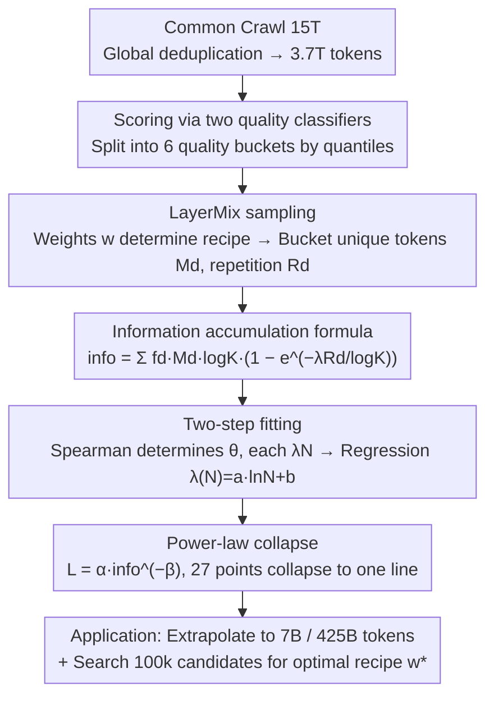

# InfoLaw: Information Scaling Laws for Large Language Models with Quality-Weighted Mixture Data and Repetition

**Conference**: ICML 2026  
**arXiv**: [2605.02364](https://arxiv.org/abs/2605.02364)  
**Code**: None  
**Area**: LLM Pre-training / Scaling Law / Data Recipes  
**Keywords**: scaling law, data quality, data repetition, data recipe, information volume  

## TL;DR
The authors propose InfoLaw: redefining "pre-training" as a process of "accumulating information in buckets." The information volume per bucket equals "quality density $f_d \times$ unique tokens $M_d \times \log K$" multiplied by an exponential decay factor associated with repetition counts $R_d$. By fitting validation loss as $L = \alpha\cdot\text{info}^{-\beta}$ on 252M-1.2B models, the law extrapolates to 7B models and 425B tokens with an average error of 0.15% (max 0.96%) and directly enables searching for optimal data recipes.

## Background & Motivation

**Background**: Chinchilla-style scaling laws define loss as $L = E + A/N^\alpha + B/D^\beta$, which extrapolates accurately in data-abundant scenarios. However, over-training has become mainstream (e.g., LLaMA / Qwen series), where high-quality tokens are insufficient, necessitating repetition or mixing with lower-quality data.

**Limitations of Prior Work**: (i) Standard scaling laws systematically underestimate the loss of large models under repetition (Fig 1: power-laws fitted on 252M-1.2B deviate significantly at 2.5B); (ii) different mixture recipes (high-quality/low-diversity vs. low-quality/high-diversity) fall on different curves, preventing cross-recipe comparison; (iii) finding the optimal recipe requires small-scale grid searches, but optimal recipes often vary across scales—leaving data recipe decisions to "blind GPU burning" without predictability.

**Key Challenge**: Higher quality yield higher per-token value, but limited tokens require repetition, which brings diminishing returns. The single axis of "compute" can no longer simultaneously characterize the three variables: "quality × repetition × scale."

**Goal**: Establish a data-aware scaling law capable of extrapolating loss across four dimensions (mixture recipe, model size, training tokens, over-training ratio) and searching for optimal data recipes without additional experiments.

**Key Insight**: Change the axis! Since compute $C$ is insufficient, the authors construct a new "effective data signal"—reinterpreting training as "information accumulation." This allows different mixtures to produce the same loss at the same information volume, naturally collapsing experimental points onto a single power-law line.

**Core Idea**: Information volume is defined as ($f_d M_d \log K$) × (1 − $e^{-\lambda(N) R_d/\log K}$). The former term represents "potential information" in the data, while the latter represents the "proportion learned by the model." This unifies all mixture × scale × repetition experiments onto a single power-law $L = \alpha\cdot\text{info}^{-\beta}$ on the $L$-info plane.

## Method

### Overall Architecture
InfoLaw answers a question constrained by the single axis of compute: what determines loss when high-quality tokens are scarce and must be supplemented by repetition and low-quality mixtures. It treats pre-training as "accumulating information by quality buckets." First, 3.7T tokens are obtained via global deduplication of Common Crawl, then partitioned into 6 quality buckets using two classifiers. Using LayerMix sampling, each training run's "quality distribution + repetition" is parameterized into weights $w$. An information volume formula $\text{info}$ is constructed to collapse all experiments. Fitting parameters on 9 small models (252M-1.2B, 27 runs) enables extrapolation to 7B/425B tokens and direct search for optimal recipes.

### Key Designs

**1. LayerMix Sampling: Decoupling "Quality × Repetition" into 6 Independently Estimable Buckets**

Traditional scaling laws assume tokens are non-repeating and uniform in quality, mixing their contributions into a single variable $D$. LayerMix splits the corpus into 6 buckets by quality quantile, with source pool proportions fixed at $B=[0.05, 0.15, 0.20, 0.20, 0.20, 0.20]$. A set of weights $w=[w_0,\dots,w_5]$ (constrained by $w_d\geq w_{d+1}$ and sum of 1 to prioritize high quality) controls the training recipe. Given total tokens $K$, the $d$-th bucket contains $K_d = w_d K$ tokens, but unique tokens available are $M_d = \min(K_d, B_d S)$. Thus, the average repetition ratio is $R_d = K_d / M_d$ ($R_d=1$ if quota is within the source pool, else $>1$). This transforms the data recipe into a 6D parameter space where the marginal contribution of $(w_d, R_d)$ per bucket can be estimated, prerequisite for decomposing loss into "additive information."

**2. Information Accumulation Formula: Quality Density × Exponential Decay × Log Normalization**

To quantify the effective information gained from reading data while accounting for quality, repetition, model capacity, and training scale, the authors model single-document gain. The gain from the $t$-th read of a document follows first-order exponential decay $I_{i\_\text{part}}(t, \lambda(N)) = I_i\cdot\lambda(N)e^{-\lambda(N)t}$. Integrating yields cumulative information $I_{i,\text{total}}(T) = I_i(1-e^{-\lambda(N)T})$, characterizing diminishing marginal returns. To generalize across scales, they introduce $\log K$ normalization, resulting in $I_{i,\text{total}} = I_i\log K(1-e^{-\lambda(N)T/\log K})$. Summing the six buckets gives total information:

$$\text{info}(w, K, S, f, \lambda(N)) = \sum_d f_d M_d \log K\cdot\big(1 - e^{-\lambda(N) R_d/\log K}\big)$$

Here $f_d = e^{-\theta d}$ is the monotonically decreasing quality density, and $\lambda(N) = a\ln N + b$ is the "learning rate" determined by model capacity. This formula decouples "data potential" ($f_d M_d\log K$) from the "proportion extracted by the model" ($(1-e^{-\lambda(N)R_d/\log K})$), reflecting that larger models extract more info before reaching saturation. Validation loss is then fitted to a power-law $L = \alpha\cdot\text{info}^{-\beta}$.

**3. Two-Step Fitting of $f_d$ and $\lambda(N)$: Monotonicity Metric followed by Extrapolative Form**

To avoid over-fitting while ensuring extrapolation to unseen $N$ across 27 points, fitting is done in two stages. First, $\theta$ in $f_d = e^{-\theta d}$ and discrete $\lambda_N$ for each model are treated as variables. 100k sets of $(\theta, \{\lambda_N\})$ are sampled, and the set maximizing Spearman rank correlation $\rho_s(L, \text{info})$ is selected. Spearman is used because it focuses on monotonic consistency rather than absolute scale, aligning with the "info maps monotonically to loss" semantics, yielding $\theta^*=0.922$. Second, the fitted $\lambda_N^*$ values are regressed as $\lambda(N)=a\ln N+b$, yielding $a^*=0.140, b^*=0.018$. The logarithmic form is chosen for its monotonic saturation in extrapolation ranges, matching the intuition that learning rates for larger models grow marginally without diverging. Final power-law parameters are $\alpha=3.7373, \beta=0.0441$.

### Loss & Training
All 27 fitting experiments utilized a fixed over-train ratio $m=3.6$, Transformer + SwiGLU + RoPE, 250k vocabulary, and bf16. Extrapolation experiments used $m'=25$ with 1.2B/640B tokens for validation. The fitted InfoLaw plus 100k mixture candidate samplings were used to select the optimal $w$ directly without further training.

## Key Experimental Results

### Main Results

| Evaluation Scenario | Configuration | Avg/Max Absolute Error |
|---------|------|--------------------|
| Unseen LayerMix (MLQ/MHQ) × 252M-1.2B | In-distribution mixture | Perfect collapse to curve |
| 1.5B-2.5B × MQ/LQ/HQ | Model extrapolation | Avg 0.15% / Max 0.96% |
| 7B × MLQ/MHQ × 300B tokens | Unseen mixture + scale | Avg 0.15% / Max 0.96% |
| 25× over-train (1.2B, 640B tokens) | Cross-overtrain domain | Parallel curve shift (offset) |
| 2.5B Optimal Recipe Search | $w^*=[0.50, 0.49, 0.01, 0, 0, 0]$ | Outperformed 4 baselines |

### Ablation Study

| Setting | Key Metric | Description |
|------|---------|------|
| W/o $\log K$ normalization | Scale generalization fails | $\log K$ is necessary (Appendix B) |
| $\lambda(N)$ as power-law / exp | Poor extrapolation | Logarithmic form fits best |
| Standard Scaling Law $L(C)$ | Underestimates large models | Significant deviation at 7B in Fig 1 |
| 1.2B + 25 random mixtures | Pearson 0.76 | InfoLaw can rank unseen recipes |

### Key Findings
- **Small models/tokens prefer quality; large models/tokens prefer diversity**: Table 2 shows that for 7B at 300B tokens, the optimal $w_0=0.548$ and $w_1=0.444$. At 1000B tokens, $w_0$ drops to 0.395 while $w_2$ rises to 0.214. This contradicts the naive intuition that high-quality data is always better regardless of quantity.
- **Diminishing returns of repetition follow exponential decay**: In HQ recipes, the top 5% bucket repeats 16×; in MQ, it repeats 10×. Early losses are similar, but HQ converges slower later, matching the saturation of $1-e^{-\lambda R/\log K}$ for large $R$.
- **Info collapse is the core empirical evidence**: 27 scattered points (differing $w, N, K$) collapse into a single straight line on the $L$-info log-log plot (Fig 3f), providing the most intuitive proof for InfoLaw.
- **Over-training shifts intercept but not slope**: Curves for $m=3.6$ and $m'=25$ are nearly parallel in log-log space, meaning InfoLaw does not require re-fitting $\beta$ for every over-training ratio.

## Highlights & Insights
- **The paradigm shift of the x-axis is elegant**: When the compute axis $C$ loses explanatory power, rather than adding more terms, the authors switch to a synthetic axis—info—that incorporates "quality × repetition." Compared to Chinchilla's approach of adding $N$ and $D$ terms, InfoLaw is more "data-centric."
- **$\log K$ normalization is a crucial technical insight**: The authors empirically demonstrate that without it, cross-scale generalization fails, suggesting that scaling law designs must consider the dilution of learning rates by the total data scale itself.
- **Small models as recipe searchers**: Using 252M-1.2B models as an "experimental platform" combined with 100k cheap mixture candidate samples allows for direct recipe selection for 7B models, representing a paradigm of data-efficient "prior scheduling."
- **One formula for two tasks**: It predicts the loss of large models and selects data recipes. The former is "diagnosis," the latter is "decision-making," extending the utility of scaling laws from passive observation to active intervention.

## Limitations & Future Work
- Fitting data only covers three mixtures across 252M-1.2B models; it has not been verified on MoE, long context, or specialized subsets like code/math.
- Quality bucket partitioning depends on the average of two external classifiers; biases in these classifiers propagate to $f_d$. Sensitivity analysis was not performed.
- Whether $\lambda(N) = a\ln N + b$ remains monotonically saturated for extremely large $N$ (>100B) is unknown, with 7B being the limit of current validation.
- The use of validation perplexity or five-task averages as the loss metric leaves it unclear if "factual knowledge" or "reasoning depth" corresponds monotonically with "info."
- Curriculum ordering (e.g., easy-to-hard vs. random) is not considered; LayerMix defaults to random packing.

## Related Work & Insights
- **vs. Chinchilla (Hoffmann 2022)**: Chinchilla assumes infinite data and calculates $N$ and $D$ terms. InfoLaw decomposes $D$ into "quality × repetition × bucket ratio," making it more accurate in data-constrained scenarios.
- **vs. Muennighoff 2023 (Scaling laws for data-constrained repetition)**: That work introduces a $R_{\text{D}}^*$ coefficient for single-source repetition; InfoLaw extends this to multi-bucket mixtures and incorporates quality density $f_d$.
- **vs. RegMix (Liu 2024)**: RegMix trains multiple proxy models to regress and pick recipes; InfoLaw uses a single info-loss power law, requiring no retraining for search.
- **vs. DataComp-LM / FineWeb (Penedo, Li)**: These provide high-quality data pools but do not specify how to mix them. InfoLaw provides a principled recipe selector that can be seamlessly applied after such datasets.

## Rating
- Novelty: ⭐⭐⭐⭐ The "info as coordinate" perspective is refreshing, with formula construction aligning well with physical intuition (decays and log normalization).
- Experimental Thoroughness: ⭐⭐⭐⭐ 27 fits + multi-scale extrapolation for 1.5B-7B + 25× over-training + recipe search validation. High density for a pre-training paper; however, it lacks MoE validation.
- Writing Quality: ⭐⭐⭐⭐ Fig 1 clearly identifies the problem, Fig 3 proves the conclusion through info collapse, and formulas are well-derived.
- Value: ⭐⭐⭐⭐ Provides a practical tool for pre-training teams to "fit at small scale → select recipes at large scale," potentially saving massive GPU resources.

<!-- RELATED:START -->

## Related Papers

- [\[ICML 2026\] Explaining Data Mixing Scaling Laws](explaining_data_mixing_scaling_laws.md)
- [\[ICML 2026\] Dropout Universality: Scaling Laws and Optimal Scheduling at the Edge-of-Chaos](dropout_universality_scaling_laws_and_optimal_scheduling_at_the_edge-of-chaos.md)
- [\[ICML 2026\] On Training Large Language Models for Long-Horizon Tasks: An Empirical Study of Horizon Length](on_training_large_language_models_for_long-horizon_tasks_an_empirical_study_of_h.md)
- [\[ICML 2026\] Predicting Large Model Test Losses with a Noisy Quadratic System](predicting_large_model_test_losses_with_a_noisy_quadratic_system.md)
- [\[ACL 2025\] DavIR: Data Selection via Implicit Reward for Large Language Models](../../ACL2025/llm_pretraining/davir_data_selection_via_implicit_reward_for_large_language_models.md)

<!-- RELATED:END -->
