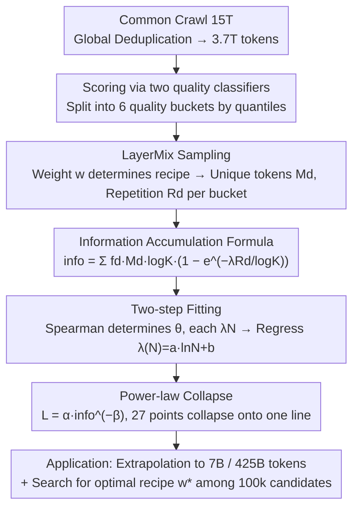

# InfoLaw: Information Scaling Laws for Large Language Models with Quality-Weighted Mixture Data and Repetition

**Conference**: ICML 2026  
**arXiv**: [2605.02364](https://arxiv.org/abs/2605.02364)  
**Code**: None  
**Area**: LLM Pre-training / Scaling Law / Data Recipe  
**Keywords**: scaling law, data quality, data repetition, data recipe, information gain

## TL;DR
The authors propose InfoLaw, which redefines "pre-training" as a process of "accumulating information by buckets." The information amount in each bucket is defined as "quality density $f_d \times$ unique tokens $M_d \times \log K$" multiplied by an exponential decay factor related to the number of repetitions $R_d$. Finally, the validation loss is modeled as $L = \alpha \cdot \text{info}^{-\beta}$. After fitting on models ranging from 252M to 1.2B, the law extrapolates to 7B models and 425B tokens with an average error of 0.15% (max 0.96%), and it can be directly used to search for optimal data recipes.

## Background & Motivation

**Background**: Chinchilla-style scaling laws model loss as $L = E + A/N^\alpha + B/D^\beta$, which accurately extrapolates when data is abundant. However, in practice, overtraining has become mainstream (e.g., Llama and Qwen series), where insufficient high-quality tokens necessitate data repetition or mixing with lower-quality data.

**Limitations of Prior Work**: (i) Standard scaling laws systematically underestimate the loss of large models in repetition settings (Fig 1: a power-law fitted on 252M-1.2B clearly deviates at 2.5B); (ii) different mixture recipes (high-quality/low-diversity vs. low-quality/high-diversity) fall on different curves, making cross-recipe comparison impossible; (iii) finding the optimal recipe requires small-scale grid searches, but optimal recipes at small scales are inconsistent with those at large scales—trapping data recipe decisions in a "blind GPU burning" cycle.

**Key Challenge**: The single axis of compute is no longer sufficient to characterize the three variables of "quality $\times$ repetition $\times$ scale" simultaneously.

**Goal**: Establish a data-aware scaling law capable of extrapolating loss across four dimensions (mixture recipe, model size, training tokens, and overtraining ratio) and searching for the optimal data recipe without additional experiments.

**Key Insight**: Change the axis! Since compute $C$ is insufficient, a new "effective data signal" is constructed by viewing training as "information accumulation." This ensures that different mixtures yield the same loss at the same information level, causing all experimental points to collapse onto a single power-law curve.

**Core Idea**: Information amount = ($f_d M_d \log K$) × ($1 - e^{-\lambda(N) R_d / \log K}$), where the first term represents "potential information" in the data and the second represents the "proportion learned by the model." This unifies data from various mixtures, scales, and repetitions onto the power-law $L = \alpha\cdot\text{info}^{-\beta}$ in the $L$-info plane.

## Method

### Overall Architecture
InfoLaw addresses the limitation of the compute-only axis: how loss is determined when high-quality tokens are scarce and must be supplemented by repetition and low-quality mixtures. The approach treats pre-training as "accumulating information via quality buckets." First, 3.7T tokens are obtained through global deduplication of Common Crawl, then sorted into six quality buckets using two classifiers. Using LayerMix sampling, the "quality distribution + repetition degree" of each run is parameterized by a set of weights $w$. An information formula $\text{info}$ is constructed to collapse mixture×scale×repetition experiments onto a single power-law line. Finally, parameters are fitted using 9 small models (252M-1.2B, 27 runs) to extrapolate to 7B models/425B tokens and search for optimal recipes.

### Key Designs

**1. LayerMix Sampling: Decomposing "Quality × Repetition" into 6 Independently Estimable Buckets**

Traditional scaling laws assume tokens are neither repeated nor differentiated by quality, conflating these contributions into the single variable $D$. LayerMix solves this by splitting the corpus into 6 buckets based on quality quantiles, with source pool proportions fixed at $B=[0.05, 0.15, 0.20, 0.20, 0.20, 0.20]$. A set of weights $w=[w_0,\ldots,w_5]$ (with constraints $w_d\geq w_{d+1}$ and sum of 1 to prioritize high quality) controls the training recipe. Given a total budget $K$, the $d$-th bucket contains $K_d = w_d K$ tokens, but the available unique tokens are $M_d = \min(K_d, B_d S)$, resulting in an average repetition factor $R_d = K_d / M_d$. When the quota does not exceed the source pool, $R_d=1$; otherwise, $R_d > 1$. This transforms the data recipe into a 6D parameter space, where the marginal contribution of $(w_d, R_d)$ in each dimension can be estimated, facilitating the decomposition of loss into "additive information."

**2. Information Accumulation Formula: Quality Density × Exponential Decay × Log Normalization**

The goal is to determine how much effective information is gained from reading data while accounting for quality, repetition, model capacity, and training scale. Starting from single-document modeling, the information gain from the $t$-th reading of the same document follows a first-order exponential decay $I_{i\_\text{part}}(t, \lambda(N)) = I_i\cdot\lambda(N)e^{-\lambda(N)t}$. Integrating yields the cumulative information $I_{i,\text{total}}(T) = I_i(1-e^{-\lambda(N)T})$, which naturally captures the "diminishing marginal returns of repetition." To enable cross-magnitude generalization, a $\log K$ normalization is added (empirically found to be necessary for scaling), resulting in $I_{i,\text{total}} = I_i\log K(1-e^{-\lambda(N)T/\log K})$. Summing the six buckets gives the total information:

$$\text{info}(w, K, S, f, \lambda(N)) = \sum_d f_d M_d \log K\cdot\big(1 - e^{-\lambda(N) R_d/\log K}\big)$$

where $f_d = e^{-\theta d}$ is the monotonically decreasing quality density and $\lambda(N) = a\ln N + b$ is the "learning rate" determined by model capacity. This formulation decouples "data potential" ($f_d M_d \log K$) from the "proportion extracted" by the model size. This allows small models to saturate early while larger models "consume" more information. Finally, the validation loss is fitted to the power-law $L = \alpha\cdot\text{info}^{-\beta}$.

**3. Two-step Fitting of $f_d$ and $\lambda(N)$**

To avoid overfitting among 27 experimental points while ensuring extrapolation to unseen $N$, a two-step process is used. First, $\theta$ in $f_d = e^{-\theta d}$ and each $\lambda_N$ are treated as discrete variables. 100,000 sets of $(\theta, \{\lambda_N\})$ are sampled, and the optimal set is selected using Spearman's rank correlation $\rho_s(L, \text{info})$. Spearman is chosen over MSE because it focuses on monotonic consistency and is insensitive to absolute scale, matching the semantic "info corresponds monotonically to loss," yielding $\theta^*=0.922$. Second, the $\lambda_N^*$ values are used to regress $\lambda(N)=a\ln N+b$, yielding $a^*=0.140, b^*=0.018$. The logarithmic form is chosen for its monotonic saturation in extrapolation, fitting the intuition that learning rates for larger models grow marginally but do not diverge. The final loss-info power-law parameters are $\alpha=3.7373, \beta=0.0441$.

### Loss & Training
All 27 fitting experiments used a fixed overtraining ratio $m=3.6$, Transformer + SwiGLU + RoPE, 250k vocabulary, and bf16. Extrapolation experiments used $m'=25$ with 1.2B/640B tokens. The fitted InfoLaw was used with 100k mixture candidate samplings to directly select the optimal $w$ without further training.

## Key Experimental Results

### Main Results

| Evaluation Scenario | Configuration | Avg/Max Absolute Error |
|---------|------|--------------------|
| Unseen LayerMix (MLQ/MHQ) × 252M-1.2B | Within range mixtures | Perfect collapse to curve |
| 1.5B-2.5B × MQ/LQ/HQ | Model extrapolation | Avg 0.15% / Max 0.96% |
| 7B × MLQ/MHQ × 300B tokens | Unseen mixture + scale | Avg 0.15% / Max 0.96% |
| 25× overtraining (1.2B, 640B tokens) | Cross-overtrain domain | Parallel curves with intercept shift |
| 2.5B Optimal Recipe Search | $w^*=[0.50, 0.49, 0.01, 0, 0, 0]$ | Beats 4 baselines |

### Ablation Study

| Setting | Key Metric | Description |
|------|---------|------|
| W/o $\log K$ normalization | Fails across scales | $\log K$ is necessary (Appendix B) |
| $\lambda(N)$ as power-law / exp | Poor extrapolation | Logarithmic function fits best |
| Traditional scaling law $L(C)$ | Large model underestimation | Strong deviation at 7B in Fig 1 |
| 1.2B + 25 random mixtures | Pearson 0.76 | InfoLaw can rank unseen recipes |

### Key Findings
- **Small models/tokens prefer quality, large models/tokens prefer diversity**: Table 2 shows that for 7B with 300B tokens, the optimal weights are $w_0=0.548, w_1=0.444$. At 1000B tokens, $w_0$ drops to 0.395 while $w_2$ rises to 0.214. This refutes the simplistic intuition that "more high quality is always better."
- **Exponential decay of marginal repetition gains**: In HQ recipes, the top 5% bucket is repeated 16×, and 10× in MQ. Losses are initially similar, but HQ converges slower later, corresponding to the saturation of $1-e^{-\lambda R/\log K}$ at high $R$.
- **Info collapse is the core evidence**: The 27 scattered points (different $w, N, K$) collapse into a straight line on the $L$-info plot (Fig 3f), providing the most direct evidence for InfoLaw.
- **Overtraining affects intercept, not slope**: The $m=3.6$ and $m'=25$ curves are nearly parallel in the log-log plane, meaning InfoLaw does not need to re-fit $\beta$ for every overtraining ratio.

## Highlights & Insights
- **The "Change of Axis" philosophy is elegant**: When compute $C$ lacks explanatory power, rather than adding more terms, it is better to switch to a synthetic axis—info—that incorporates quality and repetition. Compared to Chinchilla's additive $N$ and $D$ terms, InfoLaw is more "data-centric."
- **$\log K$ normalization is a vital hack**: Empirical evidence in the appendix shows extrapolation fails without it, suggesting that scaling laws must consider how data scale itself dilutes the learning rate.
- **Small models as recipe searchers**: Using 252M-1.2B models as an "experimental platform" combined with 100k cheap mixture samplings allows for direct recipe selection for 7B models, representing a paradigm shift toward "prior scheduling" efficiency.
- **One formula, two answers**: It simultaneously predicts LLM loss and selects data recipes. The former is "diagnosis," the latter is "decision," extending scaling law utility from passive to proactive.

## Limitations & Future Work
- Fitting data only covers 252M-1.2B models and three mixtures; not validated on MoE, long-context, or specific code/math subsets.
- Quality bucketing depends on the average of two external classifiers; bias in classifiers may propagate to $f_d$ (sensitivity analysis missing).
- Whether $\lambda(N) = a\ln N + b$ remains monotonically saturated at extremely large $N$ (e.g., >100B) is unknown, as only up to 7B was verified.
- Loss is limited to validation perplexity/average of five tasks; it is unknown if higher-level abilities (factual knowledge, reasoning depth) remain monotonically aligned with "info."
- Curriculum ordering (e.g., easy-to-hard) is not considered; LayerMix defaults to random shuffling.

## Related Work & Insights
- **vs. Chinchilla (Hoffmann 2022)**: Chinchilla assumes infinite data and models $N$ and $D$. InfoLaw decomposes $D$ into "quality × repetition × bucket ratio," making it more accurate in data-constrained scenarios.
- **vs. Muennighoff 2023 (Scaling Law for Data-Constrained LLMs)**: Muennighoff introduced a repetition coefficient $R_{\text{D}}^*$; InfoLaw extends this to multi-bucket mixtures and incorporates quality density $f_d$.
- **vs. RegMix (Liu 2024)**: RegMix uses small proxy models for regression to pick recipes, requiring training multiple proxies. InfoLaw uses a single info-loss power-law, requiring no additional training during search.
- **vs. DataComp-LM / FineWeb (Penedo, Li)**: These provide high-quality pools without specifying mixture ratios. InfoLaw provides a principled recipe selector that can be integrated with such data pools.

## Rating
- Novelty: ⭐⭐⭐⭐ "Info as a coordinate" is a fresh perspective; the formula construction and physical intuition (decaying repetition + log normalization) are well-aligned.
- Experimental Thoroughness: ⭐⭐⭐⭐ 27 fits + 1.5B-7B extrapolation + 25× overtrain + recipe search validation; high density for a pre-training paper, though MoE is not addressed.
- Writing Quality: ⭐⭐⭐⭐ Fig 1 clearly identifies the problem, Fig 3 intuitively proves the conclusion, and the derivation is clear.
- Value: ⭐⭐⭐⭐ Provides a practical tool for "small-scale fitting → large-scale recipe selection," offering significant potential to reduce GPU investment.

<!-- RELATED:START -->

## Related Papers

- [\[ICML 2026\] Dropout Universality: Scaling Laws and Optimal Scheduling at the Edge-of-Chaos](dropout_universality_scaling_laws_and_optimal_scheduling_at_the_edge-of-chaos.md)
- [\[ICML 2026\] On Training Large Language Models for Long-Horizon Tasks: An Empirical Study of Horizon Length](on_training_large_language_models_for_long-horizon_tasks_an_empirical_study_of_h.md)
- [\[ACL 2025\] DavIR: Data Selection via Implicit Reward for Large Language Models](../../ACL2025/llm_pretraining/davir_data_selection_via_implicit_reward_for_large_language_models.md)
- [\[NeurIPS 2025\] Scaling Embedding Layers in Language Models](../../NeurIPS2025/llm_pretraining/scaling_embedding_layers_in_language_models.md)
- [\[ICML 2025\] Scaling Inference-Efficient Language Models](../../ICML2025/llm_pretraining/scaling_inference-efficient_language_models.md)

<!-- RELATED:END -->
