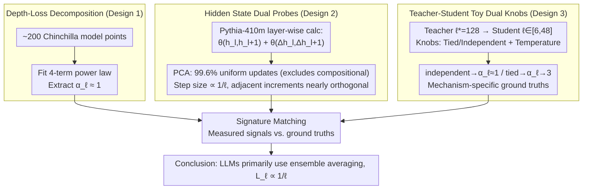

# Inverse Depth Scaling From Most Layers Being Similar

**Conference**: ICML2026  
**arXiv**: [2602.05970](https://arxiv.org/abs/2602.05970)  
**Code**: https://github.com/liuyz0/DepthScaling  
**Area**: LLM Pre-training / Neural Scaling Laws  
**Keywords**: depth scaling, ensemble averaging, residual networks, Chinchilla, width-depth tradeoff

## TL;DR
This paper proves that LLM loss is approximately inversely proportional to depth ($\alpha_\ell \approx 1$) through measurements of LLM hidden state dynamics and control experiments using a teacher-student toy model. This is attributed to a robust but inefficient usage pattern: "the vast majority of layers perform functionally similar small updates to cancel errors via ensemble averaging."

## Background & Motivation
**Background**: Neural scaling laws express loss as a power law of parameter count $N$ and data volume $D$: $L = c_N/N^{\alpha_N} + c_D/D^{\alpha_D} + L_0$ (Kaplan 2020, Chinchilla 2022). However, most works treat $N$ as a black-box integer without distinguishing the individual contributions of width $m$ and depth $\ell$.

**Limitations of Prior Work**: Another line of research (Levine 2020, Liu 2025a, Bordelon 2025b) has begun decomposing $N$ into width and depth. However, three contradictory theoretical candidates remain for the functional form of loss with respect to depth: (i) **compositional assembly**—each layer learns an abstract level, and loss depends on the hierarchical structure of the data; (ii) **procedural assembly**—residual networks approximate neural ODEs, and loss follows a power law of discretization error; (iii) **ensemble averaging**—layers act as an ensemble of shallow subnetworks, and loss is governed by the Central Limit Theorem ($1/\ell$). Empirical studies (Gromov, Sanyal, Men, etc.) repeatedly find that many LLM layers are redundant or interchangeable, but they lack a quantitative framework linking "why redundancy exists" to "how loss scales with depth."

**Key Challenge**: Theoretically, three candidate mechanisms can produce power laws. Empirically, only qualitative descriptions of "layer redundancy" exist. No prior work has measured the actual $\alpha_\ell$ of LLMs and mapped it to a specific mechanism.

**Goal**: Proceed in two steps—first, measure the depth-specific loss term and its exponent $\alpha_\ell$ on real LLMs; second, design a toy model with controllable mechanisms to map the measured exponent and hidden state signatures back to one of the three theories.

**Key Insight**: The authors note that the three mechanisms predict different signatures for **hidden state trajectories**: compositional assembly suggests "early stopping" (different inputs stop updating at different depths); procedural assembly requires neighboring updates to be **correlated** (existence of a first-order derivative in smooth dynamics); ensemble averaging expects neighboring updates to be **uncorrelated** with a step size $\propto 1/\ell$. This provides a metric to distinguish mechanisms directly from hidden states.

**Core Idea**: Use the angle between adjacent hidden states $\theta(h_l, h_{l+1})$ and increment correlation $\theta(\Delta h_l, \Delta h_{l+1})$ as probes. Combined with a teacher-student toy model that switches between "tied vs. independent weights" to provide procedural/ensemble ground truths, the authors match real-world LLM signals to the mechanism. The conclusion is that LLMs primarily follow ensemble averaging, resulting in $L_\ell \propto 1/\ell$.

## Method

### Overall Architecture
The paper answers one question: how LLM loss scales with depth $\ell$ and why. The authors run two parallel pipelines: "measuring real LLMs" and "training controllable toy models," followed by cross-referencing hidden state signatures. On the LLM side, they use the Pythia series (primarily Pythia-410m) on FineWeb to calculate $\theta(h_l, h_{l+1})$ per token and per layer, using PCA to cluster trajectories into "uniform intermediate updates" vs. "early stopping." They also fit a loss form with explicit depth dependence across ~200 public Chinchilla model points to extract $\alpha_\ell$. On the toy side, a "teacher" residual network with depth $\ell^* = 128$ generates KL targets for a "student" with depth $\ell \in [6, 48]$. By toggling two knobs—teacher weights **tied/independent** and target distribution temperature—the student is pushed into procedural or ensemble regimes to establish ground truth for $\alpha_\ell$ and hidden state signatures. Finally, these signatures (step size curves, $1/\ell$ scaling, and increment correlation) are used as templates to match LLM measurements.

### Key Designs

**1. Depth-Isolated Loss Decomposition: Making $\alpha_\ell$ Individually Readable**
A major pain point is that previous scaling laws treated parameter count $N$ as a black box, where the depth contribution was overwhelmed by width, making $\alpha_\ell$ unmeasurable. The authors further decompose the $c_N/N^{\alpha_N}$ term from the Chinchilla form into width and depth terms: $L = c_m/m^{\alpha_m} + c_\ell/\ell^{\alpha_\ell} + c_D/D^{\alpha_D} + L_0$. The width term captures error from "representation capacity limitations," while the depth term captures "transformation capacity limitations," assuming they are essentially independent with negligible high-order cross-terms $L_{m\ell}$. By minimizing the MSE of $\log L$ over ~200 Chinchilla points while fitting 7 parameters, they obtain $\alpha_m = 0.98 \pm 0.08$, $\alpha_\ell = 1.2 \pm 0.3$, and $\alpha_D = 0.30 \pm 0.01$, with an average relative error of only 0.4%. This decomposition works because it avoids forced $\log \ell$ corrections and pure power laws that fail to fit real data, directly revealing $\alpha_\ell \approx 1$. It also implies an optimal relation $m \propto \ell$, making parameter scaling $N^{-1/3}$, matching the empirical Chinchilla result of 0.34.

**2. Dual Probes for Hidden State Trajectories: Distinguishing Mechanisms via Angle Measurements**
The exponent alone is insufficient; all three mechanisms can produce power laws. Fingerprints must be found within the hidden states. The authors use two probes: the angle between adjacent hidden states $\theta(h_l, h_{l+1})$ measures step size (distinguishing "early stopping vs. uniform updates"), and the angle between adjacent increments $\theta(\Delta h_l, \Delta h_{l+1})$ measures direction correlation (distinguishing smooth dynamics vs. random walks). They perform PCA on the $\ell$-dimensional angle vector for every token; 99.6% cluster into "uniform intermediate updates," while only 0.4% (mostly document-start tokens) show "early stopping"—directly excluding dominant compositional assembly. Plotting average step size $\langle \theta \rangle_{\mathcal{D}, l}$ shows $\langle \theta \rangle \propto 1/\ell$, matching both procedural and ensemble expectations. However, the critical second-order signature $\theta(\Delta h_l, \Delta h_{l+1})$ is near $\pi/2$, indicating nearly orthogonal adjacent updates. This lack of a first-order derivative contradicts the smooth trajectories required for procedural assembly. Only by adding this second-order correlation could the authors conclude ensemble averaging at zero extra training cost.

**3. Teacher-Student Toy Dual-Knob Calibration: Translating Theories into Falsifiable Fingerprints**
Since controlled experiments on LLMs are expensive and noisy, the authors fix the mapping between mechanisms and signatures in a minimal residual network (Standard ResNet + RMSNorm + ReLU² MLP). The teacher depth $\ell^* = 128$ is much larger than the student $\ell$. Two knobs determine the teacher's dynamics: **tied** weights (shared across layers) drive the cumulative transformation $h_0^* \to h_{\ell^*}^*$ toward smooth dynamics, while **independent** weights (i.i.d. sampling) turn it into a random walk. Softmax temperature adjusts the target distribution's sharpness. Theoretical derivation (Eq. 10-12) yields two limits: for tied weights after convergence, discretization error dominates, typically giving loss $\propto 1/\ell^3$ ($\alpha_\ell = 3$). For independent weights, each layer can only fit the integral $\int 0^1 f^*(s)\,\mathrm{d}s$ using $f^\circ(l/\ell)$, with per-layer error $O(1/\ell)$; after summation, the CLT gives $\|\cdot\| \sim 1/\sqrt{\ell}$, squaring into a loss $\propto 1/\ell$. In experiments, $\alpha_\ell$ for tied weights rises from 1 to 3 during training, while independent weights remain stable near 1. The independent-weight student matches LLM signatures exactly across step size curves, $1/\ell$ scaling, and increment orthogonality.

### Loss & Training
Toy students are trained using Adam for 40,000 steps (extended to 80,000 in Fig. 4). Loss is the KL divergence between student and teacher output distributions (equivalent to cross-entropy minus a constant, preserving scaling behavior). Teacher MLP weights are initialized via standard schemes and scaled by $1/\sqrt{\ell^*}$ to ensure cumulative transformation $h_0^* \to h_{\ell^*}^*$ is $O(1)$. Temperature is applied to logits before softmax. LLMs are not trained; measurements are taken during forward passes on Pythia checkpoints and through curve fitting on Chinchilla points.

## Key Experimental Results

### Main Results: LLM Decomposition Scaling

| Fitted Term | Exponent | Meaning |
| :--- | :--- | :--- |
| Width $\alpha_m$ | $0.98 \pm 0.08$ | Consistent with Liu 2025a theory $\approx 1$ |
| Depth $\alpha_\ell$ | $\mathbf{1.2 \pm 0.3}$ | Core finding: $L_\ell \approx 1/\ell$ in LLMs |
| Data $\alpha_D$ | $0.30 \pm 0.01$ | Consistent with original Chinchilla $0.30$ |
| Mean Rel. Error ($\log L$) | 0.4% | Fit quality across 200 Chinchilla points |

### Toy Model Mechanism Comparison

| Teacher Weights | Temperature | Steps | Fitted $\alpha_\ell$ | Mechanism |
| :--- | :--- | :--- | :--- | :--- |
| Independent ($\rho = 0$) | Any | 40k | $\approx 1$ | Ensemble averaging |
| Tied ($\rho = 1$) | High | 40k | $\to 3$ (converged) | Procedural assembly |
| Tied ($\rho = 1$) | Low | 40k | $\approx 1$ (unconverged) | "Pseudo-ensemble" (raises to 3 later) |
| Tied + High-order | High | 80k | $> 3$ | Validates procedural mechanism |

### Key Findings
- **PCA Splits Tokens**: 99.6% of tokens in Pythia-410m belong to the "uniform intermediate update" cluster; only 0.4% (start-of-document) belong to "early stopping"—refuting compositional assembly as the dominant mechanism.
- **Heterogeneity of First/Last Layers**: Step sizes $\theta \approx \pi/2$ for the first and last layers are independent of depth, behaving like "compositional units," whereas intermediate layers strictly follow $1/\ell$—the majority is ensemble-based.
- **Nearly Orthogonal Increments**: $\theta(\Delta h_l, \Delta h_{l+1}) \approx \pi/2$ suggests the absence of first-order derivatives required for smooth (procedural) dynamics; independent-weight toys show the same signature.
- **Insufficient Training Mimics Ensemble**: At low temperature, tied-weight students appear as $\alpha_\ell \approx 1$ but rise to 3 with more training—a warning that scaling from single timestamps can misidentify mechanisms.
- **Width-Depth Coupling**: $\alpha_m \approx \alpha_\ell \approx 1$ implies optimal $m \propto \ell$, resulting in parameter scaling $N^{-1/3}$, providing a mechanistic explanation for the Chinchilla exponent 0.34.

## Highlights & Insights
- **Quantifying Qualitative "Layer Redundancy"**: Previous ShortGPT/Layer pruning works noted that layers are removable; this work provides the precise index $1/\ell$ for the resulting loss and identifies the CLT as the driver—a shift from observation to mechanistic explanation.
- **Migratable Dual-Probe Paradigm**: The use of "adjacent angle + increment correlation" as a mechanism fingerprint can diagnose other architectures (e.g., Mamba, recurrent depth, MoE) without retraining.
- **Functional Group Perspective**: Discussion using causal tracing (ROME) suggests that "layers cluster into functional groups, with ensemble averaging within groups and task division between groups"—a "weak version" of compositionality.
- **Architectural Implications**: Since the issue stems from "residual connections + non-smooth targets," solutions like "recursive depth" (Geiping 2025), which force depth to reuse weights, may be the key to bypassing slow $1/\ell$ scaling.

## Limitations & Future Work
- The decomposition formula (Eq. 3) is a working hypothesis, not derived from first principles; cross-terms are assumed negligible, which may not hold for small models.
- Mechanisms beyond the three candidates cannot be strictly excluded; the authors conclude ensemble is the "best fit" among available theories.
- Hidden state analysis on LLMs only captures statistically average behavior and doesn't reveal specific computations of individual layers.
- The toy model omits attention and embedding training; while scaling exponents are argued to be invariant under PDE generalizations, cross-token coupling might introduce cross-terms.
- Restricted to Pythia and Chinchilla families; whether $1/\ell$ dominates in MoE or highly structured data (code/math) remains an open question.
- Future work: Test recursive depth, weight tying across depth, or explicit hierarchical targets to see if $\alpha_\ell$ can be pushed toward 2-3.

## Related Work & Insights
- **vs. Gromov 2024 / Men 2025 / Sanyal 2024**: While they found empirical layer redundancy, this work provides a quantitative scaling $\alpha_\ell \approx 1$ and an ensemble averaging explanation.
- **vs. Liu 2025a / Bordelon 2025b**: They theoretically proposed splitting width and depth; this work provides direct empirical measurement and numerical matching ($\alpha_m \approx 1$).
- **vs. Csordás 2025**: They found LLMs fail to exploit compositional structure; this work explains "why"—architectural bias and non-smooth targets force networks into the ensemble regime.
- **vs. Sander 2022 / Chizat 2025 (residual ↔ ODE)**: They used worst-case bounds for ODE discretization; this work shows real LLMs exist in the CLT-governed typical behavior regime rather than the worst case.
- **vs. Lad 2024**: Their work on "stages of inference" aligns with the "functional groups" picture, providing a basis for characterizing inter-group task division.

## Rating
- Novelty: ⭐⭐⭐⭐⭐ Couples "layer redundancy," $1/\ell$ scaling, and ensemble averaging into a quantitative framework while explaining the Chinchilla index.
- Experimental Thoroughness: ⭐⭐⭐⭐ Closed-loop evidence from Chinchilla fitting, Pythia hidden states, and a 4-knob toy model, though LLM verification is limited to specific families.
- Writing Quality: ⭐⭐⭐⭐⭐ Logical flow from mechanisms to probes, toy calibration, and LLM matching is very clear.
- Value: ⭐⭐⭐⭐⭐ Provides diagnostic tools and architectural directions (recursive depth, hierarchical targets) to make depth truly effective.

<!-- RELATED:START -->

## Related Papers

- [\[ICML 2026\] Scaling Depth Capacity via Zero/One-Layer Model Expansion](scaling_depth_capacity_via_zeroone-layer_model_expansion.md)
- [\[NeurIPS 2025\] Scaling Embedding Layers in Language Models](../../NeurIPS2025/llm_pretraining/scaling_embedding_layers_in_language_models.md)
- [\[ICML 2026\] Dropout Universality: Scaling Laws and Optimal Scheduling at the Edge-of-Chaos](dropout_universality_scaling_laws_and_optimal_scheduling_at_the_edge-of-chaos.md)
- [\[ICML 2026\] InfoLaw: Information Scaling Laws for Large Language Models with Quality-Weighted Mixture Data and Repetition](infolaw_information_scaling_laws_for_large_language_models_with_quality-weighted.md)
- [\[ICLR 2026\] Implicit Bias and Loss of Plasticity in Matrix Completion: Depth Promotes Low-Rank](../../ICLR2026/llm_pretraining/implicit_bias_and_loss_of_plasticity_in_matrix_completion_depth_promotes_low-ran.md)

<!-- RELATED:END -->
