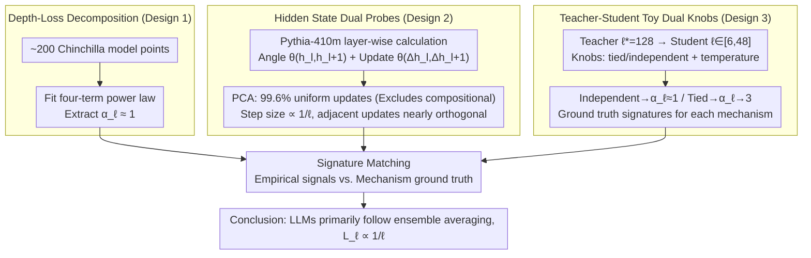

# Inverse Depth Scaling From Most Layers Being Similar

**Conference**: ICML2026  
**arXiv**: [2602.05970](https://arxiv.org/abs/2602.05970)  
**Code**: https://github.com/liuyz0/DepthScaling  
**Area**: LLM Pre-training / Neural Scaling Laws  
**Keywords**: depth scaling, ensemble averaging, residual networks, Chinchilla, width-depth tradeoff

## TL;DR
By measuring LLM hidden state dynamics and conducting controlled experiments with a teacher-student toy model, this paper proves that LLM loss is approximately inversely proportional to depth ($\alpha_\ell \approx 1$). This is attributed to an inefficient but robust "ensemble averaging" mode where the vast majority of layers perform functionally similar small-step updates to cancel out errors.

## Background & Motivation
**Background**: Neural scaling laws express loss as a power law of parameter count $N$ and data volume $D$: $L = c_N/N^{\alpha_N} + c_D/D^{\alpha_D} + L_0$ (Kaplan 2020, Chinchilla 2022). However, most works treat $N$ as a "black box" integer without distinguishing the individual contributions of width $m$ and depth $\ell$.

**Limitations of Prior Work**: Another line of research (Levine 2020, Liu 2025a, Bordelon 2025b) has begun decomposing $N$ into width and depth, but three contradictory theoretical candidates remain for the specific functional form of depth's impact on loss: (i) **compositional assembly**—each layer learns an abstract hierarchy, and loss depends on the data's hierarchical structure; (ii) **procedural assembly**—residual networks approximate a neural ODE, and loss is a power law of discretization error; (iii) **ensemble averaging**—layers act like an ensemble of shallow sub-networks, where loss scales as $1/\ell$ per the Central Limit Theorem. Empirical studies (Gromov, Sanyal, Men, etc.) repeatedly find that many LLM layers are redundant, removable, or swappable, but they lack a quantitative framework connecting "why redundancy occurs" with "how loss scales with depth."

**Key Challenge**: Theoretically, three mechanisms can generate power laws; empirically, only qualitative descriptions of "layer redundancy" exist. No prior work has measured the true $\alpha_\ell$ of LLMs and mapped it to a specific mechanism.

**Goal**: To achieve two steps—first, measure the depth-specific loss term and its exponent $\alpha_\ell$ in real LLMs; second, design a toy model with controllable mechanisms to map the measured exponent and hidden state signatures back to one of the three candidates.

**Key Insight**: The author notes that the three mechanisms predict different "signatures" for **hidden state trajectories**: compositional expects "early exit" signatures (different inputs stop updating at different depths); procedural requires **correlated** update directions between adjacent layers (existence of a first-order derivative in smooth dynamics); ensemble averaging expects **uncorrelated** updates with step sizes $\propto 1/\ell$. This provides a metric to distinguish mechanisms directly from hidden states.

**Core Idea**: Use the angle between adjacent hidden states $\theta(h_l, h_{l+1})$ and update correlations $\theta(\Delta h_l, \Delta h_{l+1})$ as probes. Combined with a teacher-student toy model that switches between "tied vs. independent" weights to provide ground truth for procedural vs. ensemble modes, the LLM empirical signals are matched to a mechanism—concluding that LLMs primarily follow ensemble averaging, resulting in $L_\ell \propto 1/\ell$.

## Method

### Overall Architecture
The paper answers one question: how does LLM loss scale with depth $\ell$, and why. To this end, the authors run two parallel pipelines: "measuring real LLMs" and "training controllable toy models," finally cross-referencing hidden state signatures. On the LLM side, they use the Pythia series (primarily Pythia-410m) on FineWeb, calculating the angle between adjacent hidden states $\theta(h_l, h_{l+1})$ token-by-token and layer-by-layer. PCA is used to cluster trajectories into "uniform mid-layer updates" vs. "early exit." Simultaneously, they fit a loss form that isolates depth across ~200 public Chinchilla model points to extract $\alpha_\ell$. On the toy side, they build a "teacher" residual network with depth $\ell^* = 128$ to generate KL targets, which a "student" with depth $\ell \in [6, 48]$ fits. Two knobs—teacher weights **tied/independent** and target distribution temperature—push the student into procedural or ensemble regions to obtain ground truth for $\alpha_\ell$ and hidden state signatures.

### Key Designs

**1. Loss decomposition isolating depth from $N$: Making $\alpha_\ell$ readable for the first time**

The pain point was that previous scaling laws treated $N$ as a black box, causing depth's contribution to be drowned out by width. The authors decompose the $c_N/N^{\alpha_N}$ term in the Chinchilla form into separate width and depth terms: $L = c_m/m^{\alpha_m} + c_\ell/\ell^{\alpha_\ell} + c_D/D^{\alpha_D} + L_0$. The width term captures error from "limited representation capacity," while the depth term captures error from "limited transformation capacity." These are assumed to be independent, with cross-term $L_{m\ell}$ negligible at high orders. Minimizing MSE of $\log L$ across ~200 Chinchilla points while fitting 7 parameters yields $\alpha_m = 0.98 \pm 0.08$, $\alpha_\ell = 1.2 \pm 0.3$, and $\alpha_D = 0.30 \pm 0.01$, with a mean relative error of only 0.4%. This decomposition works because it avoids the forced $\log \ell$ corrections of older theories while fitting real data better than pure power laws, directly revealing $\alpha_\ell \approx 1$.

**2. Dual probes for hidden state trajectories: Distinguishing three mechanisms simultaneously**

An exponent alone is insufficient as multiple mechanisms can yield power laws. Fingerprints must be found in the hidden states. Two metrics are used: the angle between adjacent hidden states $\theta(h_l, h_{l+1})$ measures step size (distinguishing "early exit vs. uniform update"), and the angle between adjacent updates $\theta(\Delta h_l, \Delta h_{l+1})$ measures direction correlation (distinguishing smooth dynamics vs. random walks). PCA on the $\ell$-dimensional angle vectors shows 99.6% of tokens cluster as "uniform mid-layer updates," while only 0.4% (mostly document-start tokens) show "early exit"—ruling out compositional assembly. Plotting average step size $\langle \theta \rangle_{\mathcal{D}, l}$ shows $\langle \theta \rangle \propto 1/\ell$, consistent with both procedural and ensemble theories. However, the critical second-order signature $\theta(\Delta h_l, \Delta h_{l+1})$ is near $\pi/2$, indicating nearly orthogonal updates with no first-order derivative—contradicting the smooth trajectories required for procedural assembly.

**3. Teacher-student toy calibration: Translating mechanisms into falsifiable fingerprints**

Since controlled experiments on LLMs are costly, the authors use a minimal residual network (Standard Residual + RMSNorm + ReLU² MLP). Teacher depth $\ell^* = 128$ is much greater than student depth $\ell$. **Tied** weights (shared across layers) drive the cumulative transformation $h_0^* \to h_{\ell^*}^*$ toward smooth dynamics, while **independent** weights (i.i.d. sampling) turn it into a random walk. Theoretical derivation shows that for tied weights, discretization error dominates after convergence, yielding loss $\propto 1/\ell^3$ ($\alpha_\ell = 3$). Under independent weights, the student must fit the integral $\int_0^1 f^*(s)\,\mathrm{d}s$ with $f^\circ(l/\ell)$, where each layer's error is $O(1/\ell)$; summing these via the Central Limit Theorem gives $\|\cdot\| \sim 1/\sqrt{\ell}$, which squared in the loss becomes $\propto 1/\ell$. Experiments show tied $\alpha_\ell$ rising from 1 to 3 during training, while independent $\alpha_\ell$ stays near 1. The independent student's signatures match LLMs perfectly across step size, scaling, and orthogonality.

### Loss & Training
Toy students are trained with Adam for 40,000 steps (extended to 80,000 in some cases). The loss is the KL divergence between student and teacher output distributions. Teacher MLP weights are initialized and scaled by $1/\sqrt{\ell}$ to ensure cumulative transformation $h_0^* \to h_{\ell^*}^*$ is $O(1)$. Logits are divided by temperature to control target distribution sharpness. No training is performed on the LLM side; only forward passes on Pythia checkpoints and curve fitting on Chinchilla data.

## Key Experimental Results

### Main Results: LLM Empirical Decomposition Scaling

| Fitted Term | Exponent | Meaning |
| :--- | :--- | :--- |
| Width $\alpha_m$ | $0.98 \pm 0.08$ | Consistent with Liu 2025a theory ($\approx 1$) |
| Depth $\alpha_\ell$ | $\mathbf{1.2 \pm 0.3}$ | Core conclusion: $L_\ell \approx 1/\ell$ in LLMs |
| Data $\alpha_D$ | $0.30 \pm 0.01$ | Perfectly matches original Chinchilla $0.30$ |
| $\log L$ Mean Rel. Error | 0.4% | Fitting quality across 200 Chinchilla points |

### Ablation Study: Toy Mechanism Comparison

| Teacher Weights | Temperature | Training Steps | Fitted $\alpha_\ell$ | Mechanism |
| :--- | :--- | :--- | :--- | :--- |
| Independent ($\rho = 0$) | Any | 40k | $\approx 1$ | Ensemble averaging |
| Tied ($\rho = 1$) | High | 40k | $\to 3$ (converged) | Procedural assembly |
| Tied ($\rho = 1$) | Low | 40k | $\approx 1$ (unconverged) | Illusion—rises to 3 with more training |
| Tied + High-order arch | High | 80k | $> 3$ | Validating procedural mechanism |

### Key Findings
- **PCA splits tokens**: 99.6% of tokens cluster as "uniform updates," while only 0.4% "early exit," rejecting compositional assembly as the dominant mechanism.
- **Heterogeneous layers**: First and last layers have step sizes $\theta \approx \pi/2$ independent of depth (acting like "composition"); mid-layers scale strictly as $1/\ell$ (acting as "ensemble").
- **Orthogonal updates**: $\theta(\Delta h_l, \Delta h_{l+1}) \approx \pi/2$. The first-order derivative for smooth dynamics (procedural) is absent.
- **Insufficient training mimics ensemble**: Under low temperature, tied-weight students appear to have $\alpha_\ell \approx 1$ initially, but this shifts to 3 with more training, warning that single-step scaling can be deceptive.
- **Width-depth coupling**: $\alpha_m \approx \alpha_\ell \approx 1$ implies optimal $m \propto \ell$, resulting in $N^{-1/3}$ parameter scaling, consistent with the empirical $0.34$ from Chinchilla.

## Highlights & Insights
- **Quantifying "Layer Redundancy"**: Moving beyond qualitative observations that "layers can be deleted," this work provides the exact index $1/\ell$ and identifies the CLT as the underlying mechanism.
- **Transferable Diagnostic Paradigm**: Using "adjacent angles + update correlation" as mechanism fingerprints allows diagnosing other architectures (Mamba, MoE) without retraining.
- **Functional Group Perspective**: Using ROME causal tracing, the authors suggest layers cluster into "functional groups" where ensemble averaging happens within groups and division of labor happens between groups.
- **Architectural Implications**: Since $1/\ell$ is a slow scaling factor caused by residual connections and non-smooth targets, "Recurrent Depth" (Geiping 2025) might be key to bypassing $1/\ell$ by reusing weights.

## Limitations & Future Work
- The decomposition in Eq. (3) is an empirical working hypothesis, not derived from first principles.
- Other unknown mechanisms cannot be strictly ruled out.
- Analysis provides statistical averages; it does not explain what a specific layer computes at a granular level.
- The toy model excludes attention and embedding training; cross-token coupling might introduce cross-terms.
- Only Pythia and Chinchilla families are covered; MoE or highly structured data (code/math) might follow different laws.

## Related Work & Insights
- **vs. Gromov 2024 / Men 2025 / Sanyal 2024**: While they found layers are redundant, this work adds the quantitative scaling $\alpha_\ell \approx 1$ and the ensemble mechanism.
- **vs. Liu 2025a / Bordelon 2025b**: Confirms their theory that width and depth should scale separately and validates $\alpha_m \approx 1$.
- **vs. Csordás 2025**: Explains *why* LLMs fail to use compositional depth effectively: architectural bias towards ensemble averaging.
- **vs. Sander 2022 / Chizat 2025**: Shows that real LLMs operate in a CLT-dominated regime rather than the worst-case discretization error regime of ODE-based residual analysis.

## Rating
- Novelty: ⭐⭐⭐⭐⭐ Connects layer redundancy, $1/\ell$ scaling, and ensemble averaging into a finished quantitative framework.
- Experimental Thoroughness: ⭐⭐⭐⭐ Strong triangulation between Chinchilla, Pythia, and toy models, though lacks modern MoE validation.
- Writing Quality: ⭐⭐⭐⭐⭐ Excellent logical flow from theory to probes to empirical matching.
- Value: ⭐⭐⭐⭐⭐ Directly guides future architecture design (recurrent depth, tying) to improve scaling efficiency.

<!-- RELATED:START -->

## Related Papers

- [\[ICML 2026\] Scaling Depth Capacity via Zero/One-Layer Model Expansion](scaling_depth_capacity_via_zeroone-layer_model_expansion.md)
- [\[NeurIPS 2025\] Scaling Embedding Layers in Language Models](../../NeurIPS2025/llm_pretraining/scaling_embedding_layers_in_language_models.md)
- [\[ICML 2026\] Dropout Universality: Scaling Laws and Optimal Scheduling at the Edge-of-Chaos](dropout_universality_scaling_laws_and_optimal_scheduling_at_the_edge-of-chaos.md)
- [\[ICML 2026\] Different Layers, Different Manifolds: Module-Wise Weight-Space Geometry in Transformer Optimization](different_layers_different_manifolds_module-wise_weight-space_geometry_in_transf.md)
- [\[NeurIPS 2025\] The Curse of Depth in Large Language Models](../../NeurIPS2025/llm_pretraining/the_curse_of_depth_in_large_language_models.md)

<!-- RELATED:END -->
