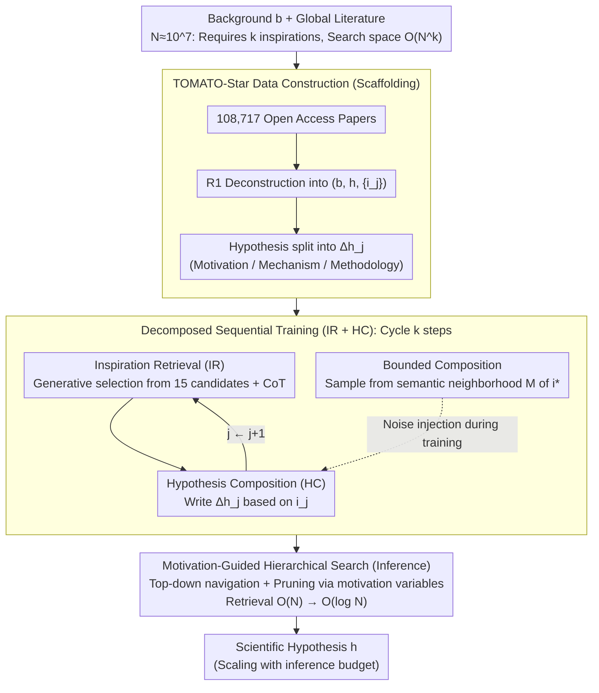

# MOOSE-Star: Unlocking Tractable Training for Scientific Discovery by Breaking the Complexity Barrier

**Conference**: ICML 2026  
**arXiv**: [2603.03756](https://arxiv.org/abs/2603.03756)  
**Code**: https://github.com/ZonglinY/MOOSE-Star (Available)  
**Area**: LLM Reasoning / Scientific Discovery / Decomposed Training  
**Keywords**: Hypothesis Generation, Inspiration Retrieval, Hierarchical Search, Tractable Training, TOMATO-Star

## TL;DR
MOOSE-Star decomposes the problem of "training an LLM to directly generate scientific hypotheses"—originally an $\mathcal{O}(N^k)$ combinatorial search—into two sequential subtasks: "Inspiration Retrieval + Hypothesis Synthesis." By integrating hierarchical tree retrieval, bounded composition, and motivation planning, it reduces optimal complexity from exponential to $\mathcal{O}(\log N)$ and releases the TOMATO-Star dataset containing 108,717 papers with decomposition annotations.

## Background & Motivation
**Background**: Research on LLMs for scientific discovery has focused almost exclusively on inference-time methods or fine-tuning with external feedback (e.g., reviewer feedback, rule-based scoring, reward alignment). Direct modeling and training of the core conditional distribution $P(\text{hypothesis}\mid\text{background})$ remains largely unexplored.

**Limitations of Prior Work**: The authors theoretically demonstrate that directly training $P(h\mid b)$ implicitly requires finding the correct sequence of $k$ inspirations within a global literature library ($N \approx 10^7$). The search space is $\mathcal{O}(N^k)$ (e.g., $\approx 10^{21}$ for $N=10^7, k=3$), making end-to-end training mathematically ill-posed due to this "combinatorial complexity wall."

**Key Challenge**: One must either abandon direct modeling of $P(h\mid b)$ (the current feedback-based route) or confront the unmanageable combinatorial complexity. Neither path is ideal.

**Goal**: To model $P(h\mid b)$ directly while reducing training complexity to a level tractable for modern compute, providing reproducible datasets and open-source code.

**Key Insight**: Borrowing the probability decomposition theorem from MOOSE-Chem, $P(h\mid b) \approx \prod_j P(i_j\mid b, h_{j-1}, \mathcal{I}) \cdot P(h_j\mid b, h_{j-1}, i_j)$ is treated as a sequence of "Inspiration Retrieval + Incremental Synthesis." This decomposition, previously used only for inference, is upgraded to a trainable objective.

**Core Idea**: Reduce the intractable $\mathcal{O}(N^k)$ problem to trainable $\mathcal{O}(k \cdot N)$ sequential subtasks, then further compress the retrieval phase from $\mathcal{O}(N)$ to $\mathcal{O}(\log N)$ using hierarchical tree search, bounded composition, and motivation planning.

## Method

### Overall Architecture
MOOSE-Star aims to train $P(h\mid b)$ directly—generating hypothesis $h$ given background $b$. The pipeline converts this into a tractable problem: first, using R1/R1-distill-Qwen to deconstruct 108,717 open-access papers (2020–2025) into $(b, h, \{i_j\})$ triplets and splitting $h$ into incremental $\Delta h_j$ (each structured with Motivation/Mechanism/Methodology). Then, $P(h\mid b)$ is decomposed via the chain rule into two subtasks: "Inspiration Retrieval (IR) + Hypothesis Composition (HC)," repeated $k$ times. Finally, a semantic retrieval tree and motivation-based pruning are used at inference to compress retrieval complexity from linear to logarithmic.

### Key Designs

**1. Decomposed Sequential Training (IR + HC): Replacing Exponential End-to-End Learning with $k$-Step Linear Subtasks**

Training $P(h\mid b)$ directly fails because it implicitly requires searching through $\mathcal{O}(N^k)$ inspiration combinations. This paper utilizes the chain rule to decompose it: $P(h\mid b) \approx \prod_{j=1}^{k} P(i_j\mid b, h_{j-1}, \mathcal{I}) \cdot P(h_j\mid b, h_{j-1}, i_j)$. The combinatorial problem becomes a cycle of $k$ iterations of "retrieve one inspiration, then synthesize one incremental hypothesis step." The IR task involves generatively selecting the most relevant paper from 15 candidates (1 positive + 14 hard negatives) with CoT reasoning. The HC task generates $\Delta h_j$ given the ground-truth $i_j$. Both are trained via teacher-based RFT, reducing overall complexity from $\mathcal{O}(N^k)$ to $\mathcal{O}(k \cdot (N+1))$.

**2. Bounded Composition: Enabling Synthesis Tolerance to Retrieval Errors**

Even with logarithmic retrieval, the selected inspiration might not be the exact ground-truth $i^*$. If HC only sees perfect inspirations during training, it fails under real-world noise. The authors define a semantic tolerance neighborhood $\mathcal{I}_{i^*}$ of size $M$ centered at $i^*$. During training, "approximate inspirations" are sampled from this neighborhood to force HC to learn synthesis using related concepts. This relaxes the IR requirement from "$1/N$ exact matching" to "$1/(N/M)$ fuzzy matching," further compressing the effective search space and making the pipeline robust to imperfect retrieval.

**3. Motivation-Guided Hierarchical Search: Compressing Retrieval from $\mathcal{O}(N)$ to $\mathcal{O}(\log N)$**

While IR reduces complexity to linear, scanning $N$ papers is still slow. Papers are clustered into a semantic retrieval tree, where each step involves selecting the most relevant branch among a node's children, yielding $\mathcal{O}(\log N)$ depth. To guide this, the background is supplemented with an explicit motivation variable $m$ (from the Motivation layer of $\Delta h$). This variable acts as a "generative root" to prune subtrees irrelevant to the current target, shrinking the searchable space from $N$ to $N_m \ll N$.

### Loss & Training
Both IR and HC tasks utilize Rejection Sampling Fine-Tuning (RFT) with CoT supervision. For each sample, $N$ CoT traces are sampled, and low-quality ones are filtered using a rubric-based evaluator. The HC rubric evaluates Motivation, Mechanism, and Methodology layers. The TOMATO-Star dataset underwent four automated quality checks (necessity, sufficiency, exclusivity, and non-redundancy) before inclusion.

## Key Experimental Results

### Main Results

| Dimension | Configuration | Highlights |
|-----------|---------------|------------|
| Data Scale | 108,717 open papers, 38,400 GPU hours | Training: 2020-09/2025; Test: 2025-10 (No temporal leakage) |
| Complexity (Worst $\rightarrow$ Best) | $\mathcal{O}(N^k) \rightarrow \mathcal{O}(\log N)$ | Compressed via IR/HC decomposition, tree retrieval, and motivation pruning |
| Test-time scaling | Brute-force vs. MOOSE-Star | Brute-force hits the "complexity wall" quickly; MOOSE-Star success rate scales with inference budget |
| Retrieval Accuracy | IR in 1-pos/14-neg pool | Significantly outperforms random/nearest-neighbor baselines via generative selection + CoT |

### Ablation Study

| Configuration | Key Metric | Insight |
|---------------|------------|---------|
| w/o Bounded Composition ($M=1$) | Lower success rate on integrated tasks | Confirms necessity of synthesis robustness to retrieval noise |
| w/o Motivation Variable | Longer tree search paths, pruning failure | Motivation is critical for effective pruning |
| End-to-end $P(h\mid b)$ training | Failed convergence | Direct distillation of $b \to h$ reasoning traces is mathematically intractable |
| Brute-force sampling | Performance plateau | Highlights the advantage of MOOSE-Star’s hierarchical scaling |

### Key Findings
- Direct training of $P(h\mid b)$ fails primarily due to the implicit combinatorial search space rather than data scarcity—a fundamental critique of "feedback-driven discovery" routes.
- The "Decomposition + Hierarchy + Tolerance + Pruning" framework is a transferable paradigm for reducing $N^k$ complexity to $\log N$.
- The structural design of TOMATO-Star (Motivation, Mechanism, Methodology) represents an upgrade over traditional "abstract-style hypotheses."
- Strict temporal splitting (testing only on papers post-2025-10) ensures evaluation is not contaminated by LLM pre-training.

## Highlights & Insights
- Provides the first rigorous complexity argument ($\mathcal{O}(N^k)$ vs $\mathcal{O}(\log N)$) for why scientific discovery models are difficult to train.
- Reinterpreting inference-time probability decomposition as a training objective is a major conceptual leap, analogous to splitting Bellman equations into TD-updates in RL.
- Bounded Composition explicitly models retrieval error in the training distribution, making it highly practical for RAG-based discovery.
- Exceptional reproducibility: releases 108k structured samples, full training/inference code, and models.

## Limitations & Future Work
- Relies on the assumption that "author citations = ground-truth inspirations," potentially missing unindexed yet impactful influences.
- The 1-pos/14-neg IR setup is a simplified approximation; hierarchical search lacks a self-correction mechanism if a top-level branch is wrongly selected.
- The tolerance radius $M$ in Bounded Composition is a hyperparameter without a systematic selection strategy.
- Primarily validated in Bio/Chem/Med; effectiveness in CS/ML where citation structures are denser remains to be seen.

## Related Work & Insights
- **vs. MOOSE-Chem (Yang et al., 2025b)**: MOOSE-Chem used decomposition only for inference; this work upgrades it to a training paradigm.
- **vs. feedback-driven training**: Unlike methods that fine-tune hypotheses based on reviewer or rule-based rewards, this work directly models the core distribution $P(h\mid b)$.
- **vs. O'Neill et al. (2025)**: While they attempted direct modeling via distillation, this paper demonstrates that simple reasoning trace distillation without decomposition is insufficient.

## Rating
- Novelty: ⭐⭐⭐⭐⭐ Rigorous complexity proof and a clear $\log N$ pathway; a rare mix of theoretical and engineering innovation.
- Experimental Thoroughness: ⭐⭐⭐⭐ Massive GPU investment and data scale, though more comparative benchmarking on unified baselines would be beneficial.
- Writing Quality: ⭐⭐⭐⭐ Clear derivations of complexity and logical flow between modules.
- Value: ⭐⭐⭐⭐⭐ Establishes a definitive baseline for the "LLM-for-discovery" field with open-sourced framework, dataset, and code.

<!-- RELATED:START -->

## Related Papers

- [\[NeurIPS 2025\] Breaking the Gradient Barrier: Unveiling Large Language Models for Strategic Classification](../../NeurIPS2025/llm_pretraining/breaking_the_gradient_barrier_unveiling_large_language_models_for_strategic_clas.md)
- [\[ICLR 2026\] RECON: Robust symmetry discovery via Explicit Canonical Orientation Normalization](../../ICLR2026/llm_pretraining/recon_robust_symmetry_discovery_via_explicit_canonical_orientation_normalization.md)
- [\[CVPR 2026\] Unlocking Pre-trained Weights: Parameter Inheritance for Zero-Shot Initialization](../../CVPR2026/llm_pretraining/unlocking_pre-trained_weights_parameter_inheritance_for_zero-shot_initialization.md)
- [\[ICML 2025\] On the Clean Generalization and Robust Overfitting in Adversarial Training from Two Theoretical Views: Representation Complexity and Training Dynamics](../../ICML2025/llm_pretraining/on_the_clean_generalization_and_robust_overfitting_in_adversarial_training_from_.md)
- [\[ICML 2026\] Annotations Mitigate Post-Training Mode Collapse](annotations_mitigate_post-training_mode_collapse.md)

<!-- RELATED:END -->
