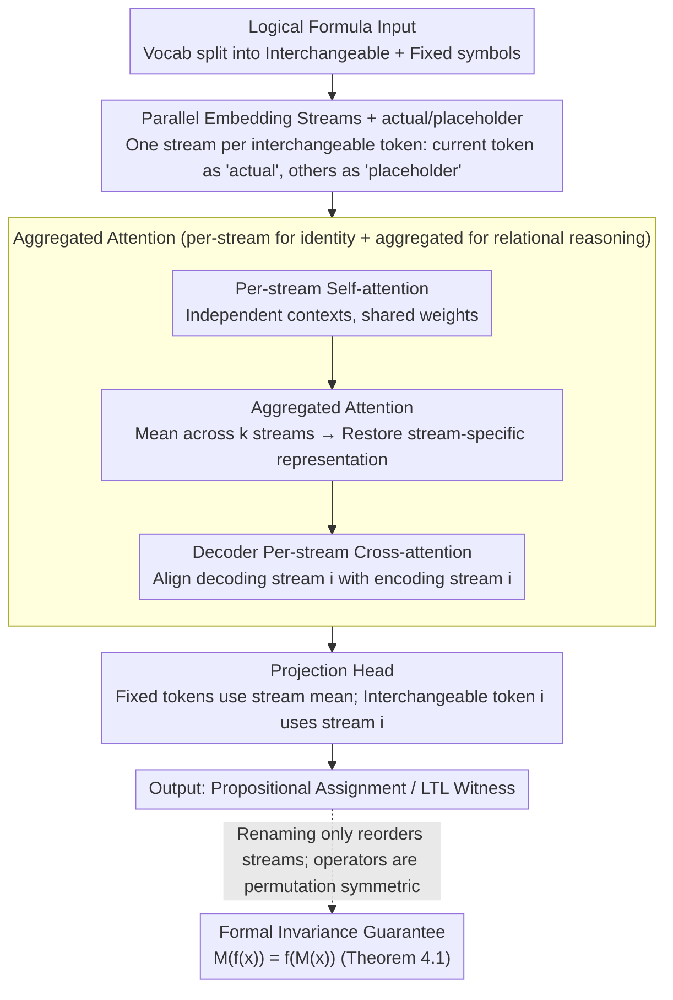

# Names Don't Matter: Symbol-Invariant Transformer for Open-Vocabulary Learning

**Conference**: ICML 2026  
**arXiv**: [2601.23169](https://arxiv.org/abs/2601.23169)  
**Code**: https://bu-depend-lab.github.io/Symbol-Invariant-Transformer/ (Project Page)  
**Area**: LLM Pre-training / Transformer Architecture / Symbolic Reasoning / Open Vocabulary  
**Keywords**: Symbol Invariance, Alpha-equivalence, Parallel Embedding Streams, Open-vocabulary Generalization, LTL

## TL;DR
The authors modify the Transformer into a structure featuring "a shared-weight parallel embedding stream for each interchangeable symbol + cross-stream aggregated attention." This architecture-level design guarantees that the output remains completely unchanged under variable renaming (alpha-equivalence) and allows the inclusion of new symbols not seen during training into the vocabulary at test time. It outperforms comparable baselines and even GPT-5.2 on propositional logic and LTL witness generation tasks.

## Background & Motivation
**Background**: Applying Transformers to symbolic reasoning tasks (theorem proving, mathematical reasoning, LTL synthesis) has become a mainstream approach. Theoretically, Transformers have also been proven capable of simulating any finite automata. However, these works typically train and test on a **fixed vocabulary**, learning an embedding for "symbols" as if they were ordinary discrete tokens.

**Limitations of Prior Work**: Symbolic systems contain a special class of tokens—variable names, atomic propositions, and bound variables in $\lambda$-calculus—which are **interchangeable**. Renaming them should not change the semantics (e.g., $\lambda x.x+1$ is equivalent to $\lambda y.y+1$). However, models trained with fixed embedding tables overfit to specific names. LLM accuracy on code tasks can drop by up to 70% under semantics-preserving variable renaming; models like DeepLTL fail as soon as atomic proposition (AP) names not seen during training appear in the test set.

**Key Challenge**: The role of an embedding table is inherently contradictory. To allow a model to "distinguish between two different symbols," it must assign them different vectors. Once vectors encode "identity," renaming invariance is broken, and new symbols cannot be represented. Existing mitigations (e.g., Işık et al. 2025, using random vectors instead of learned embeddings) allow for post-training vocabulary expansion, but the randomness means **different seeds will yield different predictions for alpha-equivalent inputs**, offering no formal guarantee.

**Goal**: Design a Transformer architecture that (i) ensures outputs for any renaming of interchangeable tokens are automatically equivalent; (ii) accepts new interchangeable tokens outside the training vocabulary at test time; and (iii) does not rely on randomness, providing invariance as a "by construction" hard guarantee.

**Key Insight**: Since alpha-equivalence is essentially "permutation invariance among $k$ interchangeable symbols," each interchangeable symbol can be treated as an independent embedding stream. All streams share the same weights, and information across streams is fused using permutation-invariant operators (sum/mean). In this setup, **renaming merely reorders the $k$ streams**, and since permutation is invariant under these operators, equivalence holds naturally.

**Core Idea**: Replace the single embedding table with $k$ parallel embedding streams with shared weights. Each stream observes the input from the "perspective of one interchangeable symbol," using permutation-invariant aggregated attention for cross-stream communication. This elevates alpha-equivalence from a training objective to an architectural guarantee.

## Method

### Overall Architecture
This paper aims to make the Transformer inherently invariant to variable renaming (alpha-equivalence) while accepting unseen symbols at test time. The approach replaces the single embedding table with $k$ shared-weight parallel embedding streams. The vocabulary is split into an interchangeable part $\mathbb{V}_i$ (atomic propositions, variable names) and a fixed part $\mathbb{V}_n$ (logical operators, keywords). For each distinct interchangeable token in the input, a stream is opened. Each stream "rewrites" the same sequence from its perspective; within each stream, per-stream self-attention is performed, followed by permutation-invariant aggregated attention for cross-stream communication. (The Decoder also includes a per-stream cross-attention to align decoding streams with corresponding encoding streams). Finally, the projection head reads predictions from the dedicated stream of each token. Since renaming only reorders these $k$ streams, and both the internal tensors and cross-stream operators are symmetric with respect to order, output equivalence is locked by the architecture.

### Key Designs

**1. Parallel Embedding Streams + actual/placeholder Dual Embeddings: Shifting "Identity" from Embeddings to Stream Indices**

The fundamental flaw of traditional embedding tables is that once a vector encodes a token's "identity," renaming invariance and open vocabulary become conflicting goals. To distinguish two symbols, they must have different vectors, but different vectors break "same meaning, different name." The solution here is to use stream indices instead of vectors to represent identity. When processing stream $i$, the positions in the sequence actually occupied by token $i$ are filled with an "actual" embedding, while positions of other interchangeable tokens are filled with a single shared "placeholder" embedding. Fixed tokens are kept as is, and a binary mask tracks which position belongs to which token. Consequently, all $k$ streams are isomorphic—non-interchangeable parts are identical, and interchangeable parts are disambiguated as actual/placeholder—allowing them to be processed in parallel by the same Transformer weights. Renaming $f$ that maps token $i$ to $j$ merely results in the original "stream $i$" becoming "stream $j$," with internal tensors remaining unchanged. Since weights for self-attention, FFN, and LayerNorm are shared across streams, new tokens in the vocabulary only require **opening an additional stream**, requiring no untrained parameters or retraining.

**2. Aggregated Attention: Enabling Cross-stream Information Exchange without Breaking Permutation Invariance**

Pure per-stream attention (independent self-attention for each stream) is only sufficient for each stream to digest "where my symbol appears." It fails for relational reasoning involving multiple propositions, such as $p \land q$. Thus, a path for streams to "see" each other is necessary. Aggregated attention works by first averaging the hidden states of $k$ streams to obtain a fused view, then replacing the values at positions where each interchangeable token appears with the true hidden state from its corresponding stream $i$ (restoring the "dedicated representation"). Self-attention is then performed on this fused view. The key is that this path is symmetric throughout: the mean is naturally permutation-invariant ($\sum_i v_i = \sum_i v_{\pi(i)}$), and position-based restoration uses the "stream corresponding to the token" rather than an "absolute stream index." Thus, even if streams are reordered, the aggregation result remains the same, making relational reasoning alpha-invariant. Both Encoder and Decoder use a combination of per-stream and aggregated attention; the Decoder additionally introduces cross-stream cross-attention, which defaults to per-stream mode (stream $i$ aligning with encoder stream $i$). Ablations show this alignment is critical for correctly identifying stream identities.

**3. Formal Invariance Guarantee (Theorem 4.1): Turning Renaming Invariance from Empirical Observation into a Theorem**

The invariance of previous random embedding methods (Işık et al. 2025) is only statistical—different random seeds for the same pair of alpha-equivalent inputs can lead to different predictions, which is insufficient for formal verification scenarios. This work demands a 0-1 hard guarantee: for any alpha-renaming $f$, the model satisfies $M(f(x)) = f(M(x))$, implying $f^{-1}(\hat{y}') = \hat{y}$. The proof follows from the two designs above: when renaming maps token $i$ to $j$, "stream $i$" in the original calculation becomes "stream $j$" in the new one. Per-stream operators are independent of stream indices due to weight sharing. Aggregated operators use summation/averaging and "token-specific restoration," where summation is permutation-invariant and restoration does not depend on absolute stream indices. Since both types of operators are strictly symmetric with respect to stream order, the symmetry of the entire network holds, and invariance is guaranteed by construction rather than training.

### Loss & Training
The model utilizes the cosine loss from Işık et al. 2025 (features and embeddings are normalized, reducing logits to cosine similarity) with AdaCos for adaptive scaling, treating sequence length as the batch dimension. The Encoder is equipped with RoPE and tree position encoding to match the tree-structured input of logical formulas. Decoding is performed via beam search ($k=3$). A computational optimization is used in the projection head: logits for fixed tokens are the average across all streams (as they are equivalent from all perspectives), while the logit for interchangeable token $i$ is taken directly from stream $i$ to prevent the dedicated representation from being diluted by cross-stream summation.

## Key Experimental Results

### Main Results
Two core tasks: **Propositional Logic Assignment Prediction** (PropRandom35) and **LTL Witness Generation** (LTLRandom35, DeepLTL benchmark), with prediction correctness verified using pyaiger and spot. Evaluation metrics include: Correct (semantic accuracy), Exact (perfect ground truth match), and Alpha-Covariance (alpha-equivalence consistency under 3/4/5 APs).

| Task | Training Setup | Method | Correct | Exact | α-cov (5 AP) |
|------|---------|------|---------|-------|--------------|
| Prop Logic | Normal | Baseline | 95.62% | 57.94% | 76.02% |
| Prop Logic | Normal | Random Emb (Işık 2025) | 93.25% | 56.45% | 92.98% |
| Prop Logic | Normal | **Proposed** | **98.03%** | **60.96%** | **100.0%** |
| Prop Logic | Reduced (80K) | Baseline | 63.26% | 29.31% | 53.31% |
| Prop Logic | Reduced | **Proposed** | **70.43%** | **35.81%** | **100.0%** |
| Prop Logic | Pretrained | GPT-5.2 | 99.73% | 25.60% | 1.03% |
| LTL | Normal | Baseline | 98.23% | 83.23% | 91.80% |
| LTL | Normal | **Proposed** | **98.24%** | 79.65% | **100.0%** |
| LTL | Pretrained | GPT-5.2 | 86.83% | 35.93% | 77.56% |

Highlights: Alpha-covariance remains **100.0%** across all AP counts (validating Theorem 4.1). On LTL, it even **outperforms GPT-5.2** (98.24% vs 86.83%), while GPT-5.2's α-cov on 5 AP propositional logic is only 1.03%, suggesting LLMs fail significantly at renaming invariance.

### Ablation Study (Propositional Logic)
Two-letter encoding: First letter E/D/C = Encoder/Decoder/Cross Attention; Second letter P/A = Per-stream/Aggregated.

| Config | Heatmap Accuracy | Description |
|------|---------------|------|
| Best (EP-DP-EA-DA-CP) | 95.05% | Recommended default configuration |
| -CP+CA | 28.51% | **Catastrophic**: Replacing per-stream cross-attention with aggregated; decoder streams fail to recognize corresponding encoder streams |
| -DP | 46.55% | Removing decoder per-stream → Significant drop (failure in stream identity recognition) |
| -EA-DA | 72.35% | Removing both aggregated attentions → Loss of relational reasoning capability |
| -DA | 84.48% | Removing decoder aggregated → Moderate drop |
| -EA | 92.47% | Removing encoder aggregated → Minor drop (DA partially compensates) |

### Key Findings
- **Per-stream cross-attention is vital for identity alignment**: Switching to aggregated attention results in a ~60% drop, proving the decoder must know "which encoder stream the token I am currently generating corresponds to."
- **Task determines aggregated attention importance**: In propositional logic, relational reasoning (operators like implication/xor involving multiple APs) is the bottleneck, making aggregated attention highly impactful. In LTL, temporal reasoning is the main bottleneck rather than AP relations; removing DA actually leads to a slight improvement.
- **Alpha-covariance gap with baseline**: Baselines drop to 76% / 91.8% at 5 AP, while Ours remains 100%—a product of architectural guarantee rather than data or hyperparameters.
- **Pareto improvement**: On Renamed training sets, Ours outperforms the baseline on original datasets (Prop logic 41.57% → Ours maintains high levels), showing this inductive bias is a structural learning aid, not just a robustness trick.
- **Adaptability of pre-trained models**: By treating baseline token embeddings as actual/placeholder, 1 epoch of fine-tuning raised LTL heatmap performance from failure to 85.91%, and after 5 epochs, it matched the 84.13% of from-scratch training. This is a crucial path for applying the method to existing LLMs.
- **Manageable overhead**: Theoretical complexity is $O(SL^2)$. For $S=10$, per-sample inference time increases from 3.38 ms to 5.13 ms—four orders of magnitude faster than GPT-5.2's 10–90 seconds per sample.

## Highlights & Insights
- **Invariance as an architectural primitive**: Equivalence class invariance (alpha-equivalence here) is usually approximated by data augmentation or regularization. This work uses "symmetric operators under group action" to achieve it directly. This "group action = invariance" approach is transferable to other domains with symmetries (graph node renaming, set inputs, $k$-ary relations).
- **Weight Sharing + Stream Indexing = Open Vocabulary**: Traditional models require changing embedding tables and retraining to expand the vocabulary. Here, adding a new token simply involves opening a new stream with zero new parameters and zero retraining. This is an elegant paradigm for handling "infinite vocabularies" in symbolic systems—similar to GNNs using message passing instead of node ID embeddings.
- **Structural vs. Statistical Guarantees**: Prior work using random embeddings provided empirical improvements but lacked 0-1 guarantees. This work demonstrates that "formal guarantee + empirical performance + computational feasibility" can coexist. For safety, verification, and formal reasoning, a 0-1 guarantee is significantly more valuable than incremental accuracy gains.
- **Functional division of per-stream vs. aggregated**: The ablation clearly decouples "stream identity recognition" (per-stream) and "cross-stream relational reasoning" (aggregated), revealing that their importance varies by task—a valuable design analysis.
- **Lightweight adaptation for pre-trained models**: Allowing "existing LLM + minimal fine-tuning" to acquire alpha-invariance transforms the technology from "from-scratch only" to "incremental upgrade," which is key for integration into code or math LLMs.

## Limitations & Future Work
- **Upper limit on stream count $S$**: With $O(SL^2)$ complexity and $O(SLd)$ memory, $S \le 10$ is verified, but program synthesis or theorem proving can involve hundreds of local variables. The authors suggest Top-K stream sparsification, which must follow "input-symmetric" criteria (e.g., position frequency) rather than token identity to preserve invariance.
- **Inability to generate "new symbols" outside the training vocabulary**: Streams are instantiated from the encoder input, so the model can only output interchangeable tokens present in the input. Tasks requiring "inventing new variable names" (constructive proofs, code synthesis) currently cannot be handled; the authors propose a "future symbol pool" of reserved streams.
- **Relatively restricted tasks**: Experiments are limited to toy-ish symbolic tasks (Prop logic, LTL). While the comparison with GPT-5.2 is compelling, proving superiority in real-world code, mathematics, or theorem proving requires larger-scale experiments and LLM integration.
- **Task-dependent placement of Aggregated attention**: Ablations show DA is critical for Prop logic but detrimental for LTL, suggesting that architectural hyperparameters (which layers are A vs. P) need per-task tuning and are not yet fully plug-and-play.

## Related Work & Insights
- **vs. Random Embedding (Işık et al. 2025)**: They use random vectors for a non-learnable "identity code" + a shared learnable part. This expands vocabulary statistically, but alpha-equivalent inputs may yield different outputs under different seeds. Ours uses structural symmetry to elevate invariance to a 0-1 guarantee and outperforms them on accuracy (98.03% vs 93.25%).
- **vs. Renamer (Ankner et al. 2023)**: Also seeks provable invariance to variable renaming but does not consider vocabulary expansion (remains within a fixed vocabulary). Ours achieves both invariance and open vocabulary through stream weight sharing.
- **vs. GNNs for Automated Reasoning (Olsák et al. 2019)**: GNNs provide invariance for ATP but only for graph structures and cannot perform seq2seq tasks. This work brings "permutation invariance" to encoder-decoder Transformers for sequence inputs/outputs.
- **vs. Set/Permutation Invariant Transformers (Lee et al. 2019 Set Transformer / Xu et al. 2024)**: General permutation-invariant schemes treat the entire sequence as a set, losing order. Ours applies invariance only to the "interchangeable token subset" while preserving sequence order for fixed tokens—a more refined partial-invariance design.
- **vs. Vision Open-Vocabulary (CLIP, etc.)**: CLIP relies on semantic relationships between categories in massive pre-training. This does not apply to interchangeable tokens in symbolic logic, which are semantically identical and only differ in name.
- **vs. LLMs (GPT-5.2)**: General LLMs achieve only 1.03% α-cov on 5 AP propositional logic and 86.83% accuracy on LTL, with 10–90s per sample. This specialized model achieves 98.24% on LTL with millisecond inference, illustrating that "for structural tasks, inductive bias is more important than scale."

## Rating
- **Novelty**: ⭐⭐⭐⭐⭐ Elevating alpha-equivalence to an architectural symmetry combined with an open vocabulary is a clean approach with formal guarantees.
- **Experimental Thoroughness**: ⭐⭐⭐⭐ Core tasks are well-explained (including detailed ablation, heatmaps, GPT-5.2 comparison, and pre-training adaptation), though verification on large-scale symbolic tasks like code or mathematics is missing.
- **Writing Quality**: ⭐⭐⭐⭐⭐ The chain from motivation → method → theorem → ablation underscores the logic clearly. Conceptual naming is consistent with diagrams, aiding reproducibility.
- **Value**: ⭐⭐⭐⭐⭐ Provides a provably secure architectural primitive for formal verification, theorem proving, and symbolic reasoning, with a clear path for adapting existing pre-trained models.

<!-- RELATED:START -->

## Related Papers

- [\[ECCV 2024\] Plan, Posture and Go: Towards Open-Vocabulary Text-to-Motion Generation](../../ECCV2024/llm_pretraining/plan_posture_and_go_towards_open-vocabulary_text-to-motion_generation.md)
- [\[ICML 2026\] If open source is to win, it must go public](if_open_source_is_to_win_it_must_go_public.md)
- [\[NeurIPS 2025\] Learning in Compact Spaces with Approximately Normalized Transformer](../../NeurIPS2025/llm_pretraining/learning_in_compact_spaces_with_approximately_normalized_transformer.md)
- [\[NeurIPS 2025\] Born a Transformer – Always a Transformer? On the Effect of Pretraining on Architectural Abilities](../../NeurIPS2025/llm_pretraining/born_a_transformer_--_always_a_transformer_on_the_effect_of_pretraining_on_archi.md)
- [\[AAAI 2026\] PrefixGPT: Prefix Adder Optimization by a Generative Pre-trained Transformer](../../AAAI2026/llm_pretraining/prefixgpt_prefix_adder_optimization_by_a_generative_pre-trained_transformer.md)

<!-- RELATED:END -->
