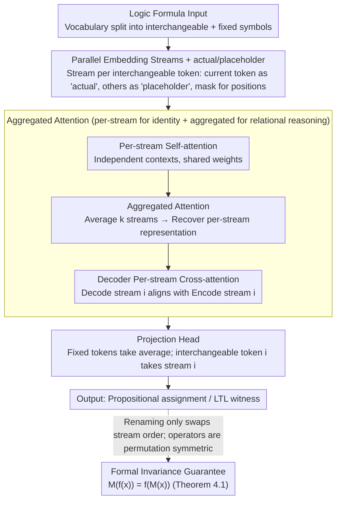

# Names Don't Matter: Symbol-Invariant Transformer for Open-Vocabulary Learning

**Conference**: ICML 2026  
**arXiv**: [2601.23169](https://arxiv.org/abs/2601.23169)  
**Code**: https://bu-depend-lab.github.io/Symbol-Invariant-Transformer/ (Project Page)  
**Area**: LLM Pre-training / Transformer Architecture / Symbolic Reasoning / Open Vocabulary  
**Keywords**: Symbol Invariance, alpha-equivalence, Parallel Embedding Streams, Open-Vocabulary Generalization, LTL

## TL;DR
The authors modify the Transformer into a structure with "a shared-weight parallel embedding stream for each interchangeable symbol + cross-stream aggregated attention." This architecture-level design guarantees identical outputs for variable renaming (alpha-equivalence) and allows the inclusion of new symbols not seen during training into the vocabulary during testing. It outperforms comparable baselines and even GPT-5.2 on propositional logic and LTL witness generation tasks.

## Background & Motivation
**Background**: Applying Transformers to symbolic reasoning tasks (theorem proving, mathematical reasoning, LTL synthesis) has become a mainstream approach. Theoretically, Transformers have been proven capable of simulating any finite automaton. However, these works typically train and test on a **fixed vocabulary**, learning an embedding for "symbols" as ordinary discrete tokens.

**Limitations of Prior Work**: Symbolic systems contain categories of interchangeable tokens—variable names, atomic propositions, bound variables in $\lambda$-calculus—where renaming should not alter semantics ($\lambda x.x+1$ is equivalent to $\lambda y.y+1$). Models trained with fixed embedding tables overfit to specific names: LLMs' accuracy on code tasks can drop by up to 70% under semantic-preserving variable renaming perturbations. Models like DeepLTL fail as soon as atomic proposition (AP) names unseen during training appear in the test set.

**Key Challenge**: The role of the embedding table is inherently conflicted. To allow a model to "distinguish between two different symbols," they must be assigned different vectors. However, once vectors encode "identity," rename invariance is broken, and new symbols cannot be represented. Existing mitigations (e.g., Işık et al. 2025 using random vectors instead of learned embeddings) suffer because **different seeds yield different predictions for alpha-equivalent inputs**, providing no formal guarantee.

**Goal**: Design a Transformer architecture such that (i) any renaming of interchangeable tokens automatically produces equivalent outputs; (ii) new tokens outside the training vocabulary can be accepted during testing; (iii) the invariance is a "by construction" hard guarantee independent of randomness.

**Key Insight**: Since alpha-equivalence is essentially "permutation invariance among $k$ interchangeable symbols," the authors split each interchangeable symbol into an independent embedding stream. All streams share the same weights, and information across streams is fused using permutation-invariant operators (sum/average). Thus, **renaming merely reorders the $k$ streams**, and since the operators are permutation-invariant, equivalence is naturally maintained.

**Core Idea**: Replace a single embedding table with $k$ shared-weight parallel embedding streams. Each stream views the input from the "perspective of one interchangeable symbol," using permutation-invariant aggregated attention for cross-stream communication, elevating alpha-equivalence from a training objective to an architectural guarantee.

## Method

### Overall Architecture
The paper seeks to make the Transformer inherently invariant to variable renaming (alpha-equivalence) while enabling open-vocabulary support. The single embedding table is replaced by $k$ shared-weight parallel embedding streams. The vocabulary is partitioned into an interchangeable part $\mathbb{V}_i$ (atomic propositions, variables) and a fixed part $\mathbb{V}_n$ (logic operators, keywords). For each distinct interchangeable token in the input, a stream is initialized. Each stream "rewrites" the same sequence from its own perspective. Within streams, per-stream self-attention is performed; then, permutation-invariant aggregated attention allows communication between streams. The Decoder adds a per-stream cross-attention to align decoding streams with corresponding encoding streams. Finally, the projection head reads predictions from the dedicated stream of each token. Equivalence is locked by the architecture because renaming only reorders the $k$ streams, and all operators are symmetric with respect to this order.

### Key Designs

**1. Parallel Embedding Streams + actual/placeholder: Moving identity from embedding to stream index**
The fundamental conflict in traditional embedding tables is that once a vector encodes "identity," rename invariance and open vocabulary become opposing goals. This work breaks this by using stream indices, rather than vectors, to represent identity. In stream $i$, positions containing token $i$ are filled with an "actual" embedding, while positions of other interchangeable tokens are filled with a shared "placeholder" embedding. Fixed tokens remain unchanged, and a binary mask tracks which position belongs to which token. Consequently, all $k$ streams are isomorphic—interchangeable parts are disambiguated as actual/placeholder—and can be processed in parallel by the same Transformer weights. Renaming token $i$ to $j$ simply swaps "stream $i$" and "stream $j$," without changing the tensors within. Since weights for self-attention, FFN, and LayerNorm are shared, new tokens simply require **opening an additional stream** without new parameters or retraining.

**2. Aggregated Attention: Cross-stream communication without breaking invariance**
Pure per-stream attention is insufficient for relational reasoning between different propositions (e.g., $p \land q$). Aggregated attention provides a pathway for streams to "see" each other. It computes a fused view by averaging the hidden states of $k$ streams, then restores the "exclusive representation" at each interchangeable token's position using the corresponding hidden state from stream $i$. Self-attention is then performed on this fused view. This path is symmetric: averaging is inherently permutation-invariant ($\sum_i v_i = \sum_i v_{\pi(i)}$), and position restoration uses the "token-corresponding stream" rather than an absolute stream index. Even if streams are reordered, the aggregation result remains identical. Both Encoder and Decoder use a combination of per-stream and aggregated attention.

**3. Formal Invariance Guarantee (Theorem 4.1): Turning invariance into a theorem**
Previous random-embedding methods (Işık et al. 2025) provided only statistical invariance—different seeds could yield different predictions for alpha-equivalent inputs. This study provides a hard 0-1 guarantee: for any alpha-renaming $f$, the model satisfies $M(f(x)) = f(M(x))$. The proof follows the design: renaming token $i$ to $j$ makes "stream $i$" in the original calculation exactly "stream $j$" in the new one. Per-stream operators are independent of stream indices due to weight sharing. Aggregated operators remain the same due to permutation invariance of sums and token-dependent retrieval.

### Loss & Training
The model uses the cosine loss from Işık et al. 2025 (normalized features and embeddings, logits reduced to cosine similarity) with AdaCos for adaptive scaling. Sequence length is treated as the batch dimension. The Encoder uses RoPE + tree position encoding to match the tree structure of logic formulas. Decoding uses beam search ($k=3$).

## Key Experimental Results

### Main Results
Two core tasks: **Propositional Logic Assignment Prediction** (PropRandom35) and **LTL Witness Generation** (LTLRandom35). Performance is verified using `pyaiger` and `spot`. Metrics: Correct (semantic), Exact (match ground truth), Alpha-Covariance (consistency across 3/4/5 APs).

| Task | Training | Method | Correct | Exact | α-cov (5 AP) |
|------|---------|------|---------|-------|--------------|
| Prop Logic | Normal | Baseline | 95.62% | 57.94% | 76.02% |
| Prop Logic | Normal | Random Emb (Işık 2025) | 93.25% | 56.45% | 92.98% |
| Prop Logic | Normal | **Ours** | **98.03%** | **60.96%** | **100.0%** |
| Prop Logic | Reduced (80K) | Baseline | 63.26% | 29.31% | 53.31% |
| Prop Logic | Reduced | **Ours** | **70.43%** | **35.81%** | **100.0%** |
| Prop Logic | Pretrained | GPT-5.2 | 99.73% | 25.60% | 1.03% |
| LTL | Normal | Baseline | 98.23% | 83.23% | 91.80% |
| LTL | Normal | **Ours** | **98.24%** | 79.65% | **100.0%** |
| LTL | Pretrained | GPT-5.2 | 86.83% | 35.93% | 77.56% |

Highlights: Alpha-covariance is **100%** across all AP counts (confirming Theorem 4.1). On LTL, it **outperforms GPT-5.2** (98.24% vs 86.83%). GPT-5.2's $\alpha$-cov on Prop Logic is only 1.03%, showing LLMs fail significantly at rename invariance.

### Ablation Study (Propositional Logic)
Codes: E/D/C = Encoder/Decoder/Cross-attention; P/A = Per-stream/Aggregated.

| Configuration | Heatmap Accuracy | Description |
|------|---------------|------|
| Best (EP-DP-EA-DA-CP) | 95.05% | Recommended default |
| -CP+CA | 28.51% | **Catastrophic**: Aggregated cross-attention fails to identify decoder streams |
| -DP | 46.55% | Removing decoder per-stream leads to identity failure |
| -EA-DA | 72.35% | Removing both aggregated attentions loses relational reasoning |
| -DA | 84.48% | Partial drop without decoder aggregated attention |
| -EA | 92.47% | Minor drop; DA can partially compensate |

### Key Findings
- **Per-stream cross-attention is crucial for alignment**: Switching to aggregated attention drops accuracy by 60+, as the decoder must know which encoder stream it corresponds to.
- **Task-dependent aggregation importance**: In propositional logic, relational reasoning is the bottleneck, making aggregated attention vital. In LTL, temporal reasoning is the bottleneck, and DA is less critical.
- **100% Alpha-covariance**: While baselines drop as AP count increases, this model remains at 100% due to architectural design.
- **Pareto Improvement**: On renamed datasets, the proposed model maintains high performance, showing the inductive bias helps learn structure rather than just robustness.
- **Adaptability for Pre-trained Models**: Baseline embeddings can be treated as actual/placeholder. 1-epoch fine-tuning significantly improves performance on LTL tasks.

## Highlights & Insights
- **Invariance as an Architectural Primitive**: Equivalence classes (like alpha-equivalence) are usually handled via data augmentation. This work uses symmetric operators under group actions to solve it architecturally.
- **Shared Weights + Stream Index = Open Vocabulary**: Unlike traditional models that require retraining or modifying tables to add tokens, this model simply opens a new stream.
- **Structural vs. Statistical Guarantees**: Previous works provided statistical improvements but lacked a 0-1 guarantee. This work demonstrates that formal guarantees, empirical performance, and computational feasibility can coexist.
- **Functional Decoupling**: Ablations clearly separate "stream identity identification" (per-stream) and "cross-stream relational reasoning" (aggregated).

## Limitations & Future Work
- **Stream Count $S$ Ceiling**: Complexity is $O(SL^2)$. While $S \le 10$ is tested, program synthesis or theorem proving might require hundreds of variables. Top-K stream sparsification must be input-symmetric.
- **New Symbol Generation**: Streams are instantiated from encoder inputs; the model only outputs tokens present in the input. Tasks requiring "inventing" new variables need further modification (e.g., a "future symbol pool").
- **Task Scope**: Evaluation is restricted to propositional logic and LTL. Validation on large-scale code or mathematical tasks is needed.

## Related Work & Insights
- **vs. Random Embedding (Işık et al. 2025)**: They use statistical "identity codes," but lack consistency for alpha-equivalent inputs. This work provides a 100% formal guarantee and superior accuracy.
- **vs. Renamer (Ankner et al. 2023)**: Renamer provides invariance within a fixed vocabulary; this work achieves both invariance and open-vocabulary support.
- **vs. GNNs for ATP (Olsák et al. 2019)**: GNNs handle graph structure but are not designed for seq2seq. This work brings permutation invariance to encoder-decoder Transformers.
- **vs. LLM (GPT-5.2)**: LLMs fail significantly at alpha-covariance and are orders of magnitude slower. This model demonstrates that for structural tasks, inductive bias outweighs scale.

## Rating
- Novelty: ⭐⭐⭐⭐⭐ 
- Experimental Thoroughness: ⭐⭐⭐⭐ 
- Writing Quality: ⭐⭐⭐⭐⭐ 
- Value: ⭐⭐⭐⭐⭐ 

<!-- RELATED:START -->

## Related Papers

- [\[CVPR 2026\] Reconstructing CLIP for Open-Vocabulary Dense Perception](../../CVPR2026/llm_pretraining/reconstructing_clip_for_open-vocabulary_dense_perception.md)
- [\[ECCV 2024\] Plan, Posture and Go: Towards Open-Vocabulary Text-to-Motion Generation](../../ECCV2024/llm_pretraining/plan_posture_and_go_towards_open-vocabulary_text-to-motion_generation.md)
- [\[ICML 2026\] If open source is to win, it must go public](if_open_source_is_to_win_it_must_go_public.md)
- [\[NeurIPS 2025\] Learning in Compact Spaces with Approximately Normalized Transformer](../../NeurIPS2025/llm_pretraining/learning_in_compact_spaces_with_approximately_normalized_transformer.md)
- [\[NeurIPS 2025\] Born a Transformer – Always a Transformer? On the Effect of Pretraining on Architectural Abilities](../../NeurIPS2025/llm_pretraining/born_a_transformer_--_always_a_transformer_on_the_effect_of_pretraining_on_archi.md)

<!-- RELATED:END -->
