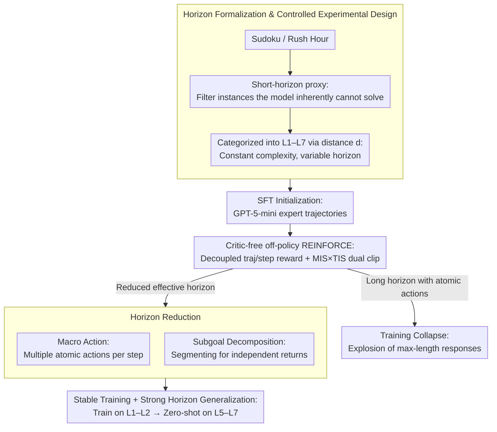

# On Training Large Language Models for Long-Horizon Tasks: An Empirical Study of Horizon Length

**Conference**: ICML 2026  
**arXiv**: [2605.02572](https://arxiv.org/abs/2605.02572)  
**Code**: Not disclosed  
**Area**: LLM Agent / Reinforcement Learning / Long-Horizon  
**Keywords**: horizon reduction, REINFORCE, macro action, subgoal, horizon generalization

## TL;DR
Using a set of carefully controlled Sudoku/Rush Hour tasks where "reasoning difficulty remains constant while only the horizon length varies," this paper systematically proves that **task horizon itself is an independent root cause for LLM agent RL training collapse**. The authors propose two horizon-reduction mechanisms—macro actions and subgoal decomposition—which not only stabilize training but also enable strong zero-shot generalization across longer horizons (horizon generalization).

## Background & Motivation

**Background**: Utilizing LLMs as agents has become mainstream (e.g., Claude Code, Codex). Training methods focus on system-level context engineering and model-level SFT/RL (critic-free methods like GRPO, DAPO, GSPO).

**Limitations of Prior Work**: When the required interaction steps increase from short (10-20 steps) to long (30+ steps), RL that was stable on short tasks often suffers **catastrophic collapse**—success rates plummet, and response lengths explode to the max-length. The community often attributes this to "task difficulty" or "sparse rewards," without isolating whether "horizon" is an independent bottleneck.

**Key Challenge**: In real-world tasks, horizon length is naturally coupled with reasoning complexity (e.g., harder Sudoku requires longer traces and advanced techniques). This makes it impossible to determine if training failure stems from the "long horizon" or "reasoning difficulty."

**Goal**: 1) Mechanically isolate horizon from other difficulty factors; 2) Quantitatively characterize RL training dynamics under the single variable of horizon; 3) Identify simple principles to stabilize long-horizon RL.

**Key Insight**: The authors use a key hypothesis: "If a model has problem-solving capability, it should solve the task if compressed into a single-step form." They construct a **short-horizon proxy task** ("providing the full Sudoku answer in one step") to filter instances, then segment them into seven levels (L1–L7) based on the number of atomic actions $d(s_0, g)$, ensuring "solving complexity" remains identical across levels.

**Core Idea**: Horizon is an intrinsic task attribute rather than an environmental constraint. Actively reducing the effective horizon $h_\pi(s_0, g)$ (via macro actions or subgoals) is more effective at curing long-horizon training collapse than designing complex RL algorithms, and it naturally leads to horizon generalization.

## Method

### Overall Architecture
This paper follows a "Diagnosis—Intervention—Verification" path: First, under controlled solving complexity, it performs SFT + REINFORCE-style RL on Qwen3-1.7B across L1–L4 to observe how training curves collapse as the horizon grows. Second, it proposes two horizon-reduction mechanisms—macro actions (multiple atomic actions per step) and subgoal decomposition (segmenting the trajectory for independent return calculation)—to compress the effective horizon back into a stable RL learning zone. Finally, it cross-validates robustness on Rush Hour, WebShop, 4B models, and the GRPO optimizer, and tests zero-shot horizon generalization on L5–L7.

### Key Designs

**1. Horizon Formalization and Controlled Experimental Design: Isolating horizon from all other difficulty factors**

The community struggled to discern whether long-horizon RL failures stemmed from "more steps" or "harder problems" due to their natural coupling. The authors partition horizon into three metrics: target distance $d(s_0, g)$ (atomic actions in the optimal path), interaction budget $H_{\max}$, and effective horizon $h_\pi(s_0, g)$ (actual steps taken), where $d \le h_\pi \le H_{\max}$. They construct a univariate dataset: Sudoku uses the number of empty cells as a proxy for $d$, with all instances locked to "basic techniques" via the HoDoKu solver to fix reasoning complexity. Rush Hour uses the minimum number of moves as $d$. A short-horizon proxy filters out instances beyond the model's inherent capability. The remaining instances **differ only in horizon** and are categorized into levels L1–L7 based on $d$.

**2. Critic-free off-policy REINFORCE and reward decoupling: A stable optimizer for long horizons**

Since variance reduction in value-based methods degrades over long horizons, the authors bypass the PPO critic for a baseline-corrected REINFORCE: $A_t = \hat r_t^{\text{traj}} + \alpha \hat r_t^{\text{step}}$, where $r^{\text{traj}}_t = \sum_{k=t}^{T-1} \gamma^{k-t} r_k$ is the trajectory return and $r^{\text{step}}_t = r^{\text{format}}_t + r^{\text{valid}}_t$ penalizes parsing/invalid actions. Both are batch-normalized before weighting with $\alpha = 0.2$. This reward decoupling prevents step penalties from polluting trajectory signals. For off-policy stability, they use a joint MIS (Masked Importance Sampling with geometric mean ratio) and TIS (Truncated IS with sequence-level ratio) clip: $w_t = \mathbb{I}(C_{\text{low}}\le \rho_{\text{geo},t}\le C_{\text{high}}) \cdot \min(\rho_{\text{seq},t}, C)$. This addresses the **diffusivity of negative advantage**: penalized tokens spread probability across the vocabulary; in long trajectories, a few errors can contaminate all tokens.

**3. Horizon Reduction: Macro actions and subgoal decomposition**

Since RL stability depends on $h_\pi$ rather than $d$, the authors reduce $h_\pi$ directly. **Macro actions** allow the policy to output multiple atomic actions (e.g., filling multiple Sudoku cells or `move(id, direction, N)` in Rush Hour), defining $\pi'$ over a macro-action space such that $h_{\pi'}(s_0, g) \le h_\pi(s_0, g)$. Comparing atomic vs. fixed-length vs. flexible granularity, the authors found flexible macro actions (model-determined length) performed best. **Subgoal decomposition** breaks the global goal $g$ into independently verifiable subgoals $(g_1, \ldots, g_k)$. By calculating segment-wise $G_t$, they transform a long sparse-reward MDP into multiple short dense-reward MDPs. An ablation confirmed the mechanism: training a macro-action policy but **forcing it to execute only 1 atomic action per turn** still leads to collapse, proving the contribution is horizon reduction, not increased policy expressivity.

### Loss & Training
The base model is Qwen3-1.7B (validated with 4B, Llama3, etc.), initialized via SFT on GPT-5-mini expert trajectories, followed by 4 epochs of off-policy REINFORCE. Rollout/inference temperature is 0.8; pass@K/avg@K are estimated using 4 trajectories per instance.

## Key Experimental Results

### Main Results

| Setting | Short Horizon (L1-L2) | Long Horizon (L3-L4) |
|------|--------------------|--------------------|
| Atomic action RL | Stable improvement | **Training collapse**, max-length ratio explosion |
| Macro action RL | Faster, higher convergence | **Stable improvement**, no collapse |
| Subgoal decomposition | — | Stable learning on L3-L4 where sparse-reward baselines fail |

### Ablation Study

| Configuration | Key Phenomenon | Explanation |
|------|---------|------|
| Macro-action policy (restricted to 1 atomic/turn) | Still collapses | Horizon is the real bottleneck, not policy expressivity |
| Fixed-length macro ($k$ steps) | Suboptimal, overshooting | Rigid constraints are harmful |
| Flexible macro ($n\le5$ or unbound) | Optimal | Policy autonomously determines action length |
| GRPO-style optimizer | Also collapses on long horizons | Conclusion is optimizer-agnostic |
| WebShop / 4B Model | Universal stable improvement | Conclusion holds across environments and scales |

### Key Findings
- **Collapse is accompanied by a sharp rise in max-length response ratio**: The authors hypothesize that accumulated negative advantage pushes the policy toward incoherent, long-form generation. This serves as a precursor to collapse and a signal for early stopping.
- **Horizon generalization**: Macro-action models trained only on L1-L2 significantly outperform atomic baselines on unseen L5-L7 horizons, indicating that horizon reduction facilitates the learning of **transferable problem-solving patterns**.
- **Horizon curriculum is effective**: A training sequence from short to long performs better than short-only or long-only, confirming that reducing $h_\pi$ to a stable learning zone is critical.

## Highlights & Insights
- The **dataset design decoupling horizon and reasoning** is the most significant methodological contribution. This paradigm (short-horizon proxy + solver-based leveling) can be directly applied to training and evaluating web or coding agents.
- The contrast between "complex algorithms vs. simple principles" is striking: while the community focuses on PPO/GRPO/DAPO variants, this work proves that reducing effective horizon makes even basic REINFORCE robust.
- The insight that **negative-advantage diffusion causes incoherent generation** is crucial for LLM RL practitioners, explaining why training often deteriorates over time in long-sequence scenarios.
- **Horizon generalization** suggests an optimistic upper bound: effective training on short horizons can yield zero-shot capabilities for long horizons, potentially making large-scale long-horizon RL more feasible.

## Limitations & Future Work
- Environments are primarily text-based games; the effectiveness of horizon reduction in **open-ended coding or research agents** is not directly verified. Defining macro actions in code editing remains an open question.
- Model scales are limited to 1.7B/4B; verifying if larger models (14B+) can fully suppress collapse via horizon reduction is needed.
- Subgoal decomposition requires "independently verifiable subgoals," which is natural for structured tasks like Sudoku but remains unsolved for chain-like tasks like mathematical proofs or complex planning.
- The relationship between horizon reduction and search/planning methods (e.g., MCTS, Tree-of-Thought) was not discussed; theoretically, these approaches could be layered.

## Related Work & Insights
- **vs. Shen et al. / Xi et al. / Bai et al. (horizon-based curriculum)**: Those works view horizon as an environmental constraint (interaction budget); this paper treats it as an intrinsic task property, offering deeper mechanistic analysis.
- **vs. CALM (wang-etal-2025) and refined RL algorithms**: While others design more complex algorithms, this paper advocates for task structure modification, which is simpler and more robust.
- **vs. Sinha et al. (step accuracy analysis)**: This work agrees that long horizons require near-perfect step accuracy but proposes reducing the number of steps rather than solely trying to increase step-wise precision.

## Rating
- Novelty: ⭐⭐⭐⭐ Univariate isolation of horizon via dataset design is genuinely innovative.
- Experimental Thoroughness: ⭐⭐⭐⭐ Robustness verified across environments/scales/optimizers, though open-ended coding validation is missing.
- Writing Quality: ⭐⭐⭐⭐⭐ Extremely clear logical chain following the "Diagnosis-Intervention-Verification" structure.
- Value: ⭐⭐⭐⭐⭐ Provides actionable guidance for practitioners training long-horizon LLM agents.

<!-- RELATED:START -->

## Related Papers

- [\[ACL 2025\] Nemotron-CC: Transforming Common Crawl into a Refined Long-Horizon Pretraining Dataset](../../ACL2025/llm_pretraining/nemotron_cc_pretraining_data.md)
- [\[ICLR 2026\] Beyond Length: Quantifying Long-Range Information for Long-Context LLM Pretraining Data](../../ICLR2026/llm_pretraining/beyond_length_quantifying_long-range_information_for_long-context_llm_pretrainin.md)
- [\[ICML 2026\] InfoLaw: Information Scaling Laws for Large Language Models with Quality-Weighted Mixture Data and Repetition](infolaw_information_scaling_laws_for_large_language_models_with_quality-weighted.md)
- [\[ICLR 2026\] How Text Quality Interventions Reshape Neural Scaling Laws for LLMs: Empirical Study](../../ICLR2026/llm_pretraining/how_text_quality_interventions_reshape_neural_scaling_laws_for_llms_empirical_st.md)
- [\[ICML 2026\] Tuning the Implicit Regularizer of Masked Diffusion Language Models: Enhancing Generalization via Insights from k-Parity](tuning_the_implicit_regularizer_of_masked_diffusion_language_models_enhancing_ge.md)

<!-- RELATED:END -->
