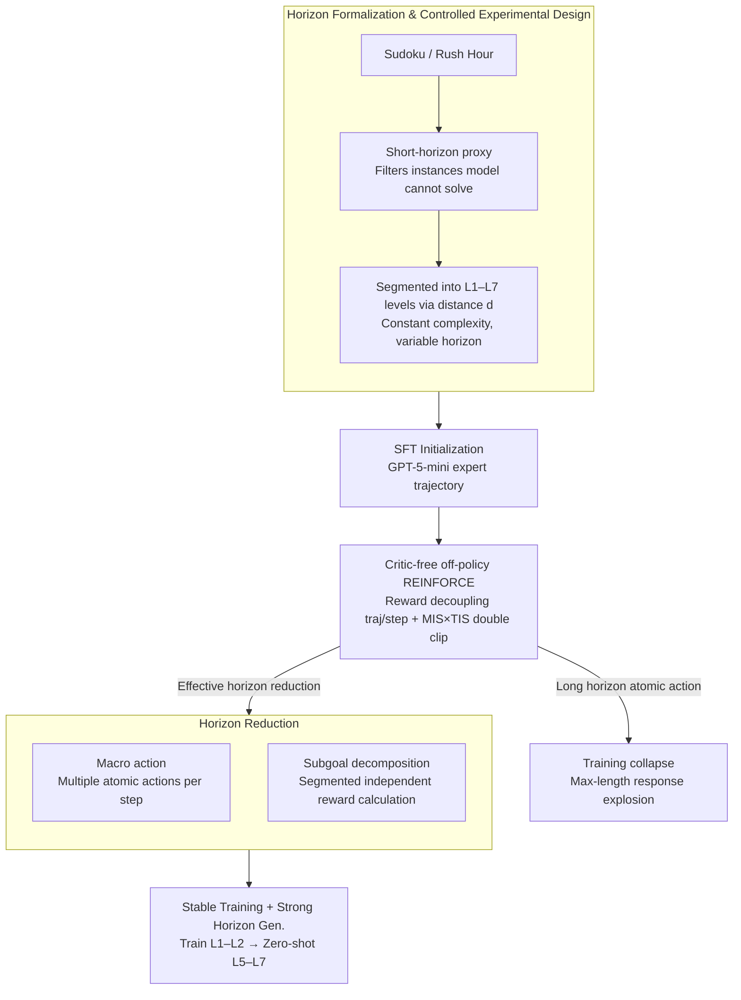

# On Training Large Language Models for Long-Horizon Tasks: An Empirical Study of Horizon Length

**Conference**: ICML 2026  
**arXiv**: [2605.02572](https://arxiv.org/abs/2605.02572)  
**Code**: Not disclosed  
**Area**: LLM Agent / Reinforcement Learning / Long-Horizon  
**Keywords**: horizon reduction, REINFORCE, macro action, subgoal, horizon generalization

## TL;DR
Using a set of carefully controlled Sudoku/Rush Hour tasks with constant reasoning difficulty but varying horizon lengths, this paper systematically proves that **task horizon itself is an independent root cause of RL training collapse in LLM agents**. It proposes two horizon-reduction mechanisms—macro action and subgoal decomposition—which not only stabilize training but also enable strong zero-shot generalization (horizon generalization) to even longer horizons.

## Background & Motivation

**Background**: Utilizing LLMs as agents has become mainstream (e.g., Claude Code, Codex). Training methods focus on system-level context engineering and model-level SFT/RL (critic-free methods like GRPO, DAPO, GSPO).

**Limitations of Prior Work**: When the required interaction steps increase from short (10-20 steps) to long (30+ steps), RL that was stable on short tasks often suffers **catastrophic collapse**—success rate drops to zero and response length explodes to the max-length. The community often blames "task difficulty" or "sparse rewards," but whether the horizon is an independent bottleneck remained unexamined.

**Key Challenge**: In real-world tasks, horizon length is naturally coupled with reasoning complexity (harder Sudoku requires both longer traces and more advanced techniques), making it impossible to determine if training failure stems from the long horizon or the reasoning difficulty.

**Goal**: 1) Mechanically isolate horizon from other difficulty factors; 2) Quantitatively characterize RL training dynamics under the single variable of horizon; 3) Identify simple principles to stabilize long-horizon RL.

**Key Insight**: The authors construct a **short-horizon proxy task** ("provide the entire Sudoku solution in one step") to filter instances based on the hypothesis: "If the model can solve it, it should be able to do so in a single-step format." Instances are then segmented into seven levels (L1–L7) based on the number of atomic actions $d(s_0, g)$, ensuring the solving complexity remains constant across levels.

**Core Idea**: Horizon is an intrinsic task attribute rather than an environmental constraint. Actively reducing the effective horizon $h_\pi(s_0, g)$ (via macro actions or subgoals) is more effective at curing long-horizon training collapse than designing complex RL algorithms, and it naturally facilitates horizon generalization.

## Method

### Overall Architecture
The paper follows a "Diagnosis—Intervention—Validation" path: first, performing SFT + REINFORCE-style RL on Qwen3-1.7B across L1–L4 while controlling complexity to observe how training collapses as the horizon lengthens. Then, it proposes two horizon reduction mechanisms—macro action (executing multiple atomic actions per step) and subgoal decomposition (segmenting the task to calculate rewards independently)—to bring the effective horizon back into a stable RL range. Finally, it cross-validates robustness on Rush Hour, WebShop, a 4B model, and the GRPO optimizer, testing zero-shot horizon generalization on L5–L7.

### Key Designs

**1. Horizon Formalization and Controlled Experimental Design: Isolating horizon from all other difficulty factors**

The community struggled to distinguish if RL failure was due to "many steps" or "difficulty." The authors decompose horizon into three metrics: target distance $d(s_0, g)$ (atomic actions for optimal strategy), interaction budget $H_{\max}$, and effective horizon $h_\pi(s_0, g)$ (actual steps taken), where $d \le h_\pi \le H_{\max}$. Sudoku uses empty cells as a proxy for $d$, with HoDoKu solver ensuring all instances require only "basic techniques" to fix reasoning complexity. Rush Hour uses $min\_moves$ for $d$. Filtering with a short-horizon proxy ensures instances **differ only in horizon**. This dataset is the cornerstone of the paper's claim that horizon is an independent bottleneck.

**2. Critic-free off-policy REINFORCE and Reward Decoupling: A stable optimizer for long horizons**

Since value-based variance reduction decays in long horizons, the authors use REINFORCE with a baseline: $A_t = \hat r_t^{\text{traj}} + \alpha \hat r_t^{\text{step}}$, where $r^{\text{traj}}_t = \sum_{k=t}^{T-1} \gamma^{k-t} r_k$ is the trajectory return and $r^{\text{step}}_t = r^{\text{format}}_t + r^{\text{valid}}_t$ penalizes parsing/invalid moves. Reward decoupling is critical; otherwise, step penalties drown out trajectory signals. For off-policy stability, they use a combination of Masked Importance Sampling (MIS, geometric mean ratio clip) and Truncated IS (TIS, sequence-level ratio clip): $w_t = \mathbb{I}(C_{\text{low}}\le \rho_{\text{geo},t}\le C_{\text{high}}) \cdot \min(\rho_{\text{seq},t}, C)$. This targets the **diffusivity of negative advantage**: penalized tokens spread probability across the vocab; in long trajectories, one error can pollute all subsequent tokens.

**3. Horizon Reduction: Macro actions and subgoal decomposition**

Since RL stability depends on $h_\pi$ rather than $d$, they physically reduce $h_\pi$. **Macro actions** allow the policy to output multiple atomic actions (e.g., filling multiple cells in Sudoku, `move(id, direction, N)` in Rush Hour), defining $\pi'$ on a macro-action space such that $h_{\pi'}(s_0, g) \le h_\pi(s_0, g)$. Comparing atomic vs. fixed-length vs. flexible (up to 5) granularities, they found fixed-length performed worst due to overshooting, while flexible was optimal. **Subgoal decomposition** breaks the global goal $g$ into independently verifiable subgoals $(g_1, \ldots, g_k)$, calculating segment-wise $G_t$. This effectively cuts a long sparse-reward MDP into multiple short dense-reward MDPs. An ablation confirmed the mechanism: training a macro-action policy but **forcing only 1 atomic action per turn** still resulted in collapse, proving the contribution is horizon reduction, not increased policy expressivity.

### Loss & Training
Base models included Qwen3-1.7B (validated on 4B and Llama3). SFT was performed on GPT-5-mini expert trajectories, followed by 4 epochs of off-policy REINFORCE. Rollout/inference temperature was 0.8; pass@K/avg@K estimated with 4 trajectories per instance.

## Key Experimental Results

### Main Results

| Setting | Short Horizon (L1-L2) | Long Horizon (L3-L4) |
| :--- | :--- | :--- |
| Atomic action RL | Stable Gain | **Training Collapse**, max-length ratio surge |
| Macro action RL | Faster convergence, higher performance | **Stable Gain**, no collapse |
| Subgoal decomposition | — | Stable performance on L3-L4 where sparse-reward baseline fails to learn |

### Ablation Study

| Configuration | Key Phenomenon | Explanation |
| :--- | :--- | :--- |
| Macro-action policy (limit 1 atomic/turn) | Still collapses | Horizon is the bottleneck, not policy capacity |
| Fixed-length macro ($k$ steps) | Poor performance, overshooting | Rigid constraints are harmful |
| Flexible macro ($n\le5$ or unbounded) | Optimal | Policy decides action length autonomously |
| GRPO-style optimizer | Collapses on long horizons | Conclusion is optimizer-agnostic |
| WebShop / 4B Model | Universal stable gain | Conclusion holds across environments and scales |

### Key Findings
- **Collapse is accompanied by a sharp rise in max-length responses**: Likely due to accumulated negative advantages pushing the policy toward incoherent generation; this serves as a clean early-stopping signal.
- **Horizon generalization**: Macro-action models trained only on L1-L2 significantly outperform atomic baselines on unseen long horizons (L5-L7), showing horizon reduction yields **transferable** solving patterns.
- **Horizon curriculum is effective**: A short-to-long training sequence performs better than short-only or long-only, further confirming that reducing $h_\pi$ to a stable range is key.

## Highlights & Insights
- The **dataset design decoupling horizon and reasoning** is the most valuable methodological contribution—this proxy-plus-solver paradigm can be applied to web and coding agents.
- It highlights "simple principles over complex methods": while the community competes on PPO variant nuances, this shows that reducing effective horizon makes even basic REINFORCE robust.
- The insight regarding **negative-advantage diffusion causing incoherent generation** is crucial for LLM RL practice, explaining why models often "deteriorate" with longer training.
- **Horizon generalization** suggests an counter-intuitive upper bound: effective training on short tasks can provide zero-shot capabilities for long tasks, potentially reducing the cost of long-horizon RL.

## Limitations & Future Work
- Evaluation was limited to text-based games; the effect of horizon reduction on **open-ended coding/research agents** is not yet verified.
- Experiments primarily used 1.7B/4B scales; whether 14B+ models can be fully stabilized solely through horizon reduction remains to be seen.
- Subgoal decomposition requires "independently verifiable subgoals," which is natural for Sudoku but remains an open problem for chain-like tasks (mathematical proofs, complex planning).
- The relationship between horizon reduction and search/planning methods (MCTS, Tree-of-Thought) was not discussed.

## Related Work & Insights
- **vs. Shen et al. / Xi et al. (Horizon curriculum)**: They treat horizon as a budget constraint; Ours treats it as an intrinsic attribute, providing a deeper "why" for training failure.
- **vs. CALM (wang-etal-2025)**: Instead of designing more elaborate algorithms, Ours uses structural task modification, which is simpler and more robust.
- **vs. Sinha et al.**: Agrees that long horizons require exponential step accuracy, but Ours proposes the inverse solution: "don't focus on step accuracy, but reduce the number of steps."

## Rating
- Novelty: ⭐⭐⭐⭐ (Isolation of horizon as a single variable is highly original)
- Experimental Thoroughness: ⭐⭐⭐⭐ (Robustness across environments/optimizers)
- Writing Quality: ⭐⭐⭐⭐⭐ (Very clear argumentation and structure)
- Value: ⭐⭐⭐⭐⭐ (Immediate practical guidance for long-horizon agent training)

<!-- RELATED:START -->

## Related Papers

- [\[ACL 2025\] Nemotron-CC: Transforming Common Crawl into a Refined Long-Horizon Pretraining Dataset](../../ACL2025/llm_pretraining/nemotron_cc_pretraining_data.md)
- [\[ICML 2026\] InfoLaw: Information Scaling Laws for Large Language Models with Quality-Weighted Mixture Data and Repetition](infolaw_information_scaling_laws_for_large_language_models_with_quality-weighted.md)
- [\[ICML 2026\] Tuning the Implicit Regularizer of Masked Diffusion Language Models: Enhancing Generalization via Insights from k-Parity](tuning_the_implicit_regularizer_of_masked_diffusion_language_models_enhancing_ge.md)
- [\[ICML 2026\] Predicting Large Model Test Losses with a Noisy Quadratic System](predicting_large_model_test_losses_with_a_noisy_quadratic_system.md)
- [\[ACL 2025\] Towards Effective and Efficient Continual Pre-training of Large Language Models](../../ACL2025/llm_pretraining/towards_effective_and_efficient_continual_pre-training_of_large_language_models.md)

<!-- RELATED:END -->
